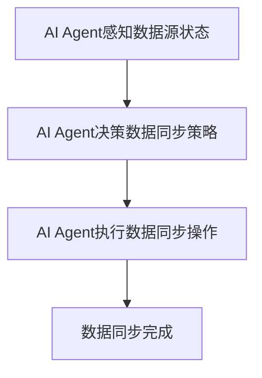
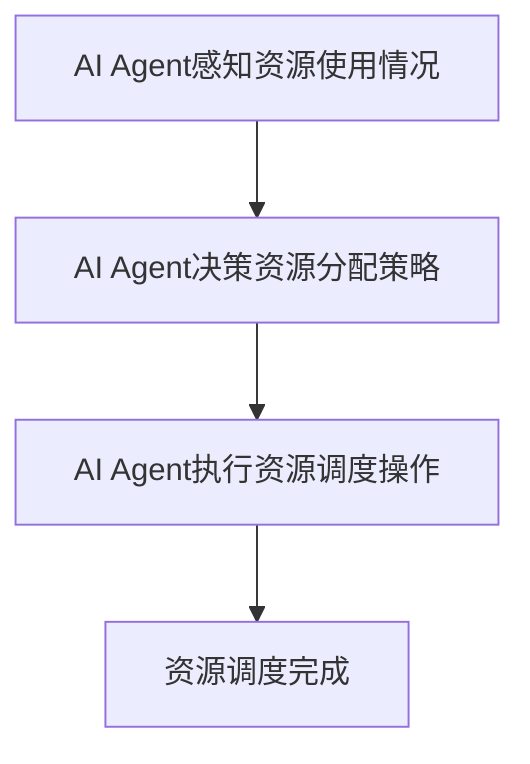
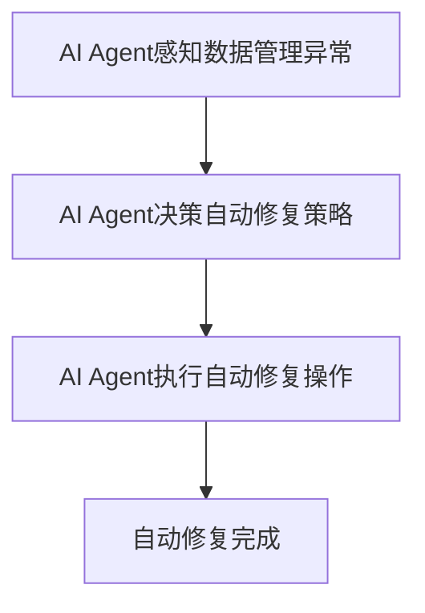
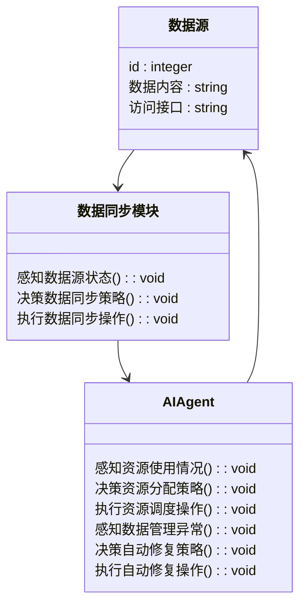
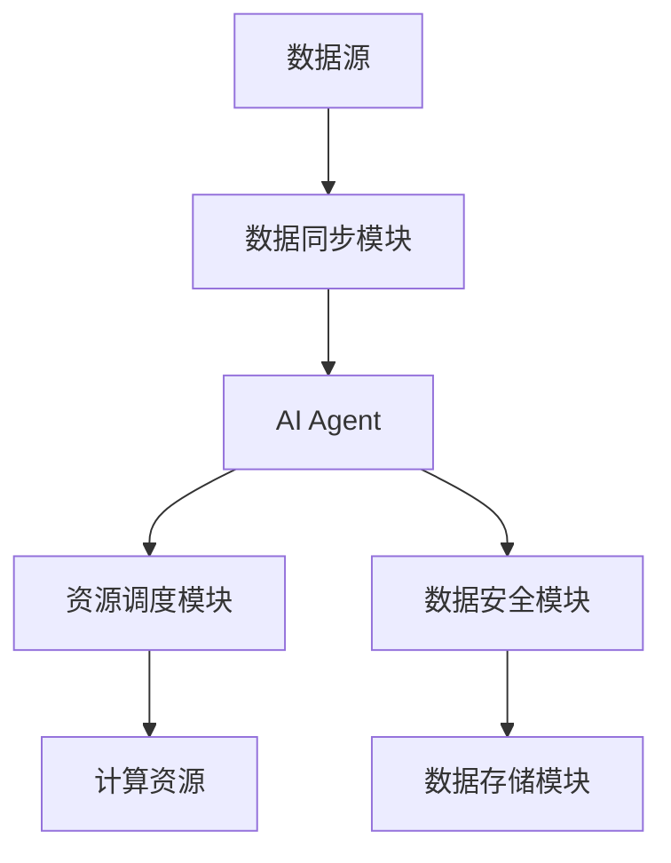
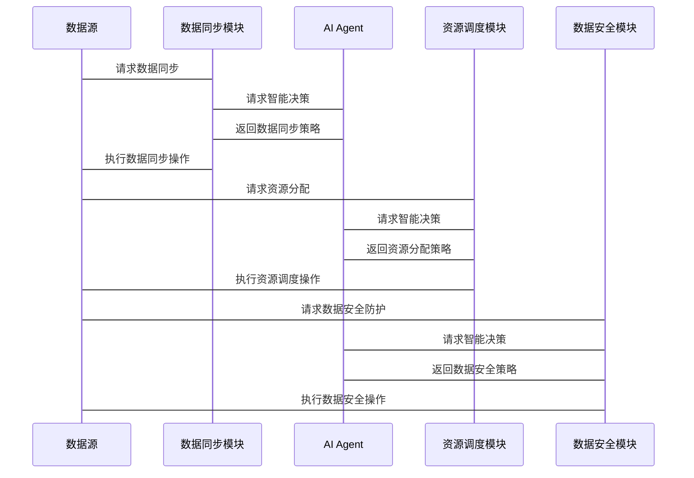

                 


# 企业AI Agent的混合云数据管理策略

> 关键词：企业AI Agent，混合云数据管理，数据一致性，AI智能调度，云数据同步

> 摘要：本文深入探讨了企业AI Agent在混合云数据管理中的应用策略，重点分析了数据一致性、智能调度和云数据同步的关键问题，并结合实际案例，提出了高效的解决方案和实现方法。

---

# 第1章 企业AI Agent与混合云数据管理的背景

## 1.1 问题背景与挑战

### 1.1.1 混合云数据管理的背景

随着企业业务的扩展，数据的存储和处理需求日益增长。混合云作为一种灵活的部署方式，结合了公有云和私有云的优势，为企业提供了更高的资源利用率和成本效益。然而，混合云环境下的数据管理面临以下挑战：

1. 数据一致性：跨云平台的数据同步需要保证一致性，避免数据冲突。
2. 数据安全：混合云环境中的数据分散在不同平台，如何保证数据的安全性和隐私性是一个关键问题。
3. 资源调度：如何智能地调度计算资源以优化数据处理效率。

### 1.1.2 企业AI Agent的核心需求

企业AI Agent是一种能够感知环境、自主决策的智能系统，其在混合云数据管理中的需求包括：

1. 智能调度：根据实时数据量和资源使用情况，动态分配计算资源。
2. 数据同步：确保多云环境下的数据一致性。
3. 自动修复：在数据管理出现异常时，能够自动恢复数据一致性。

### 1.1.3 当前数据管理的主要问题

1. 数据一致性难以保证：由于不同云平台的网络延迟和数据传输时间不同，数据一致性难以实时维护。
2. 数据安全风险：混合云环境下，数据分散存储，容易受到网络攻击和数据泄露的风险。
3. 资源利用率低：传统数据管理方式缺乏智能化，资源分配不合理，导致资源浪费。

## 1.2 问题描述与目标

### 1.2.1 混合云数据管理的关键问题

1. 数据一致性问题：如何保证跨云平台的数据一致性。
2. 数据安全问题：如何确保数据在传输和存储过程中的安全性。
3. 资源调度问题：如何高效地调度计算资源以优化数据处理效率。

### 1.2.2 企业AI Agent的目标与期望

1. 实现智能数据调度：根据实时数据量和资源使用情况，动态分配计算资源。
2. 确保数据一致性：通过AI Agent的智能决策，保证跨云平台的数据一致性。
3. 提高数据安全性：利用AI Agent的智能监控和防护机制，确保数据的安全性。

### 1.2.3 数据管理与AI Agent的结合点

1. 数据同步与一致性：AI Agent可以通过智能算法实现数据的高效同步和一致性维护。
2. 资源调度与优化：AI Agent可以根据实时数据和资源使用情况，动态调整资源分配策略。
3. 数据安全与防护：AI Agent可以通过智能监控和预测分析，提前发现并应对数据安全威胁。

## 1.3 问题解决与技术路线

### 1.3.1 混合云数据管理的解决方案

1. 数据一致性解决方案：通过分布式事务和两阶段提交协议，保证数据一致性。
2. 数据安全解决方案：采用加密技术和访问控制策略，确保数据的安全性。
3. 资源调度解决方案：利用AI Agent的智能算法，动态分配计算资源。

### 1.3.2 AI Agent在数据管理中的作用

1. 数据同步：AI Agent可以通过智能算法实现数据的高效同步，减少数据冲突。
2. 资源调度：AI Agent可以根据实时数据量和资源使用情况，动态调整资源分配策略。
3. 自动修复：在数据管理出现异常时，AI Agent可以自动恢复数据一致性。

### 1.3.3 技术路线与实现框架

1. 数据一致性实现框架：基于分布式事务和两阶段提交协议，结合AI Agent的智能决策，实现数据一致性。
2. 数据安全实现框架：采用加密技术和访问控制策略，结合AI Agent的智能监控和防护机制，确保数据的安全性。
3. 资源调度实现框架：利用AI Agent的智能算法，动态分配计算资源，优化数据处理效率。

## 1.4 边界与外延

### 1.4.1 混合云数据管理的边界

1. 数据一致性：仅保证跨云平台的数据一致性，不涉及单个云平台内部的数据一致性。
2. 数据安全：仅保证数据在传输和存储过程中的安全性，不涉及数据内容的合法性。
3. 资源调度：仅优化计算资源的分配，不涉及存储资源和网络资源的优化。

### 1.4.2 AI Agent的适用范围

1. 数据一致性维护：适用于混合云环境下的数据同步和一致性维护。
2. 资源调度优化：适用于计算资源的动态分配和优化。
3. 数据安全防护：适用于数据安全威胁的智能监控和防护。

### 1.4.3 相关技术的对比与区分

1. 混合云与私有云：混合云结合了公有云和私有云的优势，而私有云仅适用于内部资源的管理。
2. AI Agent与传统数据管理工具：AI Agent具有智能决策和自主学习能力，而传统数据管理工具仅提供基本的数据管理功能。
3. 数据安全与数据可用性：数据安全关注数据的保护，数据可用性关注数据的访问和使用。

## 1.5 概念结构与核心要素

### 1.5.1 混合云数据管理的系统架构

1. 数据源：包括企业内部的数据库和公有云平台的数据源。
2. 数据同步模块：负责数据的同步和一致性维护。
3. AI Agent：负责智能数据调度和资源优化。

### 1.5.2 AI Agent的核心要素

1. 智能决策模块：基于实时数据和资源使用情况，动态调整资源分配策略。
2. 数据同步模块：负责数据的高效同步和一致性维护。
3. 自动修复模块：在数据管理出现异常时，自动恢复数据一致性。

### 1.5.3 关键技术的相互关系

1. 数据一致性与AI Agent：数据一致性是AI Agent实现智能数据调度的基础。
2. 数据安全与AI Agent：数据安全是AI Agent实现智能数据调度的前提条件。
3. 资源调度与数据一致性：资源调度的优化可以提高数据处理效率，从而间接提高数据一致性的维护能力。

---

# 第2章 核心概念与联系

## 2.1 混合云数据管理的核心原理

### 2.1.1 数据存储与访问的机制

1. 数据存储机制：数据可以存储在公有云和私有云的不同存储平台上，通过统一的访问接口进行访问。
2. 数据访问机制：通过统一的访问接口，用户可以访问分布在不同云平台上的数据。

### 2.1.2 数据同步与一致性保障

1. 数据同步机制：通过分布式事务和两阶段提交协议，保证数据的同步和一致性。
2. 数据一致性保障：通过AI Agent的智能决策，动态调整数据同步策略，确保数据一致性。

### 2.1.3 数据安全与隐私保护

1. 数据安全机制：采用加密技术和访问控制策略，确保数据的安全性和隐私性。
2. 数据隐私保护：通过数据脱敏和访问权限控制，保护数据隐私。

## 2.2 AI Agent的原理与功能

### 2.2.1 AI Agent的基本原理

1. 智能感知：通过实时监控数据量和资源使用情况，感知环境状态。
2. 智能决策：基于感知到的环境状态，智能决策资源分配策略。
3. 自主执行：根据决策结果，自主执行资源分配和数据同步操作。

### 2.2.2 AI Agent的核心功能

1. 数据同步：负责数据的高效同步和一致性维护。
2. 资源调度：根据实时数据量和资源使用情况，动态调整计算资源分配策略。
3. 自动修复：在数据管理出现异常时，自动恢复数据一致性。

### 2.2.3 AI Agent与数据管理的结合

1. 数据一致性维护：AI Agent通过智能决策，动态调整数据同步策略，确保数据一致性。
2. 资源优化：AI Agent通过智能调度，优化计算资源的使用效率，降低资源浪费。
3. 数据安全防护：AI Agent通过智能监控和预测分析，提前发现并应对数据安全威胁。

## 2.3 核心概念的属性对比

### 2.3.1 混合云与私有云的对比

| 特性          | 混合云                | 私有云                |
|---------------|----------------------|----------------------|
| 资源共享       | 支持部分资源共享     | 不支持资源共享       |
| 成本效益       | 较高                 | 较低                 |
| 灵活性          | 高                  | 低                  |
| 数据一致性     | 跨平台数据一致性     | 单平台数据一致性     |

### 2.3.2 AI Agent与传统数据管理工具的对比

| 特性          | AI Agent              | 传统数据管理工具      |
|---------------|----------------------|----------------------|
| 智能决策       | 具备智能决策能力       | 无智能决策能力       |
| 自主学习       | 具备自主学习能力       | 无自主学习能力       |
| 资源优化       | 具备资源优化能力       | 无资源优化能力       |
| 数据一致性     | 具备数据一致性维护能力 | 无数据一致性维护能力 |

### 2.3.3 数据安全与数据可用性的对比

| 特性          | 数据安全              | 数据可用性            |
|---------------|----------------------|----------------------|
| 保护对象       | 数据内容和访问权限    | 数据的访问和使用      |
| 实现机制       | 加密技术和访问控制    | 数据备份和恢复策略    |
| 目标           | 防止数据泄露和网络攻击 | 保证数据的可访问性和可靠性 |

## 2.4 ER实体关系图

```mermaid
erDiagram
    customer[客户] {
        id : integer
        name : string
        email : string
    }
    order[订单] {
        id : int
        customer_id : integer
        order_date : date
        total : decimal
    }
    product[产品] {
        id : integer
        name : string
        price : decimal
    }
    sales[销售] {
        id : integer
        order_id : integer
        product_id : integer
        quantity : integer
    }
    customer_order"订单" o2m order
    order_product"订单-产品" o2m sales
```

---

# 第3章 混合云数据管理与AI Agent的算法原理

## 3.1 数据同步算法

### 3.1.1 数据同步的基本原理

1. 数据同步的必要性：确保分布在不同云平台上的数据一致。
2. 数据同步的实现方式：通过分布式事务和两阶段提交协议，保证数据的一致性。

### 3.1.2 基于AI Agent的数据同步算法

1. 算法步骤：
   1. AI Agent感知数据源的状态。
   2. AI Agent决策数据同步策略。
   3. AI Agent执行数据同步操作。
2. 算法流程图：



### 3.1.3 数据同步的数学模型

数据同步的数学模型如下：

$$
\text{同步完成} = \text{数据一致性检查} \land (\text{同步成功} \lor \text{自动修复})
$$

其中：
- 数据一致性检查：检查数据是否一致。
- 同步成功：数据同步操作成功。
- 自动修复：数据同步失败时，AI Agent自动修复数据一致性。

### 3.1.4 数据同步的Python代码实现

```python
def data_sync():
    # 感知数据源状态
    source_status =感知数据源状态()
    # 决策数据同步策略
    sync_strategy = 决策数据同步策略(source_status)
    # 执行数据同步操作
    if 同步成功():
        return "数据同步完成"
    else:
        return 自动修复数据一致性()
```

## 3.2 智能调度算法

### 3.2.1 智能调度的基本原理

1. 智能调度的必要性：优化计算资源的使用效率。
2. 智能调度的实现方式：基于AI Agent的智能决策，动态调整资源分配策略。

### 3.2.2 基于AI Agent的智能调度算法

1. 算法步骤：
   1. AI Agent感知资源使用情况。
   2. AI Agent决策资源分配策略。
   3. AI Agent执行资源调度操作。
2. 算法流程图：



### 3.2.3 智能调度的数学模型

智能调度的数学模型如下：

$$
\text{资源分配} = \text{AI Agent决策}(\text{资源使用情况})
$$

其中：
- 资源使用情况：包括CPU使用率、内存使用率、磁盘使用率等。
- AI Agent决策：基于历史数据和当前数据，预测未来资源需求，动态调整资源分配策略。

### 3.2.4 智能调度的Python代码实现

```python
def resource_scheduling():
    # 感知资源使用情况
    resource_usage = 感知资源使用情况()
    # 决策资源分配策略
    schedule_strategy = 决策资源分配策略(resource_usage)
    # 执行资源调度操作
    if 资源分配成功():
        return "资源调度完成"
    else:
        return 调整资源分配策略()
```

## 3.3 自动修复算法

### 3.3.1 自动修复的基本原理

1. 自动修复的必要性：在数据管理出现异常时，自动恢复数据一致性。
2. 自动修复的实现方式：基于AI Agent的智能监控和预测分析，自动修复数据管理异常。

### 3.3.2 基于AI Agent的自动修复算法

1. 算法步骤：
   1. AI Agent感知数据管理异常。
   2. AI Agent决策自动修复策略。
   3. AI Agent执行自动修复操作。
2. 算法流程图：



### 3.3.3 自动修复的数学模型

自动修复的数学模型如下：

$$
\text{自动修复} = \text{AI Agent决策}(\text{数据管理异常})
$$

其中：
- 数据管理异常：包括数据一致性冲突、资源分配失败等。
- AI Agent决策：基于历史数据和当前数据，预测未来异常，动态调整自动修复策略。

### 3.3.4 自动修复的Python代码实现

```python
def auto_repair():
    # 感知数据管理异常
    management_anomaly = 感知数据管理异常()
    # 决策自动修复策略
    repair_strategy = 决策自动修复策略(management_anomaly)
    # 执行自动修复操作
    if 自动修复成功():
        return "自动修复完成"
    else:
        return 调整自动修复策略()
```

---

# 第4章 混合云数据管理与AI Agent的系统分析与架构设计

## 4.1 系统分析

### 4.1.1 问题场景介绍

1. 数据一致性维护：跨云平台的数据同步需要保证一致性。
2. 资源调度优化：动态分配计算资源以优化数据处理效率。
3. 数据安全防护：确保数据在传输和存储过程中的安全性。

### 4.1.2 项目介绍

本项目旨在设计并实现一个基于AI Agent的混合云数据管理系统，实现数据一致性维护、资源调度优化和数据安全防护。

## 4.2 系统功能设计

### 4.2.1 领域模型



### 4.2.2 系统架构设计



### 4.2.3 系统接口设计

1. 数据源接口：提供数据访问接口，供数据同步模块和AI Agent访问。
2. 数据同步模块接口：提供数据同步接口，供AI Agent调用。
3. 资源调度模块接口：提供资源调度接口，供AI Agent调用。
4. 数据安全模块接口：提供数据安全接口，供AI Agent调用。

### 4.2.4 系统交互设计



## 4.3 系统架构设计

### 4.3.1 系统架构图

```mermaid
graph TD
    数据源 --> 数据同步模块
    数据同步模块 --> AI Agent
    AI Agent --> 资源调度模块
    资源调度模块 --> 计算资源
    AI Agent --> 数据安全模块
    数据安全模块 --> 数据存储模块
```

### 4.3.2 系统功能模块

1. 数据源模块：提供数据访问接口，供数据同步模块和AI Agent访问。
2. 数据同步模块：负责数据的高效同步和一致性维护。
3. AI Agent模块：负责智能数据调度和资源优化。
4. 资源调度模块：根据AI Agent的决策，动态调整计算资源分配策略。
5. 数据安全模块：负责数据的安全性和隐私保护。
6. 数据存储模块：提供数据存储接口，供数据同步模块和AI Agent使用。

---

# 第5章 混合云数据管理与AI Agent的项目实战

## 5.1 环境安装

### 5.1.1 开发环境

1. 操作系统：Linux/Windows/MacOS
2. Python版本：Python 3.8及以上
3. 开发工具：PyCharm/VS Code
4. 云平台：阿里云/腾讯云/亚马逊云

### 5.1.2 依赖安装

1. 数据库：MySQL/PostgreSQL
2. 云服务SDK：阿里云SDK/腾讯云SDK/亚马逊云SDK
3. AI框架：TensorFlow/PyTorch
4. 其他依赖：numpy/pandas/matplotlib

## 5.2 核心代码实现

### 5.2.1 数据同步模块

```python
class DataSyncModule:
    def __init__(self, data_source):
        self.data_source = data_source

    def感知数据源状态(self):
        # 实现感知数据源状态的逻辑
        pass

    def 决策数据同步策略(self, source_status):
        # 实现决策数据同步策略的逻辑
        pass

    def 执行数据同步操作(self, sync_strategy):
        # 实现执行数据同步操作的逻辑
        pass
```

### 5.2.2 AI Agent模块

```python
class AIAssistant:
    def __init__(self, data_sync_module, resource_scheduling_module):
        self.data_sync_module = data_sync_module
        self.resource_scheduling_module = resource_scheduling_module

    def 感知资源使用情况(self):
        # 实现感知资源使用情况的逻辑
        pass

    def 决策资源分配策略(self, resource_usage):
        # 实现决策资源分配策略的逻辑
        pass

    def 执行资源调度操作(self, schedule_strategy):
        # 实现执行资源调度操作的逻辑
        pass

    def 感知数据管理异常(self):
        # 实现感知数据管理异常的逻辑
        pass

    def 决策自动修复策略(self, management_anomaly):
        # 实现决策自动修复策略的逻辑
        pass

    def 执行自动修复操作(self, repair_strategy):
        # 实现执行自动修复操作的逻辑
        pass
```

### 5.2.3 资源调度模块

```python
class ResourceSchedulingModule:
    def __init__(self, ai_assistant):
        self.ai_assistant = ai_assistant

    def 请求资源分配(self):
        # 实现请求资源分配的逻辑
        pass

    def 返回资源分配策略(self, resource_usage):
        # 实现返回资源分配策略的逻辑
        pass

    def 执行资源调度操作(self, schedule_strategy):
        # 实现执行资源调度操作的逻辑
        pass
```

### 5.2.4 数据安全模块

```python
class DataSecurityModule:
    def __init__(self, data_storage_module):
        self.data_storage_module = data_storage_module

    def 请求数据安全防护(self):
        # 实现请求数据安全防护的逻辑
        pass

    def 返回数据安全策略(self, security威胁):
        # 实现返回数据安全策略的逻辑
        pass

    def 执行数据安全操作(self, security_strategy):
        # 实现执行数据安全操作的逻辑
        pass
```

## 5.3 案例分析与实现

### 5.3.1 数据一致性维护案例

案例描述：某企业使用混合云存储客户订单数据，由于网络延迟导致数据一致性问题。

解决方案：
1. 使用分布式事务和两阶段提交协议，保证数据一致性。
2. 通过AI Agent的智能决策，动态调整数据同步策略，减少数据冲突。

### 5.3.2 资源调度优化案例

案例描述：某企业在混合云环境下，数据处理任务量波动较大，资源利用效率低下。

解决方案：
1. 通过AI Agent感知资源使用情况，动态调整计算资源分配策略。
2. 在数据处理任务高峰期，增加计算资源；在低谷期，减少计算资源。

### 5.3.3 数据安全防护案例

案例描述：某企业的混合云数据管理系统受到网络攻击，数据安全受到威胁。

解决方案：
1. 通过AI Agent智能监控数据安全威胁，提前发现并应对。
2. 使用加密技术和访问控制策略，确保数据的安全性和隐私性。

---

# 第6章 混合云数据管理与AI Agent的最佳实践

## 6.1 小结

1. 混合云数据管理的核心问题包括数据一致性、资源调度和数据安全。
2. AI Agent在混合云数据管理中的作用包括数据同步、资源调度和自动修复。
3. 通过智能算法和分布式事务，可以实现高效的数据同步和一致性维护。

## 6.2 注意事项

1. 数据一致性维护：在混合云环境下，数据一致性维护是关键，需要结合AI Agent的智能决策和分布式事务。
2. 资源调度优化：AI Agent的资源调度算法需要根据实际业务需求进行调整和优化。
3. 数据安全防护：数据安全是混合云数据管理的前提条件，需要结合AI Agent的智能监控和防护机制。

## 6.3 拓展阅读

1. 《分布式系统一致性协议》：深入探讨分布式系统一致性协议的设计与实现。
2. 《AI在资源调度中的应用》：研究AI技术在资源调度中的应用与实践。
3. 《混合云数据安全防护》：分析混合云环境下数据安全的挑战与解决方案。

---

# 作者：AI天才研究院/AI Genius Institute & 禅与计算机程序设计艺术/Zen And The Art of Computer Programming

