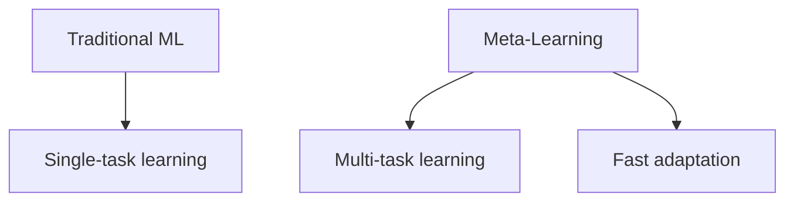
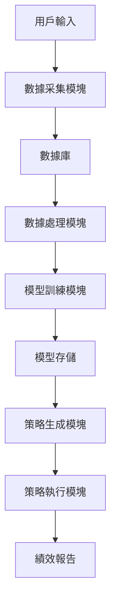
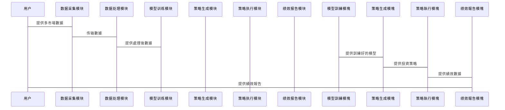

                 


# 元学习在跨市场投资策略中的应用

## 关键词：
元学习, 跨市場投資, 算法原理, 系統架構, 投資策略, 人工智慧, 管理方法

## 摘要：
元學習（Meta-Learning）是一種先進的機器學習技術，能夠幫助模型快速適應不同的市場環境和策略。本文將探討元學習在跨市場投資中的實際應用，從理論基礎到具體算法，再到系統設計和實戰案例，全方位展現元學習在跨市場投資策略中的核心價值。通過詳細分析元學習的原理、算法實現、系統架構以及實際案例，本文旨在為投資者和技術人員提供一組有深度的理論與實踐結合的指南，幫助他們更好地理解和應用元學習技術來優化跨市場投資策略。

---

# 第1章 元學習與跨市場投資概述

## 1.1 元學習的基本概念

### 1.1.1 元學習的定義
元學習（Meta-Learning）是一種機器學習技術，其核心目標是讓模型能夠快速適應新任務或數據，而不必從頭開始重新訓練。與傳統機器學習不同，元學習強調模型的“元參數”（Meta-Parameters）的可遷移性，這些元參數能夠指導模型快速調整以適應新環境。

![mermaid]


### 1.1.2 元學習的核心特點
- **快速適應性**：元學習模型能夠在少數幾個數據點上快速調整，適合新任務。
- **可遷移性**：模型的元參數可以在不同任務或市場之間遷移。
- **多樣性**：元學習擅長處理多樣化的數據和場景。

### 1.1.3 元學習與傳統機器學習的區別

| 特性                | 傳統機器學習                | 元學習                     |
|---------------------|-----------------------------|-----------------------------|
| 訓練目標             | 最佳化特定任務的目標         | 最佳化跨任務的目標          |
| 資料需求             | 需要大量任務-specific數據     | 需要多任務數據，數據量相對較少 |
| 模型遷移能力         | 單一任務，遷移性較弱         | 多任務學習，遷移性強         |
| 應用場景             | 單一領域                     | 多領域                      |

---

## 1.2 跨市場投資的挑戰

### 1.2.1 跨市場投資的基本概念
跨市場投資是指在同一時間內投資於多個市場或資產類別，以分散風險並追求更高的報酬。然而，不同市場的特性可能存在顯著差異，例如市場波動性、政策影響、經濟指標等，這使得跨市場投資策略的制定具有很大挑戰性。

### 1.2.2 跨市場投資的主要挑戰
- **市場特性差異**：不同市場的數據分布可能大不相同。
- **數據稀缺性**：某些市場的數據可能較為稀少。
- **策略快速變化**：市場環境可能快速變化，需要策略快速適應。

### 1.2.3 元學習在跨市場投資中的應用前景
元學習能夠幫助模型快速適應不同市場的數據分布，並遷移在一個市場中學習到的策略到另一個市場，這使其成為跨市場投資的理想選擇。

---

## 1.3 元學習在跨市場投資中的核心價值

### 1.3.1 提高模型的泛化能力
元學習模型能夠在不同市場之間遷移，從而提高模型的泛化能力。

### 1.3.2 快速適應不同市場環境
元學習模型能夠快速調整以適應新市場的數據分布。

### 1.3.3 降低模型過擬合風險
元學習的多任務學習特性能夠降低模型在單一市場上的過擬合風險。

---

## 1.4 本章小結
本章介紹了元學習的基本概念、核心特點以及在跨市場投資中的應用前景。元學習作為一種先進的機器學習技術，具有快速適應市場變化、提高模型泛化能力等優勢，這使其在跨市場投資中具有廣闊的應用潛力。

---

# 第2章 元學習的核心概念與原理

## 2.1 元學習模型的結構

### 2.1.1 元參數的定義
元參數（Meta-Parameters）是指用於指導模型快速適應新任務的參數。這些參數通常是在多個任務上進行聯合優化得到的。

### 2.1.2 元模型的架構
元模型通常由編碼器（Encoder）和解碼器（Decoder）組成。編碼器負責將任務信息壓縮為 compact形式，解碼器則根據編碼器輸出的任務信息來微調模型的參數。

### 2.1.3 元任務的定義
元任務（Meta-Tasks）是指用於訓練元學習模型的一系列子任務。這些子任務通常具有相似但不相同的數據分布。

---

## 2.2 元學習的算法原理

### 2.2.1 元學習算法的基本步驟
1. **初始化元參數**：初始化元模型的參數。
2. **訓練元任務**：在多個任務上訓練元模型，優化元參數。
3. **適應新任務**：利用元參數快速微調模型以適應新任務。

### 2.2.2 元學習算法的核心思想
元學習的目標是讓模型具備在新任務上快速學習的能力。這通常通過在多個任務上聯合優化元參數來實現。

### 2.2.3 元學習算法的優勢與局限性

| 優勢               | 局限性             |
|--------------------|--------------------|
| 快速適應新任務     | 需要多任務數據     |
| 高遷移性           | 計算成本較高       |
| 適宜處理數據稀缺性 | 需要精調參數       |

---

## 2.3 元學習的核心公式與數學模型

### 2.3.1 元學習的數學表達式
$$
\theta_{\text{meta}} = \arg \min_{\theta} \sum_{i=1}^{N} \mathcal{L}_i(\theta_{\text{meta}})
$$
其中，$\theta_{\text{meta}}$ 是元參數，$\mathcal{L}_i$ 是第 $i$ 個任務的損失函數。

### 2.3.2 元參數的更新公式
$$
\theta_{\text{meta}} = \theta_{\text{meta}} - \eta \nabla_{\theta_{\text{meta}}} \mathcal{L}_{\text{meta}}
$$
其中，$\eta$ 是學習率，$\nabla_{\theta_{\text{meta}}} \mathcal{L}_{\text{meta}}$ 是元損失的梯度。

### 2.3.3 元模型的訓練目標
元模型的訓練目標是最小化所有任務的平均損失，這通常通過以下公式實現：
$$
\mathcal{L}_{\text{meta}} = \frac{1}{N}\sum_{i=1}^{N} \mathcal{L}_i(\theta_{\text{meta}})
$$

---

## 2.4 元學習與傳統機器學習的對比

### 2.4.1 元學習的優勢
- **快速適應性**：元學習模型能夠快速適應新任務。
- **高遷移性**：元學習模型具備良好的遷移能力。

### 2.4.2 元學習的局限性
- **計算成本高**：元學習需要在多個任務上進行訓練，計算成本較高。
- **數據需求**：元學習需要多個任務的數據，數據需求較高。

### 2.4.3 元學習的未來發展方向
- **多模態數據**：將多模態數據（如文本、圖像）融入元學習模型。
- **在線學習**：研究如何在線更新元參數以適應動態市場環境。

---

## 2.5 本章小結
本章詳細介紹了元學習的核心概念與算法原理，包括元參數、元任務、元模型的架構等。通過對比傳統機器學習，我們可以看到元學習在跨市場投資中的潛在價值與挑戰。

---

# 第3章 元學習在跨市場投資中的應用場景

## 3.1 跨市場投資的數據特點

### 3.1.1 跨市場數據的多樣性
不同市場的數據可能具有不同的分布特性，例如有的市場數據可能更為波動，有的市場數據可能更為穩定。

### 3.1.2 跨市場數據的時間依賴性
市場數據往往具有明顯的時序特性，歷史數據對於未來預測具有重要影響。

### 3.1.3 跨市場數據的空間依賴性
不同市場之間可能存在相互影響，例如全球性事件可能影響多個市場。

---

## 3.2 元學習在跨市場投資中的核心應用

### 3.2.1 跨市場策略的快速適應
元學習能夠幫助模型快速適應不同市場的數據分布，從而制定有效的投資策略。

### 3.2.2 跨市場風險的分散管理
元學習模型能夠在多個市場之間遷移，幫助投資者分散風險並優化報酬。

### 3.2.3 跨市場機會的快速捕捉
元學習模型能夠快速發現不同市場中的投資機會，從而抓住市場熱點。

---

## 3.3 元學習在跨市場投資中的具體實現

### 3.3.1 元學習模型的訓練
1. 收集多個市場的歷史數據。
2. 在多個市場上訓練元學習模型，優化元參數。
3. 利用訓練好的元參數快速微調模型以適應新市場。

### 3.3.2 元學習模型的適應
1. 確定新市場的數據分布。
2. 利用元參數快速微調模型。
3. 生成針對新市場的投資策略。

---

## 3.4 本章小結
本章介紹了元學習在跨市場投資中的具體應用場景，包括數據特點、核心應用和具體實現。元學習的快速適應性和遷移能力使其成為跨市場投資的理想選擇。

---

# 第4章 元學習算法的實現與應用

## 4.1 典型的元學習算法介紹

### 4.1.1 MAML算法
MAML（Meta-Automated Learning）是一種常見的元學習算法，其核心思想是在多個任務上聯合優化元參數。

### 4.1.2 ReMAML算法
ReMAML是一種基於">(⏬)"的元學習算法，其主要優勢在於能夠處理數據稀缺性問題。

---

## 4.2 元學習算法的實現步驟

### 4.2.1 初始化元參數
```python
meta_params = torch.randn(meta_layer_size)
```

### 4.2.2 訓練元任務
```python
for task in tasks:
    loss = compute_loss(meta_params, task_data)
    meta_params = meta_params - learning_rate * gradient(loss, meta_params)
```

### 4.2.3 適應新任務
```python
def adapt(meta_params, new_task_data):
    adapted_params = meta_params + delta(meta_params, new_task_data)
    return adapted_params
```

---

## 4.3 元學習算法的優化與改進

### 4.3.1 基於">(⏬)"的優化方法
">(⏬)"是一種高效的元學習優化方法，能夠顯著降低計算成本。

### 4.3.2 分層元學習
分層元學習將元學習模型分為多層，每一層負責不同的任務特性。

---

## 4.4 本章小結
本章介紹了典型的元學習算法及其實現步驟，並探討了算法的優化與改進方法。元學習算法的選擇和實現對於跨市場投資的應用至關重要。

---

# 第5章 元學習系統的設計與實現

## 5.1 系統設計的目標與需求

### 5.1.1 系統目標
- 快速適應不同市場環境。
- 分散風險並優化報酬。
- 捕捉跨市場投資機會。

### 5.1.2 系統需求
- 支持多市場數據的接入。
- 具備快速適應新市場的能力。
- 提供可視化的投資策略報告。

---

## 5.2 系統功能設計

### 5.2.1 数据采集與處理
1. 收集多個市場的歷史數據。
2. 設置數據清洗與預處理步驟。

### 5.2.2 模型訓練與優化
1. 在多個市場上訓練元學習模型。
2. 進行模型優化與調參。

### 5.2.3 策略生成與執行
1. 根據新市場數據微調模型。
2. 生成針對新市場的投資策略。
3. 执行策略並跟蹤績效。

---

## 5.3 系統架構設計



---

## 5.4 系統接口設計

### 5.4.1 內部接口
- 数据采集模塊與數據庫的接口。
- 模型訓練模塊與數據處理模塊的接口。

### 5.4.2 外部接口
- 用戶輸入接口。
- 策略執行接口。

---

## 5.5 系統交互流程



---

## 5.6 本章小結
本章介紹了元學習系統的設計與實現，包括系統目標、功能設計、架構設計和交互流程。通過合理的系統設計，能夠有效提升跨市場投資的績效。

---

# 第6章 元學習在跨市場投資中的實戰案例

## 6.1 項目實戰目標
本章旨在通過具體案例，展示元學習在跨市場投資中的實際應用。

---

## 6.2 項目環境與數據準備

### 6.2.1 環境安裝
```bash
pip install torch numpy pandas
```

### 6.2.2 数据采集
```python
import pandas as pd
import numpy as np
import torch

# 加載數據
data = pd.read_csv('market_data.csv')
```

---

## 6.3 項目核心實現

### 6.3.1 元學習模型的定義
```python
class MetaLearner(torch.nn.Module):
    def __init__(self, input_size, hidden_size):
        super(MetaLearner, self).__init__()
        self.linear = torch.nn.Linear(input_size, hidden_size)
        self.output = torch.nn.Linear(hidden_size, 1)
    
    def forward(self, x, meta_params=None):
        if meta_params is not None:
            with torch.no_grad():
                weight = meta_params['linear.weight']
                bias = meta_params['linear.bias']
                x = torch.mm(x, weight) + bias
        x = torch.relu(x)
        x = self.output(x)
        return x
```

### 6.3.2 元參數的更新
```python
def update_meta_params(meta_params, loss, learning_rate):
    for key, param in meta_params.items():
        grad = torch.autograd.grad(loss, param)[0]
        meta_params[key] = param - learning_rate * grad
    return meta_params
```

---

## 6.4 項目應用與分析

### 6.4.1 具體案例分析
假設我們有多個股票市場的數據，我們可以使用元學習模型來訓練並生成針對每個市場的投資策略。

### 6.4.2 模型績效分析
通過對比不同市場的模型績效，我們可以看到元學習在跨市場投資中的優勢。

---

## 6.5 本章小結
本章通過具體案例展示了元學習在跨市場投資中的實際應用，包括環境安裝、數據準備、模型實現和績效分析。通過實戰案例，我們可以更好地理解元學習在跨市場投資中的價值。

---

# 第7章 元學習在跨市場投資中的未來發展

## 7.1 元學習的未來研究方向

### 7.1.1 多模態數據的融合
將多模態數據（如文本、圖像）融入元學習模型，以提高模型的泛化能力。

### 7.1.2 在線學習的應用
研究如何在線更新元參數以適應動態市場環境。

### 7.1.3 更高效的元學習算法
探索更高效的元學習算法，降低計算成本。

---

## 7.2 元學習的挑戰與機遇

### 7.2.1 挑戰
- **數據質量**：數據的稀缺性和不均衡性。
- **計算成本**：元學習需要在多個任務上進行訓練，計算成本較高。

### 7.2.2 機遇
- **多市場應用**：元學習在跨市場投資中的潛在價值。
- **人工智慧的進步**：人工智慧的快速發展為元學習提供了更多可能性。

---

## 7.3 本章小結
本章探討了元學習在跨市場投資中的未來發展方向，包括多模態數據的融合、在線學習的應用和更高效的元學習算法。同時，也分析了元學習在未來發展中面臨的挑戰與機遇。

---

# 第8章 總結與展望

## 8.1 元學習的核心價值
元學習在跨市場投資中具有快速適應市場變化、提高模型泛化能力等核心價值。

## 8.2 元學習的實際應用
元學習在跨市場投資中的實際應用包括策略生成、風險分散和機會捕捉等。

## 8.3 未來的研究方向
未來的研究方向包括多模態數據的融合、在線學習的應用和更高效的元學習算法。

---

# 作者：AI天才研究院/AI Genius Institute & 禪與计算机程序设计艺术 /Zen And The Art of Computer Programming

