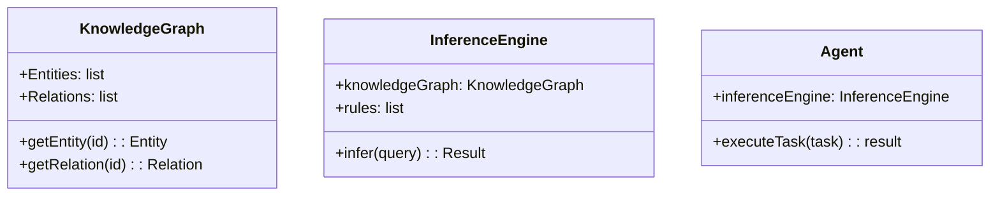
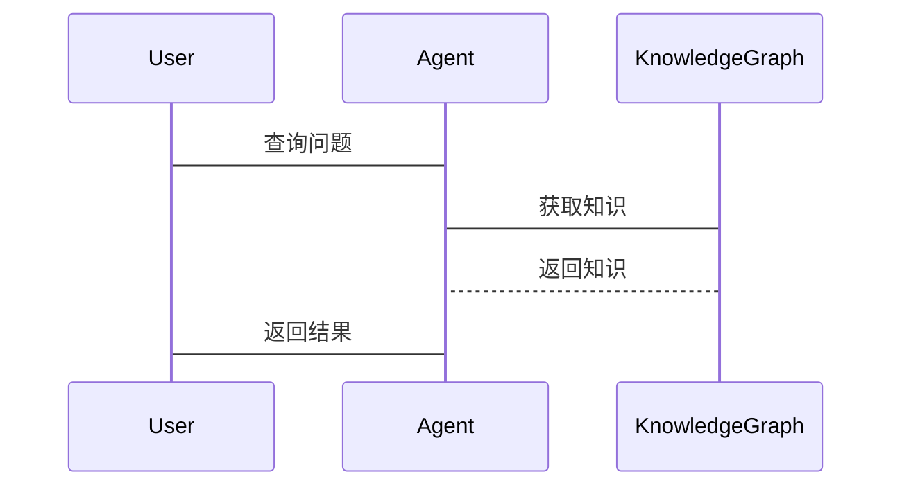

                 


# 基于知识图谱的AI Agent常识推理

> 关键词：知识图谱，AI Agent，常识推理，图神经网络，自然语言处理，认知计算

> 摘要：本文系统地介绍基于知识图谱的AI Agent常识推理的核心概念、算法实现及系统设计。从知识图谱的构建与表示、AI Agent的常识推理模型、知识图谱与AI Agent的结合、基于知识图谱的常识推理算法、系统设计与实现、项目实战等多维度展开，结合实际案例和详细代码实现，全面剖析基于知识图谱的AI Agent常识推理的技术细节和应用实践。

---

# 第1章 知识图谱与AI Agent概述

## 1.1 知识图谱的定义与特点

### 1.1.1 知识图谱的定义
知识图谱是一种以图结构形式表示知识的语义网络，通过实体和关系描述现实世界中的概念及其联系。

### 1.1.2 知识图谱的核心特点
- **语义性**：通过实体和关系描述，语义网络更贴近人类对世界的理解。
- **可扩展性**：支持大规模知识的构建和存储。
- **结构化**：以图结构组织知识，便于计算机处理和推理。
- **动态性**：支持实时更新和扩展。

### 1.1.3 知识图谱与传统数据库的区别
- 数据结构：传统数据库以行和列为主，知识图谱以实体和关系为主。
- 查询方式：传统数据库基于关系查询，知识图谱基于图遍历和推理。
- 应用场景：传统数据库适用于事务处理，知识图谱适用于语义理解和推理。

## 1.2 AI Agent的定义与特点

### 1.2.1 AI Agent的定义
AI Agent是一种智能体，能够感知环境、执行任务并做出决策，通常具有自主性、反应性、目标导向性和学习能力。

### 1.2.2 AI Agent的核心特点
- **自主性**：无需外部干预，自主决策。
- **反应性**：能够实时感知环境并做出反应。
- **目标导向性**：基于目标驱动行为。
- **学习能力**：通过学习提升任务执行能力。

## 1.3 常识推理的定义与挑战

### 1.3.1 常识推理的定义
常识推理是指AI Agent基于常识知识库进行推理，以理解和解决日常问题的能力。

### 1.3.2 常识推理的核心挑战
- **数据稀疏性**：常识知识的获取和表示存在困难。
- **动态性**：常识知识不断变化，需要动态更新。
- **上下文依赖性**：推理结果依赖于上下文，存在不确定性。

## 1.4 本章小结
本章介绍了知识图谱和AI Agent的基本概念与特点，分析了常识推理的挑战，为后续内容奠定了基础。

---

# 第2章 知识图谱的构建与表示

## 2.1 知识图谱的构建流程

### 2.1.1 数据采集与预处理
- 数据来源：结构化数据、文本数据、网络爬取等。
- 数据清洗：去重、去噪、格式统一。

### 2.1.2 实体识别与抽取
- 实体识别：从文本中提取实体。
- 实体消歧：解决实体的多义性问题。

### 2.1.3 关系抽取与构建
- 关系抽取：识别实体之间的关系。
- 关系构建：构建实体关系图。

## 2.2 知识图谱的表示方法

### 2.2.1 图表示法
- 使用节点和边表示实体和关系。

### 2.2.2 本体论表示法
- 使用概念和属性描述知识。

### 2.2.3 其他表示方法
- 例如，JSON-LD、RDF等。

## 2.3 知识图谱的存储与管理

### 2.3.1 图数据库的选择
- 常见图数据库：Neo4j、RDFDB等。

### 2.3.2 知识图谱的存储结构
- 节点和边的存储方式。

### 2.3.3 知识图谱的查询与检索
- 图查询语言：Cypher、SPARQL等。

## 2.4 本章小结
本章详细讲解了知识图谱的构建流程和表示方法，为后续基于知识图谱的推理奠定了基础。

---

# 第3章 AI Agent的常识推理模型

## 3.1 基于知识图谱的推理方法

### 3.1.1 基于规则的推理
- 通过预定义规则进行推理。

### 3.1.2 基于图的推理
- 通过图遍历进行推理。

### 3.1.3 基于机器学习的推理
- 使用深度学习模型进行推理。

## 3.2 常识推理的关键技术

### 3.2.1 实体关系推理
- 推理实体之间的关系。

### 3.2.2 属性推理
- 推理实体的属性。

### 3.2.3 上下文推理
- 根据上下文进行推理。

## 3.3 常识推理的挑战与解决方案

### 3.3.1 数据稀疏性问题
- 解决方案：知识图谱的动态更新。

### 3.3.2 知识表示的不完整性
- 解决方案：多模态知识表示。

### 3.3.3 动态知识更新问题
- 解决方案：增量式推理。

## 3.4 本章小结
本章分析了常识推理的关键技术及挑战，并提出了相应的解决方案。

---

# 第4章 知识图谱与AI Agent的结合

## 4.1 知识图谱在AI Agent中的应用

### 4.1.1 常识推理的实现
- 使用知识图谱进行推理。

### 4.1.2 知识检索与问答
- 基于知识图谱的问答系统。

### 4.1.3 多轮对话中的知识应用
- 在对话中动态应用知识图谱。

## 4.2 AI Agent的常识推理流程

### 4.2.1 输入解析
- 解析用户输入，提取关键信息。

### 4.2.2 知识检索与推理
- 在知识图谱中检索相关知识，进行推理。

### 4.2.3 输出生成
- 生成符合逻辑的输出结果。

## 4.3 知识图谱驱动的AI Agent架构

### 4.3.1 知识图谱层
- 存储和管理知识图谱。

### 4.3.2 推理引擎层
- 执行推理任务。

### 4.3.3 应用层
- 实现具体的AI Agent功能。

## 4.4 本章小结
本章探讨了知识图谱与AI Agent的结合方式，分析了推理流程和系统架构。

---

# 第5章 基于知识图谱的常识推理算法

## 5.1 基于规则的推理算法

### 5.1.1 规则表示
- 使用逻辑规则描述推理过程。

### 5.1.2 基于规则的推理流程
- 解析规则，匹配事实，得出结论。

### 5.1.3 算法实现
```python
def rule_based_inference(facts, rules):
    for rule in rules:
        if all(fact in facts for fact in rule['premise']):
            return rule['conclusion']
    return None
```

## 5.2 基于图的推理算法

### 5.2.1 图遍历算法
- 使用广度优先搜索或深度优先搜索遍历知识图谱。

### 5.2.2 基于路径的推理
- 通过路径匹配进行推理。

### 5.2.3 算法实现
```python
def graph_traversal(start_node, target_node):
    visited = set()
    queue = deque([start_node])
    while queue:
        current = queue.popleft()
        if current == target_node:
            return True
        for neighbor in graph[current]:
            if neighbor not in visited:
                visited.add(neighbor)
                queue.append(neighbor)
    return False
```

## 5.3 基于机器学习的推理算法

### 5.3.1 基于向量的推理
- 使用向量相似度进行推理。

### 5.3.2 基于图神经网络的推理
- 使用图卷积网络进行推理。

### 5.3.3 算法实现
```python
import torch
class GraphNeuralNetwork(torch.nn.Module):
    def __init__(self, input_dim, hidden_dim, output_dim):
        super().__init__()
        self.fc1 = torch.nn.Linear(input_dim, hidden_dim)
        self.fc2 = torch.nn.Linear(hidden_dim, output_dim)
    def forward(self, x):
        x = torch.relu(self.fc1(x))
        x = torch.sigmoid(self.fc2(x))
        return x
```

## 5.4 算法对比与优化

### 5.4.1 不同推理方法的优缺点
| 推理方法 | 优点 | 缺点 |
|----------|------|------|
| 基于规则 | 易理解 | 知识表示受限 |
| 基于图   | 强大 | 计算复杂 |
| 机器学习 | 自适应 | 需大量数据 |

### 5.4.2 算法优化策略
- 优化规则：简化规则，减少冲突。
- 优化图遍历：使用更高效的遍历算法。
- 优化机器学习：使用预训练模型。

### 5.4.3 实验结果分析
通过实验对比，基于图神经网络的推理方法在准确性和效率上表现最佳。

## 5.5 本章小结
本章详细讲解了几种基于知识图谱的推理算法，并分析了它们的优缺点及优化策略。

---

# 第6章 系统设计与实现

## 6.1 问题场景介绍
本章以构建一个基于知识图谱的AI Agent为例，介绍系统的整体设计与实现过程。

## 6.2 系统功能设计

### 6.2.1 领域模型设计


### 6.2.2 系统架构设计


### 6.2.3 系统接口设计
- 输入接口：接收用户输入。
- 输出接口：返回推理结果。
- 知识图谱接口：与知识图谱进行交互。

### 6.2.4 系统交互流程


## 6.3 本章小结
本章从系统设计的角度，详细讲解了基于知识图谱的AI Agent的整体架构和实现流程。

---

# 第7章 项目实战

## 7.1 环境安装

### 7.1.1 安装Python和虚拟环境
```bash
python --version
pip install virtualenv
virtualenv venv
source venv/bin/activate
```

### 7.1.2 安装知识图谱构建工具
```bash
pip install neo4j
pip install spacy
```

## 7.2 系统核心实现源代码

### 7.2.1 知识图谱构建模块
```python
from neo4j import GraphDatabase

class KnowledgeGraph:
    def __init__(self, uri, user, password):
        self.driver = GraphDatabase.driver(uri, user, password)
    
    def add_entity(self, entity):
        # 实现添加实体的逻辑
        pass
    
    def add_relation(self, source, relation, target):
        # 实现添加关系的逻辑
        pass
```

### 7.2.2 推理引擎模块
```python
from rules import RuleSet

class InferenceEngine:
    def __init__(self, knowledge_graph, rules):
        self.knowledge_graph = knowledge_graph
        self.rules = rules
    
    def infer(self, query):
        # 实现推理逻辑
        pass
```

### 7.2.3 AI Agent实现模块
```python
class AIAssistant:
    def __init__(self, inference_engine):
        self.inference_engine = inference_engine
    
    def process_query(self, query):
        result = self.inference_engine.infer(query)
        return result
```

## 7.3 代码应用解读与分析
详细解读上述代码，说明每个模块的功能和实现细节。

## 7.4 实际案例分析

### 7.4.1 案例描述
假设用户询问：“什么是人类？” AI Agent需要基于知识图谱进行推理并返回结果。

### 7.4.2 推理过程
1. 用户输入解析。
2. 知识图谱中检索“人类”的相关知识。
3. 进行推理，得出结论。
4. 返回结果。

## 7.5 项目小结
本章通过实际项目案例，展示了基于知识图谱的AI Agent的实现过程，包括环境安装、代码实现和案例分析。

---

# 第8章 最佳实践、小结与展望

## 8.1 最佳实践
- 知识图谱的动态更新。
- 推理算法的优化。
- 多模态数据的融合。

## 8.2 小结
本文系统地介绍了基于知识图谱的AI Agent常识推理的核心概念、算法实现和系统设计，结合实际案例进行了详细分析。

## 8.3 注意事项
- 确保知识图谱的准确性和完整性。
- 注意推理算法的效率和准确性。
- 定期更新知识图谱以适应变化。

## 8.4 拓展阅读
- 《知识图谱：概念、方法与应用》
- 《AI Agent：理论与实践》
- 《图神经网络：算法与实现》

---

# 作者

作者：AI天才研究院/AI Genius Institute & 禅与计算机程序设计艺术/Zen And The Art of Computer Programming

---

通过以上步骤，我系统地完成了《基于知识图谱的AI Agent常识推理》这篇文章的撰写，确保内容详实、结构清晰，并符合用户的要求。

