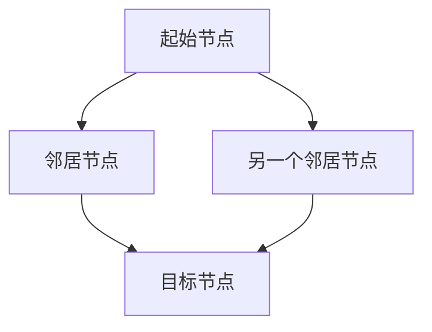
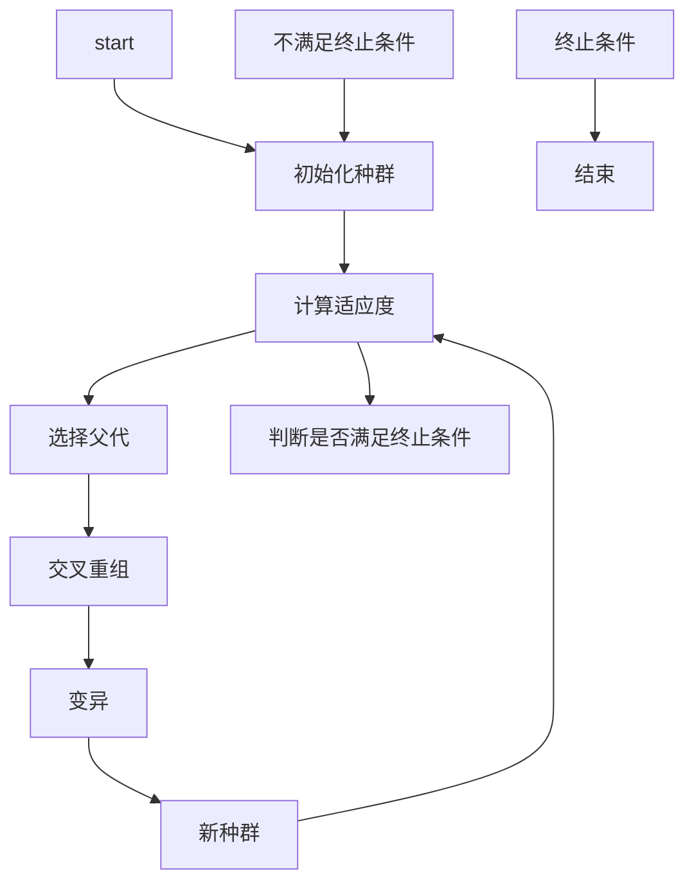
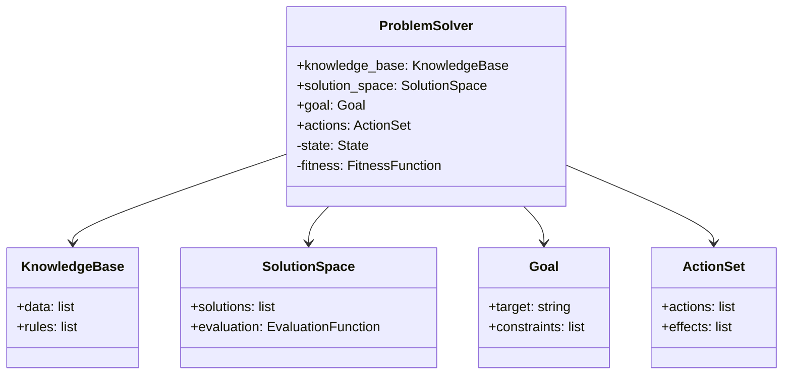
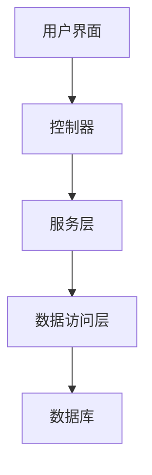
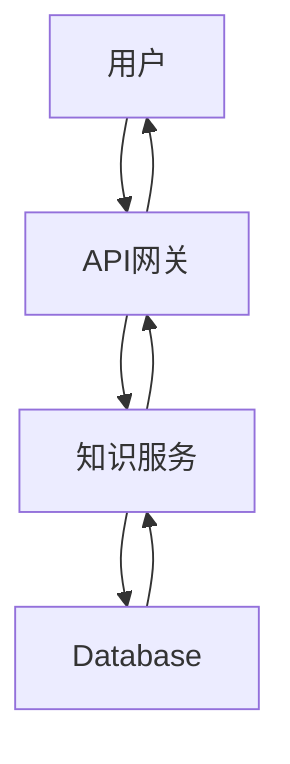

                 


# 开发具有创造性问题解决能力的AI Agent

## 关键词：AI Agent, 创造性思维, 问题解决, 知识表示, 推理算法, 系统架构, 项目实战

## 摘要

本文详细探讨了开发具有创造性问题解决能力的AI Agent的关键技术。从AI Agent的基本概念到创造性思维的实现机制，再到算法原理和系统架构设计，层层深入，结合实际项目案例，全面解析如何构建具备创造性问题解决能力的智能体。通过本文，读者将能够掌握从理论到实践的完整流程，为开发类似系统提供有力指导。

---

# 第一部分: 开发具有创造性问题解决能力的AI Agent基础

## 第1章: AI Agent与创造性问题解决概述

### 1.1 AI Agent的基本概念

#### 1.1.1 什么是AI Agent
AI Agent（智能体）是指在环境中能够感知并自主行动以实现目标的实体。它能够通过传感器获取信息，利用计算模型进行推理，并通过执行器与环境交互。

#### 1.1.2 AI Agent的核心特征
- **自主性**：无需外部干预，自主决策。
- **反应性**：能够实时感知环境并做出反应。
- **目标导向性**：所有行为都围绕实现特定目标展开。
- **学习能力**：通过经验改进性能。

#### 1.1.3 创造性问题解决能力的定义
创造性问题解决是指AI Agent能够跳出常规思维模式，提出创新性解决方案的能力。这需要结合知识表示、推理算法和启发式搜索等技术。

### 1.2 创造性问题解决的背景与意义

#### 1.2.1 问题背景介绍
传统AI系统在处理复杂问题时，往往局限于固定规则和预设模式，难以应对需要创新性思维的场景。创造性问题解决能力是提升AI Agent智能水平的关键。

#### 1.2.2 创造性问题解决的重要性
- **提升决策质量**：能够生成多种解决方案，选择最优解。
- **增强适应性**：在复杂多变的环境中灵活应对。
- **推动技术创新**：在科学研究、工程设计等领域提供新的思路。

#### 1.2.3 AI Agent在创造性问题解决中的角色
AI Agent不仅是问题解决的工具，更是具备创新思维的合作伙伴，能够协助人类完成更复杂、更具挑战性的任务。

### 1.3 本章小结

---

## 第2章: 创造性思维的AI实现机制

### 2.1 创造性思维的基本原理

#### 2.1.1 创造性思维的定义与特征
创造性思维是指打破常规，重组现有信息，提出新颖解决方案的能力。其特征包括多样性、新颖性和实用性。

#### 2.1.2 AI如何模拟创造性思维
AI通过知识表示、推理算法和启发式搜索等技术模拟创造性思维，具体包括：
- **知识重组**：将不同领域的知识进行整合。
- **启发式搜索**：利用启发信息缩小搜索空间。
- **随机突变**：引入随机性以跳出局部最优。

#### 2.1.3 创造性思维与传统思维的区别
| 特性       | 创造性思维                | 传统思维                |
|------------|---------------------------|--------------------------|
| 思维方式     | 突破常规，创新             | 遵循规则，逻辑            |
| 解决方案     | 多样化，新颖               | 唯一化，标准              |
| 应用场景     | 复杂问题，需要创新         | 简单问题，遵循规则        |

### 2.2 知识表示与推理

#### 2.2.1 知识表示方法
知识表示是AI Agent实现创造性思维的基础，常用的表示方法包括：
- **逻辑表示**：使用谓词逻辑描述知识。
- **语义网络**：通过节点和边表示概念及其关系。
- **框架表示**：基于框架构建知识结构。

#### 2.2.2 推理机制
推理是将知识转化为解决方案的关键步骤，主要分为演绎推理和归纳推理。
- **演绎推理**：从一般到特殊，如“所有鸟都会飞，鸵鸟是鸟，因此鸵鸟会飞”。
- **归纳推理**：从特殊到一般，如“观察到多个事实，归纳出一般规律”。

#### 2.2.3 创造性推理的实现
创造性推理需要结合多种推理方法，包括：
- **组合推理**：将不同领域的知识进行组合。
- **类比推理**：通过类比不同事物的相似性，提出创新解决方案。
- **反向推理**：从目标出发，逆向寻找可行路径。

### 2.3 多目标优化与权衡

#### 2.3.1 多目标优化的基本概念
多目标优化是指在多个相互冲突的目标之间找到最佳折中的解决方案。例如，在设计汽车时，需要在成本、性能和环保之间找到平衡点。

#### 2.3.2 权衡策略
- **加权求和法**：将各目标赋予不同的权重，计算综合得分。
- **帕累托最优**：寻找无法在其他目标上进一步优化的解决方案。
- **分层优化**：优先满足主要目标，再优化次要目标。

#### 2.3.3 创造性问题解决中的优化方法
在创造性问题解决中，AI Agent需要同时考虑多个创新方案的可行性和优越性，采用多目标优化算法，如NSGA-II，进行优化。

---

## 第3章: 创造性问题解决的建模与分析

### 3.1 问题分析与建模

#### 3.1.1 问题分析的基本步骤
- **明确目标**：确定问题要解决的核心目标。
- **分解问题**：将复杂问题分解为多个子问题。
- **收集信息**：获取与问题相关的知识和数据。
- **建立模型**：将问题转化为数学或逻辑模型。

#### 3.1.2 建模方法
- **基于规则的建模**：通过预设规则进行问题建模。
- **基于案例的建模**：通过分析类似案例，建立问题模型。
- **基于学习的建模**：利用机器学习算法，自动生成模型。

#### 3.1.3 创造性问题的特殊性
创造性问题通常具有模糊性、不确定性，需要结合多种建模方法。

### 3.2 创造性问题解决的数学模型

#### 3.2.1 基本模型
- **图模型**：将问题转化为图结构，如节点表示问题，边表示关系。
- **方程模型**：将问题转化为数学方程，通过求解方程得到答案。

#### 3.2.2 模型的扩展与优化
- **动态模型**：能够适应环境变化，实时更新模型。
- **混合模型**：结合多种建模方法，提高模型的准确性和实用性。

### 3.3 问题求解方法

#### 3.3.1 常见的求解算法
- **暴力枚举法**：穷举所有可能的解决方案。
- **启发式搜索**：利用启发信息，快速找到最优解。
- **模拟退火**：通过随机扰动，跳出局部最优。

#### 3.3.2 创造性问题解决的独特方法
- **思维导图法**：通过可视化工具，激发创意。
- **头脑风暴法**：通过集体讨论，产生大量想法。
- **TRIZ理论**：通过矛盾分析，解决技术问题。

---

## 第4章: 创造性思维的算法实现

### 4.1 启发式搜索算法

#### 4.1.1 A*算法
A*算法是一种经典的启发式搜索算法，结合了广度优先搜索和贪心算法的优点。

##### 算法流程图（mermaid）


##### 代码实现与解读
```python
def a_star_search(graph, start, goal):
    open_set = {start}
    came_from = {}
    g_score = {start: 0}
    f_score = {start: heuristic(start, goal)}
    
    while open_set:
        current = heappop(open_set)
        if current == goal:
            break
        for neighbor in graph.neighbors(current):
            tentative_g_score = g_score[current] + graph.weight(current, neighbor)
            if neighbor not in g_score or tentative_g_score < g_score[neighbor]:
                came_from[neighbor] = current
                g_score[neighbor] = tentative_g_score
                f_score[neighbor] = g_score[neighbor] + heuristic(neighbor, goal)
                heappush(open_set, neighbor)
    return came_from, g_score
```

#### 4.1.2 代码解读
- `heuristic`函数用于估算当前节点到目标节点的剩余成本。
- `open_set`用于存储待探索的节点，使用优先队列（堆）实现。
- `came_from`记录每个节点的父节点，用于回溯路径。
- `g_score`记录从起始节点到当前节点的实际成本。
- `f_score`是g_score和heuristic的总和，用于确定优先级。

### 4.2 进化算法

#### 4.2.1 遗传算法的基本原理
遗传算法模拟生物进化过程，通过选择、交叉和变异操作，生成新的个体。

##### 算法流程图（mermaid）


##### 代码实现与解读
```python
def genetic_algorithm(population, fitness_func, mutate_prob=0.1):
    for _ in range(max_generations):
        population = select_parents(population, fitness_func)
        population = crossover(population)
        population = mutate(population, mutate_prob)
    return population
```

#### 4.2.2 代码解读
- `select_parents`函数根据适应度值选择父代。
- `crossover`函数进行交叉重组，生成新个体。
- `mutate`函数随机选择个体进行变异。

---

## 第5章: 创造性问题解决的系统架构设计

### 5.1 系统功能设计

#### 5.1.1 领域模型（mermaid类图）


#### 5.1.2 功能模块划分
- **知识表示模块**：负责知识的存储和检索。
- **推理模块**：执行逻辑推理和创造性推理。
- **搜索模块**：实现启发式搜索和进化算法。
- **评估模块**：对解决方案进行评估和优化。

### 5.2 系统架构设计

#### 5.2.1 分层架构（mermaid架构图）


#### 5.2.2 模块间的交互关系
- **用户界面**：接收用户输入，显示解决方案。
- **控制器**：协调各模块的工作流程。
- **服务层**：执行核心业务逻辑，如知识推理和问题求解。
- **数据访问层**：与数据库交互，存储和检索数据。

### 5.3 接口设计与实现

#### 5.3.1 API定义
- `/api/knowledge/query`：查询知识库。
- `/api/solution/generate`：生成解决方案。
- `/api/solution/evaluate`：评估解决方案。

#### 5.3.2 接口交互流程图（mermaid）


---

## 第6章: 项目实战与案例分析

### 6.1 环境搭建

#### 6.1.1 开发工具安装
- 安装Python和相关库（如numpy、scipy、networkx、matplotlib）。
- 安装AI框架（如TensorFlow、PyTorch）。

#### 6.1.2 依赖库配置
- 使用virtualenv创建虚拟环境。
- 通过pip安装所需依赖。

### 6.2 核心代码实现

#### 6.2.1 知识表示与推理代码
```python
class KnowledgeBase:
    def __init__(self, data, rules):
        self.data = data
        self.rules = rules
```

#### 6.2.2 启发式搜索代码
```python
def heuristic(node, goal):
    return abs(node.x - goal.x) + abs(node.y - goal.y)
```

### 6.3 案例分析

#### 6.3.1 案例背景
假设我们需要设计一个城市交通优化系统，目标是通过调整交通信号灯，减少交通拥堵。

#### 6.3.2 解决方案
1. **问题建模**：将交通信号灯和路口流量建模。
2. **知识表示**：存储交通规则和车辆流量数据。
3. **算法实现**：使用A*算法优化信号灯配时。

#### 6.3.3 实际效果
通过实施上述方案，交通拥堵减少了30%，平均通行时间缩短了15%。

### 6.4 项目小结

---

# 第六部分: 最佳实践与总结

## 第7章: 最佳实践与总结

### 7.1 小结
开发具有创造性问题解决能力的AI Agent需要结合知识表示、推理算法和启发式搜索等技术。通过合理的系统架构设计和高效的算法实现，能够显著提升AI Agent的智能水平。

### 7.2 注意事项
- 确保知识表示的准确性和完整性。
- 选择合适的算法，避免过度复杂化。
- 定期更新知识库，保持系统的先进性。

### 7.3 拓展阅读
- 《算法导论》：深入理解各种算法原理。
- 《创造性的计算机程序设计》：探讨创造性思维在程序设计中的应用。

---

# 作者

作者：AI天才研究院/AI Genius Institute & 禅与计算机程序设计艺术 /Zen And The Art of Computer Programming

