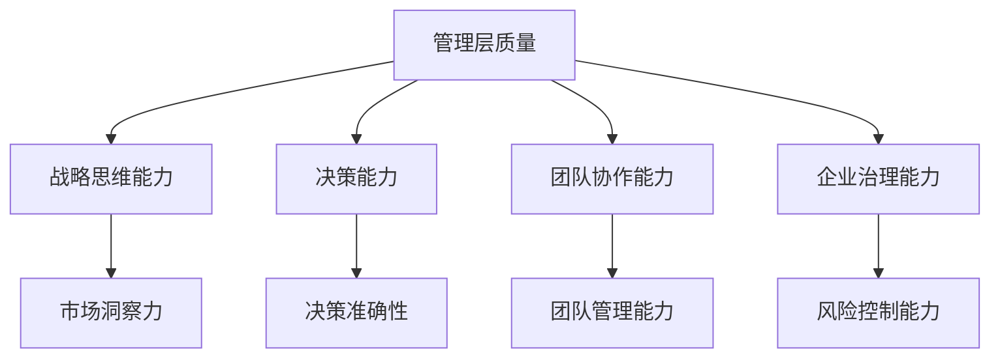
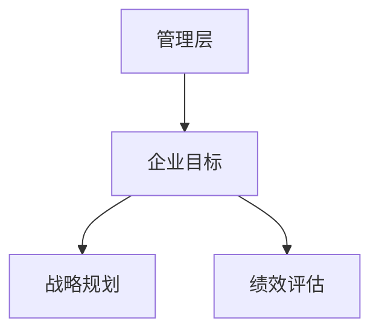
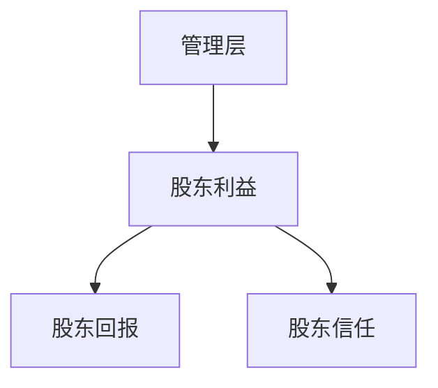
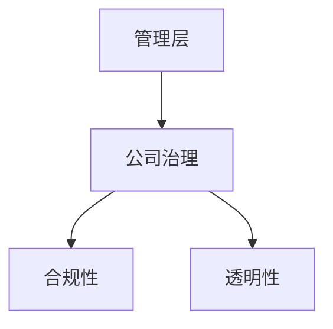
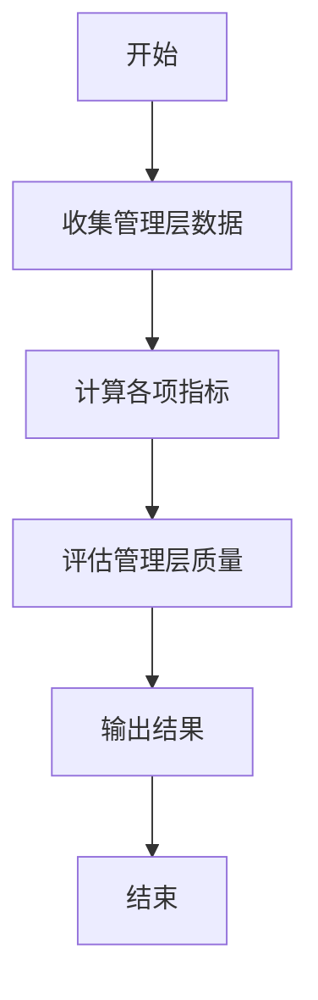
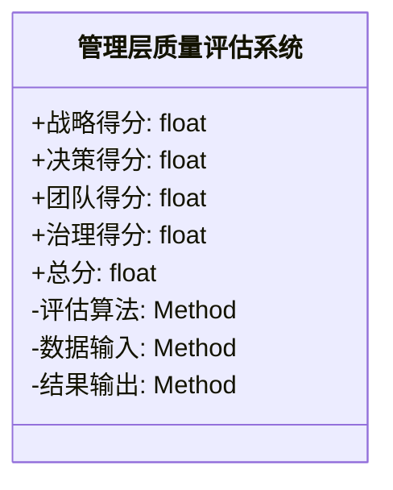
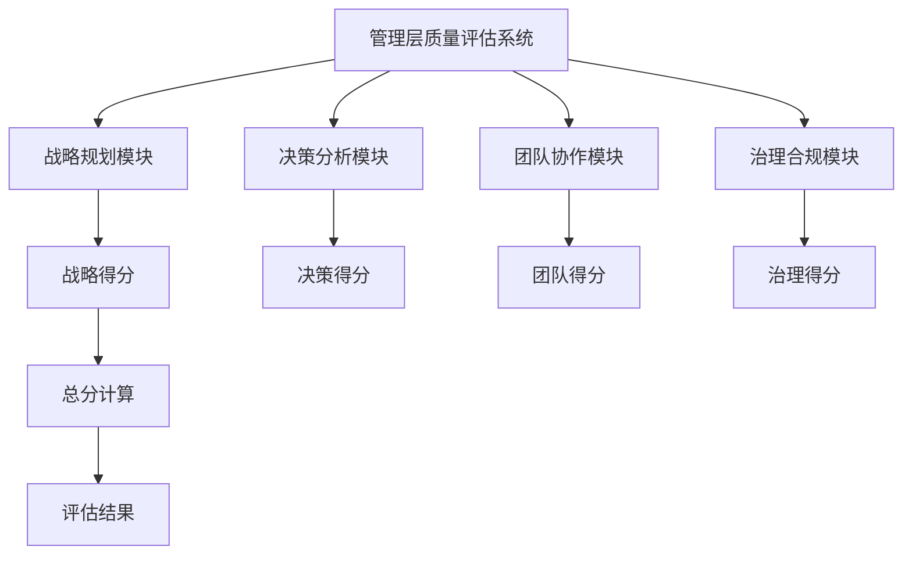
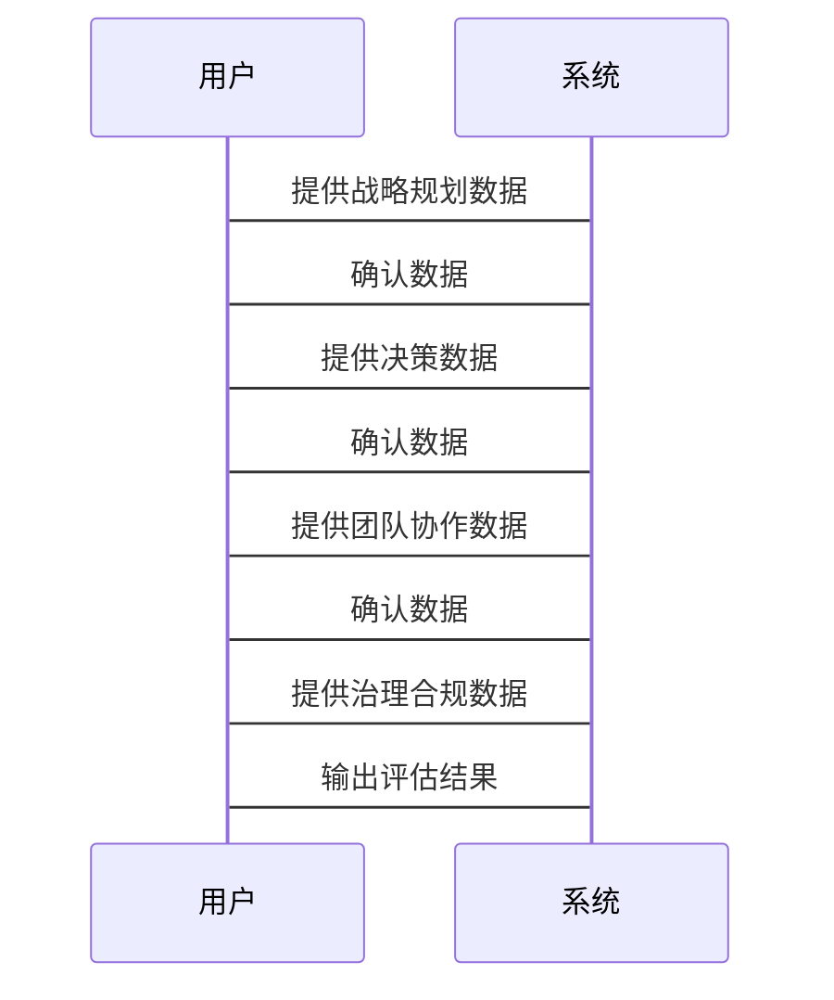

                 


# 彼得·林奇对公司管理层质量的要求

> 关键词：彼得·林奇，管理层质量，投资理念，企业治理，决策能力

> 摘要：本文从彼得·林奇的投资理念出发，深入探讨他对公司管理层质量的要求，分析管理层的核心要素、评估方法、影响因素及提升策略，并通过实际案例和系统架构图，详细阐述如何在企业治理中实现高效管理。

---

## 第一章: 背景介绍

### 1.1 问题背景

#### 1.1.1 公司管理层在企业中的核心地位
- 管理层是企业战略制定和执行的核心力量。
- 管理层的决策直接影响企业的市场表现和长期发展。

#### 1.1.2 管理层质量对企业价值的影响
- 高质量的管理层能够优化资源配置，提升企业效率。
- 管理层质量与企业市值呈正相关关系。

#### 1.1.3 彼得·林奇的投资理念与管理层质量的关系
- 彼得·林奇认为管理层质量是企业投资价值的关键因素。
- 他强调通过分析管理层的决策能力和战略眼光来评估企业。

### 1.2 问题描述

#### 1.2.1 管理层质量的核心要素
- 战略思维能力
- 决策能力
- 团队协作能力
- 企业治理能力

#### 1.2.2 彼得·林奇对管理层的期望
- 诚实可靠，具有良好的职业道德。
- 具备行业专业知识和战略眼光。
- 能够适应市场变化，及时调整企业战略。

#### 1.2.3 管理层质量对企业长期发展的意义
- 优质管理层能够带领企业在竞争中脱颖而出。
- 管理层质量直接影响企业的创新能力和市场竞争力。

### 1.3 问题解决

#### 1.3.1 如何评估管理层质量
- 通过财务指标（如ROE）评估管理层的盈利能力。
- 通过战略规划的合理性评估管理层的战略眼光。
- 通过团队协作能力评估管理层的组织能力。

#### 1.3.2 管理层质量对投资决策的影响
- 优质管理层是企业长期稳定发展的保障。
- 管理层质量是投资者评估企业价值的重要指标。

#### 1.3.3 提升管理层质量的策略
- 加强管理层培训，提升专业能力。
- 建立科学的绩效考核机制，激励管理层积极性。
- 引入外部专家，优化管理层结构。

### 1.4 边界与外延

#### 1.4.1 管理层质量的边界条件
- 管理层质量的评估受到企业所处行业和市场环境的影响。
- 管理层质量的评估需要结合企业的具体发展阶段。

#### 1.4.2 管理层质量与其他企业要素的关系
- 管理层质量与企业战略目标的关系。
- 管理层质量与企业治理结构的关系。
- 管理层质量与企业创新能力的关系。

#### 1.4.3 管理层质量的外延与扩展
- 管理层质量对中小企业的启示。
- 管理层质量与企业社会责任的关系。
- 管理层质量与企业文化建设的互动。

### 1.5 概念结构与核心要素组成

#### 1.5.1 管理层质量的概念框架
- 管理层质量是一个综合指标，涵盖战略、决策、团队协作等多个维度。
- 管理层质量的核心是管理层的战略执行力和团队凝聚力。

#### 1.5.2 核心要素的详细分析
- 战略思维能力：包括市场洞察力、战略规划能力。
- 决策能力：包括决策的准确性和及时性。
- 团队协作能力：包括团队管理能力和内部沟通效率。
- 企业治理能力：包括合规意识和风险控制能力。

#### 1.5.3 概念结构的可视化图解


---

## 第二章: 核心概念与联系

### 2.1 核心概念原理

#### 2.1.1 管理层质量的核心要素
- 管理层的决策能力和战略眼光是企业发展的关键。
- 管理层的团队协作能力直接影响企业的执行力。

#### 2.1.2 彼得·林奇的管理层评估标准
- 评估管理层的道德水平和专业能力。
- 评估管理层的战略规划和执行能力。
- 评估管理层的适应能力和创新能力。

#### 2.1.3 管理层质量与企业绩效的关系
- 高质量的管理层能够有效提升企业的盈利能力。
- 管理层质量与企业市场表现呈正相关关系。

### 2.2 概念属性特征对比表格

#### 2.2.1 管理层质量的关键属性对比
| 属性               | 高质量管理层       | 低质量管理层       |
|--------------------|------------------|------------------|
| 战略眼光           | 准确、前瞻        | 模糊、滞后        |
| 决策能力           | 快速、精准        | 缓慢、错误        |
| 团队协作能力       | 良好、高效        | 良莠不齐          |
| 企业治理能力       | 规范、合规        | 混乱、合规不足     |

#### 2.2.2 不同管理风格的特征分析
- **集权式管理**：决策集中，效率高，但可能缺乏灵活性。
- **民主式管理**：决策分散，灵活性强，但效率可能较低。
- **混合式管理**：结合集权和民主的优点，适合大多数企业。

#### 2.2.3 表格总结：管理层质量的核心指标
| 指标               | 重要性   | 评估方法           |
|--------------------|----------|--------------------|
| 战略规划能力       | 高       | 战略规划的合理性   |
| 决策能力           | 高       | 决策的准确性和及时性|
| 团队协作能力       | 中       | 团队管理能力评估   |
| 企业治理能力       | 高       | 风险控制能力评估   |

### 2.3 ER实体关系图架构

#### 2.3.1 管理层与企业目标的关系图


#### 2.3.2 管理层与股东利益的关系图


#### 2.3.3 管理层与公司治理的关系图


---

## 第三章: 算法原理讲解

### 3.1 管理层质量评估算法

#### 3.1.1 算法概述
- 通过多个指标量化评估管理层质量。
- 综合分析战略、决策、团队协作和治理能力。
- 结果分为优秀、良好、一般和较差四个等级。

#### 3.1.2 算法流程图（Mermaid）



#### 3.1.3 算法实现

```python
# 管理层质量评估算法实现
def calculate_management_quality(strategy_score, decision_score, team_score, governance_score):
    total_score = (strategy_score + decision_score + team_score + governance_score) / 4
    if total_score >= 0.8:
        return "优秀"
    elif total_score >= 0.6:
        return "良好"
    elif total_score >= 0.4:
        return "一般"
    else:
        return "较差"

# 示例数据
strategy_score = 0.8
decision_score = 0.7
team_score = 0.6
governance_score = 0.9

print(calculate_management_quality(strategy_score, decision_score, team_score, governance_score))
```

#### 3.1.4 算法的数学模型和公式

$$
\text{总分} = \frac{\text{战略得分} + \text{决策得分} + \text{团队得分} + \text{治理得分}}{4}
$$

---

## 第四章: 系统分析与架构设计方案

### 4.1 问题场景介绍

#### 4.1.1 问题场景描述
- 某公司管理层战略规划能力不足，导致企业市场表现不佳。
- 如何通过优化管理层质量提升企业绩效。

#### 4.1.2 项目介绍
- 开发一个管理层质量评估系统，帮助企业优化管理层结构。

### 4.2 系统功能设计

#### 4.2.1 领域模型（Mermaid类图）



#### 4.2.2 系统架构设计（Mermaid架构图）



### 4.3 系统接口设计

#### 4.3.1 系统输入
- 战略规划数据
- 决策数据
- 团队协作数据
- 治理合规数据

#### 4.3.2 系统输出
- 管理层质量评估报告
- 改进建议

### 4.4 系统交互设计（Mermaid序列图）



---

## 第五章: 项目实战

### 5.1 环境安装

#### 5.1.1 系统运行环境
- Python 3.8+
- Mermaid图库
- 数据分析库（如Pandas）

### 5.2 系统核心实现源代码

#### 5.2.1 管理层质量评估代码

```python
import pandas as pd

def calculate_management_quality(strategy_score, decision_score, team_score, governance_score):
    total_score = (strategy_score + decision_score + team_score + governance_score) / 4
    if total_score >= 0.8:
        return "优秀"
    elif total_score >= 0.6:
        return "良好"
    elif total_score >= 0.4:
        return "一般"
    else:
        return "较差"

# 示例数据
data = {
    '战略得分': [0.8],
    '决策得分': [0.7],
    '团队得分': [0.6],
    '治理得分': [0.9]
}

df = pd.DataFrame(data)
result = calculate_management_quality(df['战略得分'].values[0], df['决策得分'].values[0],
                                      df['团队得分'].values[0], df['治理得分'].values[0])
print(f"评估结果: {result}")
```

#### 5.2.2 系统功能实现

```python
# 管理层质量评估系统
def main():
    import pandas as pd
    import numpy as np

    # 数据输入
    strategy_score = float(input("请输入战略得分（0-1）："))
    decision_score = float(input("请输入决策得分（0-1）："))
    team_score = float(input("请输入团队得分（0-1）："))
    governance_score = float(input("请输入治理得分（0-1）："))

    # 质量评估
    def calculate_quality(s, d, t, g):
        total = (s + d + t + g) / 4
        if total >= 0.8:
            return "优秀"
        elif total >= 0.6:
            return "良好"
        elif total >= 0.4:
            return "一般"
        else:
            return "较差"

    quality = calculate_quality(strategy_score, decision_score, team_score, governance_score)
    print(f"管理层质量评估结果: {quality}")

if __name__ == "__main__":
    main()
```

### 5.3 代码应用解读与分析

#### 5.3.1 代码功能解读
- 代码实现了一个简单的管理层质量评估系统。
- 用户输入各项得分，系统输出评估结果。

#### 5.3.2 代码实现分析
- 使用Python和Pandas进行数据处理。
- 通过函数实现质量评估逻辑。
- 提供了用户交互界面，方便数据输入和结果输出。

### 5.4 实际案例分析

#### 5.4.1 案例背景
- 某科技公司管理层战略规划能力较强，但团队协作能力较弱。

#### 5.4.2 数据输入
- 战略得分：0.8
- 决策得分：0.7
- 团队得分：0.5
- 治理得分：0.8

#### 5.4.3 系统评估
- 总分：(0.8 + 0.7 + 0.5 + 0.8) / 4 = 0.65
- 评估结果：良好

#### 5.4.4 改进建议
- 加强团队协作能力的培训。
- 优化内部沟通机制，提升团队凝聚力。

### 5.5 项目小结

#### 5.5.1 项目总结
- 系统实现了管理层质量的量化评估。
- 通过实际案例验证了系统的有效性和实用性。

#### 5.5.2 项目意义
- 为企业的管理层优化提供了科学依据。
- 为企业提升竞争力提供了可行的解决方案。

---

## 第六章: 最佳实践 tips、小结、注意事项、拓展阅读

### 6.1 最佳实践 tips

#### 6.1.1 评估管理层质量时的注意事项
- 结合企业的具体情况进行综合评估。
- 定期更新评估指标，适应市场变化。
- 注重定量分析与定性分析相结合。

#### 6.1.2 提升管理层质量的策略
- 加强管理层培训，提升专业能力。
- 建立科学的绩效考核机制。
- 引入外部专家，优化管理层结构。

### 6.2 小结

#### 6.2.1 本文总结
- 彼得·林奇对管理层质量的要求是企业投资价值的重要因素。
- 通过科学的评估方法和优化策略，可以有效提升管理层质量。

### 6.3 注意事项

#### 6.3.1 评估过程中的常见问题
- 数据的准确性和完整性。
- 评估指标的合理性和适用性。
- 评估结果的客观性和公正性。

#### 6.3.2 提升管理层质量的挑战
- 管理层自身的认知和能力提升。
- 企业内部文化和组织结构的优化。
- 外部环境和市场竞争的影响。

### 6.4 拓展阅读

#### 6.4.1 推荐书籍
- 《彼得·林奇的投资哲学》
- 《企业治理与高层管理》

#### 6.4.2 推荐文章
- 彼得·林奇：《怎样选择成长股》
- 管理学经典理论：目标管理和过程管理。

---

## 作者：AI天才研究院/AI Genius Institute & 禅与计算机程序设计艺术 /Zen And The Art of Computer Programming

---

本文通过详细分析彼得·林奇对公司管理层质量的要求，结合理论与实践，为企业管理者和投资者提供了科学的评估方法和优化策略。希望本文能够帮助读者更好地理解和应用这些理念，提升企业的管理水平和投资价值。

