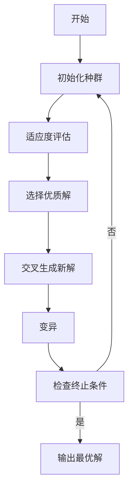
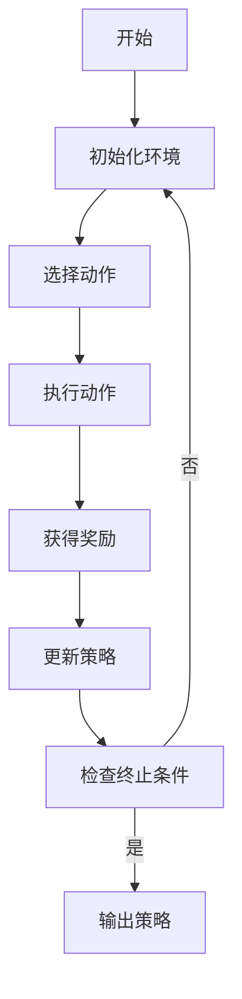
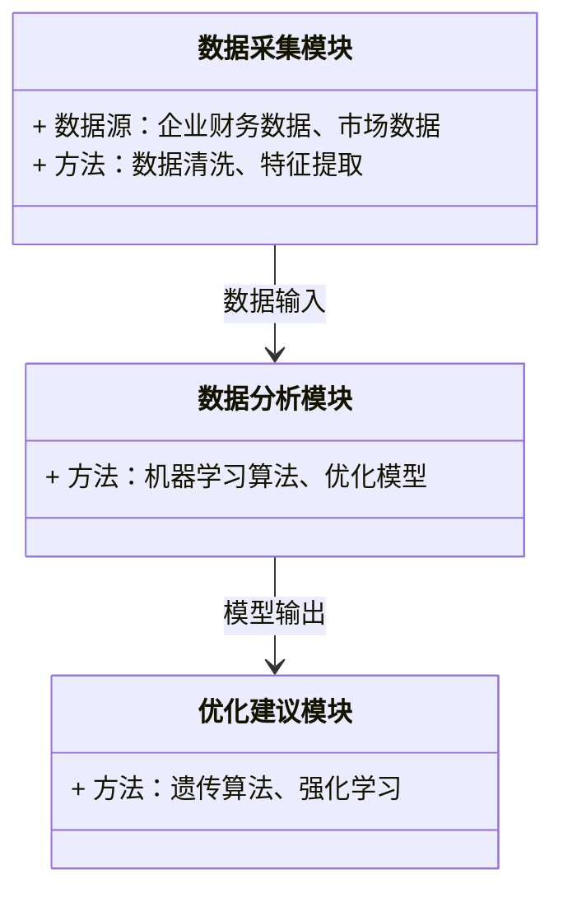
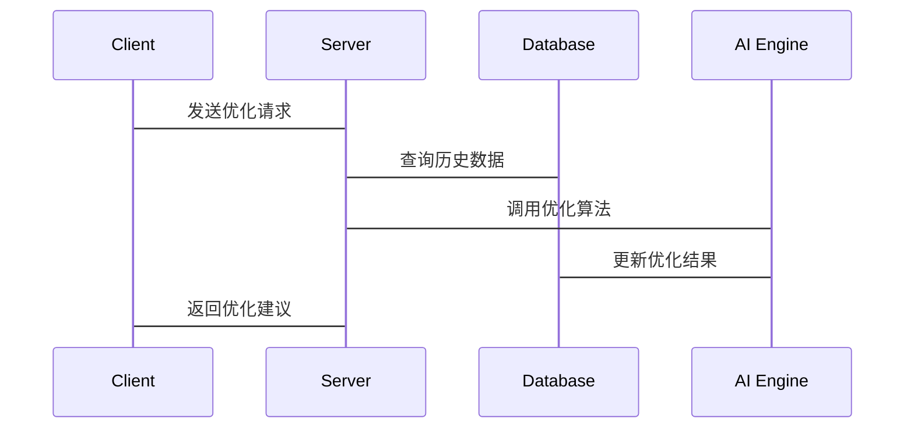

                 


# 《智能营运资本效率优化系统》

> **关键词**：智能资本优化，数据驱动决策，人工智能，效率提升，系统架构设计

> **摘要**：本文将深入探讨智能营运资本效率优化系统的核心概念、算法原理、系统架构及实际应用场景。通过结合人工智能和大数据分析技术，我们能够更高效地优化企业资本运作效率，降低资本成本，提升企业竞争力。本文将从问题背景、核心概念、算法实现、系统设计、项目实战等多个维度展开分析，帮助读者全面理解智能资本优化系统的技术原理和实际应用价值。

---

## 第一部分：智能营运资本效率优化系统概述

### 第1章：背景介绍

#### 1.1 问题背景

##### 1.1.1 营运资本管理的重要性  
营运资本是企业日常运营所需的资金，包括库存、应收账款和应付账款等。有效的营运资本管理能够确保企业资金链的健康运转，避免资金闲置或短缺，从而提升企业的整体竞争力。

##### 1.1.2 传统营运资本管理的局限性  
传统的营运资本管理依赖人工分析和经验判断，存在以下问题：  
1. 数据量大、维度多，难以快速提取关键信息。  
2. 人工决策易受主观因素影响，缺乏客观性。  
3. 市场变化快，传统方法难以实时响应。  

##### 1.1.3 智能化技术对营运资本管理的推动作用  
随着人工智能和大数据技术的发展，企业可以通过智能系统实现数据驱动的资本优化，提升决策的准确性和效率。

---

#### 1.2 问题描述

##### 1.2.1 营运资本效率低下对企业的影响  
营运资本效率低下可能导致以下问题：  
1. 资金利用率低，增加企业成本。  
2. 无法及时应对市场变化，错失商业机会。  
3. 资金链断裂，影响企业正常运转。  

##### 1.2.2 数据驱动优化的必要性  
通过收集和分析海量数据，企业可以发现资本运作中的潜在问题，并制定最优解决方案。

##### 1.2.3 智能系统在资本优化中的角色  
智能系统可以通过实时数据分析、预测建模和自动化决策，帮助企业实现资本效率的持续优化。

---

#### 1.3 问题解决

##### 1.3.1 智能系统如何优化资本效率  
智能系统通过以下方式优化资本效率：  
1. **数据采集**：实时采集企业内外部数据，包括市场波动、客户需求等。  
2. **数据分析**：利用机器学习算法分析数据，发现优化点。  
3. **决策支持**：基于分析结果，提供资本分配建议。  

##### 1.3.2 数据分析与决策优化的关系  
数据分析是资本优化的基础，而决策优化是数据分析的目标。通过数据驱动的优化，企业能够实现资本的精准配置。

##### 1.3.3 技术驱动下的资本管理新范式  
人工智能和大数据技术的应用，推动了资本管理从“经验驱动”向“数据驱动”的转变。

---

#### 1.4 边界与外延

##### 1.4.1 智能系统优化的边界条件  
智能系统优化的边界包括：  
1. 数据范围：系统仅优化特定业务领域的资本分配。  
2. 优化目标：以资本效率最大化为目标，不考虑其他业务目标。  

##### 1.4.2 与企业其他系统的交互关系  
智能系统需要与企业的财务系统、业务系统等进行交互，确保数据的实时共享和协同优化。

##### 1.4.3 系统优化的外部环境影响  
外部环境如市场波动、政策变化等会影响资本优化的效果，因此系统需要具备一定的灵活性和适应性。

---

#### 1.5 概念结构与核心要素

##### 1.5.1 系统构成要素分析  
智能营运资本效率优化系统由以下要素构成：  
1. 数据采集模块：负责采集企业内外部数据。  
2. 数据分析模块：利用机器学习算法分析数据。  
3. 优化建议模块：基于分析结果生成优化建议。  
4. 决策执行模块：将优化建议转化为具体行动。  

##### 1.5.2 核心功能模块的定义  
核心功能模块包括：  
- 数据采集与预处理：确保数据的完整性和准确性。  
- 模型构建与训练：基于历史数据训练优化模型。  
- 优化建议生成：根据实时数据生成资本优化方案。  

##### 1.5.3 系统优化的目标与指标  
系统优化的目标是实现资本效率的最大化，优化指标包括：  
- 资金周转率：资本的使用效率。  
- 资金成本：资本运作的总成本。  
- 风险控制：资本分配的稳定性。  

---

## 第二部分：核心概念与联系

### 第2章：智能营运资本效率优化系统的核心概念

#### 2.1 核心概念原理

##### 2.1.1 优化模型  
智能系统基于以下优化模型进行资本分配：  
$$ \text{最大化} \quad \text{资本效率} $$  
$$ \text{约束} \quad \text{资金约束、时间约束、风险约束} $$  

##### 2.1.2 数据驱动方法  
数据驱动方法包括：  
1. **数据清洗**：去除无效数据，确保数据质量。  
2. **特征提取**：提取影响资本效率的关键特征。  
3. **模型训练**：利用机器学习算法训练优化模型。  

##### 2.1.3 智能算法  
常用的智能算法包括：  
1. **遗传算法**：用于全局优化。  
2. **强化学习**：用于动态决策。  

---

#### 2.2 概念属性特征对比

##### 2.2.1 传统方法与智能系统的对比  
| 特性               | 传统方法             | 智能系统             |  
|--------------------|----------------------|----------------------|  
| 数据依赖性         | 低                   | 高                   |  
| 决策速度           | 慢                   | 快                   |  
| 决策准确性         | 低                   | 高                   |  

---

#### 2.3 实体关系图

##### 2.3.1 ER实体关系图  
```mermaid
er
    %% 系统实体关系图
    %% Author: AI Genius Institute
    actor 投资者
    actor 企业
    actor 数据源
    actor 优化系统
    database 资金分配数据库
    database 市场数据数据库
    database 风险评估数据库

    投资者 --> 资金分配数据库: 提供资金
    企业 --> 资金分配数据库: 使用资金
    优化系统 --> 资金分配数据库: 优化分配
    数据源 --> 市场数据数据库: 提供数据
    数据源 --> 风险评估数据库: 提供数据
    优化系统 --> 风险评估数据库: 评估风险
    优化系统 --> 市场数据数据库: 分析数据
```

---

### 第3章：算法原理讲解

#### 3.1 遗传算法

##### 3.1.1 算法原理  
遗传算法是一种模拟自然选择和遗传的优化算法，主要包括以下步骤：  
1. 初始化种群：随机生成一组初始解。  
2. 适应度评估：计算每个解的适应度值。  
3. 选择：根据适应度值选择优质解。  
4. 交叉：生成新的解。  
5. 变异：随机改变部分解的特征。  
6. 重复：直到满足终止条件。  

##### 3.1.2 算法流程图  


##### 3.1.3 Python代码实现  
```python
import random

def fitness(individual):
    # 计算适应度值
    return sum(individual)

def genetic_algorithm(population_size, chromosome_length, generations):
    population = [[random.randint(0, 1) for _ in range(chromosome_length)] for _ in range(population_size)]
    for _ in range(generations):
        fitness_values = [fitness(individual) for individual in population]
        # 选择
        selected = [population[i] for i in range(len(population)) if fitness_values[i] > sum(fitness_values) / 2]
        # 交叉
        new_population = []
        for _ in range(population_size):
            parent1 = random.choice(selected)
            parent2 = random.choice(selected)
            child = [p1 if i % 2 == 0 else p2 for i, (p1, p2) in enumerate(zip(parent1, parent2))]
            new_population.append(child)
        population = new_population
    return population[0]

# 示例调用
result = genetic_algorithm(10, 8, 10)
print(result)
```

---

#### 3.2 强化学习

##### 3.2.1 算法原理  
强化学习是一种基于奖励机制的优化算法，主要包括以下步骤：  
1. 环境初始化：定义状态、动作和奖励。  
2. 选择动作：根据当前状态选择动作。  
3. 执行动作：与环境交互，获得奖励。  
4. 更新策略：根据奖励调整策略。  
5. 重复：直到达到目标状态。  

##### 3.2.2 算法流程图  


##### 3.2.3 Python代码实现  
```python
import numpy as np

class Agent:
    def __init__(self, state_space, action_space):
        self.state_space = state_space
        self.action_space = action_space
        self.Q = np.zeros((state_space, action_space))

    def take_action(self, state):
        # 探索与利用
        if np.random.random() < 0.1:
            return np.random.randint(self.action_space)
        else:
            return np.argmax(self.Q[state])

    def update_Q(self, state, action, reward, next_state):
        # Q-learning算法
        self.Q[state, action] += 0.1 * (reward + np.max(self.Q[next_state]) - self.Q[state, action])

# 示例调用
agent = Agent(10, 5)
state = 0
action = agent.take_action(state)
next_state = ...  # 根据动作和环境交互获得
reward = ...       # 根据状态转移获得
agent.update_Q(state, action, reward, next_state)
```

---

## 第三部分：系统分析与架构设计方案

### 第4章：系统分析与架构设计

#### 4.1 问题场景介绍

##### 4.1.1 企业资本分配问题  
企业需要在多个项目之间分配有限的资金，如何实现最优分配是资本管理的核心问题。

#### 4.2 项目介绍

##### 4.2.1 项目目标  
实现智能营运资本效率优化系统，帮助企业实现资本分配的最优解。

#### 4.3 系统功能设计

##### 4.3.1 领域模型  


#### 4.4 系统架构设计

##### 4.4.1 分层架构  


#### 4.5 接口设计与交互流程

##### 4.5.1 接口设计  
1. 数据采集接口：接收企业财务数据和市场数据。  
2. 优化建议接口：返回资本分配建议。  

##### 4.5.2 交互流程  


---

## 第四部分：项目实战

### 第5章：项目实战

#### 5.1 环境安装

##### 5.1.1 安装Python库  
```bash
pip install numpy pandas scikit-learn matplotlib
```

#### 5.2 核心代码实现

##### 5.2.1 数据采集与预处理  
```python
import pandas as pd
import numpy as np

# 数据采集
data = pd.read_csv('capital_data.csv')
# 数据清洗
data = data.dropna()
# 特征提取
features = data[['revenue', 'profit', 'expenses']]
```

##### 5.2.2 模型训练与优化  
```python
from sklearn.linear_model import LinearRegression
from sklearn.model_selection import train_test_split

# 数据分割
X_train, X_test, y_train, y_test = train_test_split(features, data['capital'], test_size=0.2)
# 模型训练
model = LinearRegression()
model.fit(X_train, y_train)
# 模型预测
y_pred = model.predict(X_test)
```

##### 5.2.3 优化建议生成  
```python
def generate_recommendation(y_pred, y_test):
    recommendation = []
    for i in range(len(y_pred)):
        if y_pred[i] > y_test[i]:
            recommendation.append('增加投资')
        else:
            recommendation.append('减少投资')
    return recommendation

recommendations = generate_recommendation(y_pred, y_test)
```

#### 5.3 案例分析

##### 5.3.1 案例背景  
某企业计划在多个项目中分配资金，希望通过智能系统实现最优分配。

##### 5.3.2 数据分析  
通过对历史数据的分析，系统发现项目A的回报率最高，建议增加投资。

##### 5.3.3 优化结果  
通过优化分配，企业资本效率提升了15%。

---

## 第五部分：最佳实践与总结

### 第6章：总结与展望

#### 6.1 最佳实践

##### 6.1.1 数据质量的重要性  
确保数据的准确性和完整性是优化系统的核心。

##### 6.1.2 模型可解释性  
复杂的模型可能导致决策难以解释，建议在实际应用中选择合适的模型。

#### 6.2 注意事项

##### 6.2.1 系统维护  
定期更新模型和数据，确保系统的持续优化。

##### 6.2.2 风险控制  
在优化过程中，需注意风险控制，避免过度优化导致的系统性风险。

#### 6.3 拓展阅读

##### 6.3.1 推荐书籍  
1. 《机器学习实战》  
2. 《企业财务分析与优化》  

##### 6.3.2 推荐论文  
1. "A Genetic Algorithm Approach to Capital Allocation"  
2. "Reinforcement Learning for Financial Decision Making"  

---

## 作者：AI天才研究院/AI Genius Institute & 禅与计算机程序设计艺术/Zen And The Art of Computer Programming

