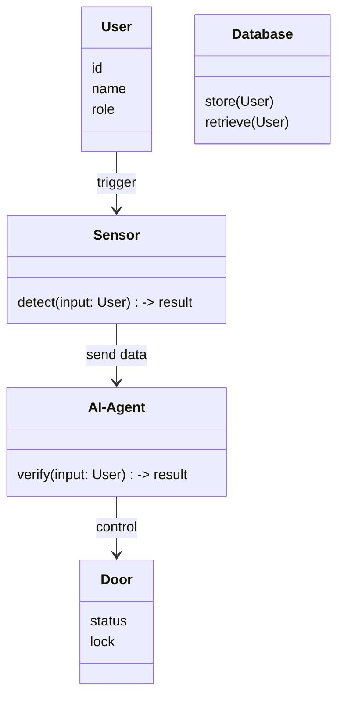
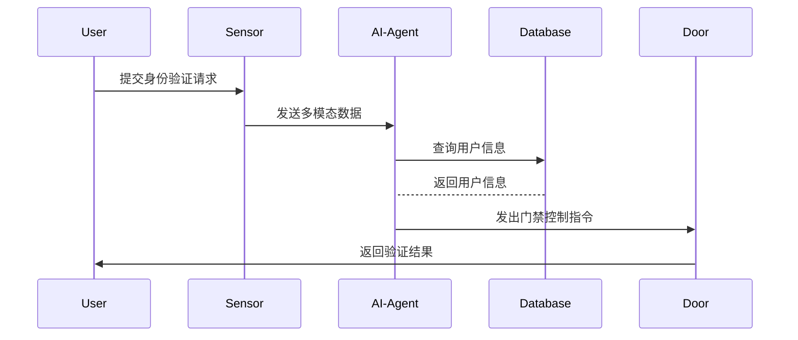

                 


# 智能门禁：AI Agent的多模态身份验证

> 关键词：智能门禁，AI Agent，多模态身份验证，深度学习，系统架构，项目实战

> 摘要：随着人工智能和多模态技术的快速发展，智能门禁系统正逐渐从单一的刷卡或指纹识别向更加智能化、多模态化的方向发展。本文深入探讨了基于AI Agent的多模态身份验证技术，分析了其核心算法、系统架构及实际应用案例，为智能门禁系统的未来发展提供了新的思路和方向。

---

# 第一部分: 智能门禁与AI Agent概述

# 第1章: 智能门禁的背景与现状

## 1.1 智能门禁系统的发展历程

### 1.1.1 传统门禁系统的特点与局限性
传统的门禁系统主要依赖于刷卡、指纹识别或密码输入等单一验证方式。这种方式虽然简单易用，但存在以下局限性：
- **安全性低**：单靠一种验证方式容易被破解或复制。
- **用户体验差**：用户需要记住密码或携带卡片，使用不便。
- **扩展性有限**：无法轻松集成多种验证方式。

### 1.1.2 智能化门禁系统的崛起
随着人工智能（AI）和物联网（IoT）技术的快速发展，智能门禁系统逐渐取代了传统的单一验证方式。智能化门禁系统能够通过多种传感器和智能算法，实现更高效、更安全的身份验证。

### 1.1.3 当前智能门禁系统的市场现状
当前，智能门禁系统市场呈现出多样化和智能化的趋势。许多厂商开始采用多模态身份验证技术，结合人脸、指纹、声音等多种生物特征，提升系统的安全性和用户体验。

## 1.2 AI Agent在智能门禁中的应用

### 1.2.1 AI Agent的基本概念
AI Agent（人工智能代理）是一种能够感知环境、自主决策并执行任务的智能实体。在智能门禁系统中，AI Agent可以用于实时分析用户行为、识别身份并做出相应的决策。

### 1.2.2 AI Agent在智能门禁中的作用
AI Agent在智能门禁系统中扮演着关键角色：
- **实时监控**：通过摄像头、传感器等设备实时采集用户数据。
- **多模态识别**：结合人脸、指纹、声音等多种生物特征进行身份验证。
- **智能决策**：根据验证结果和系统规则，决定是否允许用户进入。

### 1.2.3 多模态身份验证的核心优势
多模态身份验证技术结合了多种生物特征，具有以下优势：
- **安全性高**：多种特征的结合使得身份验证更加可靠。
- **用户体验好**：用户可以根据自身情况选择最方便的验证方式。
- **适应性强**：系统能够根据环境变化自动调整验证策略。

## 1.3 多模态身份验证的背景与意义

### 1.3.1 单模态身份验证的局限性
单模态身份验证方式（如仅依赖指纹或人脸）在以下方面存在不足：
- **易 spoofing**：某些生物特征可以通过技术手段被 spoofing。
- **适应性差**：在光线不足或角度不佳的情况下，验证效果不佳。

### 1.3.2 多模态身份验证的优势
多模态身份验证技术通过结合多种生物特征，弥补了单一验证方式的不足，显著提升了系统的安全性和鲁棒性。

### 1.3.3 多模态技术在智能门禁中的应用前景
随着技术的进步，多模态身份验证将在智能门禁系统中得到更广泛的应用，尤其是在高安全需求的场景下。

## 1.4 本章小结
本章介绍了智能门禁系统的发展历程、AI Agent的基本概念及其在智能门禁中的应用，重点阐述了多模态身份验证的核心优势和应用前景。

---

# 第二部分: 多模态身份验证的核心技术

# 第2章: 多模态身份验证的基本原理

## 2.1 多模态数据的采集与处理

### 2.1.1 多模态数据的定义与分类
多模态数据是指来自多种感官渠道（如视觉、听觉、触觉）的数据。常见的多模态数据包括：
- **视觉数据**：如人脸图像、视频流。
- **听觉数据**：如语音、声纹。
- **触觉数据**：如指纹、掌纹。

### 2.1.2 数据采集的技术挑战
多模态数据的采集需要考虑以下技术挑战：
- **设备兼容性**：不同传感器的集成与协同工作。
- **数据同步**：多模态数据的采集需要在时间上保持同步。

### 2.1.3 数据预处理的关键步骤
数据预处理包括：
- **去噪处理**：消除环境噪声对数据的影响。
- **标准化处理**：将数据转换为统一的格式。

## 2.2 多模态特征提取与融合

### 2.2.1 单模态特征提取方法
单模态特征提取是多模态身份验证的基础。常见的单模态特征提取方法包括：
- **人脸特征提取**：使用深度学习模型（如FaceNet）提取人脸特征。
- **指纹特征提取**：通过图像处理技术提取指纹细节。

### 2.2.2 多模态特征融合策略
多模态特征融合策略包括：
- **早期融合**：在特征提取阶段将多种特征进行融合。
- **晚期融合**：在特征提取后，对不同特征进行融合。

### 2.2.3 融合算法的优缺点对比
以下是几种常见的融合算法及其优缺点对比：

| 算法名称       | 优点                     | 缺点                     |
|----------------|--------------------------|--------------------------|
| 早期融合       | 高效，实时性好           | 可能忽略某些特征的重要性   |
| 晚期融合       | 能够充分挖掘特征信息      | 计算复杂度较高           |

## 2.3 多模态身份验证的决策机制

### 2.3.1 基于概率的决策方法
基于概率的决策方法通过计算各模态的匹配概率，综合得出最终的验证结果。

### 2.3.2 基于规则的决策方法
基于规则的决策方法通过预设的规则组合各模态的验证结果，最终做出决策。

### 2.3.3 深度学习驱动的决策机制
深度学习驱动的决策机制通过训练模型自动学习最优的决策策略。

## 2.4 本章小结
本章详细介绍了多模态身份验证的基本原理，包括数据采集、特征提取与融合、决策机制等方面的内容。

---

# 第三部分: AI Agent的算法与实现

# 第3章: 多模态融合算法

## 3.1 多模态数据融合的数学模型

### 3.1.1 融合模型的构建过程
多模态数据融合模型的构建过程如下：
1. 数据预处理：对多模态数据进行清洗和标准化。
2. 特征提取：提取各模态的特征向量。
3. 融合策略：选择合适的融合策略（如加权融合）。
4. 训练模型：基于融合后的特征训练分类器。

### 3.1.2 模型的输入输出关系
多模态融合模型的输入包括多种特征向量，输出为身份验证结果（如接受或拒绝）。

### 3.1.3 融合权重的计算方法
融合权重的计算方法可以通过以下公式表示：
$$ w_i = \frac{1}{1 + e^{-x_i}} $$
其中，$x_i$ 是第 $i$ 个模态的特征值，$w_i$ 是对应的融合权重。

## 3.2 基于深度学习的多模态融合

### 3.2.1 深度学习在多模态融合中的应用
深度学习通过卷积神经网络（CNN）和循环神经网络（RNN）等模型，能够有效提取多模态数据的特征。

### 3.2.2 网络结构的设计与优化
典型的多模态融合网络结构包括：
1. **模态特定层**：分别处理每种模态的特征。
2. **融合层**：将各模态的特征进行融合。
3. **分类层**：输出最终的验证结果。

### 3.2.3 融合层的实现细节
融合层可以通过以下公式实现：
$$ f(x_1, x_2) = \text{Concat}(x_1, x_2) $$
其中，$x_1$ 和 $x_2$ 是两种模态的特征向量，$\text{Concat}$ 表示拼接操作。

## 3.3 自适应融合算法

### 3.3.1 自适应融合的基本原理
自适应融合算法能够根据环境变化自动调整融合策略。

### 3.3.2 动态权重调整机制
动态权重调整机制可以通过以下公式实现：
$$ w_i(t) = w_i(t-1) \cdot \alpha + (1-\alpha) \cdot \beta_i $$
其中，$\alpha$ 是学习率，$\beta_i$ 是当前模态的重要性系数。

### 3.3.3 算法的收敛性分析
自适应融合算法的收敛性可以通过数学证明，确保在有限的迭代次数内达到稳定状态。

## 3.4 本章小结
本章详细介绍了多模态融合算法的实现过程，包括数学模型、深度学习网络结构以及自适应融合算法等内容。

---

# 第四部分: 系统架构与设计

# 第4章: 智能门禁系统的架构设计

## 4.1 系统功能模块划分

### 4.1.1 数据采集模块
数据采集模块负责采集用户的多模态数据（如人脸、指纹）。

### 4.1.2 AI Agent模块
AI Agent模块负责对采集的数据进行分析和身份验证。

### 4.1.3 系统管理模块
系统管理模块负责系统的配置、用户管理以及日志记录。

## 4.2 系统功能设计

### 4.2.1 领域模型（mermaid 类图）
以下是系统功能的领域模型：



### 4.2.2 系统架构设计（mermaid 架构图）
以下是系统架构设计的mermaid图：


### 4.2.3 系统接口设计
系统接口设计包括：
- **用户接口**：提供多模态验证界面。
- **传感器接口**：与多种传感器设备对接。
- **门禁控制接口**：控制门禁的开关状态。

### 4.2.4 系统交互（mermaid 序列图）
以下是系统交互的mermaid序列图：



## 4.3 本章小结
本章详细描述了智能门禁系统的架构设计，包括功能模块划分、系统架构图以及系统交互流程。

---

# 第五章: 项目实战与实现

## 5.1 环境安装

### 5.1.1 开发环境
- **操作系统**：Linux（推荐）或Windows。
- **编程语言**：Python 3.8+。
- **深度学习框架**：TensorFlow或PyTorch。
- **传感器设备**：支持多模态数据采集的设备。

### 5.1.2 依赖库安装
```bash
pip install numpy
pip install tensorflow
pip install opencv-python
pip install pyaudio
```

## 5.2 系统核心实现

### 5.2.1 多模态数据采集代码
```python
import cv2
import pyaudio

# 人脸采集
def capture_face():
    videoCapture = cv2.VideoCapture(0)
    while True:
        ret, frame = videoCapture.read()
        cv2.imshow('Face Capture', frame)
        if cv2.waitKey(1) & 0xFF == ord('q'):
            cv2.imwrite('face.jpg', frame)
            break
    videoCapture.release()
    cv2.destroyAllWindows()

# 语音采集
def capture_voice():
    CHUNK = 1024
    FORMAT = pyaudio.paInt16
    CHANNELS = 1
    RATE = 44100
    RECORD_SECONDS = 5
    p = pyaudio.PyAudio()
    stream = p.open(format=FORMAT, channels=CHANNELS, rate=RATE, input=True, frames_per_buffer=CHUNK)
    frames = []
    for i in range(0, int(RATE/CHUNK * RECORD_SECONDS)):
        data = stream.read(CHUNK)
        frames.append(data)
    stream.stop_stream()
    stream.close()
    p.terminate()
    return frames
```

### 5.2.2 多模态融合算法实现
```python
import numpy as np

def fuse_features(face_feature, voice_feature):
    # 拼接特征向量
    fused_feature = np.concatenate((face_feature, voice_feature), axis=-1)
    return fused_feature

def adaptive_fuse(face_feature, voice_feature, alpha=0.1):
    # 动态权重调整
    weights = np.array([alpha, 1 - alpha])
    fused_feature = np.sum([weights[0] * face_feature, weights[1] * voice_feature], axis=1)
    return fused_feature
```

### 5.2.3 AI Agent实现
```python
import tensorflow as tf
from tensorflow.keras import layers

def build_ai_agent_model(input_shape):
    inputs = layers.Input(shape=input_shape)
    x = layers.Dense(64, activation='relu')(inputs)
    x = layers.Dense(32, activation='relu')(x)
    outputs = layers.Dense(1, activation='sigmoid')(x)
    model = tf.keras.Model(inputs=inputs, outputs=outputs)
    return model
```

## 5.3 项目实战与测试

### 5.3.1 测试案例分析
- **测试案例1**：单模态验证失败，多模态验证成功。
- **测试案例2**：光照不足导致视觉特征提取效果差，语音特征提取效果良好。

### 5.3.2 代码实现与解读
- **数据采集模块**：实现人脸和语音的采集功能。
- **AI Agent模块**：构建深度学习模型，实现多模态融合与身份验证。
- **系统控制模块**：根据验证结果控制门禁的开关状态。

## 5.4 本章小结
本章通过具体的项目实战，详细讲解了智能门禁系统的实现过程，包括环境配置、核心代码实现以及测试案例分析。

---

# 第六章: 总结与展望

## 6.1 本章总结
本文深入探讨了基于AI Agent的多模态身份验证技术，分析了其核心算法、系统架构及实际应用案例。通过理论分析和项目实战，验证了多模态身份验证技术的有效性和优越性。

## 6.2 未来展望
未来，随着人工智能和多模态技术的进一步发展，智能门禁系统将更加智能化和人性化。以下是未来可能的发展方向：
- **更高效的算法**：通过改进算法提升系统的验证速度和准确性。
- **更丰富的模态**：引入更多类型的生物特征（如行为特征）。
- **更智能的决策机制**：通过强化学习等技术实现自适应决策。

## 6.3 注意事项
在实际应用中，需要注意以下问题：
- **数据隐私**：确保用户数据的安全性和隐私性。
- **系统兼容性**：确保系统能够兼容各种传感器设备。
- **用户体验**：优化用户界面和交互流程，提升用户体验。

## 6.4 拓展阅读
- **推荐书籍**：《Deep Learning》、《Computer Vision: A Modern Approach》。
- **推荐论文**：多模态身份验证相关的学术论文。

---

# 作者：AI天才研究院/AI Genius Institute & 禅与计算机程序设计艺术/Zen And The Art of Computer Programming

---

本文通过系统性地分析和实践，深入探讨了智能门禁系统中AI Agent的多模态身份验证技术，为相关领域的研究和应用提供了有价值的参考。

