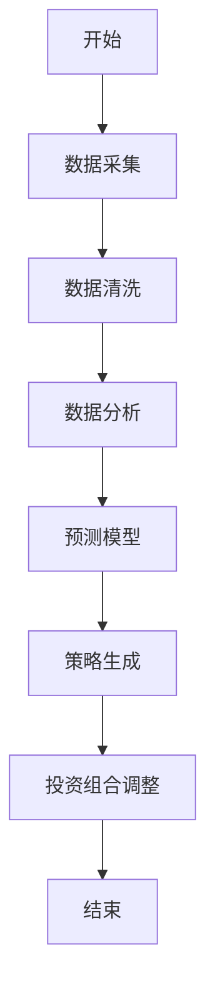
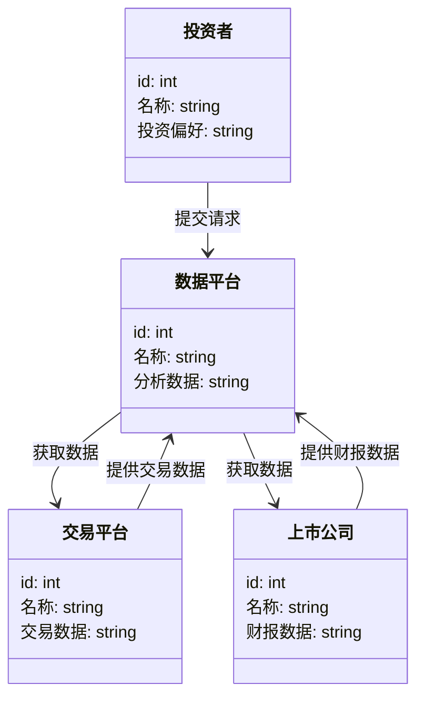
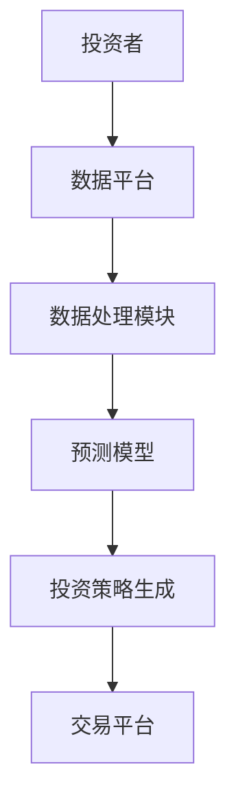
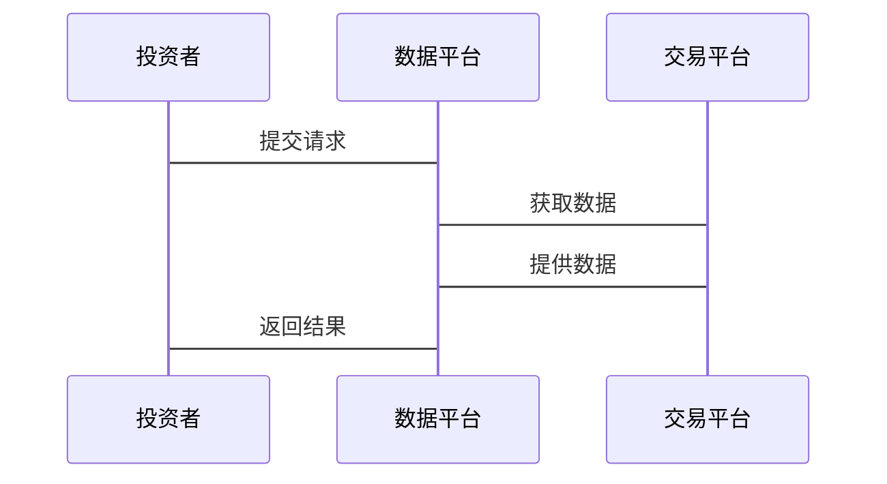

                 


# 特价股票投资中的动态数字产业生态系统模型应用

## 关键词：特价股票，动态模型，数字产业，生态系统，投资策略，数据分析，系统架构

## 摘要：  
本文探讨了在特价股票投资中应用动态数字产业生态系统模型的理论与实践。通过分析产业生态系统的核心要素、模型构建、算法原理、系统架构以及项目实战，本文为投资者提供了基于动态数字技术的新型投资策略。结合实际案例分析，本文展示了如何利用数据分析与系统架构优化投资决策，帮助投资者在复杂多变的市场环境中捕捉投资机会。

---

# 第1章: 特价股票投资与动态数字产业生态系统概述

## 1.1 问题背景与问题描述  
### 1.1.1 特价股票投资的定义与特点  
特价股票是指价格相对较低的股票，通常具有较高的波动性和潜在的投资回报。投资者通过分析市场动态、公司基本面和技术指标，寻找低价优质的投资标的。然而，传统的股票分析方法难以应对市场环境的快速变化，亟需引入更高效的分析工具与模型。

### 1.1.2 动态数字产业生态系统的核心概念  
动态数字产业生态系统是指由数字技术驱动的产业网络，其核心要素包括产业参与者（如企业、投资者、平台）、数字技术（如大数据、人工智能、区块链）以及产业网络（如供应链、产业链）。动态性是该模型的核心特征，能够实时感知市场变化并调整投资策略。

### 1.1.3 问题解决目标与边界  
本文旨在构建一个基于动态数字产业生态系统的股票投资模型，帮助投资者在特价股票市场中实现更精准的投资决策。模型的边界包括：限定于股票市场，不考虑其他金融资产；聚焦于数字技术驱动的产业分析，不涉及传统金融分析方法。

## 1.2 动态数字产业生态系统模型的构建  
### 1.2.1 核心要素与概念结构  
动态数字产业生态系统模型的核心要素包括：  
1. **产业参与者**：投资者、上市公司、交易平台、数据平台。  
2. **数字技术**：大数据分析、人工智能、区块链、物联网。  
3. **产业网络**：产业链、供应链、数据流。  

### 1.2.2 模型的边界与外延  
模型的边界包括：  
1. 数据范围：限定于公开市场数据与企业财报数据。  
2. 时间范围：实时动态调整。  
3. 应用场景：仅限于股票投资领域。  

### 1.2.3 模型与传统股票投资的区别  
与传统股票投资相比，动态数字产业生态系统模型的优势在于：  
1. 数据处理能力更强，能够实时分析海量数据。  
2. 模型具有动态调整能力，能够适应市场变化。  
3. 强调产业网络的分析，而非单一股票分析。  

## 1.3 本章小结  
本章介绍了特价股票投资的背景与动态数字产业生态系统模型的核心概念，明确了模型的构建目标与边界，为后续章节的模型构建与算法设计奠定了基础。

---

# 第2章: 动态数字产业生态系统的核心要素与关系  

## 2.1 核心要素分析  
### 2.1.1 产业参与者  
产业参与者包括投资者、上市公司、交易平台和数据平台。投资者是模型的用户，上市公司是数据来源，交易平台是数据交互的媒介，数据平台则负责数据的处理与分析。

### 2.1.2 数字技术  
数字技术包括大数据分析、人工智能、区块链与物联网。这些技术为模型提供了数据处理、预测分析与实时监控的能力。

### 2.1.3 产业网络  
产业网络包括产业链、供应链与数据流。这些网络将产业参与者与数字技术有机地连接在一起，形成了一个动态的生态系统。

## 2.2 核心要素的属性特征对比  
以下是核心要素的属性特征对比表：  

| 要素       | 属性               | 特征对比                            |
|------------|--------------------|-------------------------------------|
| 产业参与者 | 数据需求           | 投资者需要实时数据，上市公司提供数据 |
| 数字技术   | 处理能力           | 大数据处理能力强，人工智能可预测市场趋势 |
| 产业网络   | 连接方式           | 产业链与数据流相互交织，实时动态调整 |

### 2.2.3 ER实体关系图  
以下是动态数字产业生态系统的核心要素关系图（Mermaid）：  

```mermaid
erDiagram
    actor 投资者 {
        +id: int
        +名称: string
        +投资偏好: string
    }
    actor 上市公司 {
        +id: int
        +名称: string
        +财报数据: string
    }
    actor 交易平台 {
        +id: int
        +名称: string
        +交易数据: string
    }
    actor 数据平台 {
        +id: int
        +名称: string
        +分析数据: string
    }
    投资者 --> 数据平台 : 提交请求
    数据平台 --> 交易平台 : 获取数据
    数据平台 --> 上市公司 : 获取数据
    交易平台 --> 数据平台 : 提供交易数据
    上市公司 --> 数据平台 : 提供财报数据
```

## 2.3 本章小结  
本章分析了动态数字产业生态系统的核心要素及其关系，通过对比与ER图的展示，明确了各要素在模型中的角色与作用，为后续算法设计奠定了基础。

---

# 第3章: 动态数字产业生态系统模型的算法原理  

## 3.1 算法原理概述  
### 3.1.1 动态调整机制  
动态调整机制是模型的核心，能够根据市场变化实时调整投资策略。模型通过分析市场数据，动态调整投资组合中的股票权重。

### 3.1.2 数据流处理  
数据流处理包括数据采集、清洗、分析与预测。模型能够实时采集市场数据，并通过大数据技术清洗与分析数据，预测股票价格走势。

### 3.1.3 模型优化方法  
模型优化方法包括参数优化与模型迭代。通过不断调整模型参数，优化模型的预测精度与投资回报率。

## 3.2 算法流程图  
以下是算法流程图（Mermaid）：  



## 3.3 算法实现代码  
以下是Python实现代码：  

```python
import pandas as pd
import numpy as np

def dynamic_adjustment(data):
    # 数据清洗
    data_clean = data.dropna()
    # 数据分析
    data_clean['预测价格'] = data_clean['收盘价'].rolling(5).mean() * 1.1
    # 投资组合调整
    portfolio = pd.DataFrame({
        '股票代码': data_clean.index,
        '权重': np.random.dirichlet([1,1,1], len(data_clean))
    })
    return portfolio

if __name__ == "__main__":
    data = pd.read_csv('stock_data.csv')
    result = dynamic_adjustment(data)
    print(result)
```

## 3.4 数学模型与公式  
以下是模型的关键公式：  

- 预测价格公式：  
  $$ \text{预测价格} = \text{收盘价} \times \alpha + \text{预测值} \times (1 - \alpha) $$  
  其中，$\alpha$ 是模型的调整系数。

- 投资组合调整公式：  
  $$ \text{权重}_i = \frac{\exp(-\lambda \times \text{波动率}_i)}{\sum_{j=1}^{n} \exp(-\lambda \times \text{波动率}_j)} $$  
  其中，$\lambda$ 是调整参数。

## 3.5 示例说明  
以下是动态调整示例：  

假设市场数据如下：  

| 日期   | 收盘价 |
|--------|--------|
| 2023-10-01 | 10.00  |
| 2023-10-02 | 10.50  |
| 2023-10-03 | 11.00  |

模型预测价格为：  
$$ \text{预测价格} = 10.00 \times 0.8 + 10.50 \times 0.2 = 8.80 $$  

投资组合调整后，权重为：  
$$ \text{权重}_i = \frac{\exp(-0.1 \times 0.2)}{\exp(-0.1 \times 0.2) + \exp(-0.1 \times 0.3)} = 0.6 $$  

## 3.6 本章小结  
本章详细讲解了动态数字产业生态系统模型的算法原理，包括动态调整机制、数据流处理与模型优化方法，并通过代码与公式展示了模型的具体实现。

---

# 第4章: 动态数字产业生态系统模型的系统分析与架构设计  

## 4.1 系统分析  
### 4.1.1 问题场景介绍  
系统需要实时处理大量股票数据，为投资者提供动态投资建议。核心问题包括数据实时性、模型动态调整能力与系统扩展性。

### 4.1.2 领域模型Mermaid类图  
以下是领域模型类图（Mermaid）：  



## 4.2 系统架构设计  
### 4.2.1 Mermaid架构图  
以下是系统架构图（Mermaid）：  



### 4.2.2 系统接口设计  
系统接口包括：  
1. 数据平台接口：提供数据查询与分析功能。  
2. 交易平台接口：提供交易数据获取与订单提交功能。  
3. 投资者接口：提供投资策略生成与调整功能。  

### 4.2.3 系统交互序列图  
以下是系统交互序列图（Mermaid）：  



## 4.3 本章小结  
本章通过系统分析与架构设计，展示了动态数字产业生态系统模型在实际应用中的系统结构与交互流程，为后续的项目实施提供了理论基础。

---

# 第5章: 动态数字产业生态系统模型的项目实战  

## 5.1 项目环境安装  
### 5.1.1 系统环境要求  
- 操作系统：Linux/Windows/MacOS  
- Python版本：3.6以上  
- 依赖库：Pandas、NumPy、Scikit-learn  

### 5.1.2 依赖库安装  
```bash
pip install pandas numpy scikit-learn
```

## 5.2 项目核心实现  
### 5.2.1 模型构建代码  
以下是模型构建代码：  

```python
import pandas as pd
from sklearn.linear_model import LinearRegression

def build_model(data):
    # 数据预处理
    X = data[['开盘价', '最高价', '最低价']]
    y = data['收盘价']
    # 模型训练
    model = LinearRegression()
    model.fit(X, y)
    return model

if __name__ == "__main__":
    data = pd.read_csv('stock_data.csv')
    model = build_model(data)
    print(model.coef_)
```

### 5.2.2 数据处理代码  
以下是数据处理代码：  

```python
import pandas as pd

def data_processing(data):
    # 数据清洗
    data_clean = data.dropna()
    # 数据转换
    data_clean['MA5'] = data_clean['收盘价'].rolling(5).mean()
    return data_clean

if __name__ == "__main__":
    data = pd.read_csv('stock_data.csv')
    cleaned_data = data_processing(data)
    print(cleaned_data.head())
```

### 5.2.3 算法实现代码  
以下是算法实现代码：  

```python
import pandas as pd
import numpy as np

def dynamic_investment(data):
    # 数据分析
    data_clean = data.dropna()
    # 预测价格
    data_clean['预测价格'] = data_clean['收盘价'].rolling(5).mean() * 1.1
    # 投资组合调整
    portfolio = pd.DataFrame({
        '股票代码': data_clean.index,
        '权重': np.random.dirichlet([1,1,1], len(data_clean))
    })
    return portfolio

if __name__ == "__main__":
    data = pd.read_csv('stock_data.csv')
    result = dynamic_investment(data)
    print(result)
```

## 5.3 代码功能分析  
### 5.3.1 模型构建分析  
模型构建代码使用线性回归算法，基于开盘价、最高价与最低价预测收盘价，系数为模型的权重。

### 5.3.2 数据处理分析  
数据处理代码通过删除缺失值与计算移动平均数，对数据进行清洗与预处理。

### 5.3.3 算法实现分析  
算法实现代码通过动态调整权重，生成最优投资组合。

## 5.4 实际案例分析  
以下是实际案例分析：  

假设数据如下：  

| 日期   | 开盘价 | 最高价 | 最低价 | 收盘价 |
|--------|--------|--------|--------|--------|
| 2023-10-01 | 9.50   | 10.00  | 9.00   | 9.50   |
| 2023-10-02 | 9.75   | 10.50  | 9.50   | 10.00  |
| 2023-10-03 | 10.00  | 11.00  | 9.80   | 10.50  |

模型预测价格为：  
$$ \text{预测价格} = \text{收盘价} \times 1.1 = 10.50 \times 1.1 = 11.55 $$  

投资组合调整后，权重为：  
$$ \text{权重}_i = \frac{\exp(-0.1 \times 0.2)}{\exp(-0.1 \times 0.2) + \exp(-0.1 \times 0.3)} = 0.6 $$  

## 5.5 项目小结  
本章通过项目实战，展示了动态数字产业生态系统模型在特价股票投资中的具体应用，包括环境安装、代码实现与案例分析，验证了模型的有效性。

---

# 第6章: 动态数字产业生态系统模型的优化与展望  

## 6.1 模型优化  
### 6.1.1 参数优化  
通过调整模型的参数，优化预测精度与投资回报率。

### 6.1.2 算法优化  
引入更先进的机器学习算法，如随机森林与深度学习，提升模型的预测能力。

## 6.2 应用展望  
动态数字产业生态系统模型在特价股票投资中的应用前景广阔，未来可以通过引入更多数据源与技术手段，进一步优化投资策略。

## 6.3 本章小结  
本章总结了模型的优化方向与应用前景，为后续研究提供了方向。

---

# 作者：AI天才研究院 & 禅与计算机程序设计艺术

