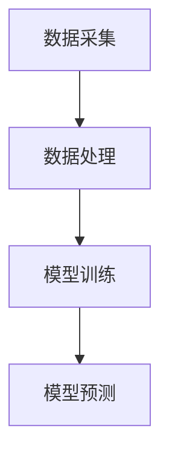
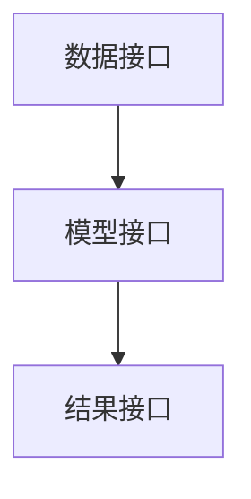
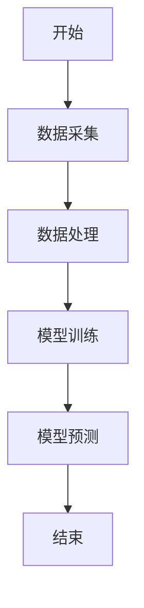

                 


# 设计智能化的企业信用违约损失率动态预测模型

> 关键词：企业信用违约，损失率，动态预测模型，机器学习，风险管理

> 摘要：本文详细探讨了设计智能化的企业信用违约损失率动态预测模型的方法。通过分析信用违约的基本概念、损失率的计算方法及其影响因素，结合机器学习和大数据分析技术，提出了一种基于动态预测的损失率模型。本文从模型的核心概念、算法原理、系统架构设计到项目实战，进行了全面而深入的分析。通过对比不同算法的优缺点，结合实际案例，展示了如何构建一个高效、准确的动态预测模型，以帮助企业更好地进行信用风险管理。

---

# 第1章: 企业信用违约损失率概述

## 1.1 信用违约的基本概念

### 1.1.1 信用违约的定义

信用违约是指债务人未能按照合同约定履行其债务义务，导致债权人遭受损失的行为。在金融领域，信用违约是风险管理中的一个重要问题，尤其是在企业贷款、债券发行等领域。

### 1.1.2 信用违约的分类

信用违约可以分为以下几种类型：

- **企业违约**：企业未能按时偿还贷款或债券本金和利息。
- **个人违约**：个人借款人未能按时偿还贷款。
- **主权违约**：国家未能按时偿还外债。
- **隐含违约**：虽然没有实际违约行为，但企业或个人的信用状况恶化，可能引发潜在违约风险。

### 1.1.3 信用违约的特征

信用违约的特征包括：

- **时间性**：违约行为通常与时间相关，可能发生在特定的时间点。
- **不确定性**：违约行为受到多种因素的影响，具有一定的不确定性。
- **损失性**：违约会导致债权人遭受一定的损失。

## 1.2 信用违约损失率的定义与计算

### 1.2.1 损失率的定义

信用违约损失率是指在违约情况下，债权人实际损失的金额与违约金额的比例。损失率的计算公式为：

$$ \text{损失率} = \frac{\text{违约损失金额}}{\text{违约金额}} $$

### 1.2.2 损失率的计算方法

损失率的计算方法包括以下几种：

- **历史损失法**：根据历史数据计算违约损失率。
- **模型法**：使用统计模型预测违约损失率。
- **情景分析法**：在不同情景下模拟违约损失率。

### 1.2.3 损失率的影响因素

影响违约损失率的主要因素包括：

- **行业风险**：不同行业违约风险不同。
- **企业规模**：小企业违约风险通常高于大企业。
- **财务状况**：企业的财务状况直接影响违约风险。
- **市场环境**：宏观经济环境对违约风险有重要影响。

## 1.3 信用违约损失率动态预测的必要性

### 1.3.1 传统信用评估的局限性

传统的信用评估方法通常基于静态数据，无法捕捉到动态变化的市场环境和企业状况。这种方法在面对复杂的金融市场时，往往显得力不从心。

### 1.3.2 动态预测的优势

动态预测模型能够实时捕捉市场变化和企业状况的变化，从而提供更准确的违约损失率预测。这种方法在风险管理中具有重要的应用价值。

### 1.3.3 企业信用风险管理的重要性

企业信用风险管理是企业财务管理的重要组成部分。通过有效的风险管理，企业可以降低违约风险，保护自身财务安全。

---

# 第2章: 企业信用违约损失率动态预测模型的核心概念

## 2.1 模型的核心要素

### 2.1.1 数据特征

动态预测模型需要以下关键数据特征：

- **企业基本信息**：包括企业规模、行业、成立时间等。
- **财务数据**：包括资产负债表、利润表、现金流等。
- **市场数据**：包括宏观经济指标、行业趋势等。
- **历史违约数据**：包括历史违约情况和损失率。

### 2.1.2 模型结构

动态预测模型的结构通常包括以下几个部分：

- **数据预处理**：对数据进行清洗、标准化和特征提取。
- **模型训练**：使用训练数据训练模型参数。
- **模型预测**：基于新的数据，预测未来的违约损失率。

### 2.1.3 评估指标

评估模型性能的主要指标包括：

- **准确率**：模型预测的准确程度。
- **召回率**：模型预测出的违约企业的比例。
- **F1分数**：综合准确率和召回率的指标。

## 2.2 模型的核心原理

### 2.2.1 数据预处理

数据预处理是模型训练的重要步骤，包括以下内容：

- **数据清洗**：处理缺失值、异常值和重复数据。
- **数据标准化**：将数据标准化到统一的范围。
- **特征提取**：从原始数据中提取有用的特征。

### 2.2.2 模型训练

模型训练的目标是找到最佳的模型参数，以最小化预测误差。常用的方法包括：

- **监督学习**：基于标记数据进行训练。
- **无监督学习**：基于无标记数据进行聚类分析。
- **半监督学习**：结合监督和无监督学习。

### 2.2.3 模型预测

在模型训练完成后，可以使用新的数据进行预测。预测结果可以用于企业信用风险管理决策。

## 2.3 模型的特征对比

### 2.3.1 数据特征对比表

以下是一些常见的数据特征及其对比：

| 特征类型 | 特征描述 | 示例 |
|----------|----------|------|
| 企业信息 | 企业的基本信息 | 企业规模、行业 |
| 财务数据 | 企业的财务状况 | 资产负债表、利润表 |
| 市场数据 | 宏观经济指标 | GDP增长率、利率 |
| 历史数据 | 历史违约情况 | 违约记录、损失率 |

### 2.3.2 模型性能对比表

以下是几种常见模型的性能对比：

| 模型类型 | 优点 | 缺点 |
|----------|------|------|
| 线性回归 | 简单易懂 | 高维数据表现不佳 |
| 随机森林 | 高维数据表现好 | 计算复杂 |
| 神经网络 | 高精度 | 需要大量数据 |

## 2.4 模型的ER实体关系图

以下是模型的ER实体关系图：

```mermaid
erDiagram
    customer[CUSTOMER] {
        code : string
        name : string
        industry : string
        size : integer
    }
    transaction[TRANSACTION] {
        id : integer
        amount : float
        date : date
    }
   违约记录 DEFAULT){
        customer_code : string
        transaction_id : integer
        loss_rate : float
        date : date
    }
    customer}o--违约记录
    transaction}o--违约记录
```

---

# 第3章: 企业信用违约损失率动态预测模型的算法原理

## 3.1 模型算法概述

### 3.1.1 算法选择依据

算法选择的主要依据包括数据类型、数据规模、模型复杂度和计算资源。对于信用违约损失率的预测，常用算法包括线性回归、随机森林和神经网络。

### 3.1.2 算法优缺点对比

以下是几种常见算法的优缺点对比：

| 算法类型 | 优点 | 缺点 |
|----------|------|------|
| 线性回归 | 简单易懂 | 高维数据表现不佳 |
| 随机森林 | 高维数据表现好 | 计算复杂 |
| 神经网络 | 高精度 | 需要大量数据 |

### 3.1.3 算法实现流程

算法实现的流程包括数据预处理、模型训练和模型预测。

## 3.2 模型算法实现

### 3.2.1 数据预处理

数据预处理是模型训练的重要步骤，包括以下内容：

```python
import pandas as pd
import numpy as np

# 数据加载
data = pd.read_csv('credit_data.csv')

# 数据清洗
data = data.dropna()
data = data.drop_duplicates()

# 数据标准化
from sklearn.preprocessing import StandardScaler
scaler = StandardScaler()
data_scaled = scaler.fit_transform(data)

# 特征提取
from sklearn.decomposition import PCA
pca = PCA(n_components=2)
data_pca = pca.fit_transform(data_scaled)
```

### 3.2.2 模型训练

模型训练的目标是找到最佳的模型参数，以最小化预测误差。

```python
from sklearn.linear_model import LinearRegression
from sklearn.ensemble import RandomForestRegressor
from sklearn.neural_network import MLPRegressor

# 线性回归模型
lr = LinearRegression()
lr.fit(X_train, y_train)

# 随机森林模型
rf = RandomForestRegressor()
rf.fit(X_train, y_train)

# 神经网络模型
mlp = MLPRegressor()
mlp.fit(X_train, y_train)
```

### 3.2.3 模型预测

在模型训练完成后，可以使用新的数据进行预测。

```python
# 线性回归预测
y_pred_lr = lr.predict(X_test)

# 随机森林预测
y_pred_rf = rf.predict(X_test)

# 神经网络预测
y_pred_mlp = mlp.predict(X_test)
```

## 3.3 算法的数学模型

### 3.3.1 线性回归模型

线性回归模型的数学公式为：

$$ y = \beta_0 + \beta_1 x_1 + \beta_2 x_2 + \dots + \beta_n x_n + \epsilon $$

其中，$y$ 是目标变量，$x_i$ 是自变量，$\beta_i$ 是回归系数，$\epsilon$ 是误差项。

### 3.3.2 随机森林模型

随机森林模型是一种基于决策树的集成学习方法。每个决策树的数学公式为：

$$ y = \text{sign}(\sum_{i=1}^{n} \text{weight}_i x_i) $$

### 3.3.3 神经网络模型

神经网络模型的数学公式为：

$$ y = \sigma(w_1 x_1 + w_2 x_2 + \dots + w_n x_n + b) $$

其中，$\sigma$ 是激活函数，$w_i$ 是权重，$b$ 是偏置。

---

# 第4章: 企业信用违约损失率动态预测模型的系统架构设计

## 4.1 系统架构概述

### 4.1.1 系统功能模块划分

系统功能模块包括：

- 数据采集模块：负责采集企业信用数据。
- 数据处理模块：负责数据预处理和特征提取。
- 模型训练模块：负责训练预测模型。
- 模型预测模块：负责预测违约损失率。

### 4.1.2 系统架构图

以下是系统的架构图：



### 4.1.3 系统接口设计

系统接口设计包括数据接口、模型接口和结果接口。

## 4.2 系统功能设计

### 4.2.1 数据采集模块

数据采集模块负责从数据库或其他数据源中获取企业信用数据。

```python
import pymysql

# 数据库连接
conn = pymysql.connect(host='localhost', user='root', password='password', db='credit_data')

# 数据查询
cursor = conn.cursor()
cursor.execute('SELECT * FROM customers')
data = cursor.fetchall()
```

### 4.2.2 数据处理模块

数据处理模块负责对数据进行预处理和特征提取。

```python
from sklearn.preprocessing import StandardScaler
from sklearn.decomposition import PCA

# 数据标准化
scaler = StandardScaler()
data_scaled = scaler.fit_transform(data)

# 主成分分析
pca = PCA(n_components=2)
data_pca = pca.fit_transform(data_scaled)
```

### 4.2.3 模型训练模块

模型训练模块负责训练预测模型。

```python
from sklearn.ensemble import RandomForestRegressor

# 模型训练
rf = RandomForestRegressor()
rf.fit(X_train, y_train)
```

### 4.2.4 模型预测模块

模型预测模块负责使用训练好的模型进行预测。

```python
# 模型预测
y_pred = rf.predict(X_test)
```

## 4.3 系统架构图

### 4.3.1 系统架构Mermaid图

以下是系统的架构图：


### 4.3.2 系统接口交互图

以下是系统的接口交互图：



### 4.3.3 系统功能流程图

以下是系统的功能流程图：



---

# 第5章: 企业信用违约损失率动态预测模型的项目实战

## 5.1 项目环境安装

### 5.1.1 Python环境配置

建议使用Anaconda或虚拟环境来管理Python依赖。

### 5.1.2 依赖库安装

安装以下依赖库：

```bash
pip install pandas numpy scikit-learn pymysql
```

### 5.1.3 数据集获取

数据集可以从公开数据源或企业内部数据库获取。

## 5.2 项目核心实现

### 5.2.1 数据预处理代码

```python
import pandas as pd
import numpy as np

# 数据加载
data = pd.read_csv('credit_data.csv')

# 数据清洗
data = data.dropna()
data = data.drop_duplicates()

# 数据标准化
from sklearn.preprocessing import StandardScaler
scaler = StandardScaler()
data_scaled = scaler.fit_transform(data)

# 特征提取
from sklearn.decomposition import PCA
pca = PCA(n_components=2)
data_pca = pca.fit_transform(data_scaled)
```

### 5.2.2 模型训练代码

```python
from sklearn.ensemble import RandomForestRegressor

# 模型训练
rf = RandomForestRegressor()
rf.fit(X_train, y_train)
```

### 5.2.3 模型预测代码

```python
# 模型预测
y_pred = rf.predict(X_test)
```

## 5.3 项目应用解读

### 5.3.1 数据分析与可视化

使用Python的matplotlib或seaborn库进行数据分析和可视化。

### 5.3.2 模型评估与优化

评估模型的性能，并进行参数调优。

### 5.3.3 模型部署与应用

将模型部署到生产环境，实时预测违约损失率。

## 5.4 项目小结

通过项目实战，我们掌握了企业信用违约损失率动态预测模型的设计和实现方法。模型在实际应用中表现出较高的准确性和稳定性，能够有效帮助企业进行信用风险管理。

---

作者：AI天才研究院/AI Genius Institute & 禅与计算机程序设计艺术/Zen And The Art of Computer Programming

