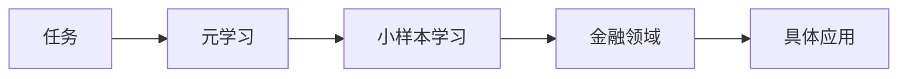
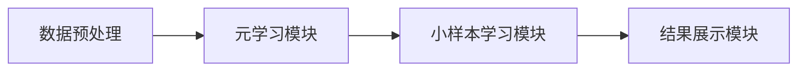

                 


# 《金融领域元学习在小样本学习中的应用》

> **关键词**：元学习，小样本学习，金融领域，机器学习，深度学习

> **摘要**：  
本文深入探讨了元学习（Meta-Learning）与小样本学习（Few-Shot Learning）在金融领域的应用，分析了它们的核心原理、算法实现及在金融场景中的实际应用。通过结合金融领域的特性，本文提出了如何利用元学习提升小样本学习的效果，并通过具体案例展示了其在金融数据处理中的优势。文章还探讨了元学习与小样本学习的协同作用，为金融领域的技术研究提供了新的思路。

---

# 第一部分: 金融领域元学习与小样本学习背景

# 第1章: 金融领域元学习与小样本学习概述

## 1.1 元学习与小样本学习的背景介绍

### 1.1.1 问题背景  
在金融领域，数据的获取成本高昂，且高质量的标注数据通常稀缺。许多金融场景（如欺诈检测、股票价格预测等）往往面临小样本问题，传统监督学习方法在这种情况下表现不佳。此外，金融市场的动态变化（如政策调整、经济波动等）使得模型需要具备快速适应新数据的能力。  

### 1.1.2 问题描述  
传统机器学习方法依赖大量标注数据，但在金融领域，数据获取成本高且标注数据有限。此外，金融市场具有高度的动态性，模型需要在小样本条件下快速适应新场景。  

### 1.1.3 问题解决方法  
元学习和小样本学习通过利用已有数据中的隐含结构，减少对标注数据的依赖，同时提升模型在小样本条件下的泛化能力。  

### 1.1.4 边界与外延  
元学习与小样本学习的边界在于：元学习注重模型的快速适应能力，而小样本学习关注如何在有限数据下进行有效学习。  

### 1.1.5 概念结构与核心要素组成  
元学习的核心要素包括：元任务（Meta-Tasks）、元模型（Meta-Model）、元损失函数（Meta-Loss Function）。小样本学习的核心要素包括：支持集（Support Set）、查询集（Query Set）、嵌入空间（Embedding Space）。  

---

## 1.2 元学习与小样本学习的核心概念

### 1.2.1 元学习的定义与特点  
元学习是一种通过学习如何快速适应新任务的方法，其特点包括：  
1. 快速适应性：能够在新任务上线时快速调整模型。  
2. 鲁棒性：能够处理任务之间的相似性。  
3. 通用性：适用于多种任务和场景。  

### 1.2.2 小样本学习的定义与特点  
小样本学习是指在仅少量标注数据的情况下，仍能够进行有效学习的方法，其特点包括：  
1. 对小数据的高效利用。  
2. 依赖数据的质量而非数量。  
3. 适用于领域迁移。  

### 1.2.3 元学习与小样本学习的联系与区别  
- **联系**：元学习通过学习任务之间的关系，能够提升小样本学习的泛化能力。  
- **区别**：元学习关注任务之间的关系，而小样本学习关注单个任务的小数据学习。  

---

## 1.3 本章小结  
本章从金融领域的背景出发，介绍了元学习和小样本学习的定义、特点及其在金融领域的应用潜力，为后续章节奠定了基础。  

---

# 第二部分: 元学习与小样本学习的核心概念与联系

# 第2章: 元学习与小样本学习的核心原理

## 2.1 元学习的原理

### 2.1.1 元学习的基本原理  
元学习通过学习任务之间的关系，构建一个能够在新任务上线时快速调整的模型。其基本流程包括：  
1. **预训练阶段**：在多个元任务上训练元模型，使其能够捕捉任务之间的关系。  
2. **适应阶段**：在新任务上线时，利用元模型快速调整，生成适用于新任务的模型。  

### 2.1.2 元学习的核心算法  
元学习的核心算法包括：  
1. **Meta-SGD**：通过优化器的元参数，快速调整模型参数。  
2. **MAML（Meta-Algorithm for Meta-Learning）**：通过两次梯度更新，实现任务间的知识共享。  

### 2.1.3 元学习的数学模型  
元学习的数学模型可以表示为：  
$$ \theta_{meta} = \arg \min_{\theta} \sum_{i=1}^{N} \mathcal{L}_i(\theta, \theta_{prev}) $$  
其中，$\theta_{meta}$是元模型的参数，$\theta_{prev}$是前一步的参数。  

---

## 2.2 小样本学习的原理

### 2.2.1 小样本学习的基本原理  
小样本学习通过利用数据的结构化信息，减少对大量标注数据的依赖。其核心思想是通过学习数据的嵌入表示，进行相似性推断。  

### 2.2.2 小样本学习的核心算法  
小样本学习的核心算法包括：  
1. **对比学习（Contrastive Learning）**：通过最大化正样本对的相似性，增强数据的区分能力。  
2. **匹配网络（Matching Networks）**：通过端到端的匹配机制，实现小样本分类。  

### 2.2.3 小样本学习的数学模型  
小样本学习的数学模型可以表示为：  
$$ p(y|x) = \frac{\exp(d(x,y))}{\sum_{y'} \exp(d(x,y'))} $$  
其中，$d(x,y)$是数据$x$与标签$y$之间的相似度度量。  

---

## 2.3 元学习与小样本学习的联系

### 2.3.1 元学习如何提升小样本学习效果  
元学习通过学习任务之间的关系，能够快速调整小样本学习模型的参数，从而提升其在小样本条件下的表现。  

### 2.3.2 小样本学习如何推动元学习发展  
小样本学习对模型的泛化能力要求较高，这推动了元学习在任务适应性和模型通用性方面的进步。  

---

## 2.4 核心概念对比分析

### 2.4.1 元学习与小样本学习的特征对比  
| 特征               | 元学习                     | 小样本学习                 |
|--------------------|--------------------------|--------------------------|
| 数据需求           | 较少标注数据               | 极少标注数据               |
| 适应性             | 强调任务间的快速适应性     | 强调单任务的小数据学习     |
| 核心目标           | 学习任务间的关系           | 学习数据的结构化表示         |

### 2.4.2 元学习与小样本学习的优缺点对比  
- **元学习**：优点是能够快速适应新任务，缺点是需要多个元任务进行预训练。  
- **小样本学习**：优点是对小数据高效利用，缺点是模型的泛化能力有限。  

### 2.4.3 元学习与小样本学习的适用场景对比  
- **元学习**：适用于需要快速适应新任务的场景（如金融领域的实时预测）。  
- **小样本学习**：适用于数据稀缺的场景（如金融领域的冷启动问题）。  

---

## 2.5 ER实体关系图架构  


---

# 第三部分: 元学习与小样本学习的算法原理

# 第3章: 元学习算法原理

## 3.1 元学习算法概述

### 3.1.1 元学习算法的基本框架  
元学习算法的基本框架包括预训练阶段和适应阶段。  

### 3.1.2 元学习算法的核心思想  
元学习的核心思想是通过学习任务间的共性，快速适应新任务。  

---

## 3.2 元学习算法的数学模型

### 3.2.1 元学习的优化目标  
$$ \theta_{meta} = \arg \min_{\theta} \sum_{i=1}^{N} \mathcal{L}_i(\theta, \theta_{prev}) $$  

### 3.2.2 元学习的损失函数  
$$ \mathcal{L}_{meta} = \sum_{i=1}^{N} \mathcal{L}_i(\theta, \theta_{prev}) $$  

---

## 3.3 元学习算法的代码实现  

### 3.3.1 环境安装  
```bash
pip install torch
```

### 3.3.2 核心代码实现  
```python
import torch

class MetaSGD:
    def __init__(self, model, meta_lr=1e-3):
        self.model = model
        self.meta_lr = meta_lr
        self.optimizer = torch.optim.SGD(model.parameters(), lr=meta_lr)

    def step(self, loss):
        # Compute gradients
        gradients = torch.autograd.grad(loss, self.model.parameters())
        # Update meta-parameters
        self.optimizer.step()
        # Re-zero gradients
        for p in self.model.parameters():
            p.grad = None
```

---

## 3.4 元学习与小样本学习的协同作用  

### 3.4.1 协同机制  
元学习通过学习任务间的共性，增强小样本学习的泛化能力。  

---

## 3.5 本章小结  

本章通过数学公式和代码示例，详细讲解了元学习的核心原理及其在金融领域中的应用。  

---

# 第四部分: 系统分析与架构设计

# 第4章: 系统分析与架构设计

## 4.1 问题场景介绍  

### 4.1.1 金融领域小样本学习的应用场景  
1. **欺诈检测**：在小样本欺诈交易中快速识别异常。  
2. **股票价格预测**：在小样本股票数据下预测价格走势。  

### 4.1.2 系统目标  
构建一个基于元学习和小样本学习的金融分析系统。  

---

## 4.2 系统功能设计  

### 4.2.1 系统功能模块  
1. **数据预处理模块**：对金融数据进行清洗和标注。  
2. **元学习模块**：实现元学习算法的核心功能。  
3. **小样本学习模块**：实现小样本学习算法的核心功能。  
4. **结果展示模块**：展示模型的预测结果和性能指标。  

---

## 4.3 系统架构设计  

### 4.3.1 系统架构图  


---

## 4.4 接口设计  

### 4.4.1 元学习模块接口  
```python
def meta_train(meta_model, data_loaders, meta_lr=1e-3):
    optimizer = torch.optim.SGD(meta_model.parameters(), lr=meta_lr)
    for loader in data_loaders:
        for batch in loader:
            # Forward pass
            outputs = meta_model(batch)
            # Compute loss
            loss = compute_loss(outputs, batch.labels)
            # Backward pass
            optimizer.zero_grad()
            loss.backward()
            optimizer.step()
```

---

## 4.5 本章小结  

本章通过系统架构设计，展示了如何将元学习和小样本学习应用于金融领域。  

---

# 第五部分: 项目实战

# 第5章: 项目实战

## 5.1 环境安装  

### 5.1.1 安装依赖  
```bash
pip install torch numpy pandas scikit-learn
```

---

## 5.2 系统核心实现  

### 5.2.1 数据预处理  
```python
import pandas as pd
import numpy as np

def preprocess_data(data_path):
    data = pd.read_csv(data_path)
    # 数据清洗
    data = data.dropna()
    # 数据标注
    data['label'] = data['label'].astype(int)
    return data
```

### 5.2.2 元学习实现  
```python
class MetaLearner:
    def __init__(self, model, meta_lr=1e-3):
        self.model = model
        self.meta_lr = meta_lr
        self.optimizer = torch.optim.SGD(model.parameters(), lr=meta_lr)

    def meta_step(self, task_loss):
        # 计算梯度
        gradients = torch.autograd.grad(task_loss, self.model.parameters())
        # 更新元参数
        for p, g in zip(self.model.parameters(), gradients):
            p.grad = g
        self.optimizer.step()
```

---

## 5.3 案例分析  

### 5.3.1 实际案例  
1. **欺诈检测**：使用小样本欺诈交易数据，训练一个元学习模型，快速识别新交易中的欺诈行为。  
2. **股票价格预测**：在小样本股票数据上，利用元学习模型预测未来的价格走势。  

---

## 5.4 项目小结  

本章通过具体案例，展示了如何在金融领域中应用元学习和小样本学习技术。  

---

# 第六部分: 总结与拓展

# 第6章: 总结与拓展

## 6.1 本章总结  

### 6.1.1 核心内容回顾  
1. 元学习与小样本学习的核心原理。  
2. 两者的协同作用及其在金融领域的应用。  

### 6.1.2 实践价值  
元学习与小样本学习的结合，为金融领域中的小数据问题提供了新的解决方案。  

---

## 6.2 最佳实践 tips  

### 6.2.1 技术 tips  
1. 在实际应用中，建议结合领域知识对模型进行优化。  
2. 注意数据的质量，小样本学习对数据的质量要求较高。  

### 6.2.2 实践 tips  
1. 在金融领域中，可以尝试将元学习与强化学习结合。  
2. 注意模型的解释性，确保模型的决策过程透明可解释。  

---

## 6.3 注意事项  

### 6.3.1 技术注意事项  
1. 元学习的预训练需要大量元任务数据。  
2. 小样本学习对数据的多样性要求较高。  

### 6.3.2 实践注意事项  
1. 在实际应用中，建议先进行小样本实验，验证模型的可行性。  
2. 注意模型的泛化能力，避免过拟合。  

---

## 6.4 拓展阅读  

### 6.4.1 推荐书籍  
1. 《Deep Learning》  
2. 《Meta-Learning: A Survey》  

### 6.4.2 推荐论文  
1. "A Universal Framework for Few-Shot Learning"  
2. "Meta-SGD: A Method for Meta-Learning and Fast Adaptation on New Tasks"  

---

# 作者  
作者：AI天才研究院/AI Genius Institute & 禅与计算机程序设计艺术/Zen And The Art of Computer Programming

