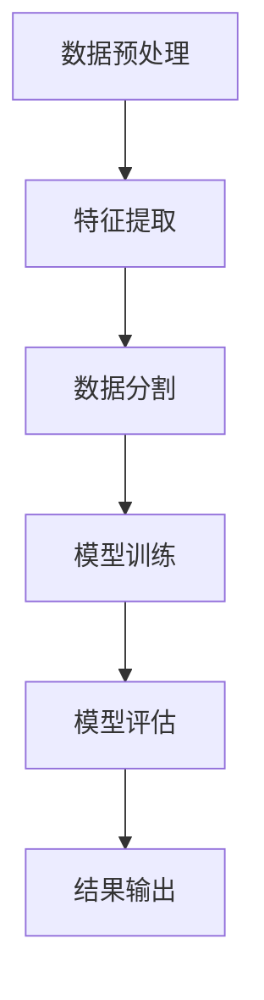
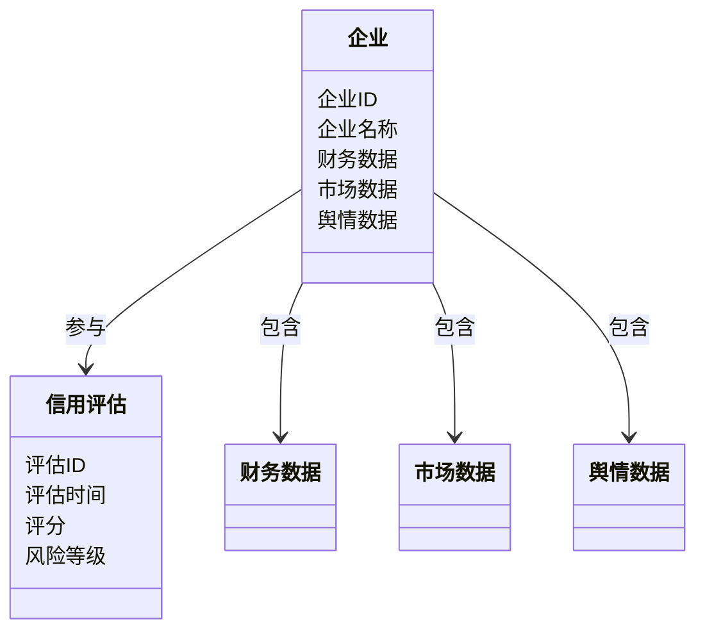
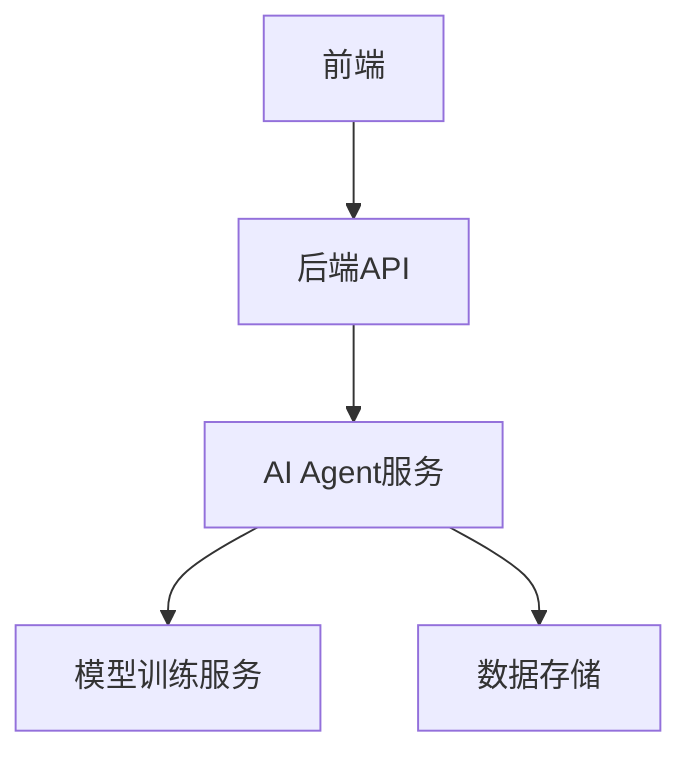

                 


# AI Agent在企业信用风险评估中的深度应用与模型解释

> 关键词：AI Agent，信用风险评估，机器学习，深度学习，模型解释，知识图谱

> 摘要：本文深入探讨AI Agent在企业信用风险评估中的应用，分析其算法原理、系统架构设计，并通过实际案例展示其在信用风险预测中的优势。文章结合数学模型和代码实现，详细解释了AI Agent如何提升信用风险评估的准确性和动态监控能力。

---

# 第一部分: AI Agent与企业信用风险评估的背景与概念

## 第1章: AI Agent与信用风险评估概述

### 1.1 AI Agent的基本概念

#### 1.1.1 AI Agent的定义与特点
- **定义**：AI Agent（人工智能代理）是指能够感知环境、自主决策并执行任务的智能实体。
- **特点**：
  - 智能性：能够理解复杂环境并做出合理决策。
  - 自主性：无需人工干预，自主完成任务。
  - 反应性：能够实时感知环境变化并调整行为。
  - 学习性：通过数据和经验不断优化自身的决策能力。

#### 1.1.2 AI Agent的核心功能与应用场景
- **核心功能**：
  - 数据采集与处理：从多种来源收集相关信息。
  - 分析与决策：基于数据分析做出预测或推荐。
  - 自动执行：根据决策结果执行相应的操作。
- **应用场景**：
  - 金融领域：信用评估、投资决策、风险管理。
  - 零售行业：个性化推荐、客户行为分析。
  - 制造业：质量控制、生产优化。

#### 1.1.3 企业信用风险评估的定义与重要性
- **定义**：信用风险评估是通过分析企业的财务状况、经营情况等因素，预测其在信用交易中违约的可能性。
- **重要性**：
  - 降低企业损失：通过准确评估，减少因违约带来的经济损失。
  - 提高决策效率：帮助金融机构快速做出信贷决策。
  - 优化资源配置：通过风险分层，合理分配信贷资源。

---

## 第2章: AI Agent与信用风险评估的核心概念与联系

### 2.1 AI Agent的核心原理

#### 2.1.1 AI Agent的决策机制
- **基于规则的决策**：通过预定义的规则进行判断。
- **基于学习的决策**：利用机器学习模型从数据中学习决策规则。
- **基于知识图谱的决策**：通过语义理解，利用知识图谱进行推理和决策。

#### 2.1.2 机器学习算法在AI Agent中的应用
- **监督学习**：如逻辑回归、支持向量机（SVM）用于分类任务。
- **无监督学习**：如聚类分析用于客户分群。
- **强化学习**：通过试错机制优化决策策略。

#### 2.1.3 知识图谱与语义理解在AI Agent中的作用
- **知识图谱**：构建企业信息的语义网络，帮助AI Agent理解复杂关系。
- **语义理解**：通过自然语言处理技术，从文本中提取有用信息。

### 2.2 信用风险评估的数学模型

#### 2.2.1 信用评分模型的数学公式
- **线性回归模型**：用于预测违约概率。
  $$ P = \beta_0 + \beta_1x_1 + \beta_2x_2 + \ldots + \beta_nx_n $$
- **逻辑回归模型**：用于分类任务。
  $$ P(y=1|x) = \frac{1}{1 + e^{-(\beta_0 + \beta_1x_1 + \ldots + \beta_nx_n)}} $$

#### 2.2.2 信用风险的量化方法
- **KMV模型**：基于市场数据预测企业违约概率。
- **Z值模型**：通过财务指标计算企业破产概率。
  $$ Z = 1.2A + 0.04998B + 0.0137C + 0.0033D + 0.0003E $$

#### 2.2.3 基于AI的信用风险预测模型
- **随机森林**：通过集成学习提高模型鲁棒性。
- **XGBoost**：梯度提升算法，适合处理高维数据。

### 2.3 AI Agent与信用风险评估的关联

#### 2.3.1 AI Agent如何提升信用风险评估的准确性
- **多源数据融合**：整合财务数据、市场数据、舆情数据等多维信息。
- **实时监控**：通过流数据处理技术，实时更新评估结果。

#### 2.3.2 AI Agent在信用风险动态监控中的应用
- **实时预警**：通过持续监控企业经营状况，及时发现潜在风险。
- **动态调整模型**：根据最新数据更新模型参数，保持评估准确性。

#### 2.3.3 AI Agent与信用风险管理的结合
- **风险分层**：根据评估结果对企业进行信用分层，制定差异化管理策略。
- **风险缓解**：通过AI Agent提出风险缓解建议，如调整授信额度、制定还款计划等。

### 2.4 核心概念对比表格

| **对比维度** | **传统信用评估模型** | **AI Agent驱动的信用评估模型** |
|--------------|-----------------------|-----------------------------|
| 数据来源     | 主要依赖财务数据     | 包括财务数据、文本数据、市场数据等多源数据 |
| 模型复杂度   | 较低，线性模型为主     | 较高，支持深度学习和非线性模型 |
| 决策速度     | 较慢，人工干预较多     | 实时决策，自动化处理 |
| 精度         | 较低，受数据限制       | 较高，通过大数据和机器学习提升准确性 |

### 2.5 ER实体关系图

```mermaid
erd
    title 信用风险评估实体关系图
    entity 企业 {
        key 属性：企业ID
        属性：企业名称、注册资本、行业、成立时间
    }
    entity 信用评估 {
        key 属性：评估ID
        属性：评估时间、评分、风险等级
    }
    entity 财务数据 {
        key 属性：数据ID
        属性：收入、利润、负债、现金流
    }
    entity 市场数据 {
        key 属性：市场ID
        属性：行业指数、股价、债券收益率
    }
    entity 舆情数据 {
        key 属性：舆情ID
        属性：新闻标题、社交媒体 sentiment
    }
    企业 --N-> 信用评估: 一次评估对应多个企业
    信用评估 --N-> 财务数据: 每次评估基于多份财务数据
    信用评估 --N-> 市场数据: 每次评估参考市场数据
    信用评估 --N-> 舆情数据: 每次评估参考舆情数据
```

---

## 第3章: 算法原理与流程

### 3.1 算法原理

#### 3.1.1 基于机器学习的信用风险评估算法
- **逻辑回归**：适用于二分类问题，预测企业违约概率。
- **随机森林**：通过集成多个决策树，提升模型的准确性和鲁棒性。

#### 3.1.2 基于深度学习的信用风险评估算法
- **神经网络**：通过多层感知机（MLP）提取非线性特征。
- **LSTM网络**：适用于时间序列数据，捕捉长期依赖关系。

#### 3.1.3 基于规则的信用风险评估算法
- **专家系统**：通过预定义的规则进行评估，适用于规则明确的场景。

### 3.2 算法流程图



### 3.3 数学模型与公式

#### 3.3.1 信用评分模型的数学公式
- **线性回归模型**：
  $$ P = \beta_0 + \beta_1x_1 + \beta_2x_2 + \ldots + \beta_nx_n $$
  其中，$x_i$ 表示各个特征，$\beta_i$ 表示对应的系数。

- **逻辑回归模型**：
  $$ P(y=1|x) = \frac{1}{1 + e^{-(\beta_0 + \beta_1x_1 + \ldots + \beta_nx_n)}} $$

#### 3.3.2 基于逻辑回归的信用风险预测模型
```python
import numpy as np
from sklearn.linear_model import LogisticRegression

# 数据预处理
X = ...  # 特征矩阵
y = ...  # 标签向量

# 模型训练
model = LogisticRegression()
model.fit(X, y)

# 模型预测
new_X = ...  # 新数据
predicted = model.predict(new_X)
```

#### 3.3.3 基于决策树的信用风险分类模型
```python
from sklearn.tree import DecisionTreeClassifier

# 模型训练
model = DecisionTreeClassifier()
model.fit(X, y)

# 模型预测
new_X = ...  # 新数据
predicted = model.predict(new_X)
```

### 3.4 代码实现

#### 3.4.1 环境安装与配置
```bash
pip install numpy pandas scikit-learn
```

#### 3.4.2 信用风险评估模型的Python代码实现
```python
import pandas as pd
from sklearn.model_selection import train_test_split
from sklearn.metrics import accuracy_score

# 加载数据
data = pd.read_csv('credit_data.csv')

# 数据预处理
X = data.drop('target', axis=1)
y = data['target']

# 数据分割
X_train, X_test, y_train, y_test = train_test_split(X, y, test_size=0.2)

# 模型训练
from sklearn.ensemble import RandomForestClassifier
model = RandomForestClassifier()
model.fit(X_train, y_train)

# 模型预测
y_pred = model.predict(X_test)

# 模型评估
print("Accuracy:", accuracy_score(y_test, y_pred))
```

---

## 第4章: 系统分析与架构设计方案

### 4.1 问题场景介绍
- **目标**：构建一个基于AI Agent的企业信用风险评估系统。
- **需求**：实时采集企业信息，动态评估信用风险，提供预警和建议。

### 4.2 系统功能设计

#### 4.2.1 领域模型（类图）


### 4.3 系统架构设计

#### 4.3.1 系统架构图


### 4.4 系统接口设计

#### 4.4.1 API接口描述
- **输入接口**：
  - POST /api/credit_assessment: 提交企业信息，获取评估结果。
- **输出接口**：
  - GET /api/risk_report: 获取信用评估报告。

---

## 第5章: 项目实战

### 5.1 环境安装与配置
```bash
pip install numpy pandas scikit-learn flask
```

### 5.2 核心代码实现

#### 5.2.1 数据预处理代码
```python
import pandas as pd

data = pd.read_csv('credit_data.csv')
data = data.dropna()
data = pd.get_dummies(data)
```

#### 5.2.2 模型训练代码
```python
from sklearn.ensemble import RandomForestClassifier
model = RandomForestClassifier(n_estimators=100, random_state=42)
model.fit(X_train, y_train)
```

### 5.3 实际案例分析

#### 5.3.1 案例背景
- **企业A**：中型制造企业，财务状况良好，但近期市场表现不佳。

#### 5.3.2 模型预测
- **预测结果**：违约概率为20%，风险等级为中等。

#### 5.3.3 模型解释
- **特征重要性**：
  - 负债比例：权重最高。
  - 营业收入增长率：次之。
  - 净利润：最低。

---

## 第6章: 最佳实践、小结与注意事项

### 6.1 最佳实践
- **数据预处理**：确保数据的完整性和准确性。
- **模型解释**：使用特征重要性分析，提高模型的可解释性。
- **持续监控**：定期更新模型，适应市场变化。

### 6.2 小结
- 本文详细探讨了AI Agent在企业信用风险评估中的应用，从算法原理到系统架构，再到实际案例，全面分析了其优势和挑战。
- 通过AI Agent，企业可以实现更精准的信用风险评估，提高决策效率，降低潜在风险。

### 6.3 注意事项
- **数据隐私**：在处理企业数据时，需遵守相关法律法规，保护数据隐私。
- **模型鲁棒性**：确保模型在面对异常数据时仍能正常运行。
- **持续优化**：定期更新模型，适应市场变化，提升评估准确性。

---

# 作者：AI天才研究院/AI Genius Institute & 禅与计算机程序设计艺术 /Zen And The Art of Computer Programming

