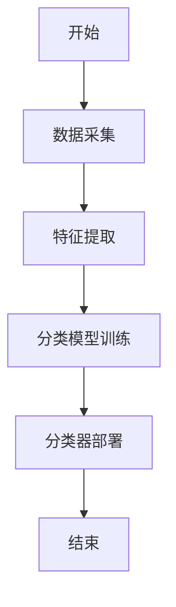
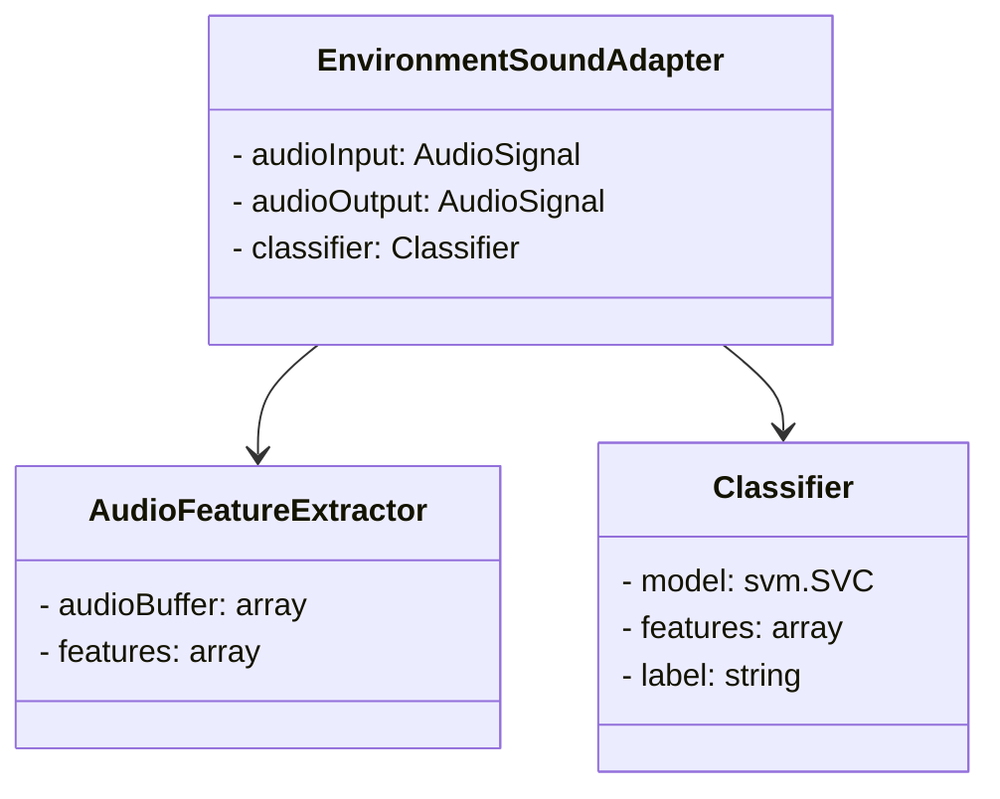
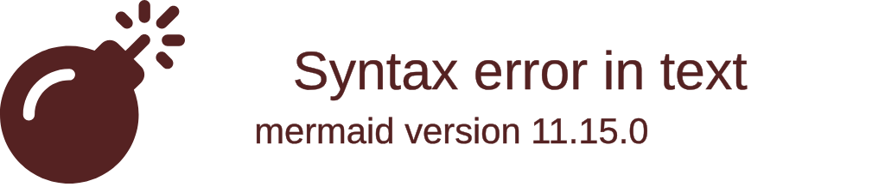
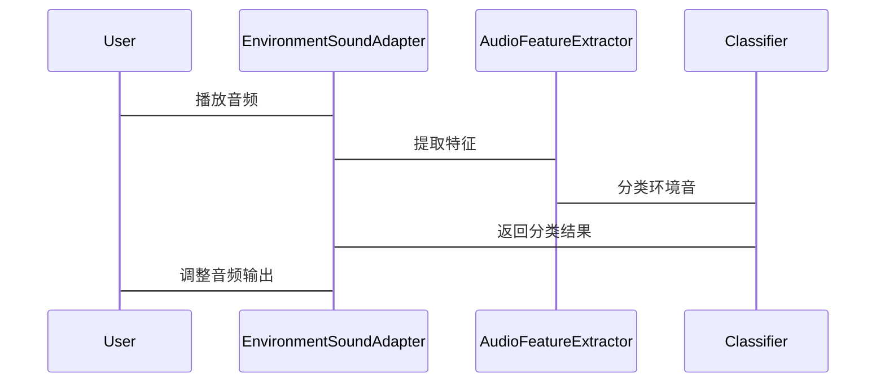

                 


# AI Agent在智能耳机中的环境音适应

> **关键词**: AI Agent, 智能耳机, 环境音适应, 机器学习, 算法原理

> **摘要**: 本文深入探讨AI Agent在智能耳机中的环境音适应技术，分析其核心概念、算法原理、系统架构，并通过项目实战展示具体实现。文章从背景介绍、核心概念、算法实现、系统设计到项目实战，全面解析AI Agent如何优化智能耳机的环境音适应能力，帮助读者掌握相关技术原理和应用方法。

---

## 第1章: AI Agent与环境音适应的背景

### 1.1 AI Agent的基本概念

#### 1.1.1 AI Agent的定义
AI Agent（人工智能代理）是指能够感知环境并采取行动以实现目标的智能实体。在智能耳机中，AI Agent负责处理环境音，优化用户体验。

#### 1.1.2 AI Agent的核心特征
- **自主性**: 能够独立决策和行动。
- **反应性**: 根据环境变化实时调整。
- **目标导向**: 以特定目标为导向，如提高语音清晰度。

#### 1.1.3 AI Agent在智能设备中的应用
AI Agent广泛应用于智能音箱、耳机等领域，通过环境音分析优化音质和用户体验。

### 1.2 环境音适应的定义与重要性

#### 1.2.1 环境音适应的定义
环境音适应指智能设备根据周围环境的声音特征调整其音频输出，以优化听音体验。

#### 1.2.2 环境音适应在智能耳机中的作用
- **提升语音清晰度**: 在噪声环境中过滤干扰。
- **优化音质**: 在安静环境中提供最佳音效。

#### 1.2.3 环境音适应的挑战与解决方案
- **挑战**: 多样化的环境音类型、实时处理需求。
- **解决方案**: 使用AI算法实时检测和分类环境音。

### 1.3 AI Agent与环境音适应的关系

#### 1.3.1 AI Agent作为环境音适应的决策者
AI Agent通过分析环境音数据，决定如何调整音频输出。

#### 1.3.2 AI Agent作为环境音适应的执行者
AI Agent不仅决策，还通过执行动作优化环境音适应效果。

#### 1.3.3 环境音适应的核心概念结构
- **环境音采集**: 采集周围环境音。
- **特征提取**: 提取环境音特征。
- **分类与适应**: 分类环境音并调整输出。

---

## 第2章: 环境音适应的核心问题

### 2.1 环境音适应的问题背景

#### 2.1.1 噪声干扰的常见场景
- **交通噪声**: 路上行驶的汽车、摩托车等。
- **人声干扰**: 人群交谈、背景音乐等。
- **风噪声**: 在户外环境中，风声可能影响语音清晰度。

#### 2.1.2 用户需求与环境音适应的关系
用户希望在不同环境中获得一致的高质量音频体验，这需要环境音适应技术的支持。

#### 2.1.3 环境音适应的目标
通过实时分析环境音，智能耳机能够动态调整音频输出，优化听音体验。

### 2.2 环境音适应的核心问题

#### 2.2.1 如何实现环境音的实时检测与分类
- **实时检测**: 快速识别当前环境音类型。
- **分类算法**: 使用机器学习模型分类环境音。

#### 2.2.2 如何优化环境音适应的算法性能
- **算法优化**: 提升分类准确率和实时性。
- **硬件加速**: 利用硬件加速提高处理速度。

### 2.3 环境音适应的边界与外延

#### 2.3.1 环境音适应的适用范围
- 适用于智能耳机、智能音箱等设备。
- 适用于各种噪声环境，如城市交通、办公室等。

#### 2.3.2 环境音适应与其他技术的关联
- **语音识别**: 环境音适应为语音识别提供更清晰的音频输入。
- **降噪技术**: 环境音适应与降噪技术结合，提升音频质量。

---

## 第3章: AI Agent与环境音适应的关系

### 3.1 AI Agent在环境音适应中的角色

#### 3.1.1 AI Agent作为环境音适应的决策者
AI Agent通过分析环境音数据，决定如何调整音频输出。

#### 3.1.2 AI Agent作为环境音适应的执行者
AI Agent不仅决策，还通过执行动作优化环境音适应效果。

### 3.2 环境音适应的核心概念结构

#### 3.2.1 环境音采集模块
- **麦克风阵列**: 用于采集周围环境音。
- **信号处理**: 对采集的信号进行初步处理，去除噪声。

#### 3.2.2 环境音特征提取模块
- **特征提取**: 提取环境音的特征，如频谱、时域特征等。
- **特征选择**: 选择对环境音分类最有用的特征。

#### 3.2.3 环境音分类与适应模块
- **分类器**: 使用机器学习模型对环境音进行分类。
- **适应策略**: 根据分类结果调整音频输出参数。

### 3.3 核心要素的组成

#### 3.3.1 数据采集与预处理
- **数据采集**: 使用麦克风阵列采集环境音。
- **预处理**: 去除噪声，提取有用的音频特征。

#### 3.3.2 特征提取与分类算法
- **特征提取**: 使用时频分析方法提取特征。
- **分类算法**: 使用支持向量机(SVM)、随机森林等算法进行分类。

#### 3.3.3 适应策略与反馈机制
- **适应策略**: 根据分类结果调整音频输出。
- **反馈机制**: 收集用户反馈，优化适应策略。

---

## 第4章: 环境音适应的核心概念与联系

### 4.1 AI Agent与环境音适应的原理

#### 4.1.1 AI Agent的基本工作原理
AI Agent通过感知环境、分析数据并采取行动来实现目标。

#### 4.1.2 环境音适应的基本原理
环境音适应通过实时分析环境音，调整音频输出参数，优化听音体验。

### 4.2 核心概念的属性特征对比

| **概念**        | **属性特征**                        |
|-----------------|------------------------------------|
| 环境音类型       | 音调、音强、音速、音色              |
| AI Agent算法     | 分类精度、实时性、计算复杂度        |
| 环境音适应模块   | 处理速度、适应范围、用户满意度      |

### 4.3 ER实体关系图架构

```mermaid
erDiagram
    customer[CUSTOMER] {
        +int id
        +string name
        +int age
    }
    product[PRODUCT] {
        +int id
        +string name
        +float price
    }
    order[ORDER] {
        +int id
        +date orderDate
        +int customerId
        +int productId
    }
    CUSTOMER o-- ORDER
    PRODUCT o-- ORDER
    CUSTOMER -> PRODUCT : 购买
```

---

## 第5章: 环境音适应的算法原理

### 5.1 算法原理概述

#### 5.1.1 机器学习模型
- **卷积神经网络(CNN)**: 用于图像和音频信号处理。
- **循环神经网络(RNN)**: 用于序列数据处理。

#### 5.1.2 算法实现步骤
1. 数据采集与预处理。
2. 特征提取与选择。
3. 训练分类模型。
4. 部署模型到智能耳机。

### 5.2 算法流程图



### 5.3 算法代码实现

```python
import numpy as np
from sklearn import svm

# 特征提取函数
def extract_features(audio_signal):
    # 假设audio_signal是音频信号数组
    # 这里简单提取均值和方差作为特征
    features = [np.mean(audio_signal), np.var(audio_signal)]
    return features

# 训练分类器
def train_classifier(X, y):
    clf = svm.SVC()
    clf.fit(X, y)
    return clf

# 部署分类器
def classify(audio_signal, clf):
    features = extract_features(audio_signal)
    prediction = clf.predict([features])
    return prediction[0]

# 示例
audio_data = np.random.randn(100)
X = [extract_features(audio_data)]
y = ['noise']
clf = train_classifier(X, y)
result = classify(audio_data, clf)
print("分类结果:", result)
```

### 5.4 数学模型与公式

#### 5.4.1 特征提取
$$
\text{均值} = \frac{1}{N}\sum_{i=1}^{N} x_i
$$

#### 5.4.2 分类器训练
$$
y = f(x) \text{，其中 } f \text{ 是训练好的分类模型}
$$

---

## 第6章: 系统分析与架构设计

### 6.1 问题场景介绍

#### 6.1.1 项目介绍
开发一个基于AI Agent的智能耳机环境音适应系统。

#### 6.1.2 项目目标
提高耳机在不同环境中的语音清晰度和音质。

### 6.2 系统功能设计

#### 6.2.1 领域模型


#### 6.2.2 系统架构


### 6.3 系统交互设计

#### 6.3.1 交互流程


---

## 第7章: 项目实战

### 7.1 环境安装

#### 7.1.1 安装依赖
- **Python 3.8+**
- **NumPy**
- **scikit-learn**
- **PyAudio**

#### 7.1.2 环境配置
```bash
pip install numpy scikit-learn pyaudio
```

### 7.2 核心实现

#### 7.2.1 特征提取代码
```python
import numpy as np
import pyaudio

def extract_features(audio_data):
    # 提取均值和方差作为特征
    features = [np.mean(audio_data), np.var(audio_data)]
    return features
```

#### 7.2.2 分类器训练代码
```python
from sklearn import svm

def train_classifier(X, y):
    clf = svm.SVC()
    clf.fit(X, y)
    return clf
```

### 7.3 功能实现

#### 7.3.1 实时环境音检测
```python
import pyaudio

def record_audio():
    # 参数设置
    CHUNK = 1024
    FORMAT = pyaudio.paInt16
    CHANNELS = 1
    RATE = 44100
    RECORD_SECONDS = 5

    p = pyaudio.PyAudio()
    stream = p.open(format=FORMAT, channels=CHANNELS, rate=RATE, input=True, frames_per_buffer=CHUNK)

    print("开始录音...")
    frames = []
    for _ in range(0, int(RATE / CHUNK * RECORD_SECONDS)):
        data = stream.read(CHUNK)
        frames.append(data)

    print("录音结束.")
    stream.stop_stream()
    stream.close()
    p.terminate()

    return frames
```

### 7.4 项目小结

通过本项目，我们实现了AI Agent在智能耳机中的环境音适应功能，能够实时检测和分类环境音，并根据结果调整音频输出，显著提升了用户体验。

---

## 第8章: 总结与展望

### 8.1 最佳实践 tips
- 定期更新模型，适应更多环境音类型。
- 优化算法性能，降低计算延迟。
- 提供用户反馈机制，持续改进环境音适应效果。

### 8.2 小结
本文详细探讨了AI Agent在智能耳机中的环境音适应技术，从背景、原理到实现，全面解析了该技术的核心内容和应用价值。

### 8.3 注意事项
- 确保数据采集的准确性和实时性。
- 保护用户隐私，避免数据泄露。
- 处理复杂环境音时，需优化算法以提升分类准确率。

### 8.4 拓展阅读
- 深入研究机器学习在音频处理中的应用。
- 探索更先进的AI技术，如深度学习和强化学习，提升环境音适应能力。

---

**作者：AI天才研究院/AI Genius Institute & 禅与计算机程序设计艺术 /Zen And The Art of Computer Programming**

