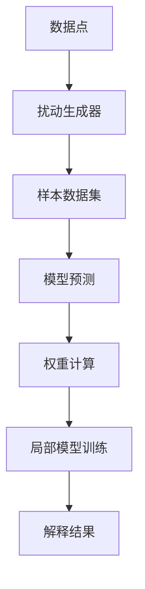
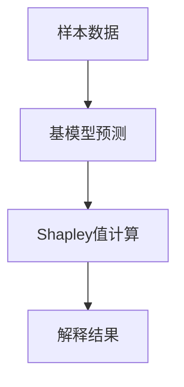
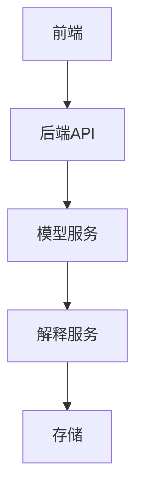
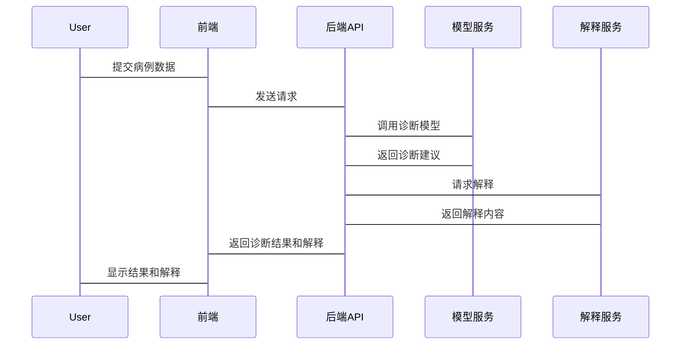
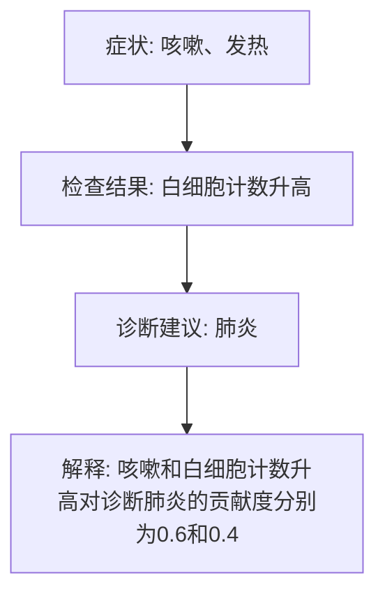

                 


# AI Agent的可解释性设计与实现

## 关键词：AI Agent，可解释性，机器学习模型，系统设计，算法原理

## 摘要：  
AI Agent的可解释性是当前人工智能领域的重要研究方向，尤其是在实际应用中，如何设计和实现具有可解释性的AI Agent系统成为关键挑战。本文从AI Agent的基本概念出发，深入探讨可解释性设计的核心原理、算法实现和系统架构，结合实际案例进行详细分析，最终提出可解释性设计的最佳实践和未来研究方向。

---

# 第一部分: AI Agent的可解释性基础

## 第1章: AI Agent与可解释性概述

### 1.1 AI Agent的基本概念
#### 1.1.1 AI Agent的定义
AI Agent（人工智能代理）是一种能够感知环境、自主决策并执行任务的智能实体。它可以是一个软件程序、机器人或其他智能系统，具备以下核心特征：
- **自主性**：能够在没有外部干预的情况下独立运行。
- **反应性**：能够感知环境并实时调整行为。
- **目标导向**：基于预设目标或用户需求执行任务。
- **学习能力**：通过数据或经验优化自身的决策能力。

#### 1.1.2 AI Agent的核心特征
AI Agent的设计目标是实现智能化决策，这需要结合以下关键特征：
- **感知能力**：通过传感器或其他输入方式获取环境信息。
- **推理能力**：基于感知信息进行逻辑推理或模式识别。
- **决策能力**：根据推理结果做出最优或合理的决策。
- **执行能力**：通过执行机构或输出接口完成任务。

#### 1.1.3 可解释性在AI Agent中的重要性
AI Agent的决策过程往往依赖复杂的算法和模型，这使得其行为难以被人类理解和信任。可解释性设计的核心目标是让AI Agent的决策过程透明化，从而增强用户信任、满足监管要求，并支持问题排查与优化。

---

### 1.2 可解释性问题的背景与挑战
#### 1.2.1 可解释性问题的背景
随着AI技术的广泛应用，AI Agent被应用于金融、医疗、自动驾驶等领域。然而，这些领域对决策过程的透明性和可解释性要求极高，尤其是在涉及人类生命安全或重大利益的场景中。

#### 1.2.2 可解释性在AI应用中的挑战
AI Agent的可解释性设计面临以下主要挑战：
- **模型复杂性**：深度学习模型（如神经网络）通常被视为“黑箱”，难以解释其决策过程。
- **数据多样性**：不同场景下的数据分布差异可能导致解释方法的适用性受限。
- **用户需求多样性**：不同用户对解释的需求和理解能力存在差异。

#### 1.2.3 可解释性对用户信任的影响
用户对AI Agent的信任往往依赖于对决策过程的理解。缺乏可解释性的AI系统可能导致用户不信任，甚至引发法律或伦理争议。

---

### 1.3 可解释性设计的目标与范围
#### 1.3.1 可解释性设计的目标
可解释性设计的目标是通过清晰、简洁的方式展示AI Agent的决策逻辑，使其易于被人类理解和验证。

#### 1.3.2 可解释性的边界与外延
可解释性并非要求AI Agent的所有决策过程完全透明，而是要在特定范围内提供合理的解释。例如：
- 对于简单的规则模型，可以提供明确的规则说明。
- 对于复杂的模型，可以提供局部可解释性或概率解释。

#### 1.3.3 可解释性与模型复杂性的平衡
模型的复杂性与可解释性之间存在天然的矛盾。复杂模型通常具有更高的预测能力，但其决策过程更难解释。因此，需要在模型性能和可解释性之间找到平衡点。

---

### 1.4 本章小结
本章从AI Agent的基本概念出发，分析了可解释性设计的重要性及其面临的挑战。接下来的章节将深入探讨可解释性设计的核心原理、算法实现和系统架构。

---

# 第二部分: AI Agent的可解释性核心概念

## 第2章: 可解释性设计的核心原理

### 2.1 可解释性设计的原理
#### 2.1.1 可解释性模型的构建
可解释性设计的核心是构建易于理解的模型或解释方法。例如：
- **线性模型**：如线性回归，其权重可以直接解释特征对结果的影响。
- **决策树**：其结构可以直观地展示决策逻辑。

#### 2.1.2 可解释性与模型透明度的关系
模型透明度是可解释性的基础。透明的模型通常更容易被解释，但透明度与模型复杂性密切相关。

#### 2.1.3 可解释性设计的数学基础
可解释性设计需要结合概率论、统计学和优化理论等数学工具，以确保解释的准确性和合理性。

### 2.2 可解释性维度对比表
以下是对不同可解释性方法的对比：

| **方法**       | **解释范围** | **可解释性** | **计算复杂度** |
|----------------|--------------|--------------|----------------|
| LIME           | 局部         | 高           | 中             |
| SHAP           | 全局/局部    | 高           | 高             |
| Linear Model   | 全局         | 高           | 低             |

### 2.3 可解释性设计的ER实体关系图
以下是一个简单的可解释性设计的ER实体关系图：

```mermaid
erDiagram
    class 可解释性系统 {
        id : 整数
        model_id : 整数
        feature_importance : 浮点数
        explanation : 文本
    }
    class AI Agent {
        id : 整数
        name : 文本
        model_type : 文本
        target : 文本
    }
    可解释性系统 --> AI Agent : belongsTo
```

### 2.4 本章小结
本章从可解释性设计的核心原理出发，分析了不同方法的特点及其适用场景。接下来的章节将重点讲解可解释性算法的实现原理。

---

# 第三部分: AI Agent可解释性算法原理

## 第3章: 可解释性算法的核心原理

### 3.1 可解释性算法的分类
#### 3.1.1 局部可解释性方法
局部可解释性方法关注模型在特定数据点附近的决策逻辑。例如：
- **LIME（Local Interpretable Model-agnostic Explanations）**：通过扰动数据点，构建局部线性模型进行解释。

#### 3.1.2 全局可解释性方法
全局可解释性方法关注整个模型的决策逻辑。例如：
- **SHAP（SHapley Additive exPlanations）**：基于博弈论中的Shapley值，量化每个特征对模型预测结果的贡献。

#### 3.1.3 模型不可知论解释方法
这些方法适用于任何模型，无需了解模型内部结构。例如：
- **LIME** 和 **SHAP**。

---

### 3.2 LIME算法原理
#### 3.2.1 LIME算法的流程图
以下是一个LIME算法的流程图：



#### 3.2.2 LIME算法的Python实现
以下是LIME算法的Python实现示例：

```python
import lime
from lime import lime_explanation

def explain_model(model, data, feature_names):
    explainer = lime_explanation.LimeTabularExplainer(data, feature_names=feature_names)
    explanation = explainer.explain_instance(data, model.predict, num_features=len(feature_names))
    return explanation
```

#### 3.2.3 LIME算法的数学模型
LIME算法的核心思想是通过线性回归模型对局部数据点进行拟合，公式如下：

$$ \text{预测值} = \sum_{i=1}^{n} w_i x_i + b $$

其中，$w_i$ 是特征 $x_i$ 的权重，$b$ 是截距项。

---

### 3.3 SHAP值原理
#### 3.3.1 SHAP值的计算流程
以下是一个SHAP值的计算流程图：



#### 3.3.2 SHAP值的Python实现
以下是SHAP值的Python实现示例：

```python
import shap
from sklearn.datasets import load_iris

iris = load_iris()
X = iris.data
y = iris.target

explainer = shap.TreeExplainer(model)
shap_values = explainer.shap_values(X)
shap.force_plot(explainer, shap_values, X, y)
```

#### 3.3.3 SHAP值的数学表达式
SHAP值基于博弈论中的Shapley值，公式如下：

$$ \text{Shapley值} = \sum_{S \subseteq F} \frac{1}{\binom{n-1}{|S|}} \cdot (f(S \cup \{i\}) - f(S)) $$

其中，$F$ 是特征集合，$n$ 是特征总数。

---

### 3.4 本章小结
本章详细讲解了LIME和SHAP两种经典的可解释性算法，并通过代码示例和数学公式展示了它们的实现原理。接下来的章节将探讨如何将这些算法应用于实际系统设计中。

---

# 第四部分: AI Agent可解释性系统的架构设计

## 第4章: 可解释性系统的分析与设计

### 4.1 可解释性系统的场景介绍
#### 4.1.1 问题场景描述
假设我们正在开发一个医疗诊断AI Agent，该系统需要根据患者的症状、检查结果等信息，推荐诊断方案。由于医疗领域对可解释性要求极高，因此需要设计一个可解释的系统架构。

#### 4.1.2 系统目标与范围
系统的目标是为医生提供可信赖的诊断建议，同时支持对诊断过程的可解释性分析。

#### 4.1.3 系统的关键需求
- 提供诊断结果的解释。
- 支持用户对解释的需求（如概率解释、规则解释）。
- 提供实时反馈和优化功能。

---

### 4.2 系统功能设计
#### 4.2.1 领域模型类图
以下是领域模型类图：


#### 4.2.2 系统架构图
以下是系统架构图：



#### 4.2.3 系统接口设计和交互流程图
以下是系统接口设计和交互流程图：



---

### 4.3 本章小结
本章从系统设计的角度，详细分析了可解释性系统的架构设计，并通过医疗诊断场景进行了具体说明。接下来的章节将结合实际项目案例，进一步探讨可解释性设计的实现细节。

---

# 第五部分: AI Agent可解释性系统的实现

## 第5章: 可解释性系统的实现

### 5.1 项目实战: 医疗诊断AI Agent的可解释性实现

#### 5.1.1 环境安装
以下是实现所需的环境配置：

```bash
# 安装依赖
pip install scikit-learn xgboost lime shap flask
```

#### 5.1.2 核心代码实现
以下是核心代码实现：

```python
# 模型训练
from sklearn.ensemble import GradientBoostingClassifier
import numpy as np

model = GradientBoostingClassifier()
model.fit(X_train, y_train)

# 解释实现
import lime
from lime import lime_explanation

def get_explanation(instance, model, feature_names):
    explainer = lime_explanation.LimeTabularExplainer(X_train, feature_names=feature_names)
    explanation = explainer.explain_instance(instance, model.predict_proba, num_features=len(feature_names))
    return explanation.as_list()
```

#### 5.1.3 代码应用解读与分析
上述代码实现了一个基于梯度提升树的诊断模型，并使用LIME算法对模型进行解释。LIME算法通过扰动数据点，构建局部线性模型来解释模型的预测结果。

#### 5.1.4 实际案例分析
以下是一个具体案例的分析结果：



---

### 5.2 最佳实践与注意事项
#### 5.2.1 文档记录
确保对系统的可解释性设计进行全面记录，包括模型选择、解释方法和优化过程。

#### 5.2.2 用户教育
为用户提供易于理解的解释，同时提供必要的培训，帮助用户理解AI Agent的决策过程。

#### 5.2.3 透明度与责任
在设计可解释性系统时，需要明确系统的透明度和责任归属，尤其是在涉及法律和伦理问题的领域。

---

### 5.3 本章小结
本章通过医疗诊断AI Agent的案例，详细展示了可解释性系统的实现过程，并提出了相关的最佳实践建议。接下来的章节将总结全书内容，并展望未来的研究方向。

---

# 第六部分: 可解释性设计的总结与展望

## 第6章: 可解释性设计的总结与展望

### 6.1 总结
可解释性设计是AI Agent技术的核心挑战之一。本文从理论到实践，详细探讨了可解释性设计的核心原理、算法实现和系统架构，并通过实际案例展示了其应用价值。

---

### 6.2 未来研究方向
未来的可解释性设计将朝着以下方向发展：
- **多模态解释**：结合文本、图像等多种形式提供更丰富的解释。
- **动态可解释性**：支持实时更新和自适应解释。
- **人机交互优化**：设计更直观的解释界面，提升用户体验。

---

## 作者：AI天才研究院/AI Genius Institute & 禅与计算机程序设计艺术/Zen And The Art of Computer Programming

---

**文章结尾提示**：  
如果您对本文内容有疑问或需要进一步的技术支持，请随时联系我，我会尽力为您提供详细的解答和技术指导。

