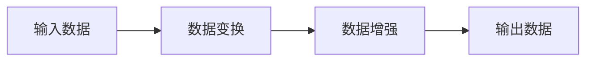
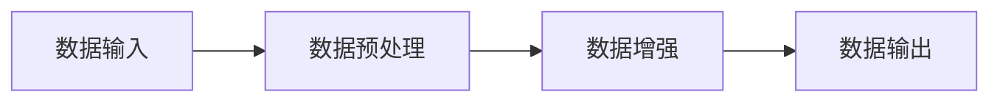
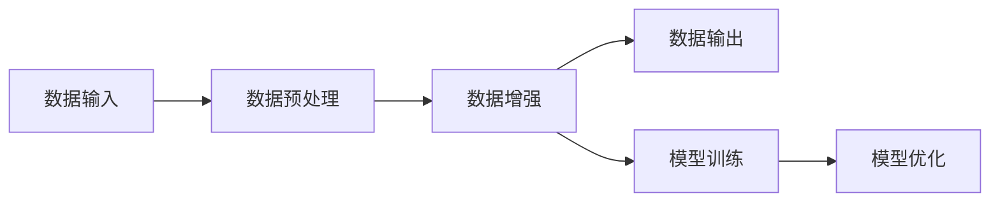

                 


# AI Agent的数据增强技术与策略

> 关键词：AI Agent, 数据增强技术, 数据多样性, 模型优化, 算法原理, 实体关系图, 数据增强策略

> 摘要：  
本文将深入探讨AI Agent中的数据增强技术与策略。通过分析数据增强技术的基本概念、核心原理、算法流程、系统架构以及实际应用，结合丰富的案例分析和代码实现，帮助读者全面理解数据增强技术在AI Agent中的重要作用。文章还将详细讲解数据增强技术的数学模型和优化策略，为读者提供从理论到实践的全面指导。

---

# 目录

1. [AI Agent与数据增强技术概述](#ai-agent与数据增强技术概述)
2. [数据增强技术的核心概念与原理](#数据增强技术的核心概念与原理)
3. [数据增强技术的算法原理与实现](#数据增强技术的算法原理与实现)
4. [数据增强技术的系统架构与设计](#数据增强技术的系统架构与设计)
5. [数据增强技术的项目实战](#数据增强技术的项目实战)
6. [数据增强技术的优化策略与部署](#数据增强技术的优化策略与部署)
7. [数据增强技术的未来趋势与挑战](#数据增强技术的未来趋势与挑战)

---

## 第1章: AI Agent与数据增强技术概述

### 1.1 AI Agent的基本概念

#### 1.1.1 AI Agent的定义与特点
AI Agent（人工智能代理）是指能够感知环境、自主决策并执行任务的智能实体。其特点包括：
- **自主性**：能够自主决策，无需外部干预。
- **反应性**：能够实时感知环境并做出响应。
- **目标导向性**：以目标为导向，优化行为以实现任务。
- **学习能力**：能够通过经验改进性能。

#### 1.1.2 数据增强技术的基本概念
数据增强技术是指通过各种方法对数据进行变换和扩展，以增加数据多样性和复杂性的技术。其目的是提升模型的泛化能力和鲁棒性。

#### 1.1.3 AI Agent与数据增强技术的关联
AI Agent需要处理多样化的数据，而数据增强技术能够为AI Agent提供更丰富的数据集，从而提高其感知和决策能力。

### 1.2 数据增强技术的应用背景

#### 1.2.1 数据增强技术的起源与发展
数据增强技术起源于计算机视觉领域，旨在通过数据扩展来解决数据不足的问题。随着AI Agent的应用场景扩展，数据增强技术逐渐成为其核心支撑技术之一。

#### 1.2.2 AI Agent领域中的数据增强需求
AI Agent需要处理来自多源异构数据，数据增强技术能够帮助其更好地适应复杂环境。

#### 1.2.3 数据增强技术在AI Agent中的作用
数据增强技术通过增加数据多样性，帮助AI Agent更好地泛化能力，提升其在实际应用中的性能。

### 1.3 数据增强技术的核心目标

#### 1.3.1 提高模型泛化能力
通过生成多样化的数据，数据增强技术能够帮助AI Agent更好地泛化能力，减少过拟合。

#### 1.3.2 增强数据多样性
数据增强技术能够扩展数据集的规模，增加数据多样性，从而提高模型的鲁棒性。

#### 1.3.3 优化模型性能的策略
通过数据增强技术，可以优化模型的性能，使其在复杂环境中表现更好。

### 1.4 本章小结
本章介绍了AI Agent的基本概念，数据增强技术的基本概念，以及两者之间的关联。通过数据增强技术，AI Agent能够更好地适应复杂环境，提高其感知和决策能力。

---

## 第2章: 数据增强技术的核心概念与原理

### 2.1 数据增强技术的核心原理

#### 2.1.1 数据增强的基本流程
数据增强的基本流程包括数据预处理、数据变换和数据后处理三个阶段。

#### 2.1.2 数据增强的主要方法
数据增强的主要方法包括图像变换、数据扰动、数据合成等。

#### 2.1.3 数据增强的数学模型
数据增强的数学模型可以通过函数表示，例如：
$$ y = f(x) $$
其中，$x$ 表示原始数据，$y$ 表示增强后的数据，$f$ 表示数据变换函数。

### 2.2 数据增强技术的关键特征

#### 2.2.1 数据多样性
数据增强技术通过生成多样化的数据，帮助模型更好地适应不同的输入。

#### 2.2.2 数据一致性
数据增强技术需要保持数据的一致性，确保增强后的数据与原始数据具有相似的分布。

#### 2.2.3 数据分布的平衡性
数据增强技术需要平衡数据分布，避免某些类别数据过多或过少。

### 2.3 数据增强技术的实体关系图


### 2.4 本章小结
本章详细介绍了数据增强技术的核心原理和关键特征，通过实体关系图展示了数据增强技术在AI Agent中的作用。

---

## 第3章: 数据增强技术的算法原理与实现

### 3.1 数据增强算法的基本流程

#### 3.1.1 数据预处理阶段
数据预处理阶段包括数据清洗和标准化等步骤。

#### 3.1.2 数据变换阶段
数据变换阶段包括图像旋转、缩放、裁剪等操作。

#### 3.1.3 数据后处理阶段
数据后处理阶段包括数据归一化和数据增强结果的存储。

### 3.2 数据增强算法的核心步骤



### 3.3 数据增强算法的数学模型

#### 3.3.1 数据变换的数学表示
$$ y = f(x) $$
其中，$x$ 表示原始数据，$y$ 表示增强后的数据，$f$ 表示数据变换函数。

#### 3.3.2 数据增强的优化目标
$$ \min_{\theta} \mathbb{E}_{x \sim P(x)}[L(f(x), y)] $$
其中，$L$ 表示损失函数，$\theta$ 表示模型参数。

### 3.4 数据增强算法的实现

#### 3.4.1 数据增强方法
- **图像旋转**：通过旋转图像生成新的数据。
- **图像缩放**：通过缩放图像生成新的数据。
- **图像裁剪**：通过裁剪图像生成新的数据。

#### 3.4.2 数据增强实现的Python代码
```python
import numpy as np
from PIL import Image

def rotate_image(image, angle):
    rotated_image = image.rotate(angle)
    return rotated_image

def enhance_data(images, angles):
    enhanced_images = []
    for image in images:
        for angle in angles:
            enhanced_image = rotate_image(image, angle)
            enhanced_images.append(enhanced_image)
    return enhanced_images
```

### 3.5 本章小结
本章详细介绍了数据增强技术的算法原理与实现，通过代码示例展示了数据增强的具体实现方法。

---

## 第4章: 数据增强技术的系统架构与设计

### 4.1 数据增强系统的整体架构



### 4.2 数据增强系统的功能设计

#### 4.2.1 数据预处理模块
数据预处理模块负责对原始数据进行清洗和标准化。

#### 4.2.2 数据增强模块
数据增强模块负责对预处理后的数据进行变换和扩展。

#### 4.2.3 数据输出模块
数据输出模块负责将增强后的数据存储或输出到模型训练模块。

### 4.3 数据增强系统的架构设计



### 4.4 数据增强系统的接口设计

#### 4.4.1 数据预处理模块接口
```python
def preprocess(images):
    # 数据清洗和标准化
    return processed_images
```

#### 4.4.2 数据增强模块接口
```python
def enhance(images):
    # 数据变换和扩展
    return enhanced_images
```

### 4.5 数据增强系统的交互流程


### 4.6 本章小结
本章详细介绍了数据增强技术的系统架构与设计，通过模块化设计展示了数据增强在AI Agent中的具体实现。

---

## 第5章: 数据增强技术的项目实战

### 5.1 项目背景与目标

#### 5.1.1 项目背景
本项目旨在通过数据增强技术提升AI Agent在图像识别任务中的性能。

#### 5.1.2 项目目标
通过数据增强技术，提高AI Agent在图像识别任务中的准确率和鲁棒性。

### 5.2 项目实施步骤

#### 5.2.1 环境安装
```bash
pip install numpy pillow matplotlib
```

#### 5.2.2 数据预处理
```python
import numpy as np
from PIL import Image

def preprocess(images):
    processed_images = []
    for image in images:
        # 数据清洗和标准化
        processed_image = image.resize((224, 224))
        processed_images.append(processed_image)
    return processed_images
```

#### 5.2.3 数据增强
```python
def enhance(images):
    enhanced_images = []
    for image in images:
        # 图像旋转
        rotated_image = image.rotate(45)
        enhanced_images.append(rotated_image)
    return enhanced_images
```

#### 5.2.4 模型训练
```python
from tensorflow.keras import layers, Model

def build_model(input_shape):
    inputs = layers.Input(shape=input_shape)
    x = layers.Conv2D(32, (3, 3), activation='relu')(inputs)
    x = layers.MaxPooling2D((2, 2))(x)
    x = layers.Conv2D(64, (3, 3), activation='relu')(x)
    x = layers.MaxPooling2D((2, 2))(x)
    x = layers.Flatten()(x)
    x = layers.Dense(128, activation='relu')(x)
    outputs = layers.Dense(10, activation='softmax')(x)
    return Model(inputs=inputs, outputs=outputs)
```

### 5.3 项目小结
本章通过实际案例展示了数据增强技术在AI Agent中的应用，通过代码实现和案例分析，帮助读者理解数据增强技术的具体实现方法。

---

## 第6章: 数据增强技术的优化策略与部署

### 6.1 数据增强技术的优化策略

#### 6.1.1 数据多样性优化
通过引入更多数据变换方法，提高数据多样性。

#### 6.1.2 数据一致性优化
通过保持数据一致性，确保增强后的数据与原始数据具有相似的分布。

#### 6.1.3 数据分布平衡性优化
通过调整数据分布，避免某些类别数据过多或过少。

### 6.2 数据增强技术的部署

#### 6.2.1 环境部署
确保系统环境满足数据增强技术的部署需求。

#### 6.2.2 代码部署
将数据增强代码部署到实际应用中，确保其稳定运行。

### 6.3 数据增强技术的注意事项

#### 6.3.1 数据增强技术的适用场景
数据增强技术适用于数据不足或数据分布不均衡的场景。

#### 6.3.2 数据增强技术的局限性
数据增强技术可能无法完全模拟真实场景，需要结合其他技术进行优化。

### 6.4 本章小结
本章详细介绍了数据增强技术的优化策略与部署方法，帮助读者更好地理解和应用数据增强技术。

---

## 第7章: 数据增强技术的未来趋势与挑战

### 7.1 数据增强技术的未来趋势

#### 7.1.1 智能化数据增强
通过引入AI技术，实现更加智能化的数据增强方法。

#### 7.1.2 自适应数据增强
通过自适应算法，实现动态调整数据增强策略。

#### 7.1.3 多模态数据增强
通过多模态数据增强，提升AI Agent的多模态感知能力。

### 7.2 数据增强技术的挑战

#### 7.2.1 数据增强技术的计算成本
数据增强技术需要大量计算资源，可能面临计算成本高的问题。

#### 7.2.2 数据增强技术的模型泛化能力
数据增强技术需要在提升模型泛化能力的同时，保持数据一致性。

#### 7.2.3 数据增强技术的可解释性
数据增强技术需要提高其可解释性，便于理解和优化。

### 7.3 本章小结
本章展望了数据增强技术的未来趋势，分析了其面临的挑战，为读者提供了未来研究的方向。

---

## 作者：AI天才研究院/AI Genius Institute & 禅与计算机程序设计艺术 /Zen And The Art of Computer Programming

---

以上是《AI Agent的数据增强技术与策略》的文章大纲，内容涵盖从基础到高级的各个方面，结合理论与实践，为读者提供了全面的指导。

