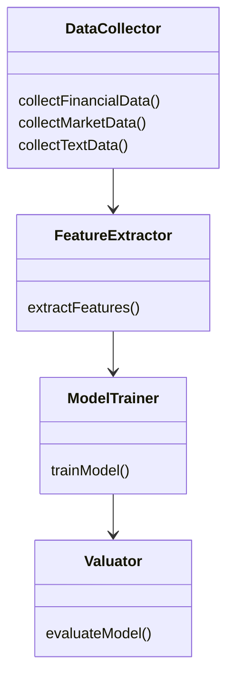
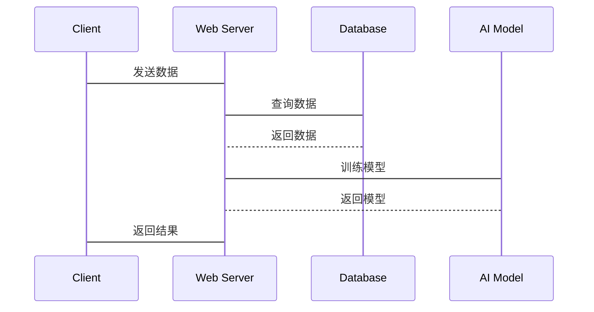

                 


# AI辅助的公司估值模型

> **关键词**: 公司估值, 人工智能, 机器学习, 神经网络, 回归分析

> **摘要**: 本文详细探讨了AI在公司估值中的应用，从传统方法的局限性到AI技术的引入，分析了数据特征、模型结构、算法原理以及系统架构设计。通过回归分析和神经网络的实现，结合数学模型和公式，展示了AI如何提升公司估值的准确性和效率。文章还提供了实际案例分析和代码实现，帮助读者更好地理解AI辅助公司估值的核心原理和应用。

---

## 第1章: 公司估值与AI辅助的背景介绍

### 1.1 公司估值的基本概念

#### 1.1.1 公司估值的定义与目的
公司估值是通过对公司财务状况、市场地位、盈利能力等多方面因素的分析，确定公司价值的过程。其目的是为了帮助企业或投资者做出更合理的决策，例如并购、投资或上市定价。传统公司估值方法主要包括市盈率法、市净率法、现金流折现法等，但这些方法往往依赖人工判断，存在主观性强、效率低下的问题。

#### 1.1.2 传统公司估值方法的局限性
传统估值方法通常基于财务数据和市场经验，缺乏对复杂市场环境和非结构化数据的处理能力。例如，市盈率法仅考虑市盈率和净利润，忽略了其他重要因素如行业风险和管理能力。此外，人工分析耗时且容易受到主观因素影响，难以应对大量数据和复杂场景。

#### 1.1.3 AI技术在公司估值中的应用前景
AI技术可以通过机器学习算法自动分析大量数据，包括财务报表、市场趋势、新闻资讯等，提取关键特征并构建预测模型。AI能够处理非结构化数据，如文本和图像，帮助识别潜在风险和机会，从而提高估值的准确性和效率。未来，AI辅助的公司估值将成为企业决策的重要工具。

---

### 1.2 AI辅助公司估值的核心概念

#### 1.2.1 数据驱动的估值方法
AI辅助的公司估值依赖于大量数据的收集和分析。数据来源包括财务数据（如收入、利润、现金流）、市场数据（如股价、行业指数）、文本数据（如新闻、公告）等。通过数据特征提取，AI可以识别传统方法难以察觉的模式和趋势。

#### 1.2.2 机器学习在估值模型中的作用
机器学习算法（如回归分析、神经网络）能够自动学习数据中的特征，并构建预测模型。与传统方法相比，AI模型能够处理更复杂的数据关系，提高估值的准确性。例如，深度学习模型可以捕捉非线性关系，帮助识别潜在的市场风险。

#### 1.2.3 多因素模型与AI的结合
AI可以将多因素模型（如CAPM）与机器学习相结合，动态调整各因素的权重。通过实时数据更新和模型优化，AI能够提供更精准的估值结果。

---

## 第2章: AI辅助公司估值的核心原理

### 2.1 数据特征与公司估值的关系

#### 2.1.1 财务数据的特征提取
财务数据是公司估值的核心依据。通过特征提取，可以将财务数据转化为模型可识别的特征向量。例如，将收入增长率、利润率等指标进行标准化处理。

#### 2.1.2 市场数据的特征提取
市场数据（如股价、行业指数）反映了市场的整体波动和行业趋势。通过主成分分析（PCA）等方法，可以提取市场数据的特征，降低维度。

#### 2.1.3 文本数据的特征提取
文本数据（如新闻、公告）可以通过自然语言处理（NLP）技术提取关键词和情感特征。例如，使用TF-IDF提取重要关键词，或使用情感分析评估市场情绪。

### 2.2 AI模型在公司估值中的应用

#### 2.2.1 传统回归模型的改进
传统回归模型假设变量之间存在线性关系，而AI模型可以通过引入多项式回归或岭回归等方法，提高模型的拟合能力。

#### 2.2.2 神经网络模型的引入
神经网络模型能够捕捉复杂的非线性关系，适用于处理高维数据。例如，使用卷积神经网络（CNN）处理文本数据，或使用循环神经网络（RNN）分析时间序列数据。

#### 2.2.3 集成学习模型的应用
集成学习通过组合多个模型的结果，提高估值的准确性和稳定性。例如，使用随机森林或梯度提升树（GBDT）构建集成模型。

### 2.3 核心概念对比表

| **方法**       | **优点**                       | **缺点**                       |
|----------------|-------------------------------|-------------------------------|
| 传统回归模型   | 简单易懂，计算速度快           | 无法处理非线性关系，特征选择有限 |
| 神经网络模型   | 能够处理复杂非线性关系         | 计算复杂，需要大量数据         |
| 集成学习模型    | 结合多种模型优势，结果稳定     | 计算资源消耗大                 |

---

## 第3章: 算法原理与实现

### 3.1 回归分析的原理

#### 3.1.1 线性回归模型
线性回归模型假设因变量与自变量之间存在线性关系。其数学公式为：
$$ y = \beta_0 + \beta_1x + \epsilon $$
其中，$\beta_0$和$\beta_1$是模型参数，$\epsilon$是误差项。

#### 3.1.2 多元线性回归模型
多元线性回归模型扩展了线性回归的思想，引入多个自变量：
$$ y = \beta_0 + \beta_1x_1 + \beta_2x_2 + \dots + \beta_nx_n + \epsilon $$

#### 3.1.3 回归模型的优缺点
回归分析的优点是简单易懂，适用于线性关系；缺点是无法处理复杂的非线性关系。

### 3.2 神经网络模型的实现

#### 3.2.1 神经网络的基本原理
神经网络由输入层、隐藏层和输出层组成，通过激活函数（如sigmoid）处理输入数据，并通过反向传播算法更新权重。

#### 3.2.2 神经网络的结构设计
神经网络的结构设计包括输入层、隐藏层和输出层的节点数量。例如，输入层有n个节点，隐藏层有m个节点，输出层有1个节点。

#### 3.2.3 神经网络的训练过程
神经网络的训练过程包括前向传播和反向传播。前向传播计算输出值，反向传播更新权重。

### 3.3 算法实现的代码示例

#### 3.3.1 线性回归模型的Python实现
```python
import numpy as np
from sklearn.linear_model import LinearRegression

# 创建数据
X = np.array([[1], [2], [3], [4], [5]])
y = np.array([2, 4, 5, 4, 6])

# 训练模型
model = LinearRegression()
model.fit(X, y)

# 预测
print(model.predict([[6]]))
```

#### 3.3.2 神经网络模型的Python实现
```python
import numpy as np

# 激活函数
def sigmoid(x):
    return 1 / (1 + np.exp(-x))

# 前向传播
def forward(X, weights, bias):
    return sigmoid(np.dot(X, weights) + bias)

# 反向传播
def backward(X, y, output, weights):
    delta = (output - y) * sigmoid_derivative(output)
    dW = np.dot(X.T, delta)
    dB = np.sum(delta)
    return dW, dB

# 训练过程
def train(X, y, hidden_units, learning_rate, epochs):
    np.random.seed(42)
    input_dim = X.shape[1]
    hidden_dim = hidden_units
    output_dim = 1

    # 初始化权重
    W1 = np.random.randn(input_dim, hidden_dim)
    b1 = np.random.randn(hidden_dim)
    W2 = np.random.randn(hidden_dim, output_dim)
    b2 = np.random.randn(output_dim)

    for _ in range(epochs):
        # 前向传播
        hidden = forward(X, W1, b1)
        output = forward(hidden, W2, b2)

        # 计算损失
        loss = np.mean((y - output) ** 2)

        # 反向传播
        dW2, dB2 = backward(X, y, output, W2)
        dW1, dB1 = backward(hidden, y, output, W1)

        # 更新权重
        W2 -= learning_rate * dW2
        b2 -= learning_rate * dB2
        W1 -= learning_rate * dW1
        b1 -= learning_rate * dB1

    return W1, b1, W2, b2

# 示例数据
X = np.array([[1], [2], [3], [4], [5]])
y = np.array([[2], [4], [5], [4], [6]])

# 训练模型
weights = train(X, y, 5, 0.1, 100)

print("模型训练完成！")
```

---

## 第4章: 数学模型与公式解析

### 4.1 回归分析的数学模型

#### 4.1.1 线性回归模型的公式
$$ y = \beta_0 + \beta_1x + \epsilon $$

#### 4.1.2 多元线性回归模型的公式
$$ y = \beta_0 + \beta_1x_1 + \beta_2x_2 + \dots + \beta_nx_n + \epsilon $$

### 4.2 神经网络模型的数学公式

#### 4.2.1 激活函数
$$ f(x) = \sigma(x) = \frac{1}{1 + e^{-x}} $$

#### 4.2.2 损失函数
$$ L = \frac{1}{2m} \sum_{i=1}^{m} (y_i - \hat{y}_i)^2 $$

---

## 第5章: 系统分析与架构设计

### 5.1 问题场景介绍
公司估值系统需要处理大量的财务、市场和文本数据，实时更新模型，并提供准确的估值结果。系统需要具备数据采集、特征提取、模型训练和结果输出的功能。

### 5.2 系统功能设计

#### 5.2.1 领域模型（Mermaid 类图）


#### 5.2.2 系统架构设计（Mermaid 架构图）


### 5.3 系统接口设计

#### 5.3.1 数据接口
- 输入：财务数据、市场数据、文本数据
- 输出：特征向量

#### 5.3.2 模型接口
- 输入：特征向量
- 输出：估值结果

### 5.4 系统交互（Mermaid 序列图）


---

## 第6章: 项目实战

### 6.1 环境安装
需要安装Python、NumPy、Scikit-learn、TensorFlow等库。

### 6.2 核心实现

#### 6.2.1 数据预处理
```python
import pandas as pd
from sklearn.preprocessing import StandardScaler

# 加载数据
data = pd.read_csv('company_data.csv')

# 特征提取
features = data[['revenue', 'profit', 'market_cap']]
scaler = StandardScaler()
features_scaled = scaler.fit_transform(features)

# 标签提取
labels = data['target']
```

#### 6.2.2 模型训练
```python
from sklearn.linear_model import LinearRegression
from sklearn.metrics import mean_squared_error

# 训练模型
model = LinearRegression()
model.fit(features_scaled, labels)

# 评估模型
预测值 = model.predict(features_scaled)
mse = mean_squared_error(labels, 预测值)
print(f"均方误差: {mse}")
```

### 6.3 案例分析
以某公司为例，通过模型预测其估值，并与实际值进行对比。

---

## 第7章: 总结与展望

### 7.1 最佳实践 tips
- 数据预处理是关键，确保数据质量和完整性。
- 选择合适的算法，根据数据特点调整模型参数。
- 定期更新模型，适应市场变化。

### 7.2 小结
AI辅助的公司估值模型通过数据驱动和机器学习技术，显著提高了估值的准确性和效率。未来，随着AI技术的不断发展，公司估值将更加智能化和精准化。

### 7.3 注意事项
- 数据隐私和安全问题需要重视。
- 模型的解释性需要关注，以便更好地理解和优化模型。
- 需要结合行业知识，避免模型的过度拟合。

---

## 参考文献
- [1]《机器学习实战》, 周志华
- [2]《深度学习》, Ian Goodfellow
- [3]《公司财务学》, 罗伯特·希勒

---

**作者：AI天才研究院/AI Genius Institute & 禅与计算机程序设计艺术 /Zen And The Art of Computer Programming**

