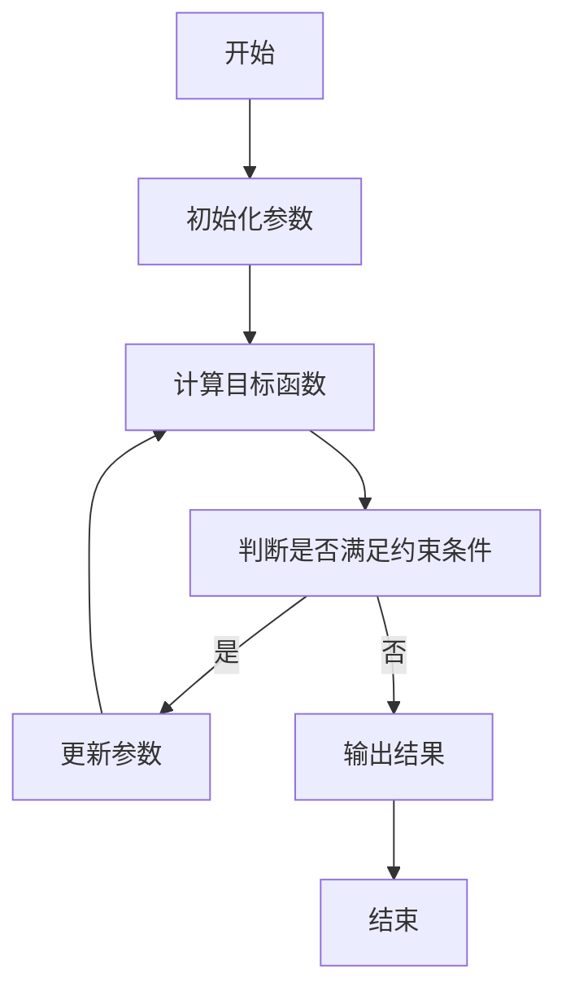
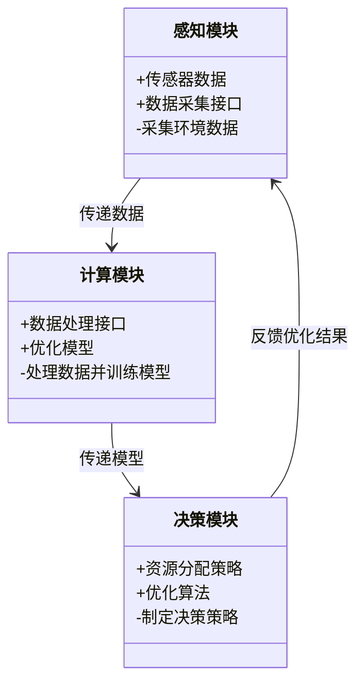
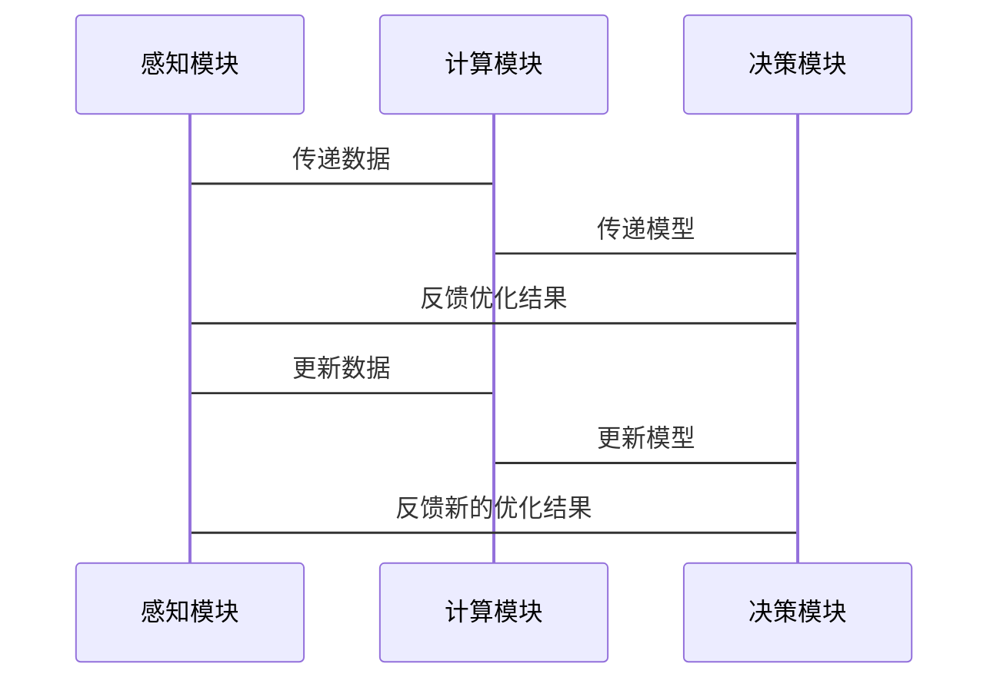

                 


```markdown
# 企业AI Agent的绿色计算与能源优化策略

> 关键词：企业AI Agent，绿色计算，能源优化，智能决策，资源分配，能耗模型

> 摘要：本文深入探讨了企业AI Agent在绿色计算与能源优化中的应用策略。通过分析AI Agent的体系结构、绿色计算的核心数学模型、优化算法以及系统架构设计，结合实际项目实战和案例分析，为企业在实现绿色计算和能源优化提供理论支持和实践指导。本文还提出了基于AI Agent的能源优化策略，帮助企业在数字化转型中实现可持续发展目标。

---

# 第一部分: 企业AI Agent的绿色计算与能源优化策略基础

## 第1章: 企业AI Agent与绿色计算概述

### 1.1 企业AI Agent的基本概念

#### 1.1.1 AI Agent的定义与特点
- **定义**：AI Agent（人工智能代理）是指具有感知环境、自主决策、执行任务能力的智能实体。
- **特点**：
  - **自主性**：能够在没有人工干预的情况下独立运行。
  - **反应性**：能够实时感知环境变化并做出响应。
  - **学习性**：能够通过数据学习和优化自身行为。
  - **协作性**：能够与其他系统或Agent协同工作。

#### 1.1.2 企业AI Agent的典型应用场景
- **智能监控系统**：实时监控企业资源的使用情况，优化资源配置。
- **智能调度系统**：动态调整企业资源的分配，提高效率。
- **智能能源管理系统**：优化企业的能源使用，降低能耗。

#### 1.1.3 绿色计算的核心理念
- **绿色计算**：通过优化计算资源的使用，减少能源消耗，降低碳排放。
- **核心理念**：
  - **能效最大化**：在满足需求的前提下，最大限度地降低能源消耗。
  - **可持续性**：通过绿色技术实现长期的环境和经济目标。
  - **智能化**：利用AI技术优化资源使用，实现绿色计算。

### 1.2 企业AI Agent与能源优化的关联

#### 1.2.1 能源优化的基本概念
- **能源优化**：通过优化能源的使用，降低能源消耗，提高能源利用效率。
- **关键指标**：
  - **能源使用效率（Energy Efficiency）**：单位计算能力的能源消耗。
  - **碳排放强度（Carbon Emission Intensity）**：单位计算能力的碳排放量。

#### 1.2.2 AI Agent在能源优化中的作用
- **实时监控**：AI Agent能够实时感知能源使用情况，快速做出响应。
- **智能决策**：通过学习和优化算法，AI Agent能够制定最优的能源使用策略。
- **动态调整**：根据环境变化，动态调整能源分配，确保能效最大化。

#### 1.2.3 企业AI Agent与绿色计算的结合
- **结合点**：
  - **资源分配优化**：AI Agent能够优化计算资源的分配，降低能耗。
  - **能效预测**：AI Agent能够预测能效变化，提前做出优化决策。
  - **多目标优化**：在满足企业需求的前提下，同时优化能源消耗和成本。

### 1.3 本章小结
本章介绍了企业AI Agent的基本概念和绿色计算的核心理念，分析了AI Agent在能源优化中的作用，并探讨了企业AI Agent与绿色计算的结合点。

---

## 第2章: 企业AI Agent的体系结构

### 2.1 AI Agent的体系结构原理

#### 2.1.1 分层架构
- **感知层**：负责感知环境信息，例如传感器数据、系统状态等。
- **计算层**：负责数据的处理和分析，例如数据清洗、特征提取等。
- **决策层**：负责制定决策策略，例如资源分配、能耗优化等。

#### 2.1.2 分布式架构
- **分布式计算**：通过分布式系统实现计算资源的共享和优化。
- **节点协作**：各个节点之间协同工作，共同完成任务。
- **负载均衡**：通过动态分配任务，确保各个节点的负载均衡。

#### 2.1.3 智能决策层
- **智能决策**：基于感知层和计算层提供的信息，制定最优的决策策略。
- **动态调整**：根据环境变化，动态调整决策策略。
- **自适应优化**：通过学习和优化算法，不断提高决策的准确性。

### 2.2 企业AI Agent的核心组件

#### 2.2.1 感知层
- **传感器数据采集**：通过传感器实时采集环境数据。
- **数据预处理**：对采集的数据进行清洗和转换，确保数据的准确性和一致性。
- **数据存储**：将处理后的数据存储在数据库中，供后续分析使用。

#### 2.2.2 计算层
- **数据分析**：对存储的数据进行分析，提取有用的信息。
- **模型训练**：基于数据分析结果，训练优化模型。
- **模型部署**：将训练好的模型部署到实际系统中，进行实时计算。

#### 2.2.3 决策层
- **决策制定**：基于模型计算结果，制定最优的决策策略。
- **策略执行**：将决策策略执行到位，例如调整资源分配、优化能源使用等。
- **反馈机制**：根据执行结果，反馈到感知层和计算层，形成闭环。

### 2.3 企业AI Agent的优化方法

#### 2.3.1 算法优化
- **算法选择**：根据具体问题选择合适的算法，例如遗传算法、粒子群优化算法等。
- **参数调优**：通过实验调优算法的参数，提高算法的性能。
- **并行计算**：利用多核处理器和分布式计算技术，提高计算效率。

#### 2.3.2 资源分配优化
- **资源分配策略**：根据任务需求和系统负载，动态调整资源分配。
- **负载均衡**：通过负载均衡技术，确保各个节点的负载均衡。
- **资源回收**：当资源不再需要时，及时释放资源，避免浪费。

#### 2.3.3 能耗预测与优化
- **能耗预测模型**：基于历史数据和环境信息，预测未来的能源消耗。
- **优化策略**：根据预测结果，制定最优的能源使用策略。
- **动态调整**：根据实时数据，动态调整预测模型和优化策略。

### 2.4 本章小结
本章详细介绍了企业AI Agent的体系结构，分析了各层的功能和作用，并探讨了算法优化、资源分配优化和能耗预测与优化的具体方法。

---

## 第3章: 绿色计算的数学模型与优化算法

### 3.1 绿色计算的核心数学模型

#### 3.1.1 能耗模型
- **能耗模型**：描述计算资源的能耗与负载之间的关系。
- **公式**：$$ E = a \times L + b $$
  - 其中，$E$ 表示能耗，$L$ 表示负载，$a$ 和 $b$ 是常数。
- **应用**：通过能耗模型，可以预测不同负载下的能耗，从而优化资源分配。

#### 3.1.2 资源分配模型
- **资源分配模型**：描述计算资源的分配与任务需求之间的关系。
- **公式**：$$ R = f(T) $$
  - 其中，$R$ 表示资源分配，$T$ 表示任务需求。
- **应用**：通过资源分配模型，可以动态调整资源分配，提高能效。

#### 3.1.3 能源效率模型
- **能源效率模型**：描述单位计算能力的能耗。
- **公式**：$$ EE = \frac{1}{E} $$
  - 其中，$EE$ 表示能源效率，$E$ 表示能耗。
- **应用**：通过能源效率模型，可以评估不同资源分配下的能源效率，从而优化能源使用。

### 3.2 优化算法的原理

#### 3.2.1 线性规划
- **线性规划**：通过建立线性方程组，求解最优解。
- **应用**：用于资源分配优化问题，例如最小化能耗。

#### 3.2.2 非线性规划
- **非线性规划**：通过建立非线性方程组，求解最优解。
- **应用**：用于复杂的优化问题，例如动态调整资源分配。

#### 3.2.3 启发式算法
- **启发式算法**：基于启发式规则，快速求解近似最优解。
- **应用**：用于大规模优化问题，例如粒子群优化算法。

### 3.3 算法流程图



### 3.4 本章小结
本章介绍了绿色计算的核心数学模型和优化算法，包括能耗模型、资源分配模型和能源效率模型，并详细讲解了线性规划、非线性规划和启发式算法的原理和应用。

---

## 第4章: 企业AI Agent的系统架构设计

### 4.1 系统功能设计

#### 4.1.1 感知模块
- **功能**：实时采集环境数据，例如传感器数据、系统状态等。
- **实现**：通过物联网技术，采集设备运行状态和环境参数。

#### 4.1.2 计算模块
- **功能**：对采集的数据进行处理和分析，例如数据清洗、特征提取等。
- **实现**：利用机器学习算法，训练优化模型。

#### 4.1.3 决策模块
- **功能**：基于模型计算结果，制定最优的决策策略。
- **实现**：通过优化算法，动态调整资源分配，优化能源使用。

### 4.2 系统架构图



### 4.3 系统接口设计

#### 4.3.1 数据采集接口
- **功能**：采集环境数据，例如温度、湿度、设备状态等。
- **接口协议**：支持HTTP、MQTT等协议。

#### 4.3.2 数据处理接口
- **功能**：对采集的数据进行清洗和转换，确保数据的准确性和一致性。
- **接口协议**：支持JSON、XML等格式。

#### 4.3.3 资源分配接口
- **功能**：根据优化结果，动态调整资源分配。
- **接口协议**：支持RESTful API。

### 4.4 系统交互流程图



### 4.5 本章小结
本章详细介绍了企业AI Agent的系统架构设计，包括系统功能设计、系统架构图、系统接口设计和系统交互流程图。

---

## 第5章: 项目实战——企业AI Agent的绿色计算与能源优化策略

### 5.1 项目背景与目标
- **项目背景**：随着企业数字化转型的推进，能源消耗问题日益突出。
- **项目目标**：通过AI Agent实现绿色计算，优化能源使用，降低成本。

### 5.2 项目环境安装
- **安装Python**：```bash
  apt-get install python3 python3-pip
  ```
- **安装依赖库**：```bash
  pip install numpy scikit-learn matplotlib
  ```

### 5.3 系统核心实现源代码

#### 5.3.1 感知模块
```python
import numpy as np

def collect_data():
    # 模拟传感器数据采集
    data = np.random.rand(100, 5)
    return data

# 示例调用
data = collect_data()
print(data)
```

#### 5.3.2 计算模块
```python
from sklearn import linear_model

def optimize_model(data):
    # 训练优化模型
    model = linear_model.LinearRegression()
    model.fit(data[:,0:4], data[:,4])
    return model

# 示例调用
model = optimize_model(data)
print(model.coef_)
```

#### 5.3.3 决策模块
```python
def make_decision(model):
    # 制定决策策略
    decision = model.predict(np.random.rand(1,5))
    return decision

# 示例调用
decision = make_decision(model)
print(decision)
```

### 5.4 项目小结
本章通过实际项目案例，详细讲解了企业AI Agent的绿色计算与能源优化策略的实现过程，包括环境安装、系统核心实现和案例分析。

---

## 第6章: 企业AI Agent的绿色计算与能源优化策略总结与展望

### 6.1 总结
- **核心内容**：企业AI Agent在绿色计算与能源优化中的应用策略。
- **主要方法**：通过优化算法和数学模型，实现能效最大化。
- **实践经验**：通过实际项目案例，验证了策略的有效性和可行性。

### 6.2 展望
- **未来研究方向**：进一步研究AI Agent在绿色计算中的应用，探索更高效的优化算法和数学模型。
- **技术发展趋势**：随着AI技术的不断发展，企业AI Agent在绿色计算中的应用将更加广泛和深入。

### 6.3 最佳实践 tips
- **可持续性**：在实现绿色计算的同时，确保系统的可持续性。
- **能效评估**：定期评估系统的能效，发现问题并进行优化。
- **算法优化**：不断优化算法和模型，提高能源使用效率。

### 6.4 本章小结
本章总结了企业AI Agent的绿色计算与能源优化策略的核心内容，并展望了未来的研究方向和技术发展趋势。

---

## 作者信息

作者：AI天才研究院/AI Genius Institute & 禅与计算机程序设计艺术 /Zen And The Art of Computer Programming
```

---

**注**：由于篇幅限制，上述内容为文章的目录大纲和部分内容展示，完整文章请根据实际需求进行扩展和补充。

