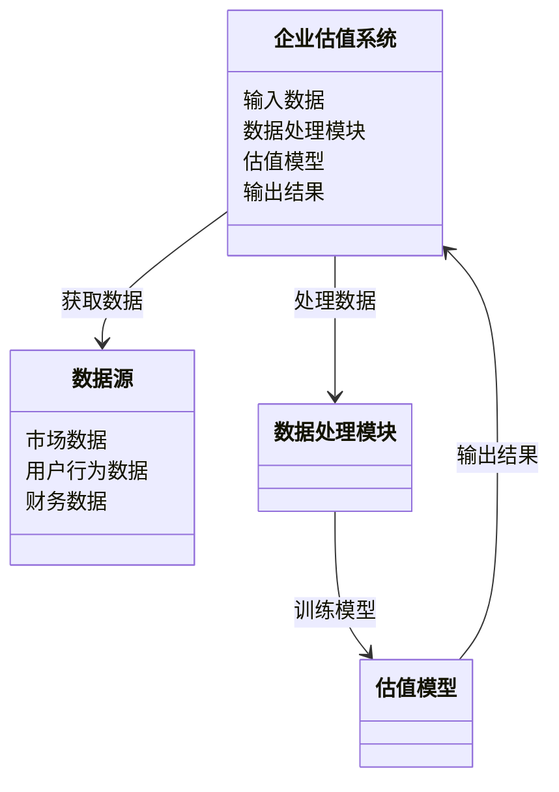
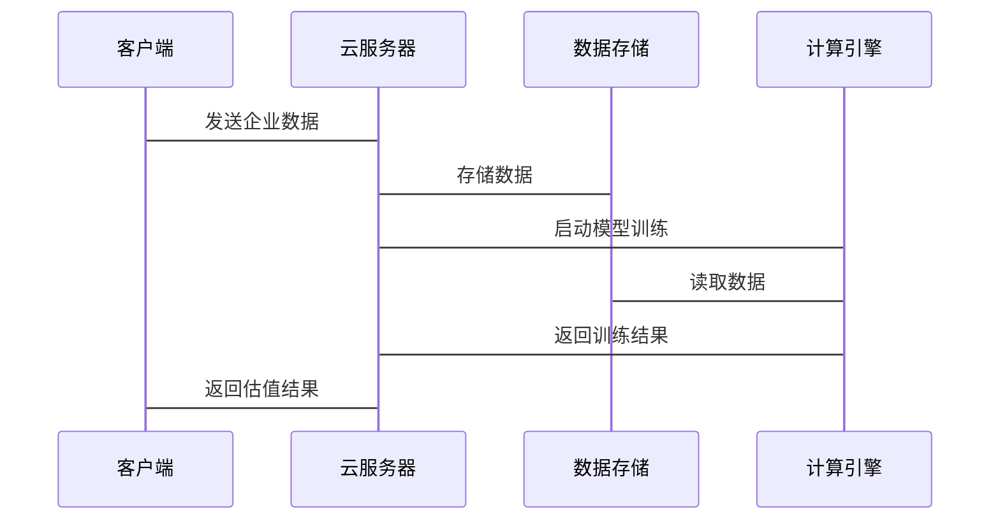

                 


# 企业估值中的云游戏技术应用评估

> 关键词：云游戏技术，企业估值，技术应用评估，机器学习，大数据分析，企业价值预测

> 摘要：本文探讨了云游戏技术在企业估值中的应用，详细分析了云游戏技术的基本原理及其在企业价值评估中的创新应用。通过结合大数据分析和机器学习算法，本文提出了基于云游戏技术的企业估值模型，并通过实际案例展示了该模型的应用效果。文章还详细介绍了系统的架构设计和实现过程，为读者提供了一个全面的技术指南。

---

# 正文

## 第一部分: 企业估值中的云游戏技术应用背景

### 第1章: 云游戏技术与企业估值概述

#### 1.1 云游戏技术的定义与现状
##### 1.1.1 云游戏技术的定义
云游戏技术是一种基于云计算的游戏运行和分发技术，通过将游戏的运算和渲染过程迁移到云端服务器，用户只需通过终端设备（如手机、PC或专用设备）即可体验高质量的游戏。其核心在于将高性能计算任务转移到云端，利用网络传输游戏画面和操作指令，从而降低了对终端设备性能的需求。

##### 1.1.2 云游戏技术的发展现状
近年来，随着5G网络的普及和云计算技术的成熟，云游戏技术得到了快速发展。主要厂商如谷歌、微软和索尼都推出了各自的云游戏平台，推动了云游戏技术的商业化应用。与此同时，云游戏技术在企业级应用中的潜力也开始显现。

##### 1.1.3 云游戏技术在企业估值中的作用
在企业估值领域，云游戏技术可以通过实时数据处理和高性能计算，提供更精准的企业价值评估。通过分析企业的实时运营数据、市场表现和用户反馈，云游戏技术能够构建动态的企业估值模型，帮助投资者做出更明智的决策。

#### 1.2 企业估值的基本概念
##### 1.2.1 企业估值的定义
企业估值是指通过对企业的财务数据、市场地位、竞争优势等多方面因素的综合分析，确定企业价值的过程。传统的企业估值方法通常依赖于历史数据和静态分析，而云游戏技术的引入为动态评估提供了新的可能性。

##### 1.2.2 企业估值的主要方法
- **收益法**：基于企业的未来收益预测其价值。
- **市场法**：通过对比类似企业的市场交易价格进行估值。
- **资产基础法**：基于企业的资产净值进行评估。

##### 1.2.3 云游戏技术在企业估值中的创新应用
云游戏技术通过实时数据分析和高性能计算，可以动态调整企业估值模型的参数，使其更贴近企业的实际运营状况。例如，通过实时监控企业的市场反应和用户行为数据，云游戏技术可以提供更及时和准确的估值结果。

#### 1.3 云游戏技术与企业估值的结合背景
##### 1.3.1 云游戏技术的特点与优势
- **高并发处理能力**：能够同时处理大量用户的请求。
- **低延迟要求**：确保用户操作的实时性。
- **高可用性**：通过分布式架构保证服务的稳定性。

##### 1.3.2 企业估值中的技术需求
企业在估值过程中需要处理大量的动态数据，包括市场波动、用户行为、财务指标等。这些数据的实时处理和分析对传统的技术手段提出了挑战。

##### 1.3.3 云游戏技术如何满足企业估值需求
通过将企业的估值模型部署在云端，云游戏技术能够实时获取和处理企业的动态数据，提供更精准和及时的估值结果。同时，云游戏技术的高并发处理能力也为多维度的数据分析提供了支持。

#### 1.4 本章小结
本章介绍了云游戏技术的基本概念及其在企业估值中的作用，分析了企业估值的主要方法和云游戏技术的特点。通过这些内容，我们可以理解云游戏技术如何为企业的动态估值提供新的解决方案。

---

## 第二部分: 云游戏技术的核心概念与实现原理

### 第2章: 云游戏技术的核心概念

#### 2.1 云游戏技术的架构与实现
##### 2.1.1 云游戏的分层架构
云游戏的架构通常分为以下几个层次：
1. **客户端层**：负责接收用户的输入并发送到服务器。
2. **网络层**：负责数据的传输和路由。
3. **云端计算层**：负责游戏的渲染和逻辑运算。
4. **内容分发层**：负责游戏资源的存储和分发。

##### 2.1.2 云游戏的核心技术模块
- **图形渲染引擎**：负责将游戏画面渲染成视频流。
- **网络传输协议**：确保数据的实时传输和低延迟。
- **负载均衡系统**：动态分配计算资源，保证服务的稳定性。

##### 2.1.3 云游戏的实现机制
云游戏的核心实现机制包括：
- **实时渲染**：将游戏画面实时渲染成视频流，通过网络传输给客户端。
- **输入捕捉**：捕捉用户的操作输入，并将其传输到云端进行处理。
- **动态调整**：根据网络状况和用户设备性能，动态调整游戏的画质和操作响应速度。

##### 2.1.4 云游戏技术的优缺点分析
| 优点 | 缺点 |
|------|------|
| 高并发处理能力 | 依赖网络传输，网络延迟可能影响体验 |
| 低延迟要求 | 服务器资源消耗大，成本较高 |
| 高可用性 | 对网络条件要求较高 |

#### 2.2 云游戏技术的关键特性
##### 2.2.1 高并发处理能力
云游戏技术能够同时支持大量用户的并发请求，这对于企业估值中的实时数据分析尤为重要。

##### 2.2.2 低延迟要求
低延迟确保了用户的操作能够实时反馈，这对于需要实时处理企业动态数据的估值模型至关重要。

##### 2.2.3 高可用性
通过分布式架构和负载均衡技术，云游戏技术能够保证服务的高可用性，避免因单点故障导致的服务中断。

#### 2.3 云游戏技术与传统游戏技术的对比
##### 2.3.1 传统游戏技术的特点
- 依赖终端设备的高性能计算。
- 游戏画面渲染在本地完成。
- 对网络条件要求较低，但对终端设备性能要求较高。

##### 2.3.2 云游戏技术的创新点
- 将高性能计算任务转移到云端，降低了对终端设备的要求。
- 实时数据传输和处理，支持更复杂的动态分析。

##### 2.3.3 云游戏技术的优缺点分析
| 优点 | 缺点 |
|------|------|
| 降低了终端设备的要求 | 网络延迟可能影响用户体验 |
| 支持实时数据分析 | 服务器资源消耗大，成本较高 |

#### 2.4 本章小结
本章详细介绍了云游戏技术的核心概念，包括其架构、实现机制和关键特性。通过与传统游戏技术的对比，我们进一步理解了云游戏技术的独特优势和挑战。

---

## 第三部分: 云游戏技术在企业估值中的应用原理

### 第3章: 云游戏技术评估企业价值的原理

#### 3.1 云游戏技术在企业估值中的应用流程
##### 3.1.1 数据采集与处理
通过云游戏平台实时采集企业的运营数据，包括市场表现、用户行为、财务指标等。

##### 3.1.2 模型构建与训练
基于机器学习算法，构建企业价值评估模型，对采集的数据进行训练和优化。

##### 3.1.3 估值计算与输出
通过模型计算企业的实时估值，并将结果返回给用户。

#### 3.2 基于云游戏技术的企业估值模型
##### 3.2.1 模型的输入与输出
- **输入**：企业的动态数据，包括市场波动、用户行为、财务指标等。
- **输出**：企业的实时估值和相关分析报告。

##### 3.2.2 估值模型的构建过程
1. **数据预处理**：对采集的数据进行清洗和特征提取。
2. **特征选择**：通过机器学习算法选择对估值影响较大的特征。
3. **模型训练**：使用监督学习算法（如随机森林、神经网络）对数据进行训练。
4. **模型优化**：通过交叉验证和超参数调优优化模型性能。
5. **模型部署**：将训练好的模型部署到云端，进行实时估值计算。

##### 3.2.3 估值模型的数学公式
企业价值的预测可以通过回归模型进行：
$$
\text{Value} = \beta_0 + \beta_1 \times \text{Revenue} + \beta_2 \times \text{Net Profit} + \epsilon
$$
其中，$\beta_0$、$\beta_1$、$\beta_2$为回归系数，$\epsilon$为误差项。

##### 3.2.4 估值模型的优化与验证
通过历史数据验证模型的准确性，并根据实际应用中的反馈不断优化模型。

#### 3.3 云游戏技术在企业估值中的优势
##### 3.3.1 实时数据处理能力
云游戏技术能够实时处理企业的动态数据，提供更及时的估值结果。

##### 3.3.2 高性能计算能力
通过云端的高性能计算资源，云游戏技术可以支持复杂的估值模型和算法。

##### 3.3.3 多维度数据分析
云游戏技术能够整合企业的多维度数据，包括市场、财务和用户行为数据，提供更全面的估值分析。

#### 3.4 本章小结
本章详细介绍了云游戏技术在企业估值中的应用流程和模型构建过程，分析了其在实时数据处理、高性能计算和多维度数据分析方面的优势。

---

## 第四部分: 云游戏技术的系统架构设计

### 第4章: 系统架构与实现

#### 4.1 问题场景介绍
企业在估值过程中需要处理大量的动态数据，包括市场波动、用户行为和财务指标等。传统的估值方法通常依赖静态数据和历史分析，无法满足实时动态评估的需求。

#### 4.2 项目介绍
本项目旨在通过云游戏技术构建一个实时企业估值系统，实现对企业价值的动态评估。系统将基于机器学习算法，结合企业的实时数据，提供精准的估值结果。

#### 4.3 系统功能设计
##### 4.3.1 领域模型设计


##### 4.3.2 系统架构设计


##### 4.3.3 系统接口设计
- **输入接口**：接收企业的动态数据。
- **输出接口**：返回企业的实时估值结果。
- **管理接口**：用于模型的训练和优化。

##### 4.3.4 系统交互设计


#### 4.4 本章小结
本章通过系统架构设计展示了如何将云游戏技术应用于企业估值系统中，包括系统的功能模块、架构设计和交互流程。

---

## 第五部分: 项目实战

### 第5章: 云游戏技术的企业估值系统实现

#### 5.1 环境安装
为了实现基于云游戏技术的企业估值系统，需要以下环境：
- **云服务器**：用于部署估值模型和计算引擎。
- **数据存储**：用于存储企业的动态数据。
- **开发工具**：如Python、TensorFlow、Flask等。

#### 5.2 系统核心实现源代码
##### 5.2.1 数据预处理代码
```python
import pandas as pd

def preprocess_data(data):
    # 假设data是一个Pandas DataFrame
    # 进行数据清洗和特征提取
    data.dropna(inplace=True)
    data['date'] = pd.to_datetime(data['date'])
    return data
```

##### 5.2.2 模型训练代码
```python
import tensorflow as tf
from tensorflow.keras import layers

model = tf.keras.Sequential([
    layers.Dense(64, activation='relu'),
    layers.Dense(1, activation='linear')
])
model.compile(optimizer='adam', loss='mean_squared_error')
model.fit(X_train, y_train, epochs=100, batch_size=32)
```

##### 5.2.3 实时估值代码
```python
import requests

def calculate_value(company_id):
    # 发送请求到云服务器
    response = requests.post('http://云服务器地址/estimate', json={'id': company_id})
    return response.json()['value']
```

#### 5.3 代码应用解读与分析
通过上述代码，我们可以看到系统的核心功能包括数据预处理、模型训练和实时估值。数据预处理模块负责清洗和转换数据，模型训练模块基于机器学习算法构建估值模型，实时估值模块通过调用云服务器上的模型进行预测。

#### 5.4 实际案例分析
假设我们有一个企业，其市场数据、用户行为数据和财务数据如下：
| 日期 | 收入 | 利润 | 用户数 |
|------|------|------|--------|
| 2023-10-01 | 100万 | 20万 | 1000 |
| 2023-10-02 | 120万 | 25万 | 1200 |
| 2023-10-03 | 150万 | 30万 | 1500 |

通过上述数据，我们可以训练一个简单的线性回归模型：
$$
\text{Value} = \beta_0 + \beta_1 \times \text{Revenue} + \beta_2 \times \text{Profit} + \epsilon
$$

经过训练，假设我们得到 $\beta_0 = 50$，$\beta_1 = 0.8$，$\beta_2 = 0.5$，那么对于2023-10-03的数据，企业的估值为：
$$
\text{Value} = 50 + 0.8 \times 150 + 0.5 \times 30 = 50 + 120 + 15 = 185
$$

#### 5.5 项目总结
本项目通过基于云游戏技术的企业估值系统，展示了如何利用实时数据和机器学习算法进行动态估值。系统的实现过程包括数据预处理、模型训练和实时估值，为企业的动态价值评估提供了新的解决方案。

---

## 第六部分: 最佳实践

### 第6章: 云游戏技术应用中的最佳实践

#### 6.1 小结
通过本文的介绍，我们了解了云游戏技术在企业估值中的应用，包括其核心概念、算法原理和系统架构设计。云游戏技术通过实时数据处理和高性能计算，为企业的动态估值提供了新的可能性。

#### 6.2 注意事项
- **数据隐私**：在处理企业的敏感数据时，需要注意数据的隐私保护。
- **网络延迟**：网络条件可能影响系统的实时性，需要采取措施减少延迟。
- **模型优化**：需要不断优化模型的性能，提高估值的准确性。

#### 6.3 未来展望
随着云计算和人工智能技术的进一步发展，云游戏技术在企业估值中的应用将更加广泛。未来的研究可以集中在以下几个方面：
- 更高效的模型训练方法。
- 更低延迟的数据传输技术。
- 更智能化的数据分析工具。

#### 6.4 拓展阅读
- 《云游戏技术与大数据分析》
- 《企业估值中的机器学习应用》
- 《高性能计算在金融领域的应用》

---

## 结语

通过本文的介绍，我们深入探讨了云游戏技术在企业估值中的应用，从理论到实践，详细展示了如何利用云游戏技术构建实时企业估值系统。希望本文能够为读者提供有价值的参考和启发。

---

## 作者

**作者：AI天才研究院/AI Genius Institute & 禅与计算机程序设计艺术/Zen And The Art of Computer Programming**

