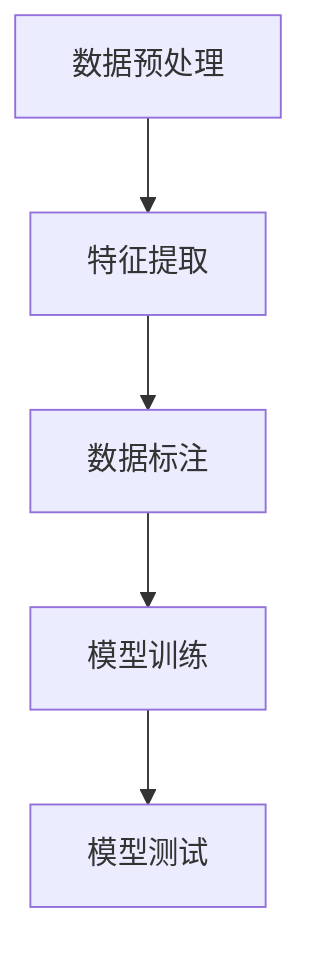
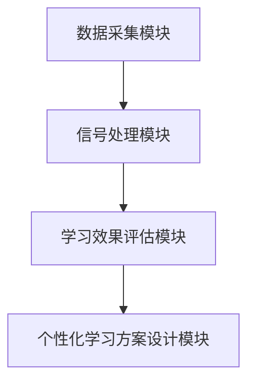
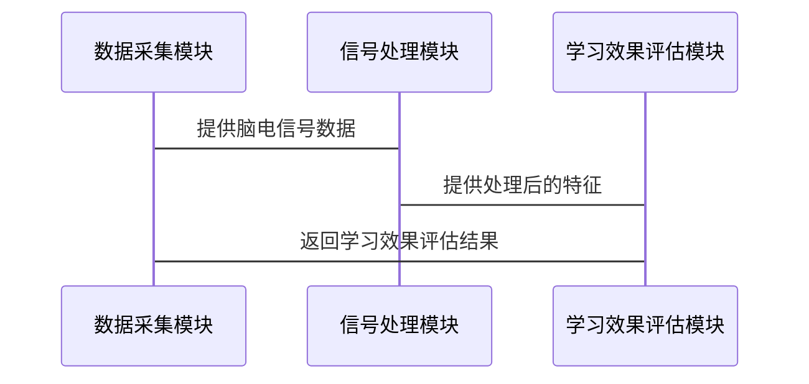

                 


# 巴菲特-芒格的脑机接口教育应用投资：认知增强的新范式

## 关键词
- 巴菲特, 芒格, 脑机接口, 教育应用, 认知增强, 投资决策, 人工智能

## 摘要
本文深入探讨了巴菲特和芒格的投资理念与脑机接口（BCI）技术在教育应用中的结合，揭示了认知增强的新范式。通过分析脑机接口的核心技术、算法原理及其在教育中的应用场景，本文为投资者提供了认知增强的新视角，并展示了如何将脑机接口技术应用于投资决策优化。

---

# 第一部分: 背景介绍

## 第1章: 巴菲特-芒格的脑机接口教育应用投资概述

### 1.1 脑机接口技术的概述
#### 1.1.1 脑机接口的基本概念
脑机接口（BCI）是一种通过技术手段直接连接人脑与外部设备的系统，能够实时捕捉和解析脑电信号，实现人与计算机之间的直接交互。脑机接口的核心在于信号处理和机器学习算法的应用。

#### 1.1.2 脑机接口的历史发展
脑机接口技术起源于20世纪60年代，经历了从实验室研究到实际应用的漫长过程。近年来，随着人工智能和神经科学的进步，脑机接口在医疗、教育和娱乐等领域得到了广泛应用。

#### 1.1.3 脑机接口在教育中的应用潜力
在教育领域，脑机接口技术可以通过实时监测学生的脑电信号，分析其注意力和情绪状态，从而提供个性化的学习方案和反馈机制。这种技术能够显著提升学习效率和教育体验。

### 1.2 巴菲特和芒格的投资理念
#### 1.2.1 巴菲特的价值投资理论
巴菲特的价值投资理论强调长期投资、基本面分析和安全边际。他认为投资者应关注企业的内在价值，而非市场的短期波动。

#### 1.2.2 芒格的多元思维模型
芒格的多元思维模型强调通过多学科的知识框架来分析问题，避免单一视角的局限性。他认为投资者应具备广泛的知识储备，以做出更明智的决策。

#### 1.2.3 两人投资理念的结合
巴菲特和芒格的投资理念共同强调长期价值、基本面分析和多学科思维。这种结合为脑机接口技术的投资提供了独特的视角。

### 1.3 脑机接口与教育应用的结合
#### 1.3.1 教育领域的认知增强需求
教育领域对认知增强的需求日益增长，学生和教师都需要更高效的学习和教学方法。脑机接口技术能够满足这一需求，提供个性化的认知增强工具。

#### 1.3.2 脑机接口在教育中的应用场景
脑机接口技术可以应用于学习效果评估、个性化学习方案设计和情绪管理等领域。通过实时监测学生的脑电信号，教育系统可以动态调整教学内容和节奏。

#### 1.3.3 巴菲特-芒格投资理念与脑机接口的契合点
巴菲特和芒格的投资理念强调长期价值和多学科思维，这与脑机接口技术的长期发展潜力和跨学科应用高度契合。脑机接口技术的投资具有较高的长期回报潜力。

### 1.4 本章小结
本章通过介绍脑机接口的基本概念、历史发展及其在教育中的应用潜力，揭示了巴菲特和芒格投资理念与脑机接口技术的契合点。脑机接口技术在教育中的应用为认知增强提供了新的可能性，也为投资者带来了新的投资机会。

---

# 第二部分: 核心概念与联系

## 第2章: 脑机接口的核心技术与教育应用

### 2.1 脑机接口的核心技术
#### 2.1.1 脑电信号采集与处理
脑电信号采集是脑机接口技术的核心环节。常用的采集方法包括 EEG（脑电图）和 EMG（肌电图）等。信号采集后需要进行预处理，包括滤波、去噪和特征提取。

#### 2.1.2 信号特征提取与分类算法
脑电信号的特征提取和分类算法是脑机接口技术的关键。常用的特征包括频域特征（如功率谱密度）和时域特征（如波形形态）。分类算法包括传统的机器学习方法（如 SVM）和深度学习方法（如 CNN）。

#### 2.1.3 机器学习在脑机接口中的应用
机器学习算法在脑机接口中的应用主要体现在信号分类和模式识别。通过训练模型，系统可以识别特定的脑电信号模式，并将其转化为控制指令。

### 2.2 教育应用中的脑机接口技术
#### 2.2.1 基于脑机接口的学习效果评估
通过监测学生的脑电信号，可以评估其注意力集中程度和情绪状态，从而判断学习效果。这种评估方法比传统的考试评估更为客观和实时。

#### 2.2.2 脑机接口辅助学习工具的设计
脑机接口技术可以设计出个性化的学习工具，根据学生的脑电信号动态调整教学内容和节奏，从而提高学习效率。

#### 2.2.3 脑机接口在个性化教育中的应用
脑机接口技术能够识别每个学生的认知特点和学习风格，从而提供个性化的教育方案。这种个性化教育能够显著提升学生的学习效果。

### 2.3 脑机接口与投资决策的联系
#### 2.3.1 脑机接口在投资决策中的潜在应用
脑机接口技术可以应用于投资决策的辅助工具设计。通过监测投资者的脑电信号，可以实时评估其情绪状态和决策倾向，从而优化投资决策。

#### 2.3.2 巴菲特-芒格投资理念与脑机接口技术的结合
巴菲特和芒格的投资理念强调长期价值和多学科思维，这与脑机接口技术的长期发展潜力和跨学科应用高度契合。脑机接口技术的投资具有较高的长期回报潜力。

#### 2.3.3 脑机接口技术对投资决策的优化作用
脑机接口技术可以帮助投资者更好地理解和预测市场趋势，优化投资决策。通过实时监测投资者的脑电信号，可以识别潜在的投资机会和风险。

### 2.4 本章小结
本章详细介绍了脑机接口的核心技术及其在教育和投资中的应用。脑机接口技术在教育中的应用为认知增强提供了新的可能性，也为投资者带来了新的投资机会。通过结合巴菲特和芒格的投资理念，脑机接口技术的投资具有较高的长期回报潜力。

---

# 第三部分: 算法原理讲解

## 第3章: 脑机接口的核心算法分析

### 3.1 脑电信号处理算法
#### 3.1.1 常见的脑电信号处理方法
脑电信号处理方法包括滤波、去噪、特征提取和分类。常用的滤波方法有 Butterworth 滤波器和 Chebyshev 滤波器。去噪方法包括基于经验模态分解（EMD）和小波变换（WT）的方法。

#### 3.1.2 基于机器学习的信号分类算法
基于机器学习的信号分类算法包括 SVM、随机森林（RF）和 K-近邻（KNN）等方法。这些算法可以通过训练数据集学习脑电信号的特征，并将其分类为不同的状态。

#### 3.1.3 深度学习在脑电信号分析中的应用
深度学习在脑电信号分析中的应用主要体现在卷积神经网络（CNN）和长短期记忆网络（LSTM）的应用。CNN可以提取脑电信号的时空特征，而 LSTM 则可以捕捉信号的时间依赖性。

#### 3.1.4 脑电信号分类算法的实现步骤
1. 数据预处理：包括滤波、去噪和分割。
2. 特征提取：提取脑电信号的时域和频域特征。
3. 数据标注：将信号分为不同的类别。
4. 模型训练：使用训练数据训练分类模型。
5. 模型测试：在测试数据上验证模型的性能。

#### 3.1.5 使用 Mermaid 绘制脑电信号分类流程图


#### 3.1.6 使用 Python 实现脑电信号分类
```python
import numpy as np
from sklearn.svm import SVC
from sklearn.metrics import accuracy_score

# 数据预处理
def preprocess_data(data):
    # 这里可以添加滤波和去噪的代码
    return data

# 特征提取
def extract_features(data):
    # 这里可以添加特征提取的代码
    return features

# 数据标注
labels = np.array([0, 1, 0, 1, 0, 1])  # 示例标签

# 模型训练
model = SVC()
model.fit(extracted_features, labels)

# 模型测试
test_data = preprocess_data(new_data)
test_features = extract_features(test_data)
predictions = model.predict(test_features)
print("准确率:", accuracy_score(test_labels, predictions))
```

#### 3.1.7 脑电信号分类算法的数学模型
常用的脑电信号分类算法包括支持向量机（SVM）和随机森林（RF）。SVM 的数学模型如下：
$$ \text{SVM 的目标是最小化 hinge loss} $$

随机森林的数学模型如下：
$$ \text{随机森林是多个决策树的集成模型} $$

### 3.2 投资决策算法
#### 3.2.1 巴菲特-芒格投资模型的算法框架
巴菲特-芒格投资模型的算法框架包括基本面分析、安全边际评估和长期价值判断。模型的实现步骤如下：
1. 选择具有长期增长潜力的公司。
2. 分析公司的财务状况和竞争优势。
3. 评估公司的安全边际。
4. 做出投资决策。

#### 3.2.2 基于脑机接口的投资决策优化算法
基于脑机接口的投资决策优化算法通过实时监测投资者的脑电信号，优化投资决策。算法的实现步骤如下：
1. 数据采集：采集投资者的脑电信号。
2. 信号处理：对信号进行预处理和特征提取。
3. 模型训练：训练分类模型以识别投资者的情绪和决策倾向。
4. 投资决策优化：根据模型输出的结果优化投资策略。

#### 3.2.3 算法的优缺点分析
脑机接口技术在投资决策中的应用具有较高的潜力，但也面临一些挑战。优点包括实时性和个性化，缺点包括技术复杂性和数据隐私问题。

### 3.3 算法的数学模型与公式
#### 3.3.1 脑电信号分类
常用的脑电信号分类算法包括支持向量机（SVM）和随机森林（RF）。SVM 的数学模型如下：
$$ \text{SVM 的目标是最小化 hinge loss} $$

随机森林的数学模型如下：
$$ \text{随机森林是多个决策树的集成模型} $$

#### 3.3.2 投资决策优化
投资决策优化的数学模型可以通过回归分析或时间序列分析来实现。例如，使用多元回归模型预测股票价格：
$$ y = \beta_0 + \beta_1 x_1 + \beta_2 x_2 + \ldots + \beta_n x_n + \epsilon $$

---

# 第四部分: 系统分析与架构设计

## 第4章: 系统分析与架构设计

### 4.1 问题场景介绍
本章以一个脑机接口教育应用系统为例，介绍系统分析与架构设计的过程。

### 4.2 项目介绍
本项目旨在开发一个基于脑机接口的教育应用系统，用于实时监测学生的学习状态并提供个性化的学习方案。

### 4.3 系统功能设计
系统功能设计包括数据采集、信号处理、学习效果评估和个性化学习方案设计。

#### 4.3.1 数据采集模块
数据采集模块负责采集学生的脑电信号。采集方法包括 EEG 和 EMG。

#### 4.3.2 信号处理模块
信号处理模块包括预处理、特征提取和分类算法。预处理步骤包括滤波和去噪，特征提取步骤包括时域和频域特征提取，分类算法包括 SVM 和随机森林。

#### 4.3.3 学习效果评估模块
学习效果评估模块根据学生的脑电信号评估其注意力集中程度和情绪状态，从而判断学习效果。

#### 4.3.4 个性化学习方案设计模块
个性化学习方案设计模块根据评估结果动态调整教学内容和节奏，提供个性化的学习方案。

### 4.4 系统架构设计
系统架构设计包括数据采集模块、信号处理模块、学习效果评估模块和个性化学习方案设计模块。各模块之间的关系可以通过 Mermaid 架构图表示。

#### 4.4.1 系统架构图


### 4.5 系统接口设计
系统接口设计包括数据采集接口、信号处理接口和学习效果评估接口。各接口之间的交互可以通过 Mermaid 序列图表示。

#### 4.5.1 系统交互流程图


### 4.6 本章小结
本章通过系统分析与架构设计，介绍了脑机接口教育应用系统的实现过程。系统功能设计和架构设计为后续的开发提供了清晰的指导。

---

# 第五部分: 项目实战

## 第5章: 项目实战

### 5.1 环境安装
#### 5.1.1 安装 Python 和相关库
安装 Python 和必要的库，如 numpy、scikit-learn 和 matplotlib。

#### 5.1.2 安装 EEG 采集设备
安装 EEG 采集设备并配置相关软件。

### 5.2 系统核心实现
#### 5.2.1 数据采集模块实现
编写代码实现 EEG 数据的采集和预处理。

#### 5.2.2 信号处理模块实现
编写代码实现信号的特征提取和分类算法。

#### 5.2.3 学习效果评估模块实现
编写代码实现学习效果的评估和个性化学习方案的设计。

### 5.3 代码应用解读与分析
#### 5.3.1 数据采集模块代码
```python
import numpy as np
import eeglib

def preprocess_data(data):
    # 这里可以添加滤波和去噪的代码
    return data
```

#### 5.3.2 信号处理模块代码
```python
from sklearn.svm import SVC
from sklearn.metrics import accuracy_score

def extract_features(data):
    # 这里可以添加特征提取的代码
    return features

model = SVC()
model.fit(extracted_features, labels)
```

#### 5.3.3 学习效果评估模块代码
```python
def assess_learning_effectiveness(data):
    # 这里可以添加学习效果评估的代码
    return effectiveness
```

### 5.4 实际案例分析
#### 5.4.1 案例背景
介绍一个实际案例，例如一个学生在学习过程中使用脑机接口技术进行实时监测和评估。

#### 5.4.2 数据采集与处理
描述数据采集和处理的过程，包括 EEG 信号的采集、预处理和特征提取。

#### 5.4.3 学习效果评估与个性化学习方案设计
根据评估结果动态调整教学内容和节奏，提供个性化的学习方案。

#### 5.4.4 结果分析
分析结果，评估脑机接口技术在教育中的实际应用效果。

### 5.5 项目小结
本章通过实际案例分析，展示了脑机接口技术在教育中的实际应用效果。项目实现了数据采集、信号处理和学习效果评估等功能，为未来的开发提供了宝贵的实践经验。

---

# 第六部分: 最佳实践与小结

## 第6章: 最佳实践与小结

### 6.1 最佳实践
#### 6.1.1抽丝剥茧般的技术分析
在技术实现过程中，需要注意 EEG 信号的采集质量、特征提取的有效性和分类算法的准确性。

#### 6.1.2 投资决策优化中的注意事项
在投资决策优化中，需要注意数据隐私和模型的实时性。

#### 6.1.3 系统设计中的关键点
在系统设计中，需要注意模块之间的耦合性和系统的可扩展性。

### 6.2 小结
本章总结了全文的主要内容，强调了脑机接口技术在教育中的应用潜力和投资价值。通过结合巴菲特和芒格的投资理念，脑机接口技术的投资具有较高的长期回报潜力。

### 6.3 投资建议
基于脑机接口技术的长期发展潜力，建议投资者关注相关领域的技术创新和市场应用。

### 6.4 注意事项
在实际应用中，需要注意数据隐私和技术可行性问题，避免技术滥用和隐私泄露。

### 6.5 拓展阅读
建议读者进一步阅读相关领域的文献，了解脑机接口技术的最新进展和应用案例。

---

# 作者

**作者：AI天才研究院 & 禅与计算机程序设计艺术**

---

本文通过详细分析脑机接口技术的核心原理、算法实现及其在教育和投资中的应用，揭示了认知增强的新范式。通过结合巴菲特和芒格的投资理念，本文为投资者提供了认知增强的新视角，并展示了如何将脑机接口技术应用于投资决策优化。

