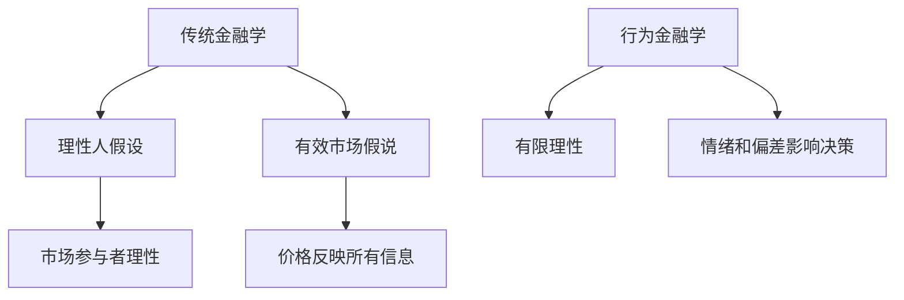
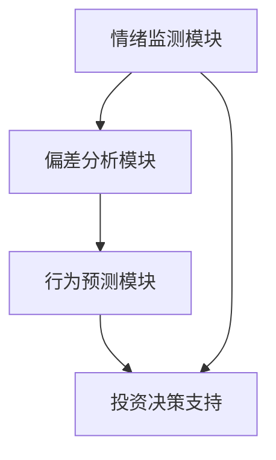

                 


# 巴菲特的行为金融学应用：元宇宙中的群体投资心理

> 关键词：巴菲特，行为金融学，群体投资心理，元宇宙，认知偏差，价值投资

> 摘要：本文将探讨巴菲特的投资理念与行为金融学的结合，特别是在元宇宙中的群体投资心理。通过分析认知偏差、群体决策和市场情绪，本文揭示了巴菲特如何利用行为金融学原理在虚拟经济环境中做出明智的投资决策。

---

# 第一部分: 巴菲特的行为金融学应用基础

## 第1章: 行为金融学与巴菲特投资理念概述

### 1.1 行为金融学的基本概念

#### 1.1.1 行为金融学的定义
行为金融学（Behavioral Finance）是研究投资者心理和行为如何影响金融市场决策的学科。它结合了心理学、经济学和社会学的原理，试图解释实际市场中的非理性行为。

#### 1.1.2 行为金融学的核心假设
行为金融学假设市场参与者是有限理性的，并且会受到心理偏差和情绪的影响，这些因素会导致市场定价和交易决策偏离理性预期。

#### 1.1.3 行为金融学与传统金融学的区别
传统金融学基于“理性人假设”，即市场参与者都是理性的，能够根据信息做出最优决策。而行为金融学则关注市场的非理性行为，认为情绪和认知偏差会影响投资决策。



### 1.2 巴菲特投资理念的核心要素

#### 1.2.1 巴菲特的价值投资理论
巴菲特的价值投资理论强调购买具有内在价值的股票，并长期持有。他认为市场波动和短期价格变化不应影响长期投资决策。

#### 1.2.2 巴菲特的长期投资策略
巴菲特倡导长期投资，避免频繁交易，以减少交易成本和情绪干扰。他相信时间是优秀投资的盟友。

#### 1.2.3 巴菲特的市场逆向思维
巴菲特逆向投资的策略是在市场恐慌时买入，在市场狂热时卖出。这种策略与行为金融学中的“反身性”理论一致。

### 1.3 元宇宙中的群体投资心理

#### 1.3.1 元宇宙的定义与特征
元宇宙是一个虚拟的三维空间，用户可以通过虚拟现实技术进入其中，进行社交、娱乐和经济活动。元宇宙中的经济体系与现实世界相似，但更加虚拟化。

#### 1.3.2 元宇宙中的投资行为特点
在元宇宙中，投资行为受到虚拟环境的影响，投资者可能会因为虚拟身份认同和虚拟财富的概念而产生不同的投资决策。

#### 1.3.3 元宇宙中的群体心理与投资决策
在元宇宙中，群体心理通过社交网络和虚拟环境传播，影响投资者的情绪和决策。这种影响可能比现实世界更加迅速和放大。

---

## 第2章: 巴菲特投资理念的行为金融学解释

### 2.1 行为金融学中的认知偏差

#### 2.1.1 简单启发式偏差
投资者倾向于使用简单的规则或启发式来做出决策，而不是进行复杂的计算。这种偏差可能导致错误的判断。

#### 2.1.2 过度自信偏差
投资者往往过于自信，认为自己能够预测市场走势，从而做出过度自信的投资决策。

#### 2.1.3 框架效应
投资者对同一信息在不同框架下的反应不同。例如，相同的收益可以用“利润”或“损失”来描述，影响投资者的决策。

### 2.2 巴菲特投资决策中的行为特征

#### 2.2.1 巴菲特的保守决策风格
巴菲特倾向于保守决策，避免高风险投资。这种风格与行为金融学中的风险厌恶理论一致。

#### 2.2.2 巴菲特对市场情绪的逆向利用
巴菲特能够在市场恐慌时买入，在市场狂热时卖出，这种逆向投资策略利用了市场的非理性情绪。

#### 2.2.3 巴菲特对价值的长期关注
巴菲特注重公司的内在价值，而非短期市场波动。这种长期视角与行为金融学中的时间偏好理论相关。

### 2.3 巴菲特与行为金融学的结合

#### 2.3.1 巴菲特投资理念中的行为因素
巴菲特的投资理念中包含了许多行为金融学的核心思想，例如认知偏差、情绪影响和群体心理。

#### 2.3.2 行为金融学对巴菲特投资策略的解释
行为金融学能够解释巴菲特为什么能够在市场波动中保持冷静，利用认知偏差和群体心理做出正确决策。

#### 2.3.3 巴菲特与行为金融学的异同点
尽管巴菲特的投资理念与行为金融学有相似之处，但他更注重基本面分析和长期价值，而行为金融学更关注市场的非理性行为。

---

## 第3章: 元宇宙中的群体投资心理分析

### 3.1 元宇宙中的投资环境特点

#### 3.1.1 元宇宙的虚拟经济体系
元宇宙中的经济体系包括虚拟货币、数字资产和虚拟商品，这些资产的交易和价值变化与现实世界相似，但也存在差异。

#### 3.1.2 元宇宙中的投资行为特点
在元宇宙中，投资者可能更加情绪化，因为虚拟环境更容易引发情感共鸣。此外，虚拟身份认同可能影响投资决策。

#### 3.1.3 元宇宙中的群体心理与投资决策
在元宇宙中，群体心理通过虚拟社交网络迅速传播，影响投资者的情绪和决策。这种影响可能比现实世界更加显著。

### 3.2 元宇宙中的投资心理算法模型

#### 3.2.1 投资情绪的传播模型
通过社交网络分析，可以建模情绪的传播过程，理解群体心理对投资决策的影响。

#### 3.2.2 投资决策的偏差模型
利用认知偏差理论，可以预测投资者在元宇宙中的决策偏差，例如过度自信和框架效应。

#### 3.2.3 投资行为的预测模型
通过机器学习算法，可以预测投资者在元宇宙中的投资行为，帮助投资者做出更理性的决策。

### 3.3 元宇宙中的投资心理案例分析

#### 3.3.1 虚拟货币市场的波动
虚拟货币市场的波动性极高，投资者容易受到市场情绪的影响，导致非理性决策。

#### 3.3.2 数字资产的估值偏差
投资者在评估数字资产时，可能因为认知偏差而高估其价值，导致泡沫的形成。

#### 3.3.3 虚拟社交网络的影响
虚拟社交网络中的信息传播可能加剧投资者的乐观或悲观情绪，影响投资决策。

---

## 第4章: 元宇宙中的群体投资心理算法实现

### 4.1 投资情绪的传播算法

#### 4.1.1 社交网络分析
通过分析社交网络中的信息传播，可以预测情绪的传播速度和范围。

#### 4.1.2 情感分析
利用自然语言处理技术，分析文本中的情感倾向，预测市场情绪的变化。

#### 4.1.3 情绪传播模型
构建情绪传播模型，模拟情绪在社交网络中的扩散过程。

### 4.2 投资决策偏差的预测算法

#### 4.2.1 认知偏差识别
通过分析投资者的行为模式，识别其存在的认知偏差。

#### 4.2.2 偏差预测模型
利用机器学习算法，预测投资者在特定情境下的决策偏差。

#### 4.2.3 偏差校正策略
根据预测结果，制定偏差校正策略，帮助投资者做出更理性的决策。

### 4.3 投资行为预测模型

#### 4.3.1 数据收集
收集投资者的历史交易数据和市场数据。

#### 4.3.2 特征提取
提取投资者的行为特征，例如交易频率、交易金额和交易时间。

#### 4.3.3 模型训练
使用机器学习算法，训练投资行为预测模型。

#### 4.3.4 模型评估
评估模型的准确性和稳定性，优化模型性能。

---

## 第5章: 元宇宙中的投资心理数学模型

### 5.1 投资情绪传播的数学模型

#### 5.1.1 情绪传播方程
$$ S(t+1) = \alpha S(t) + (1-\alpha)I(t) $$

其中，$S(t)$ 表示第 $t$ 时刻的情绪强度，$\alpha$ 是情绪衰减系数，$I(t)$ 是信息影响。

#### 5.1.2 情绪扩散方程
$$ D(t) = \beta \sum_{i=1}^{n} S_i(t) $$

其中，$D(t)$ 表示第 $t$ 时刻的扩散情绪，$\beta$ 是扩散系数，$S_i(t)$ 是各个节点的情绪强度。

### 5.2 投资决策偏差的数学模型

#### 5.2.1 偏差计算公式
$$ B = \frac{\sum_{i=1}^{m} |P_i - A_i|}{m} $$

其中，$P_i$ 是预测值，$A_i$ 是实际值，$m$ 是样本数量。

#### 5.2.2 偏差校正公式
$$ C = \frac{P}{1 + B} $$

其中，$C$ 是校正后的预测值，$P$ 是原始预测值，$B$ 是偏差值。

### 5.3 投资行为预测的数学模型

#### 5.3.1 行为预测方程
$$ P(t+1) = \theta P(t) + (1-\theta)F(t) $$

其中，$P(t)$ 表示第 $t$ 时刻的行为概率，$\theta$ 是行为惯性系数，$F(t)$ 是外部影响。

#### 5.3.2 行为校正方程
$$ C(t) = P(t) - \gamma B(t) $$

其中，$C(t)$ 是校正后的行为概率，$\gamma$ 是校正系数，$B(t)$ 是偏差值。

---

## 第6章: 元宇宙中的群体投资心理系统架构

### 6.1 系统功能设计

#### 6.1.1 情绪监测模块
实时监测市场情绪，分析投资者的心理状态。

#### 6.1.2 偏差分析模块
识别投资者的认知偏差，预测其行为变化。

#### 6.1.3 行为预测模块
根据历史数据和模型，预测投资者的投资行为。

### 6.2 系统架构设计



### 6.3 系统接口设计

#### 6.3.1 数据接口
提供API接口，连接社交网络和市场数据源。

#### 6.3.2 用户接口
设计友好的用户界面，展示情绪分析和行为预测结果。

### 6.4 系统交互流程

#### 6.4.1 情绪监测
实时监测市场情绪，更新投资者的心理状态。

#### 6.4.2 偏差分析
识别投资者的认知偏差，预测其行为变化。

#### 6.4.3 行为预测
根据模型预测投资者的投资行为，提供决策支持。

---

## 第7章: 项目实战

### 7.1 环境搭建

#### 7.1.1 安装Python
安装Python编程环境，包括Jupyter Notebook和Python解释器。

#### 7.1.2 安装依赖库
安装必要的库，例如Pandas、NumPy、Matplotlib和Scikit-learn。

### 7.2 核心实现

#### 7.2.1 情绪分析代码
```python
import pandas as pd
from sklearn.feature_extraction.text import TfidfVectorizer
from sklearn.naive_bayes import MultinomialNB

# 数据加载
data = pd.read_csv('tweets.csv')

# 特征提取
vectorizer = TfidfVectorizer()
X = vectorizer.fit_transform(data['text'])

# 模型训练
model = MultinomialNB()
model.fit(X, data['sentiment'])
```

#### 7.2.2 行为预测代码
```python
import numpy as np
from sklearn.ensemble import RandomForestClassifier

# 数据加载
data = pd.read_csv('trading_data.csv')

# 特征提取
features = data[['price', 'volume', 'sentiment_score']]
labels = data['decision']

# 模型训练
model = RandomForestClassifier()
model.fit(features, labels)
```

### 7.3 应用解读与分析

#### 7.3.1 情绪分析结果
通过TF-IDF和Naive Bayes模型，分析社交媒体上的投资者情绪，预测市场走势。

#### 7.3.2 行为预测结果
利用随机森林模型，预测投资者的交易行为，帮助做出投资决策。

### 7.4 实际案例分析

#### 7.4.1 虚拟货币市场波动
分析虚拟货币市场的波动，验证模型的预测能力。

#### 7.4.2 数字资产估值偏差
识别数字资产估值中的偏差，优化投资策略。

### 7.5 项目小结

#### 7.5.1 核心发现
通过行为金融学和机器学习算法，能够有效预测投资者在元宇宙中的投资行为。

#### 7.5.2 实践意义
本文的研究为投资者提供了在元宇宙中做出理性投资决策的方法，具有重要的实践意义。

---

## 第8章: 最佳实践与总结

### 8.1 最佳实践 tips

#### 8.1.1 避免认知偏差
投资者应识别和克服认知偏差，做出理性的投资决策。

#### 8.1.2 利用群体心理
在元宇宙中，群体心理可以通过算法预测和利用，帮助投资者做出更明智的决策。

#### 8.1.3 关注长期价值
巴菲特的长期价值投资理念在元宇宙中仍然适用，投资者应关注资产的内在价值，而非短期波动。

### 8.2 小结

#### 8.2.1 核心内容回顾
本文探讨了巴菲特的行为金融学应用，特别是在元宇宙中的群体投资心理。通过分析认知偏差、群体决策和市场情绪，揭示了行为金融学在虚拟经济环境中的重要性。

#### 8.2.2 研究意义
本文的研究为投资者在元宇宙中做出理性投资决策提供了理论依据和实践指导。

### 8.3 注意事项

#### 8.3.1 风险提示
投资者在元宇宙中应警惕虚拟环境中的非理性行为和市场波动，避免盲目跟风。

#### 8.3.2 模型局限性
本文提出的行为预测模型可能存在局限性，投资者应结合实际情况进行调整和优化。

### 8.4 拓展阅读

#### 8.4.1 推荐书籍
- 《影响力》——罗伯特·西奥迪尼
- 《怪诞行为学》——斯蒂芬·戴尔·布雷瑟诺斯

#### 8.4.2 推荐论文
- "Behavioral Finance and Portfolio Selection" ——Kahneman and Tversky

---

# 作者：AI天才研究院 & 禅与计算机程序设计艺术

