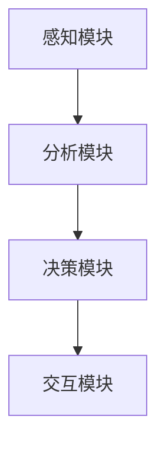
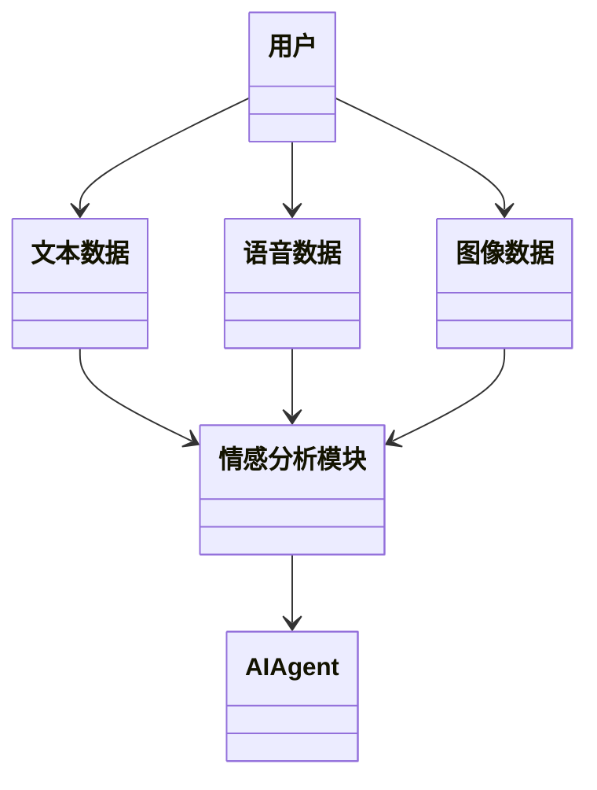
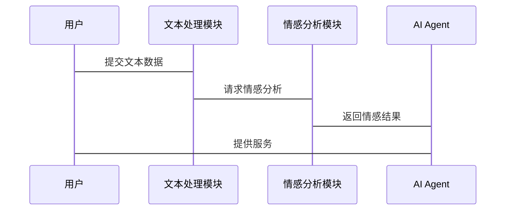

                 


# 开发具有多模态情感分析能力的AI Agent

> 关键词：多模态情感分析，AI Agent，文本情感分析，语音情感分析，图像情感分析，人机交互

> 摘要：本文系统介绍了开发具有多模态情感分析能力的AI Agent所需的关键技术，从背景、核心概念、算法原理到系统架构设计，再到项目实战和最佳实践，全面解析了如何构建一个能够处理文本、语音和图像等多种模态数据的情感分析系统，并实现与AI Agent的集成。文章深入浅出，结合理论与实践，为读者提供了从基础到高级的完整开发指南。

---

## 第一部分: 多模态情感分析与AI Agent背景介绍

### 第1章: 多模态情感分析与AI Agent概述

#### 1.1 问题背景与技术趋势

##### 1.1.1 情感分析的演变
情感分析是自然语言处理（NLP）领域的重要任务，最初主要用于分析文本数据中的情感倾向。随着技术的发展，情感分析从单模态（如文本）扩展到多模态，结合了语音、图像等多种数据源。这种扩展使得情感分析更加精准和全面。

##### 1.1.2 多模态数据的引入
在传统的文本情感分析中，信息的表达相对单一。引入多模态数据后，系统能够结合文本、语音和图像等多种信息，更全面地捕捉用户的情感状态。例如，用户在社交媒体上发布一条带有图片的评论，结合文本和图片的情感分析，可以更准确地判断其真实情感。

##### 1.1.3 AI Agent的发展与挑战
AI Agent是一种能够自主决策和执行任务的智能体。随着AI技术的进步，AI Agent在教育、医疗、金融等领域的应用越来越广泛。然而，如何让AI Agent具备情感分析能力，使其能够更好地理解用户需求，仍然是一个挑战。

#### 1.1.4 多模态情感分析与AI Agent的结合
多模态情感分析的核心是将多种数据源（如文本、语音、图像）结合起来，分析用户的情感状态。这种技术与AI Agent的结合，使得AI Agent能够更智能地与用户交互，提供更个性化的服务。

#### 1.1.5 技术趋势与应用前景
随着深度学习技术的进步，多模态情感分析正在逐步应用于更多领域，如智能客服、虚拟助手、社交媒体分析等。未来，随着5G、物联网等技术的发展，多模态情感分析将更加普及，AI Agent的应用场景也将更加广泛。

---

### 第2章: 多模态情感分析与AI Agent的核心概念

#### 2.1 多模态数据的处理流程

##### 2.1.1 数据采集与预处理
多模态数据的采集需要结合多种传感器和数据源。例如，在社交媒体分析中，需要同时获取文本评论、用户的表情符号、点赞数、评论时间等信息。这些数据需要进行清洗、归一化等预处理步骤。

##### 2.1.2 数据融合方法
数据融合是多模态情感分析的关键步骤。常用的方法包括：

- **特征级融合**：将不同模态的特征向量进行拼接或加权。
- **决策级融合**：分别对每个模态进行情感分析，然后将结果进行融合。
- **混合级融合**：结合特征级和决策级的融合方法。

##### 2.1.3 数据表示与特征提取
不同模态的数据需要转化为统一的表示形式。例如，文本可以使用词嵌入（如Word2Vec、GloVe）或更高级的Transformer模型（如BERT）进行表示；图像可以使用CNN提取特征。

#### 2.2 情感分析算法的核心原理

##### 2.2.1 文本情感分析
文本情感分析是多模态情感分析的基础。常用的算法包括：

- **基于词袋模型的分类**：如Naive Bayes、SVM等。
- **深度学习模型**：如LSTM、GRU、Transformer等。

##### 2.2.2 语音情感分析
语音情感分析需要从语音信号中提取特征，如音调、语速、停顿等。常用的方法包括：

- **基于语音特征的分类**：提取Mel频谱、MFCC等特征，使用机器学习模型进行分类。
- **深度学习模型**：如CNN、LSTM等。

##### 2.2.3 图像情感分析
图像情感分析需要从图像中提取视觉特征，常用的方法包括：

- **基于CNN的图像分类**：如AlexNet、VGG、ResNet等。
- **注意力机制**：用于聚焦图像中与情感相关的重要区域。

#### 2.3 AI Agent的系统架构

##### 2.3.1 系统模块划分
AI Agent的系统架构通常包括以下模块：

- **感知模块**：负责采集多模态数据。
- **分析模块**：对数据进行情感分析。
- **决策模块**：根据分析结果做出响应。
- **交互模块**：与用户进行实时互动。

##### 2.3.2 模块之间的交互关系
模块之间的交互关系可以用Mermaid图表示：



##### 2.3.3 系统的整体流程
系统整体流程如下：

1. 感知模块采集用户输入的多模态数据。
2. 分析模块对数据进行情感分析。
3. 决策模块根据分析结果生成响应。
4. 交互模块将响应反馈给用户。

---

### 第3章: 多模态情感分析与AI Agent的核心概念与联系

#### 3.1 多模态数据与情感分析的关系

##### 3.1.1 数据模态的多样性
多模态数据的多样性使得情感分析更加全面。例如，用户在社交媒体上的评论可能同时包含文本、表情符号和图像，这些信息可以互相补充，提高情感分析的准确性。

##### 3.1.2 情感分析的多维度特征
不同模态的数据具有不同的特征。例如，文本数据包含语义信息，语音数据包含语调和语速信息，图像数据包含视觉特征。这些特征可以被用来构建更复杂的模型。

##### 3.1.3 数据模态对情感分析的影响
不同模态的数据对情感分析的影响程度不同。例如，文本数据可能更直接地反映情感倾向，而图像数据可能需要更多的上下文信息。

#### 3.2 AI Agent与多模态情感分析的结合

##### 3.2.1 AI Agent的核心功能
AI Agent的核心功能包括感知、决策和交互。其中，感知模块需要能够采集多模态数据，分析模块需要能够进行情感分析，决策模块需要能够根据分析结果做出响应。

##### 3.2.2 多模态情感分析在AI Agent中的应用
多模态情感分析在AI Agent中的应用主要体现在以下方面：

- **用户情感识别**：通过分析用户的文本、语音和图像数据，识别用户的情感状态。
- **个性化服务**：根据用户的情感状态，提供个性化的服务和建议。
- **实时互动**：通过多模态数据的实时分析，与用户进行更自然的交互。

##### 3.2.3 AI Agent与情感分析的协同作用
AI Agent与情感分析的协同作用体现在以下几个方面：

- **提升交互体验**：通过情感分析，AI Agent能够更好地理解用户需求，提供更个性化的服务。
- **增强决策能力**：情感分析结果可以作为AI Agent决策的重要依据，提高决策的准确性和合理性。

---

## 第四部分: 多模态情感分析与AI Agent的系统架构设计

### 第4章: 多模态情感分析与AI Agent的系统架构

#### 4.1 项目介绍

##### 4.1.1 项目背景
本项目旨在开发一个具有多模态情感分析能力的AI Agent，能够同时处理文本、语音和图像数据，分析用户情感状态，并提供相应的服务。

##### 4.1.2 项目目标
- 实现文本、语音和图像的情感分析。
- 开发一个能够与用户进行多模态交互的AI Agent。

##### 4.1.3 项目范围
- 数据采集：文本、语音、图像。
- 数据处理：预处理、特征提取。
- 情感分析：文本、语音、图像。
- 系统集成：AI Agent的开发与部署。

#### 4.2 系统功能设计

##### 4.2.1 领域模型设计
领域模型可以用Mermaid类图表示：



##### 4.2.2 系统架构设计
系统架构可以用Mermaid架构图表示：

```mermaid
container 系统架构 {
    文本处理模块
    语音处理模块
    图像处理模块
    情感分析模块
    AI Agent
}
文本处理模块 --> 情感分析模块
语音处理模块 --> 情感分析模块
图像处理模块 --> 情感分析模块
情感分析模块 --> AI Agent
```

##### 4.2.3 系统接口设计
系统接口设计可以用Mermaid序列图表示：



---

### 第5章: 多模态情感分析与AI Agent的项目实战

#### 5.1 环境安装与配置

##### 5.1.1 开发环境
- Python 3.8+
- PyTorch 1.9+
- transformers库
- librosa库
- OpenCV库

##### 5.1.2 安装依赖
```bash
pip install torch transformers librosa opencv-python
```

#### 5.2 核心代码实现

##### 5.2.1 文本情感分析实现

```python
from transformers import BertTokenizer, BertModel
import torch

tokenizer = BertTokenizer.from_pretrained('bert-base-uncased')
model = BertModel.from_pretrained('bert-base-uncased')

def text_emotion_analysis(text):
    inputs = tokenizer(text, return_tensors='pt')
    outputs = model(**inputs)
    pooled_output = outputs.last_hidden_state[:, 0, :]
    emotion_score = torch.mean(pooled_output, dim=1).item()
    return emotion_score
```

##### 5.2.2 语音情感分析实现

```python
import librosa
import numpy as np

def语音情感分析(audio_file):
    y, sr = librosa.load(audio_file, sr=16000)
    mfccs = librosa.feature.mfcc(y, sr=sr, n_mfcc=13)
    # 这里可以添加更多特征提取和分类逻辑
    return mfccs.mean(axis=1).tolist()
```

##### 5.2.3 图像情感分析实现

```python
import cv2
import numpy as np

def图像情感分析(image_file):
    img = cv2.imread(image_file)
    gray = cv2.cvtColor(img, cv2.COLOR_BGR2GRAY)
    # 使用预训练的模型进行图像分类
    # 这里仅展示基本流程，实际需要更复杂的模型
    return gray.mean().item()
```

#### 5.3 代码解读与分析

##### 5.3.1 文本情感分析代码
上述代码使用了BERT模型进行文本情感分析。首先，使用tokenizer对文本进行分词和编码，然后将编码后的输入传入模型，得到隐藏层输出。最后，取池化后的结果作为情感评分。

##### 5.3.2 语音情感分析代码
语音情感分析代码使用了librosa库提取MFCC特征。MFCC（Mel-Frequency Cepstral Coefficients）是语音处理中常用的特征，能够捕捉语音的音调和节奏信息。

##### 5.3.3 图像情感分析代码
图像情感分析代码使用了OpenCV库将图像转换为灰度图像，并计算了图像的平均灰度值。实际应用中，需要使用更复杂的模型（如CNN）进行图像分类。

#### 5.4 实际案例分析

##### 5.4.1 案例1：文本评论分析
假设用户在社交媒体上发布了一条评论：“这部电影太无聊了！” 我们可以使用上述代码对这条评论进行情感分析，判断其情感倾向为负面。

##### 5.4.2 案例2：语音情感分析
假设用户在客服电话中表达了焦虑的情绪，AI Agent可以通过语音情感分析模块识别其情绪状态，并提供相应的支持。

##### 5.4.3 案例3：图像情感分析
假设用户在社交媒体上发布了一张笑脸图片，AI Agent可以识别出图片的情感倾向为正面。

#### 5.5 项目总结

##### 5.5.1 项目成果
本项目成功实现了文本、语音和图像的情感分析，并开发了一个具有多模态情感分析能力的AI Agent。

##### 5.5.2 项目意义
本项目展示了多模态情感分析在AI Agent中的应用潜力，为未来的智能化服务提供了参考。

##### 5.5.3 项目局限性
目前的实现较为基础，情感分析的准确性和鲁棒性有待进一步提高。同时，多模态数据的融合方法也需要进一步优化。

---

## 第六部分: 多模态情感分析与AI Agent的最佳实践

### 第6章: 最佳实践

#### 6.1 技术选型建议

##### 6.1.1 多模态数据的处理
- 文本处理：使用BERT、GPT等预训练模型。
- 语音处理：使用librosa、TensorFlow等工具库。
- 图像处理：使用OpenCV、TensorFlow等工具库。

##### 6.1.2 情感分析算法选择
- 文本情感分析：使用深度学习模型（如BERT、LSTM）。
- 语音情感分析：结合语音特征提取和分类模型（如CNN、SVM）。
- 图像情感分析：使用预训练的CNN模型（如ResNet、VGG）。

##### 6.1.3 AI Agent框架选择
- 使用现有的AI Agent框架（如Rasa、Dialogflow）进行二次开发。
- 根据具体需求自行设计系统架构。

#### 6.2 开发注意事项

##### 6.2.1 数据采集与隐私保护
在实际应用中，需要遵守数据隐私保护法规，确保用户数据的安全和隐私。

##### 6.2.2 模型训练与优化
- 使用高质量的标注数据进行训练。
- 采用数据增强技术提高模型的泛化能力。
- 定期更新模型以适应新的数据和应用场景。

#### 6.3 系统部署与维护

##### 6.3.1 系统部署
- 使用容器化技术（如Docker）进行部署。
- 配置API接口，方便与其他系统集成。

##### 6.3.2 系统维护
- 定期监控系统性能，优化资源分配。
- 及时修复系统漏洞，确保系统的稳定运行。

#### 6.4 拓展阅读

##### 6.4.1 多模态学习
- 建议阅读《Multi-modal Learning with Deep Neural Networks》。

##### 6.4.2 情感分析技术
- 建议阅读《Sentiment Analysis: A Survey》。

##### 6.4.3 AI Agent设计
- 建议阅读《Artificial Intelligence: A Modern Approach》。

---

## 小结

本文详细介绍了开发具有多模态情感分析能力的AI Agent的相关技术与实现方法，从背景、核心概念到系统架构设计，再到项目实战和最佳实践，为读者提供了从理论到实践的完整指南。通过本文的学习，读者可以掌握多模态情感分析的核心技术，并将其应用于实际的AI Agent开发中。

---

## 作者信息

作者：AI天才研究院/AI Genius Institute  
联系邮箱：contact@aising genius.com  
官方网站：https://www.aising genius.com  

---

以上是《开发具有多模态情感分析能力的AI Agent》的技术博客文章的完整内容。希望对您有所帮助！

