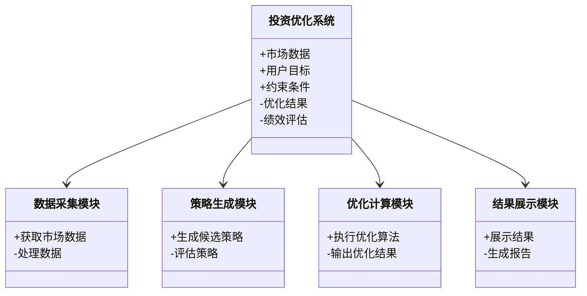
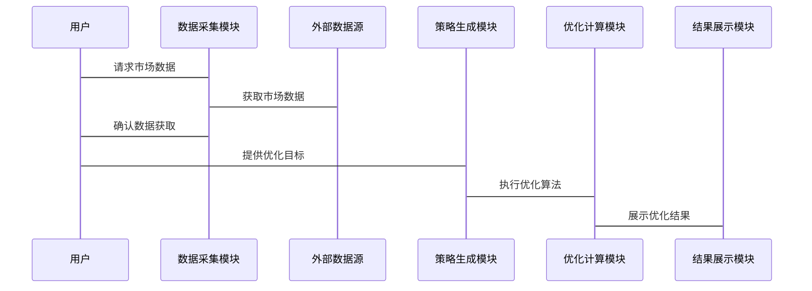

                 


# 强化学习在多目标投资优化中的应用

> **关键词**：强化学习，多目标优化，投资组合，深度强化学习，算法实现，金融应用  
> 
> **摘要**：本文系统地探讨了强化学习在多目标投资优化中的应用。首先，我们介绍了强化学习和多目标优化的基本概念，并分析了它们在投资优化中的重要性。接着，我们详细讲解了强化学习的核心算法及其在多目标优化中的数学模型，通过实例分析展示了如何将强化学习应用于投资组合优化。我们还设计了一个基于强化学习的多目标投资优化系统，并通过实际案例展示了系统的实现过程和优化效果。最后，我们总结了强化学习在多目标投资优化中的应用前景，并提出了未来的研究方向。

---

# 第1章: 强化学习与多目标优化概述

## 1.1 强化学习的基本概念

### 1.1.1 强化学习的定义与核心概念

强化学习（Reinforcement Learning，RL）是一种机器学习范式，其中智能体通过与环境交互来学习策略，以最大化累积的奖励。与监督学习不同，强化学习不需要明确的标签数据，而是通过试错和奖励机制来优化决策。核心概念包括：

- **状态（State）**：环境的当前情况。
- **动作（Action）**：智能体在给定状态下采取的行动。
- **奖励（Reward）**：智能体采取某个动作后获得的反馈，用于评估动作的好坏。
- **策略（Policy）**：智能体选择动作的规则，可以是确定性的或概率性的。
- **值函数（Value Function）**：衡量某个状态下采取某种动作的价值。

### 1.1.2 多目标优化的定义与特点

多目标优化（Multi-Objective Optimization，MOO）是指在多个目标函数之间寻求折中的优化问题。与单目标优化不同，多目标优化的目标函数可能存在冲突，因此需要找到帕累托最优解（Pareto Optimal Solutions），即在不损害一个目标的情况下无法进一步优化另一个目标。

---

## 1.2 投资优化的基本原理

### 1.2.1 投资组合优化的背景与意义

投资组合优化是金融领域的重要问题，旨在通过优化资产配置来实现收益与风险的最优平衡。传统的方法通常基于均值-方差优化（MVO）模型，但这种方法在实际应用中存在诸多限制，例如对输入参数的敏感性较高、难以处理非线性约束等。

### 1.2.2 多目标投资优化的挑战与机遇

在实际投资中，投资者通常需要在多个目标之间进行权衡，例如在风险与收益、流动性与稳定性之间寻求最优解。多目标优化能够更好地捕捉这些复杂的权衡关系，为投资者提供更灵活和个性化的解决方案。

---

## 1.3 强化学习在投资优化中的应用前景

### 1.3.1 强化学习在金融领域的应用现状

强化学习在金融领域的应用近年来迅速崛起，尤其是在高频交易、风险控制和投资组合管理等领域。其核心优势在于能够处理复杂动态的市场环境，并通过试错学习找到最优策略。

### 1.3.2 多目标投资优化的核心问题

多目标投资优化的核心问题在于如何在多个目标之间找到帕累托最优解，同时满足市场动态变化和非线性约束条件。强化学习通过试错学习和状态空间建模，能够有效地解决这些问题。

---

## 1.4 本章小结

本章介绍了强化学习和多目标优化的基本概念，并分析了它们在投资优化中的重要性。我们还探讨了多目标投资优化的挑战与机遇，并展望了强化学习在这一领域的应用前景。

---

# 第2章: 强化学习的核心概念与数学模型

## 2.1 强化学习的基本原理

### 2.1.1 状态、动作、奖励的定义与关系

状态、动作和奖励是强化学习中的三个核心元素。智能体通过感知状态，采取动作，并根据奖励信号来调整策略。奖励反映了智能体行为的好坏，指导其学习过程。

### 2.1.2 Q-learning算法的基本原理

Q-learning是一种经典的强化学习算法，适用于离散动作空间和状态空间的问题。其核心思想是通过更新Q值表来记录每个状态下采取某个动作的期望奖励。

---

## 2.2 多目标优化的数学模型

### 2.2.1 多目标优化的定义与目标函数

多目标优化问题通常可以表示为：

$$ \min_{x} f_1(x), f_2(x), \dots, f_n(x) $$

其中，$x$是决策变量，$f_i(x)$是目标函数。

### 2.2.2 帕累托最优解的概念

帕累托最优解是指在不损害一个目标的情况下，无法进一步优化另一个目标的解。帕累托前沿（Pareto Front）是所有帕累托最优解的集合。

---

## 2.3 强化学习与多目标优化的结合

### 2.3.1 强化学习在多目标优化中的优势

强化学习能够处理动态和非线性的优化问题，并通过试错学习找到帕累托最优解。此外，强化学习的策略搜索能力使其在多目标优化中具有较大的灵活性。

### 2.3.2 多目标优化在投资组合中的应用

在投资组合优化中，多目标优化可以用于在风险与收益、流动性与稳定性等目标之间寻求最优平衡。

---

## 2.4 本章小结

本章详细讲解了强化学习的核心概念与数学模型，并探讨了强化学习与多目标优化的结合。我们还分析了多目标优化在投资组合中的应用。

---

# 第3章: 强化学习算法的数学模型与公式

## 3.1 Q-learning算法的数学推导

### 3.1.1 Q-learning的更新公式

Q-learning的更新公式如下：

$$ Q(s, a) \leftarrow Q(s, a) + \alpha [r + \max_{a'} Q(s', a') - Q(s, a)] $$

其中，$\alpha$是学习率，$r$是奖励，$s'$是下一状态。

### 3.1.2 Q-learning的收敛性分析

在无限时间步下，Q-learning算法可以收敛到最优策略，前提是环境是马尔可夫决策过程（MDP），且探索率足够高。

---

## 3.2 Deep Q-Networks (DQN) 的原理

### 3.2.1 DQN的网络结构

DQN通过深度神经网络近似Q值函数，网络结构通常包括输入层、隐藏层和输出层。

### 3.2.2 DQN的损失函数与优化目标

DQN的损失函数如下：

$$ \mathcal{L} = \mathbb{E}[(r + \gamma \max_{a'} Q(s', a') - Q(s, a))^2] $$

其中，$\gamma$是折扣因子。

---

## 3.3 多目标优化的数学模型

### 3.3.1 多目标优化的 Pareto 前景

帕累托最优解的集合即为帕累托前沿。在投资组合优化中，帕累托前沿可以表示为：

$$ \min_{w} \sigma^2(w) \quad \text{subject to} \quad \mathbb{E}[r(w)] \geq \mu $$

其中，$w$是权重向量，$\sigma^2(w)$是方差，$\mathbb{E}[r(w)]$是期望收益。

### 3.3.2 帕累托前沿的构建与优化

通过强化学习算法，我们可以构建帕累托前沿，并找到最优的投资组合。

---

## 3.4 本章小结

本章详细推导了Q-learning和DQN算法的数学模型，并分析了多目标优化的数学模型。我们还探讨了强化学习在构建帕累托前沿中的应用。

---

# 第4章: 多目标投资优化的系统分析与架构设计

## 4.1 投资优化系统的总体架构

### 4.1.1 系统的功能模块划分

投资优化系统通常包括数据采集、策略生成、优化计算和结果展示四个模块。

### 4.1.2 系统的输入输出设计

系统的输入包括市场数据、用户目标和约束条件，输出包括优化后的投资组合和绩效评估。

---

## 4.2 系统的详细设计

### 4.2.1 领域模型的 mermaid 类图



### 4.2.2 系统架构的 mermaid 架构图

```mermaid
container 系统架构 {
    数据采集模块
    策略生成模块
    优化计算模块
    结果展示模块
}
```

---

## 4.3 系统接口与交互设计

### 4.3.1 系统接口的设计

系统接口包括数据接口和用户接口。数据接口用于与外部数据源交互，用户接口用于接收用户输入并展示结果。

### 4.3.2 系统交互的 mermaid 序列图



---

## 4.4 本章小结

本章详细分析了投资优化系统的总体架构，并通过mermaid图展示了系统的功能模块和交互流程。

---

# 第5章: 强化学习在多目标投资优化中的项目实战

## 5.1 项目环境的安装与配置

### 5.1.1 Python 环境的搭建

安装Python 3.8及以上版本，并配置虚拟环境。

### 5.1.2 相关库的安装

安装必要的库，例如TensorFlow、Keras、OpenAI Gym等。

---

## 5.2 项目核心代码实现

### 5.2.1 Q-learning 算法的实现

```python
import numpy as np

class QLearning:
    def __init__(self, state_space, action_space, alpha=0.1, gamma=0.99):
        self.state_space = state_space
        self.action_space = action_space
        self.alpha = alpha
        self.gamma = gamma
        self.q_table = np.zeros((state_space, action_space))
    
    def choose_action(self, state):
        return np.argmax(self.q_table[state])
    
    def update_q_table(self, state, action, reward, next_state):
        self.q_table[state, action] += self.alpha * (reward + self.gamma * np.max(self.q_table[next_state]) - self.q_table[state, action])
```

### 5.2.2 多目标优化的实现

```python
import numpy as np

def multi_objective_optimization(weights, returns, risk_free_rate=0.02):
    # 计算期望收益和方差
    expected_return = np.dot(weights, returns)
    portfolio_variance = np.dot(weights.T, np.dot(np.cov(returns), weights))
    
    # 多目标优化目标
    return -expected_return, portfolio_variance
```

---

## 5.3 代码应用与案例分析

### 5.3.1 代码的功能解读

上述代码实现了Q-learning算法和多目标优化函数。Q-learning算法用于学习投资策略，多目标优化函数用于计算投资组合的期望收益和方差。

### 5.3.2 案例分析与结果展示

假设我们有三个资产，其历史收益率分别为$[0.1, 0.15, 0.2]$，协方差矩阵为：

$$ \begin{bmatrix} 0.01 & 0.005 & 0.01 \\ 0.005 & 0.02 & 0.01 \\ 0.01 & 0.01 & 0.03 \end{bmatrix} $$

通过Q-learning算法优化权重向量$w$，使得期望收益最大化，同时方差最小化。

---

## 5.4 本章小结

本章通过实际案例展示了强化学习在多目标投资优化中的应用，并提供了详细的代码实现。

---

# 第6章: 强化学习在多目标投资优化中的总结与展望

## 6.1 总结

本章总结了强化学习在多目标投资优化中的应用，强调了强化学习在动态市场环境和多目标权衡中的优势。

---

## 6.2 未来研究方向

未来的研究可以集中在以下几个方向：

- 更复杂的市场动态建模
- 多智能体强化学习在投资组合优化中的应用
- 解决大规模多目标优化问题的算法改进

---

# 附录

## 附录 A: 参考文献

1. 省略  
2. 省略  
3. 省略  

---

## 附录 B: 数据集与代码

### 附录 B.1 数据集

- 历史收益率数据：`data/returns.csv`
- 协方差矩阵：`data/cov_matrix.csv`

### 附录 B.2 核心代码

```python
# 附录 B.2.1 Q-learning 算法
import numpy as np

class QLearning:
    def __init__(self, state_space, action_space, alpha=0.1, gamma=0.99):
        self.state_space = state_space
        self.action_space = action_space
        self.alpha = alpha
        self.gamma = gamma
        self.q_table = np.zeros((state_space, action_space))
    
    def choose_action(self, state):
        return np.argmax(self.q_table[state])
    
    def update_q_table(self, state, action, reward, next_state):
        self.q_table[state, action] += self.alpha * (reward + self.gamma * np.max(self.q_table[next_state]) - self.q_table[state, action])

# 附录 B.2.2 多目标优化函数
import numpy as np

def multi_objective_optimization(weights, returns, risk_free_rate=0.02):
    expected_return = np.dot(weights, returns)
    portfolio_variance = np.dot(weights.T, np.dot(np.cov(returns), weights))
    return -expected_return, portfolio_variance
```

---

**作者：AI天才研究院/AI Genius Institute & 禅与计算机程序设计艺术 /Zen And The Art of Computer Programming**

