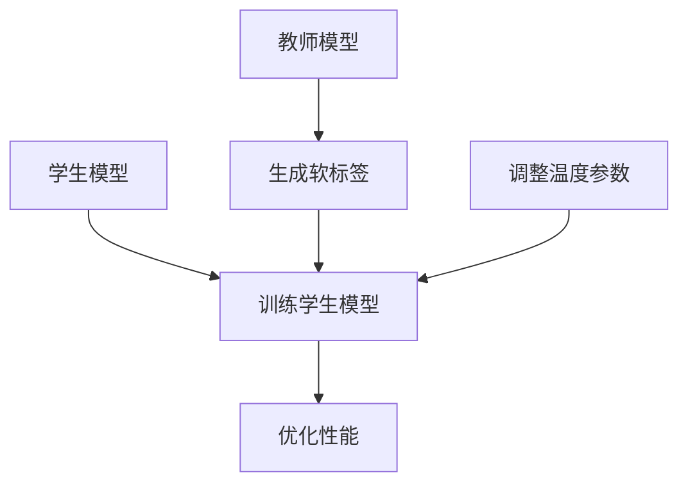
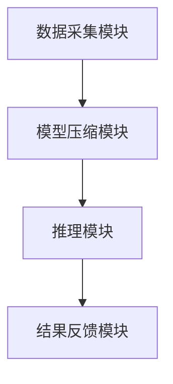

                 


# 模型压缩：在边缘设备部署轻量级AI Agent

**关键词**：模型压缩，边缘设备，AI Agent，轻量级，知识蒸馏，剪枝，量化

**摘要**：  
在边缘计算的快速发展中，部署轻量级AI Agent的需求日益增长。模型压缩技术是实现这一目标的关键。本文从模型压缩的核心概念、算法原理、系统架构到项目实战，全面探讨如何在边缘设备上高效部署轻量级AI Agent。通过详细分析模型压缩的方法，结合实际案例，为读者提供从理论到实践的深度解析。

---

## 第1章: 模型压缩与边缘设备部署概述

### 1.1 模型压缩的核心概念

#### 1.1.1 模型压缩的定义  
模型压缩是指通过减少模型的参数数量或优化模型结构，使其在保持或提升性能的同时，显著降低计算资源消耗。  

#### 1.1.2 边缘设备的定义与特点  
边缘设备指的是在网络边缘进行数据处理的硬件设备，如手机、嵌入式设备、 IoT 设备等。其特点包括资源受限（计算能力、存储空间、功耗）、实时性要求高、数据量大等。  

#### 1.1.3 轻量级AI Agent的目标与意义  
轻量级AI Agent旨在通过模型压缩技术，在边缘设备上实现高性能AI推理，满足实时性、资源受限和低功耗的需求，同时保持模型的准确性和响应速度。  

---

### 1.2 模型压缩的背景与问题背景

#### 1.2.1 AI模型在边缘设备部署的挑战  
边缘设备的资源限制（如计算能力、存储空间）使得大型深度学习模型难以直接部署。此外，边缘设备的实时性要求对模型推理的效率提出了更高要求。  

#### 1.2.2 模型压缩的必要性与可能性  
模型压缩是解决边缘设备部署问题的关键技术。通过压缩模型，可以在不显著降低性能的前提下，大幅减少模型的大小和计算量，使其适应边缘设备的资源限制。  

#### 1.2.3 边缘计算与AI结合的机遇  
边缘计算与AI的结合为智能物联网、实时数据分析等场景提供了新的可能性。模型压缩技术的成熟为边缘设备部署AI应用提供了技术保障。  

---

### 1.3 轻量级AI Agent的定义与特点

#### 1.3.1 轻量级AI Agent的定义  
轻量级AI Agent是指在边缘设备上运行的、经过模型压缩的AI代理，能够在资源受限的环境中高效完成特定任务。  

#### 1.3.2 轻量级AI Agent的核心要素  
- 资源占用低：模型参数少、计算效率高。  
- 实时性高：能够在边缘设备上快速响应。  
- 适应性强：支持多种边缘设备和应用场景。  

#### 1.3.3 轻量级AI Agent与传统AI Agent的区别  
传统AI Agent通常运行在云端或高性能计算设备上，资源消耗高，而轻量级AI Agent通过模型压缩技术适应边缘设备的资源限制。  

---

### 1.4 模型压缩的边界与外延

#### 1.4.1 模型压缩的边界  
模型压缩的边界在于如何在性能和资源消耗之间找到平衡点，避免过度压缩导致性能下降。  

#### 1.4.2 模型压缩的外延  
模型压缩的外延包括模型优化、模型蒸馏、模型量化等多种技术，以及结合边缘设备特点的定制化优化。  

#### 1.4.3 模型压缩与边缘设备部署的关系  
模型压缩是边缘设备部署AI Agent的核心技术，通过压缩模型，使其适应边缘设备的资源限制，同时保持高性能。  

---

### 1.5 本章小结  
本章介绍了模型压缩的核心概念、边缘设备的特点、轻量级AI Agent的目标与意义，以及模型压缩的边界与外延，为后续内容奠定了基础。  

---

## 第2章: 模型压缩的核心概念与联系

### 2.1 模型压缩的核心原理

#### 2.1.1 知识蒸馏  
知识蒸馏是一种通过学生模型模仿教师模型知识的技术。教师模型通常是一个大模型，学生模型是一个小模型。通过蒸馏过程，学生模型可以继承教师模型的知识，从而实现轻量化。  

#### 2.1.2 参数剪枝  
参数剪枝是一种通过移除模型中冗余的参数或神经元，降低模型复杂度的技术。剪枝可以通过阈值剪枝或贪心算法实现。  

#### 2.1.3 参数量化  
参数量化是将模型中的浮点数参数转换为低精度整数（如8位整数）的技术，从而减少模型的存储空间和计算时间。  

#### 2.1.4 模型蒸馏与剪枝的对比分析  
- 知识蒸馏：依赖教师模型，适合轻量级模型的训练。  
- 参数剪枝：直接减少模型参数，适合需要精简模型的场景。  
- 参数量化：通过降低精度实现轻量化，适合对存储和计算效率要求高的场景。  

---

### 2.2 模型压缩的核心要素

#### 2.2.1 模型结构  
模型结构决定了模型的复杂度和性能。通过优化模型结构，可以降低模型的复杂度。  

#### 2.2.2 模型参数  
模型参数的数量直接影响模型的大小和计算量。通过剪枝和量化等技术，可以减少模型参数。  

#### 2.2.3 模型性能  
模型性能是衡量模型压缩效果的重要指标，包括准确率、推理速度等。  

#### 2.2.4 模型压缩算法  
模型压缩算法是实现模型压缩的核心工具，包括知识蒸馏、剪枝、量化等。  

---

### 2.3 模型压缩方法的对比分析

#### 2.3.1 不同模型压缩方法的优缺点对比  

| 方法       | 优点                           | 缺点                           |
|------------|--------------------------------|---------------------------------|
| 知识蒸馏   | 可以继承教师模型的知识，性能高 | 需要教师模型，训练时间长       |
| 参数剪枝   | 模型参数减少，推理速度快       | 可能导致性能下降               |
| 参数量化   | 存储空间小，计算速度快         | 可能影响模型精度               |

#### 2.3.2 模型压缩方法的适用场景分析  
- 知识蒸馏适用于需要高性能轻量级模型的场景。  
- 参数剪枝适用于对模型大小要求严格的场景。  
- 参数量化适用于对存储和计算效率要求高的场景。  

#### 2.3.3 模型压缩方法的性能对比  
通过实验对比不同模型压缩方法在边缘设备上的性能表现，包括推理速度、准确率和模型大小。  

---

### 2.4 模型压缩与边缘设备部署的关系

#### 2.4.1 模型压缩对边缘设备部署的影响  
模型压缩可以显著降低模型的资源占用，使其适应边缘设备的资源限制。  

#### 2.4.2 边缘设备部署对模型压缩的需求  
边缘设备的资源限制推动了模型压缩技术的发展，使其成为边缘AI部署的核心技术。  

#### 2.4.3 模型压缩与边缘设备部署的协同优化  
通过结合模型压缩和边缘设备的特点，可以实现高性能、低资源消耗的AI部署。  

---

### 2.5 本章小结  
本章详细分析了模型压缩的核心原理、核心要素和不同压缩方法的对比，为后续的算法实现和系统设计奠定了基础。  

---

## 第3章: 模型压缩算法原理与数学模型

### 3.1 知识蒸馏算法原理

#### 3.1.1 知识蒸馏的基本原理  
知识蒸馏通过将教师模型的 logits 作为软标签，引导学生模型的训练。软标签相比硬标签更具信息量，可以更好地传递教师模型的知识。  

#### 3.1.2 知识蒸馏的数学模型  
教师模型的输出概率分布为：  
$$ P(y|x) = \text{softmax}(f_T(x)/\tau) $$  
学生模型的损失函数为：  
$$ L = -\sum_{i=1}^n P(y|x) \log P(y|x) $$  

其中，$\tau$ 是温度参数，用于控制软标签的软化程度。  

#### 3.1.3 知识蒸馏的实现步骤  
1. 训练教师模型，生成软标签。  
2. 使用软标签训练学生模型。  
3. 调整温度参数 $\tau$，优化学生模型的性能。  

---

### 3.2 参数剪枝算法原理

#### 3.2.1 参数剪枝的基本原理  
参数剪枝通过移除模型中冗余的参数或神经元，降低模型的复杂度。  

#### 3.2.2 参数剪枝的数学模型  
参数剪枝可以通过 L2 正则化实现：  
$$ L = L_{\text{loss}} + \lambda \|W\|^2 $$  
其中，$\lambda$ 是正则化系数，$W$ 是模型参数。  

#### 3.2.3 参数剪枝的实现步骤  
1. 训练模型，计算每个参数的重要性。  
2. 根据重要性排序，移除冗余参数。  
3. 重新训练剪枝后的模型，优化性能。  

---

### 3.3 参数量化算法原理

#### 3.3.1 参数量化的基本原理  
参数量化将模型中的浮点数参数转换为低精度整数（如8位整数），以减少存储空间和计算时间。  

#### 3.3.2 参数量化的数学模型  
参数量化可以通过量化矩阵实现：  
$$ Q(x) = \text{round}(x \cdot 2^{\text{bit}}) $$  
其中，$\text{bit}$ 是量化位数。  

#### 3.3.3 参数量化的实现步骤  
1. 训练模型，获取模型参数。  
2. 对参数进行量化，生成低精度参数。  
3. 部署量化后的模型到边缘设备。  

---

### 3.4 算法流程图  



---

## 第4章: 系统分析与架构设计

### 4.1 边缘设备部署AI Agent的场景分析

#### 4.1.1 系统需求  
- 资源受限：计算能力、存储空间、功耗。  
- 实时性要求高：需要快速响应。  
- 数据量大：边缘设备通常处理大量数据。  

#### 4.1.2 系统目标  
- 部署轻量级AI Agent，满足边缘设备的资源限制。  
- 保证模型的准确性和推理速度。  

---

### 4.2 系统功能设计

#### 4.2.1 功能模块  
1. 数据采集模块：采集边缘设备的数据。  
2. 模型压缩模块：对模型进行压缩，使其适应边缘设备的资源限制。  
3. 推理模块：在边缘设备上进行模型推理。  
4. 结果反馈模块：将推理结果反馈给上层系统。  

#### 4.2.2 功能流程  
1. 数据采集模块采集数据并传递给模型压缩模块。  
2. 模型压缩模块对模型进行压缩，生成轻量级模型。  
3. 推理模块加载轻量级模型，进行推理。  
4. 结果反馈模块将推理结果传递给上层系统。  

---

### 4.3 系统架构设计  



---

### 4.4 接口设计与交互流程

#### 4.4.1 接口设计  
- 数据接口：数据采集模块与模型压缩模块之间的接口。  
- 模型接口：模型压缩模块与推理模块之间的接口。  

#### 4.4.2 交互流程  
1. 数据采集模块采集数据并传递给模型压缩模块。  
2. 模型压缩模块对模型进行压缩，生成轻量级模型。  
3. 推理模块加载轻量级模型，进行推理。  
4. 结果反馈模块将推理结果传递给上层系统。  

---

## 第5章: 项目实战

### 5.1 环境安装

#### 5.1.1 安装TensorFlow Lite  
通过以下命令安装TensorFlow Lite：  
```bash
pip install tensorflowlite
```

#### 5.1.2 安装ONNX Runtime  
通过以下命令安装ONNX Runtime：  
```bash
pip install onnxruntime
```

---

### 5.2 模型压缩实现

#### 5.2.1 知识蒸馏实现  
代码示例：  
```python
import tensorflow as tf
from tensorflow import keras

# 定义教师模型
def teacher_model():
    model = keras.Sequential([
        keras.layers.Dense(128, activation='relu'),
        keras.layers.Dense(10, activation='softmax')
    ])
    return model

# 定义学生模型
def student_model():
    model = keras.Sequential([
        keras.layers.Dense(64, activation='relu'),
        keras.layers.Dense(10, activation='softmax')
    ])
    return model

# 训练教师模型
teacher = teacher_model()
teacher.compile(optimizer='adam', loss='sparse_categorical_crossentropy', metrics=['accuracy'])
teacher.fit(x_train, y_train, epochs=10, batch_size=32)

# 生成软标签
teacher_logits = teacher.predict(x_train) / 5  # 温度参数为5

# 训练学生模型
student = student_model()
student.compile(optimizer='adam', loss='kl_divergence', metrics=['accuracy'])
student.fit(x_train, teacher_logits, epochs=10, batch_size=32)
```

#### 5.2.2 参数剪枝实现  
代码示例：  
```python
import numpy as np

# 训练原始模型
model = keras.Sequential([
    keras.layers.Dense(128, activation='relu'),
    keras.layers.Dense(10, activation='softmax')
])
model.compile(optimizer='adam', loss='sparse_categorical_crossentropy', metrics=['accuracy'])
model.fit(x_train, y_train, epochs=10, batch_size=32)

# 参数剪枝
weights = model.get_weights()
pruned_weights = []
for w in weights:
    threshold = np.percentile(abs(w), 50)
    pruned_w = np.where(abs(w) > threshold, w, 0)
    pruned_weights.append(pruned_w)

# 重新训练剪枝后的模型
pruned_model = keras.Sequential([
    keras.layers.Dense(128, activation='relu'),
    keras.layers.Dense(10, activation='softmax')
])
pruned_model.set_weights(pruned_weights)
pruned_model.compile(optimizer='adam', loss='sparse_categorical_crossentropy', metrics=['accuracy'])
pruned_model.fit(x_train, y_train, epochs=5, batch_size=32)
```

#### 5.2.3 参数量化实现  
代码示例：  
```python
import numpy as np

# 训练原始模型
model = keras.Sequential([
    keras.layers.Dense(128, activation='relu'),
    keras.layers.Dense(10, activation='softmax')
])
model.compile(optimizer='adam', loss='sparse_categorical_crossentropy', metrics=['accuracy'])
model.fit(x_train, y_train, epochs=10, batch_size=32)

# 参数量化
def quantize(weights, bits):
    max_val = np.max(abs(weights))
    quantized = np.round(weights / max_val * (2**bits - 1)) * max_val / (2**bits)
    return quantized

quantized_weights = []
for w in model.get_weights():
    quantized_w = quantize(w, 8)
    quantized_weights.append(quantized_w)

# 部署量化后的模型
pruned_model = keras.Sequential([
    keras.layers.Dense(128, activation='relu'),
    keras.layers.Dense(10, activation='softmax')
])
pruned_model.set_weights(quantized_weights)
pruned_model.compile(optimizer='adam', loss='sparse_categorical_crossentropy', metrics=['accuracy'])
```

---

### 5.3 项目实战总结  

---

## 第6章: 总结与展望

### 6.1 总结  
本文详细探讨了模型压缩技术在边缘设备部署轻量级AI Agent中的应用，从核心概念、算法原理到系统设计和项目实战，为读者提供了全面的指导。  

### 6.2 展望  
未来，随着边缘计算的快速发展，模型压缩技术将更加成熟，轻量级AI Agent将在更多场景中得到广泛应用。同时，更高效的压缩算法和边缘设备的性能优化将进一步推动AI在边缘计算中的应用。  

---

**作者：AI天才研究院（AI Genius Institute） & 禅与计算机程序设计艺术（Zen And The Art of Computer Programming）**

