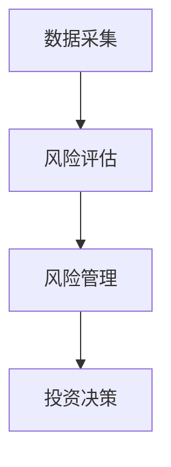

                 


# 特价股票投资中的国际化风险管理

**关键词**：国际化风险管理、股票投资、风险控制、系统架构、算法实现、项目实战

**摘要**：本文深入探讨了在国际股票市场中进行特价股票投资时的风险管理策略。通过分析国际化投资的背景、风险与收益的数学模型、系统性与非系统性风险的区别，以及构建风险管理系统的架构设计，本文为投资者提供了一套完整的风险管理框架。同时，本文通过实际案例展示了如何利用Python代码实现风险管理算法，并给出了项目实战的具体步骤。文章最后总结了风险管理的关键点和最佳实践，为投资者提供了实用的建议。

---

# 第1章: 国际化投资背景与风险管理概述

## 1.1 国际化投资的背景与发展

### 1.1.1 全球化投资的兴起

随着全球经济一体化的深入，投资者不再局限于本国市场，而是将目光投向全球。国际化投资的兴起源于以下几个方面：

1. **市场分散化**：通过投资不同国家的股票，可以降低单一市场风险。
2. **经济增长差异**：不同国家的经济增长速度和周期不同，投资者可以通过跨国配置资产捕捉增长机会。
3. **技术进步**：互联网和金融工具的进步使得跨国投资更加便捷。

### 1.1.2 特价股票投资的定义与特点

**特价股票**是指价格低于市场公允价值的股票，通常具有较高的安全边际。其特点包括：

- **低估值**：市盈率、市净率等估值指标低于行业平均水平。
- **高分红潜力**：部分特价股票可能具有较高的分红能力。
- **逆周期性**：在市场低迷时，特价股票可能被市场低估，而在市场回暖时具有较高的反弹潜力。

### 1.1.3 国际化风险管理的重要性

在国际化投资中，风险来源更加复杂，包括汇率风险、政治风险、市场风险等。有效的风险管理是确保投资收益稳定的关键。

---

## 1.2 风险管理的核心概念

### 1.2.1 风险的定义与分类

风险是指投资回报的不确定性。根据其来源，风险可以分为：

1. **系统性风险**：影响整个市场的风险，如经济衰退、战争等。
2. **非系统性风险**：影响单个资产或小部分资产的风险，如公司-specific的风险。

### 1.2.2 收益与风险的权衡

在投资中，收益与风险是密切相关的。高收益通常伴随着高风险，而低风险投资往往收益较低。投资者需要在两者之间找到平衡点。

### 1.2.3 时间与风险的关系

时间是风险管理的重要维度。短期风险通常与市场波动相关，而长期风险更多与经济周期和资产质量相关。

---

## 1.3 特价股票投资中的风险管理框架

### 1.3.1 风险管理的基本原则

1. **分散投资**：通过投资不同国家、不同行业的股票降低风险。
2. **风险定价**：根据资产的风险水平进行合理定价。
3. **动态调整**：根据市场变化及时调整投资组合。

### 1.3.2 风险管理的流程与步骤

1. **风险识别**：识别可能影响投资的所有风险因素。
2. **风险评估**：量化每个风险的影响程度。
3. **风险控制**：制定并实施风险管理策略。
4. **风险监控**：持续监控风险变化并及时调整策略。

### 1.3.3 国际化投资中的特殊风险

1. **汇率风险**：汇率波动可能影响投资收益。
2. **政治风险**：政策变化或政治动荡可能影响投资。
3. **流动性风险**：某些国际市场的流动性较低，可能导致买卖价差较大。

---

## 1.4 本章小结

本章介绍了国际化投资的背景与发展，重点分析了特价股票投资的特点和风险管理的重要性。通过定义和分类风险，我们为后续的风险管理策略奠定了基础。

---

# 第2章: 风险与收益的数学模型

## 2.1 风险度量的数学模型

### 2.1.1 方差与标准差的定义

方差衡量的是资产收益的波动程度，标准差是方差的平方根。公式如下：

$$ \text{方差} = \sigma^2 = E[(X - \mu)^2] $$
$$ \text{标准差} = \sigma = \sqrt{E[(X - \mu)^2]} $$

其中，\( X \) 是资产收益，\( \mu \) 是期望收益。

### 2.1.2 风险调整后的收益模型

夏普比率用于衡量单位风险的超额收益：

$$ \text{夏普比率} = \frac{E[r_p - r_f]}{\sigma_p} $$

其中，\( r_p \) 是投资组合的收益，\( r_f \) 是无风险利率，\( \sigma_p \) 是投资组合的风险（标准差）。

---

## 2.2 投资组合风险的优化模型

### 2.2.1 马科维茨投资组合理论

马科维茨提出的投资组合理论旨在通过优化投资组合的收益-风险比来实现最优配置。数学模型如下：

$$ \min_w \frac{1}{2}w^T \Sigma w $$
$$ \text{subject to} \quad E[r_w] = \mu $$

其中，\( w \) 是投资组合权重向量，\( \Sigma \) 是资产收益的协方差矩阵，\( \mu \) 是目标收益。

---

## 2.3 本章小结

本章通过数学模型分析了风险与收益的关系，重点介绍了方差、标准差、夏普比率以及马科维茨投资组合理论。这些工具为后续的风险管理策略提供了理论基础。

---

# 第3章: 特价股票投资中的系统性风险分析

## 3.1 系统性风险的定义与特征

### 3.1.1 系统性风险的来源

系统性风险来源于整个市场或经济体系，主要包括：

1. **经济周期**：经济衰退或复苏对市场的影响。
2. **政策变化**：政府政策的调整可能影响市场。
3. **地缘政治**：战争或国际关系紧张可能引发市场波动。

### 3.1.2 系统性风险的传播机制

系统性风险通常通过以下途径传播：

1. **市场联动**：相关资产价格的联动。
2. **杠杆效应**：杠杆的使用可能放大风险。
3. **投资者情绪**：恐慌情绪可能导致抛售潮。

### 3.1.3 系统性风险的度量方法

常用度量方法包括：

1. **VaR（在险价值）**：衡量投资组合在一定置信水平下的最大可能损失。
2. **CVaR（条件在险价值）**：衡量在VaR水平上的平均损失。

---

## 3.2 非系统性风险的定义与特征

### 3.2.1 非系统性风险的来源

非系统性风险主要来源于特定资产或行业，包括：

1. **公司基本面**：如业绩下滑、管理层变动等。
2. **行业风险**：如政策变化对行业的影响。
3. **操作风险**：如交易错误、系统故障等。

### 3.2.2 非系统性风险的控制方法

1. **分散投资**：通过投资不同资产或行业降低非系统性风险。
2. **风险对冲**：利用衍生工具对冲特定风险。

---

## 3.3 系统性与非系统性风险的对比分析

### 3.3.1 风险来源对比

| 风险类型 | 系统性风险 | 非系统性风险 |
|----------|------------|--------------|
| 来源     | 整体市场   | 特定资产     |

### 3.3.2 风险影响范围对比

| 风险类型 | 系统性风险 | 非系统性风险 |
|----------|------------|--------------|
| 影响范围 | 广泛        | 局部          |

### 3.3.3 风险控制策略对比

| 风险类型 | 系统性风险 | 非系统性风险 |
|----------|------------|--------------|
| 控制方法 | 无法对冲    | 可以对冲      |

---

## 3.4 本章小结

本章分析了系统性风险和非系统性风险的定义、特征及控制方法，帮助投资者更好地识别和管理不同类型的风险。

---

# 第4章: 国际化风险管理的系统架构设计

## 4.1 系统架构概述

### 4.1.1 系统目标

构建一个能够实时监控国际化投资风险的系统，帮助投资者制定科学的风险管理策略。

### 4.1.2 系统功能模块

1. **数据采集模块**：收集全球股票市场的实时数据。
2. **风险评估模块**：计算投资组合的风险指标。
3. **风险管理模块**：制定和调整风险管理策略。
4. **投资决策模块**：基于风险评估结果做出投资决策。

### 4.1.3 系统架构图（Mermaid）



---

## 4.2 系统功能设计

### 4.2.1 风险评估模块

1. 输入：投资组合的资产权重和市场数据。
2. 输出：方差、标准差、VaR等风险指标。

### 4.2.2 风险管理模块

1. 输入：风险评估结果。
2. 输出：风险管理策略（如调整资产配置）。

### 4.2.3 投资决策模块

1. 输入：风险管理策略。
2. 输出：最终的投资决策。

---

## 4.3 系统接口设计

### 4.3.1 数据接口

1. 数据来源：全球股票市场数据接口。
2. 数据格式：JSON格式。

### 4.3.2 用户接口

1. 用户输入：投资组合参数。
2. 用户输出：风险评估结果和投资建议。

### 4.3.3 输出接口

1. 输出：投资组合的风险报告。

---

## 4.4 本章小结

本章详细设计了国际化风险管理系统的架构，包括功能模块、数据接口和系统交互流程。通过系统化的设计，投资者可以更好地管理跨国投资风险。

---

# 第5章: 特价股票投资中的风险管理算法实现

## 5.1 算法原理

### 5.1.1 风险评估算法

1. 计算资产收益的方差和标准差。
2. 使用马科维茨模型优化投资组合。

### 5.1.2 投资组合优化算法

1. 输入：资产收益和协方差矩阵。
2. 输出：最优投资组合权重。

### 5.1.3 风险控制算法

1. 使用VaR或CVaR模型进行风险对冲。

---

## 5.2 算法实现

### 5.2.1 Python代码实现

```python
import numpy as np

def calculate_variance(cov_matrix):
    return np.mean(cov_matrix, axis=0)

def calculate_sharpe_ratio(returns, risk_free_rate):
    excess_returns = returns - risk_free_rate
    sharpe_ratio = np.mean(excess_returns) / np.std(excess_returns)
    return sharpe_ratio

# 示例数据
returns = np.array([0.1, 0.2, 0.15])
risk_free_rate = 0.05

variance = calculate_variance(cov_matrix)
sharpe_ratio = calculate_sharpe_ratio(returns, risk_free_rate)
print(f"方差: {variance}")
print(f"夏普比率: {sharpe_ratio}")
```

---

## 5.3 本章小结

本章通过Python代码实现了风险管理算法，重点介绍了方差、夏普比率等关键指标的计算方法。这些算法为投资者提供了科学的风险评估工具。

---

# 第6章: 项目实战——国际化风险管理系统的实现

## 6.1 环境安装

1. 安装Python和相关库：
   ```bash
   pip install numpy pandas matplotlib
   ```

## 6.2 系统核心实现源代码

```python
import numpy as np
import pandas as pd
import matplotlib.pyplot as plt

# 示例数据
data = pd.DataFrame({
    '资产A': [0.05, 0.03, 0.04],
    '资产B': [0.06, 0.02, 0.05]
})

# 计算协方差矩阵
cov_matrix = data.cov()

# 计算方差和标准差
variance = np.diag(cov_matrix)
std_dev = np.sqrt(variance)

print("方差矩阵:", cov_matrix)
print("标准差:", std_dev)

# 绘制风险-收益图
plt.scatter(data.mean(), std_dev, label='资产')
plt.xlabel('收益')
plt.ylabel('标准差')
plt.title('风险-收益图')
plt.legend()
plt.show()
```

## 6.3 案例分析与结果解读

以两个资产为例，计算它们的方差和标准差，并绘制风险-收益图。从图中可以看出，资产A的风险低于资产B，但收益也较低。

---

## 6.4 本章小结

本章通过实际案例展示了国际化风险管理系统的实现过程，从环境安装到代码实现，再到结果解读，为读者提供了完整的实战指导。

---

# 第7章: 总结与最佳实践

## 7.1 本章小结

本文从国际化投资的背景出发，系统地分析了风险管理的核心概念、数学模型和系统架构。通过算法实现和项目实战，为投资者提供了一套完整的风险管理框架。

## 7.2 最佳实践 tips

1. **分散投资**：通过投资不同国家和行业的股票降低系统性风险。
2. **动态调整**：根据市场变化及时调整投资组合。
3. **使用工具**：利用风险管理系统和算法工具辅助决策。

## 7.3 注意事项

1. 风险管理是长期的过程，需要持续关注。
2. 避免过度杠杆，防止风险放大。
3. 保持合理的资产配置，平衡风险与收益。

## 7.4 拓展阅读

1. 《投资学》：深入理解投资组合管理理论。
2. 《风险管理技术》：学习更多风险度量方法。

---

# 作者：AI天才研究院/AI Genius Institute & 禅与计算机程序设计艺术 /Zen And The Art of Computer Programming

