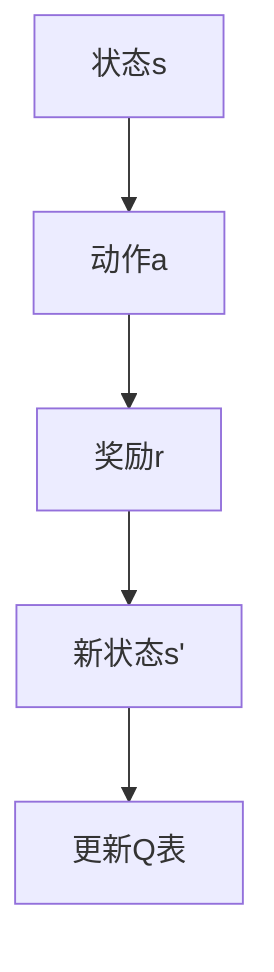
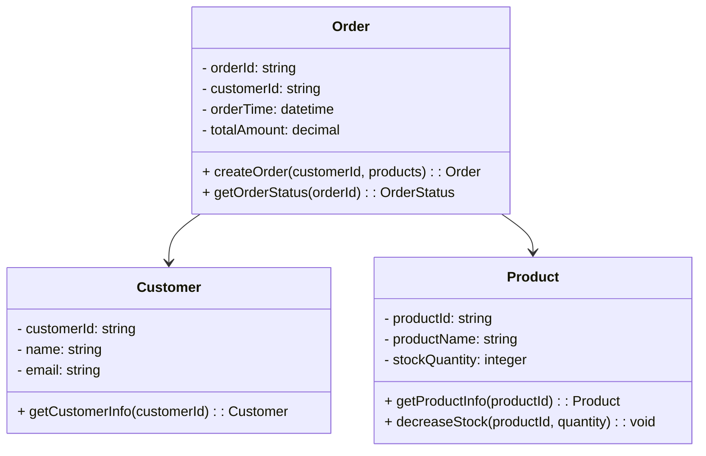

                 


# AI Agent与企业现有系统的无缝集成方案

## 关键词：AI Agent, 企业系统, 系统集成, 人工智能, 企业数字化转型

## 摘要：  
随着人工智能技术的快速发展，AI Agent（人工智能代理）逐渐成为企业智能化转型的重要工具。本文深入探讨了AI Agent与企业现有系统的无缝集成方案，从系统架构、数学模型、算法实现到实际项目案例，全面解析了AI Agent在企业环境中的应用价值和实现方法。文章通过详细的技术分析和实际案例，为企业提供了一套可行的AI Agent集成方案，帮助企业实现业务流程的智能化优化。

---

## 第1章: AI Agent与企业系统集成的背景与概念

### 1.1 AI Agent的基本概念  
AI Agent是一种能够感知环境、自主决策并执行任务的智能实体。它具备以下核心特点：  
1. **自主性**：无需外部干预，能够独立完成任务。  
2. **反应性**：能够实时感知环境变化并做出响应。  
3. **目标导向**：基于目标驱动行为，优化决策路径。  
4. **学习能力**：通过数据和反馈不断优化自身行为。  

#### AI Agent与传统软件的区别  
| 属性 | AI Agent | 传统软件 |  
|------|----------|----------|  
| 行为模式 | 基于目标驱动，动态决策 | 基于固定逻辑，静态执行 |  
| 学习能力 | 具备学习能力，可优化行为 | 无学习能力，行为固定 |  
| 交互方式 | 事件驱动，实时响应 | 请求-响应，被动执行 |  

---

### 1.2 企业现有系统的构成与特点  
企业系统通常包括以下关键组成部分：  
1. **业务系统**：如ERP、CRM等，负责企业核心业务流程的管理。  
2. **数据系统**：如数据库、数据仓库，存储企业核心数据。  
3. **操作系统**：如操作系统、中间件，提供系统运行的基础支持。  
4. **安全系统**：如防火墙、权限管理，保障系统安全。  

#### 企业系统集成的挑战  
1. **数据孤岛**：企业系统之间数据分散，缺乏统一的标准。  
2. **异构系统**：企业系统可能基于不同的技术和架构，集成难度大。  
3. **安全风险**：集成过程中可能引入新的安全漏洞。  
4. **性能瓶颈**：AI Agent对实时性和响应速度要求较高，可能对现有系统性能造成压力。  

---

### 1.3 AI Agent在企业中的应用价值  
AI Agent的应用为企业带来了显著的优势：  
1. **提高效率**：通过自动化处理重复性任务，降低人工成本。  
2. **优化决策**：基于实时数据和历史数据，提供更精准的决策支持。  
3. **增强用户体验**：通过智能化的交互，提升用户满意度。  
4. **推动创新**：AI Agent能够发现新的业务机会，推动企业创新。  

---

### 1.4 本章小结  
本章从AI Agent的基本概念出发，分析了企业系统的特点及其集成的挑战，最后总结了AI Agent在企业中的应用价值，为后续章节的深入探讨奠定了基础。

---

## 第2章: AI Agent与企业系统集成的核心概念  

### 2.1 AI Agent的体系结构  
AI Agent的体系结构可以分为以下几种：  

#### 2.1.1 单一AI Agent结构  
单一AI Agent通常由以下模块组成：  
1. **感知模块**：负责接收外部输入，如传感器数据或用户请求。  
2. **决策模块**：基于感知数据和目标，制定决策策略。  
3. **执行模块**：根据决策结果，执行具体操作。  

#### 2.1.2 多AI Agent协作架构  
在复杂的场景中，通常需要多个AI Agent协作完成任务。  
- **协同机制**：通过通信模块进行信息共享和任务分配。  
- **协调机制**：通过协商算法解决冲突，确保任务顺利进行。  

#### 2.1.3 AI Agent与企业系统的交互模式  
AI Agent与企业系统的交互模式包括以下几种：  
1. **事件驱动模式**：AI Agent通过订阅系统事件，实时响应变化。  
2. **服务调用模式**：AI Agent通过调用系统提供的服务接口，完成特定任务。  
3. **数据流驱动模式**：AI Agent通过处理实时数据流，动态调整行为。  

---

### 2.2 企业系统集成的关键要素  

#### 2.2.1 数据接口标准化  
数据接口标准化是AI Agent与企业系统集成的基础。  
- **数据格式**：统一数据格式，如JSON、XML或Protobuf。  
- **接口协议**：采用RESTful API或gRPC等标准化协议。  

#### 2.2.2 业务流程统一化  
为了确保AI Agent能够无缝融入企业系统，需要统一业务流程：  
- **流程建模**：使用BPMN（业务流程建模与执行语言）进行流程建模。  
- **流程优化**：通过AI Agent优化流程中的瓶颈环节。  

#### 2.2.3 权限与安全控制  
AI Agent的权限管理需要与企业系统的权限体系对接：  
- **身份认证**：采用OAuth2.0或JWT进行身份认证。  
- **权限控制**：基于RBAC（基于角色的访问控制）模型进行权限管理。  

---

### 2.3 AI Agent与企业系统的协同机制  

#### 2.3.1 事件驱动的协同模式  
事件驱动模式通过订阅-发布机制实现AI Agent与企业系统的协同。  
- **事件源**：企业系统发布事件，如订单完成事件。  
- **事件消费者**：AI Agent订阅事件并做出响应。  

#### 2.3.2 服务调用的协同模式  
服务调用模式通过调用企业系统提供的服务接口实现协同。  
- **服务发现**：AI Agent通过服务注册中心发现可用服务。  
- **服务调用**：通过HTTP或gRPC调用服务接口。  

#### 2.3.3 数据流驱动的协同模式  
数据流驱动模式通过实时数据流实现AI Agent与企业系统的协同。  
- **数据源**：企业系统提供实时数据流，如传感器数据。  
- **数据处理**：AI Agent处理数据流并做出决策。  

---

### 2.4 核心概念对比表格  
| 概念 | AI Agent | 企业系统 |  
|------|----------|----------|  
| 核心功能 | 智能决策与执行 | 业务流程管理与数据处理 |  
| 交互方式 | 事件驱动 | 请求-响应 |  
| 数据依赖 | 高度依赖实时数据 | 依赖结构化数据 |  

---

### 2.5 本章小结  
本章详细分析了AI Agent的体系结构和企业系统集成的关键要素，重点介绍了AI Agent与企业系统的协同机制，为后续的系统设计和实现奠定了理论基础。

---

## 第3章: AI Agent与企业系统集成的数学模型与算法原理  

### 3.1 基于状态机的AI Agent模型  

#### 3.1.1 状态机模型的定义  
状态机模型是一种描述系统行为的数学模型，由状态、转移、动作和事件构成。  

#### 3.1.2 状态转移方程  
$$ S(t+1) = f(S(t), A(t)) $$  
其中，$S(t)$ 表示当前状态，$A(t)$ 表示当前动作。  

---

### 3.2 基于强化学习的AI Agent算法  

#### 3.2.1 Q-learning算法  
Q-learning算法是一种经典的强化学习算法，适用于离散动作空间的问题。  
$$ Q(s, a) = r + \gamma \max Q(s', a') $$  
其中，$s$ 表示状态，$a$ 表示动作，$r$ 表示奖励，$\gamma$ 表示折扣因子。  

#### 3.2.2 算法实现流程图  


---

### 3.3 系统交互的序列图  

#### 3.3.1 事件驱动的交互流程  
```mermaid
sequenceDiagram
    participant A: AI Agent
    participant S: 企业系统
    A -> S: 请求数据
    S -> A: 返回数据
    A -> S: 发起操作
    S -> A: 确认操作
```

---

### 3.4 本章小结  
本章从数学模型和算法原理的角度，详细分析了AI Agent的实现方法，重点介绍了基于强化学习的Q-learning算法和系统交互的流程图。

---

## 第4章: 系统分析与架构设计方案  

### 4.1 问题场景介绍  
假设我们正在为一家电商企业设计AI Agent与现有系统的集成方案。该企业目前拥有以下系统：  
1. **订单系统**：管理订单的创建、处理和交付。  
2. **库存系统**：管理商品库存，支持库存查询和更新。  
3. **客户系统**：管理客户信息，支持客户查询和维护。  

---

### 4.2 系统功能设计  

#### 4.2.1 领域模型设计  
以下是电商系统的领域模型类图：  


---

### 4.3 系统架构设计  

#### 4.3.1 架构设计图  
以下是系统的架构设计图：  


---

### 4.4 系统接口设计  

#### 4.4.1 接口规范  
以下是AI Agent与企业系统交互的接口规范：  
- **API接口**：采用RESTful API，支持GET、POST、PUT、DELETE方法。  
- **数据格式**：采用JSON格式，确保数据的一致性和可读性。  
- **认证方式**：采用JWT（JSON Web Token）进行身份认证。  

---

### 4.5 系统交互设计  

#### 4.5.1 交互流程图  
以下是AI Agent与订单系统的交互流程图：  
```mermaid
sequenceDiagram
    participant A: AI Agent
    participant S: 订单系统
    A -> S: 查询订单状态
    S -> A: 返回订单状态
    A -> S: 确认订单
    S -> A: 返回订单确认结果
```

---

### 4.6 本章小结  
本章通过实际问题场景，详细分析了系统的功能需求、架构设计和接口设计，为后续的系统实现提供了明确的方向。

---

## 第5章: 项目实战  

### 5.1 环境安装  

#### 5.1.1 安装Python  
```bash
# 安装Python 3.8+
python --version
```

#### 5.1.2 安装依赖库  
```bash
pip install requests
pip install json
pip install mermaid
```

---

### 5.2 系统核心实现  

#### 5.2.1 AI Agent实现代码  
```python
import requests
import json

class AIAgent:
    def __init__(self, endpoint):
        self.endpoint = endpoint
        self.token = self.get_token()
    
    def get_token(self):
        # 获取JWT令牌
        response = requests.post(f"{self.endpoint}/auth", json={"username": "admin", "password": "password"})
        return response.json()["token"]
    
    def query_order_status(self, order_id):
        headers = {"Authorization": f"Bearer {self.token}"}
        response = requests.get(f"{self.endpoint}/orders/{order_id}", headers=headers)
        return response.json()
    
    def confirm_order(self, order_id):
        headers = {"Authorization": f"Bearer {self.token}"}
        data = {"status": "confirmed"}
        response = requests.put(f"{self.endpoint}/orders/{order_id}", headers=headers, json=data)
        return response.json()
```

---

### 5.3 案例分析  

#### 5.3.1 订单状态查询案例  
```python
agent = AIAgent("http://localhost:8000")
order_status = agent.query_order_status("123")
print(order_status)
# 输出结果：{"status": "processing", "description": "Order is being processed."}
```

#### 5.3.2 订单确认案例  
```python
agent = AIAgent("http://localhost:8000")
result = agent.confirm_order("123")
print(result)
# 输出结果：{"status": "confirmed", "message": "Order confirmed successfully."}
```

---

### 5.4 本章小结  
本章通过实际项目案例，详细展示了AI Agent的实现过程，包括环境安装、代码实现和案例分析，为读者提供了实践指导。

---

## 第6章: 最佳实践、小结与注意事项  

### 6.1 最佳实践  
1. **模块化设计**：将AI Agent的功能模块化，便于维护和扩展。  
2. **日志管理**：在AI Agent中集成日志模块，便于调试和问题排查。  
3. **性能优化**：通过缓存机制优化AI Agent的性能，减少对系统资源的消耗。  
4. **安全加固**：加强AI Agent的安全防护，防止恶意攻击。  

---

### 6.2 小结  
本文从理论到实践，全面解析了AI Agent与企业系统无缝集成的方案，涵盖了系统架构设计、数学模型分析、算法实现和项目实战等内容。通过本文的学习，读者可以掌握AI Agent的核心技术，并将其应用于实际的企业场景中。

---

### 6.3 注意事项  
1. **数据安全**：在集成过程中，必须重视数据的安全性，防止数据泄露。  
2. **性能监控**：定期监控系统的性能，及时发现和解决问题。  
3. **容错设计**：在AI Agent的设计中加入容错机制，确保系统的稳定性。  

---

## 作者  
作者：AI天才研究院/AI Genius Institute  
合著者：禅与计算机程序设计艺术/Zen And The Art of Computer Programming

