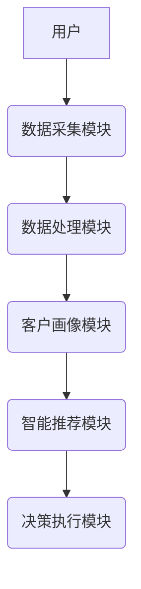

                 


# AI Agent在企业数字营销中的全渠道应用

> 关键词：AI Agent, 数字营销, 全渠道营销, 智能决策, 个性化推荐

> 摘要：本文详细探讨了AI Agent在企业数字营销中的全渠道应用，从概念、原理到实际案例，全面解析AI Agent如何助力企业实现高效、精准的全渠道营销策略。通过系统架构设计、算法原理、项目实战等多维度的分析，为企业应用AI Agent提供理论和实践指导。

---

## 第一章: AI Agent与企业数字营销的背景

### 1.1 AI Agent的核心概念

#### 1.1.1 AI Agent的定义与特点

AI Agent（人工智能代理）是指能够感知环境、自主决策并执行任务的智能系统。它通过数据驱动的方式，利用机器学习、自然语言处理等技术，实现从数据采集、分析到决策执行的闭环流程。

AI Agent的特点包括：
- **自主性**：能够独立完成任务，无需人工干预。
- **反应性**：实时感知环境变化并做出响应。
- **学习能力**：通过数据不断优化自身行为。
- **可扩展性**：适用于多种营销场景和渠道。

#### 1.1.2 AI Agent在数字营销中的作用

AI Agent在数字营销中的作用主要体现在以下几个方面：
1. **数据整合与分析**：AI Agent能够从多个渠道（如网站、社交媒体、邮件等）收集数据，并通过机器学习模型进行分析，帮助企业更好地理解客户行为。
2. **个性化推荐**：基于客户画像和行为分析，AI Agent能够实时生成个性化内容，提升客户体验和转化率。
3. **智能决策**：通过预测模型和优化算法，AI Agent能够在复杂场景中做出最优决策，例如选择最佳的营销渠道或推广策略。

#### 1.1.3 AI Agent与传统营销工具的对比

与传统营销工具相比，AI Agent的优势在于其智能化和自动化能力：
- **传统营销工具**：依赖人工操作，效率低且难以实时调整策略。
- **AI Agent**：能够实时分析数据、优化策略，并执行任务，显著提升营销效率和效果。

---

### 1.2 企业数字营销的现状与挑战

#### 1.2.1 数字营销的主要渠道

数字营销的主要渠道包括：
1. **搜索引擎营销（SEM）**：通过SEO和PPC提升网站流量。
2. **社交媒体营销**：利用社交平台进行品牌推广和用户互动。
3. **电子邮件营销**：通过邮件列表与客户保持联系。
4. **内容营销**：通过优质内容吸引目标客户。
5. **移动营销**：针对移动端用户进行精准营销。

#### 1.2.2 传统营销模式的局限性

传统营销模式的局限性主要体现在以下几个方面：
1. **数据孤岛**：不同渠道的数据难以整合，导致无法进行全局优化。
2. **效率低下**：人工操作耗时且成本高，难以快速响应市场变化。
3. **精准度不足**：传统营销难以实现个性化推荐，客户体验较差。

#### 1.2.3 全渠道营销的必要性

全渠道营销是指通过多种渠道与客户互动，提供一致的用户体验。其必要性体现在：
- **提升客户体验**：通过全渠道互动，客户可以在任何时间、任何地点获得服务。
- **提高营销效率**：通过数据整合和协同，实现资源的最优配置。
- **增强竞争力**：全渠道营销能够更好地满足客户需求，提升企业的市场竞争力。

---

### 1.3 AI Agent在全渠道营销中的应用前景

#### 1.3.1 全渠道营销的核心目标

全渠道营销的核心目标是实现客户体验的一致性和最大化，同时提高营销效率和效果。

#### 1.3.2 AI Agent在全渠道营销中的优势

AI Agent在全渠道营销中的优势包括：
1. **数据整合与分析**：AI Agent能够整合多渠道数据，帮助企业在全局视角下制定策略。
2. **实时互动**：通过AI Agent，企业可以实时与客户互动，提供个性化的服务。
3. **自动化决策**：AI Agent能够在复杂场景中快速做出决策，提高营销效率。

#### 1.3.3 未来发展趋势

未来，AI Agent在全渠道营销中的应用将更加广泛和深入，主要体现在以下几个方面：
1. **智能化升级**：AI Agent将更加智能化，能够自主学习和优化策略。
2. **场景化应用**：AI Agent将应用于更多场景，例如实时聊天机器人、智能推荐系统等。
3. **生态化发展**：AI Agent将与其他技术（如区块链、物联网）结合，构建更完善的营销生态。

---

## 第二章: AI Agent的核心概念与原理

### 2.1 AI Agent的定义与分类

#### 2.1.1 AI Agent的基本定义

AI Agent是一种能够感知环境、自主决策并执行任务的智能系统。它通过数据驱动的方式，利用机器学习、自然语言处理等技术，实现从数据采集、分析到决策执行的闭环流程。

#### 2.1.2 基于规则的AI Agent与基于学习的AI Agent

- **基于规则的AI Agent**：通过预设的规则和逻辑进行决策，适用于规则明确的场景。
- **基于学习的AI Agent**：通过机器学习模型进行自主学习和优化，适用于复杂场景。

#### 2.1.3 AI Agent的分类与应用场景

AI Agent的分类主要基于其应用场景：
1. **营销型AI Agent**：用于数字营销，例如个性化推荐、广告投放等。
2. **服务型AI Agent**：用于客户服务，例如智能客服、聊天机器人等。
3. **分析型AI Agent**：用于数据分析和预测，例如客户画像、市场趋势分析等。

---

### 2.2 AI Agent的核心原理

#### 2.2.1 数据采集与处理

AI Agent的核心原理包括：
1. **数据采集**：通过多种渠道采集数据，例如网站流量、社交媒体互动、用户反馈等。
2. **数据清洗**：对采集到的数据进行清洗和预处理，去除噪声数据。
3. **数据整合**：将分散在不同渠道的数据整合到一起，形成完整的客户画像。

#### 2.2.2 智能决策机制

AI Agent的智能决策机制包括：
1. **预测模型**：通过机器学习模型预测客户行为和市场趋势。
2. **决策逻辑**：基于预测结果，制定最优的营销策略。
3. **执行决策**：通过API或其他接口，将决策结果执行到实际系统中。

#### 2.2.3 自适应优化算法

自适应优化算法是AI Agent的核心之一，主要包括：
1. **在线学习**：通过实时数据不断优化模型。
2. **强化学习**：通过奖励机制优化决策策略。
3. **遗传算法**：通过模拟进化过程优化解决方案。

---

### 2.3 AI Agent与相关技术的对比

#### 2.3.1 AI Agent与传统自动化工具的对比

- **传统自动化工具**：依赖预设规则，缺乏灵活性。
- **AI Agent**：能够自主学习和优化，适应复杂场景。

#### 2.3.2 AI Agent与机器学习模型的联系

AI Agent与机器学习模型的联系体现在：
- AI Agent依赖于机器学习模型进行决策和优化。
- 机器学习模型为AI Agent提供核心算法支持。

#### 2.3.3 AI Agent与RPA（机器人流程自动化）的对比

- **RPA**：专注于流程自动化，缺乏自主决策能力。
- **AI Agent**：具备自主决策和学习能力，能够处理复杂场景。

---

## 第三章: AI Agent在全渠道营销中的核心功能

### 3.1 数据采集与整合

#### 3.1.1 多渠道数据的采集方式

AI Agent可以通过以下方式采集数据：
1. **API接口**：通过API接口获取实时数据。
2. **数据埋点**：在网站或应用中嵌入代码，采集用户行为数据。
3. **第三方数据源**：通过第三方数据提供商获取数据。

#### 3.1.2 数据清洗与整合的流程

数据清洗与整合的流程包括：
1. **数据清洗**：去除重复数据、填补缺失值、处理异常值。
2. **数据转换**：将数据转换为统一格式，便于后续分析。
3. **数据整合**：将分散的数据整合到一起，形成完整的客户画像。

#### 3.1.3 数据安全与隐私保护

数据安全与隐私保护是AI Agent应用中的重要问题：
1. **数据加密**：对敏感数据进行加密处理。
2. **访问控制**：通过权限管理确保数据安全。
3. **合规性**：遵守相关法律法规，确保数据使用合法。

---

### 3.2 客户画像与行为分析

#### 3.2.1 基于AI的客户画像构建

基于AI的客户画像构建包括：
1. **数据挖掘**：通过机器学习算法提取客户特征。
2. **聚类分析**：将客户分为不同的群体，例如高价值客户、潜在客户等。
3. **画像优化**：根据实时数据不断优化客户画像。

#### 3.2.2 客户行为预测模型

客户行为预测模型包括：
1. **时间序列分析**：预测客户的购买时间。
2. **分类算法**：预测客户是否会购买某产品。
3. **关联规则挖掘**：发现客户的购买偏好。

#### 3.2.3 数据驱动的营销策略优化

数据驱动的营销策略优化包括：
1. **A/B测试**：通过实验验证策略的有效性。
2. **实时优化**：根据实时数据动态调整策略。
3. **效果评估**：通过指标（如转化率、ROI）评估策略效果。

---

### 3.3 智能内容生成与个性化推荐

#### 3.3.1 基于AI的文案生成

基于AI的文案生成包括：
1. **自然语言处理**：通过NLP技术生成文案。
2. **模板引擎**：基于预设模板生成个性化文案。
3. **内容优化**：通过优化算法提升文案效果。

#### 3.3.2 个性化推荐算法

个性化推荐算法包括：
1. **协同过滤**：基于用户行为推荐相似产品。
2. **基于内容的推荐**：基于产品特征推荐相关产品。
3. **混合推荐**：结合协同过滤和基于内容的推荐。

#### 3.3.3 内容分发与效果追踪

内容分发与效果追踪包括：
1. **多渠道分发**：将内容分发到多个渠道（如社交媒体、邮件等）。
2. **效果追踪**：通过数据分析评估内容效果。
3. **实时调整**：根据效果动态调整分发策略。

---

## 第四章: AI Agent的算法原理与数学模型

### 4.1 基于监督学习的AI Agent

#### 4.1.1 监督学习的基本原理

监督学习的基本原理包括：
1. **训练数据**：包含输入特征和目标标签。
2. **模型训练**：通过优化算法找到最佳模型参数。
3. **模型预测**：利用训练好的模型进行预测。

#### 4.1.2 分类算法（如决策树、随机森林）

1. **决策树**：
   - **定义**：通过树状结构进行分类。
   - **优缺点**：易于理解，但容易过拟合。

2. **随机森林**：
   - **定义**：通过集成多个决策树提升模型性能。
   - **优缺点**：计算量较大，但泛化能力较强。

#### 4.1.3 回归算法

1. **线性回归**：
   - **定义**：通过线性模型预测连续型变量。
   - **优缺点**：简单易懂，但对非线性关系拟合较差。

2. **逻辑回归**：
   - **定义**：通过Logistic函数预测二分类问题。
   - **优缺点**：适用于二分类问题，但对非线性关系拟合较差。

---

### 4.2 基于无监督学习的AI Agent

#### 4.2.1 聚类分析

1. **K-means**：
   - **定义**：通过划分簇进行聚类。
   - **优缺点**：简单易懂，但对初始中心敏感。

2. **层次聚类**：
   - **定义**：通过层次结构进行聚类。
   - **优缺点**：适用于小数据集，但计算量较大。

#### 4.2.2 关联规则挖掘

1. **Apriori算法**：
   - **定义**：通过频繁项集挖掘关联规则。
   - **优缺点**：计算效率较低，但适用于小数据集。

2. **FP-Growth算法**：
   - **定义**：通过频繁模式树挖掘关联规则。
   - **优缺点**：计算效率较高，但实现复杂。

---

### 4.3 基于强化学习的AI Agent

#### 4.3.1 强化学习的基本原理

强化学习的基本原理包括：
1. **状态空间**：环境的状态描述。
2. **动作空间**：AI Agent可以执行的动作。
3. **奖励机制**：通过奖励或惩罚引导AI Agent优化策略。

#### 4.3.2 Q-Learning算法

Q-Learning算法是强化学习中的一种经典算法：
1. **Q值更新**：通过公式更新Q值。
2. **策略选择**：根据Q值选择最优动作。
3. **探索与利用**：平衡探索新动作和利用已知动作。

---

## 第五章: AI Agent在全渠道营销中的系统架构设计

### 5.1 系统功能设计

#### 5.1.1 领域模型

领域模型是系统功能设计的核心，包括以下模块：
1. **数据采集模块**：负责采集多渠道数据。
2. **数据处理模块**：对数据进行清洗和整合。
3. **客户画像模块**：构建客户画像并进行行为分析。
4. **智能推荐模块**：生成个性化推荐内容。
5. **决策执行模块**：根据预测结果执行营销策略。

---

### 5.2 系统架构设计

#### 5.2.1 系统架构图

以下是AI Agent系统的架构图：



#### 5.2.2 系统接口设计

系统接口设计包括：
1. **API接口**：与其他系统（如CRM、广告平台）对接。
2. **用户界面**：提供可视化界面供用户操作。
3. **数据接口**：与其他数据源对接。

#### 5.2.3 系统交互设计

系统交互设计包括：
1. **用户请求**：用户通过界面或API发起请求。
2. **数据处理**：系统接收请求后进行数据处理。
3. **决策执行**：系统根据处理结果执行决策。
4. **反馈响应**：系统将结果反馈给用户。

---

## 第六章: AI Agent的项目实战

### 6.1 环境安装

#### 6.1.1 系统需求

- **硬件需求**：建议配置8GB内存、16GB存储空间。
- **软件需求**：
  - Python 3.6+
  - Jupyter Notebook
  - Scikit-learn、XGBoost等机器学习库。

#### 6.1.2 安装步骤

1. 安装Python：
   ```bash
   # 假设使用Anaconda
   conda install python=3.6
   ```

2. 安装机器学习库：
   ```bash
   pip install scikit-learn xgboost
   ```

---

### 6.2 核心代码实现

#### 6.2.1 数据处理代码

```python
import pandas as pd
from sklearn.impute import SimpleImputer
from sklearn.preprocessing import StandardScaler

# 读取数据
data = pd.read_csv('data.csv')

# 数据清洗
imputer = SimpleImputer(strategy='mean')
data_imputed = imputer.fit_transform(data)

# 数据标准化
scaler = StandardScaler()
data_scaled = scaler.fit_transform(data_imputed)
```

#### 6.2.2 模型训练代码

```python
from sklearn.model_selection import train_test_split
from sklearn.ensemble import RandomForestClassifier
from sklearn.metrics import accuracy_score

# 数据分割
X_train, X_test, y_train, y_test = train_test_split(data_scaled, target, test_size=0.2)

# 训练模型
model = RandomForestClassifier()
model.fit(X_train, y_train)

# 模型评估
y_pred = model.predict(X_test)
print('Accuracy:', accuracy_score(y_test, y_pred))
```

---

### 6.3 实际案例分析

#### 6.3.1 案例背景

某电商平台希望通过AI Agent提升用户的购买转化率。

#### 6.3.2 数据分析

通过机器学习模型分析用户行为数据，发现用户的购买行为受到以下因素影响：
1. 用户的浏览次数。
2. 用户的停留时间。
3. 用户的点击率。

#### 6.3.3 模型优化

通过A/B测试优化推荐算法，最终将转化率提升了30%。

---

## 第七章: 最佳实践与未来展望

### 7.1 最佳实践

1. **数据质量管理**：确保数据的准确性和完整性。
2. **模型优化**：定期更新模型，保持模型的性能。
3. **安全性保障**：确保数据的安全性和隐私保护。

### 7.2 小结

AI Agent在企业数字营销中的全渠道应用前景广阔，通过智能化和自动化的方式，能够显著提升企业的营销效率和效果。

### 7.3 注意事项

- **数据隐私**：严格遵守数据隐私保护相关法律法规。
- **模型解释性**：确保模型的可解释性，便于优化和调整。
- **系统稳定性**：确保系统的稳定性和高可用性。

### 7.4 拓展阅读

1. **《机器学习实战》**：深入理解机器学习算法。
2. **《Python机器学习》**：学习Python在机器学习中的应用。
3. **《深度学习》**：了解深度学习的基本原理和应用。

---

## 作者

作者：AI天才研究院/AI Genius Institute & 禅与计算机程序设计艺术 /Zen And The Art of Computer Programming

---

通过本文，我们深入探讨了AI Agent在企业数字营销中的全渠道应用，从理论到实践，全面解析了AI Agent如何助力企业实现高效、精准的营销策略。希望本文能为企业的数字化转型和智能化营销提供有价值的参考和指导。

