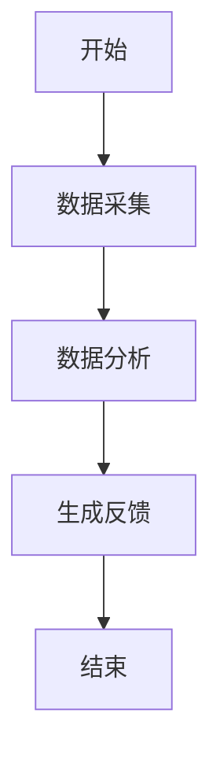
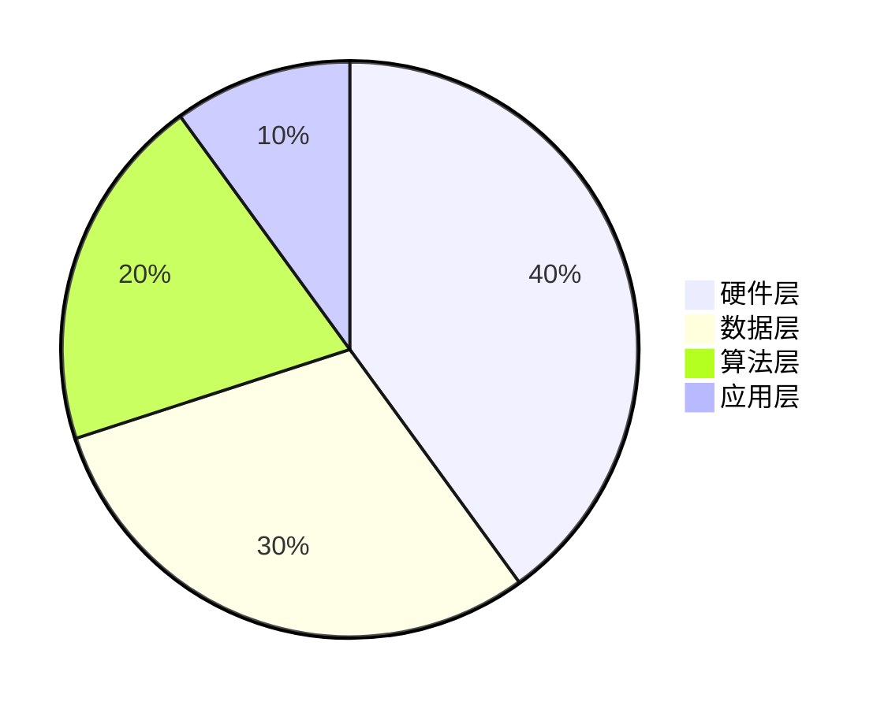
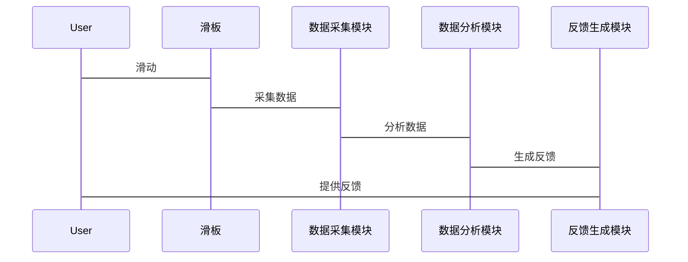

                 


# AI Agent在智能滑板中的技巧学习指导

> 关键词：AI Agent, 智能滑板, 技巧学习, 强化学习, 算法实现, 系统设计, 项目实战

> 摘要：本文详细探讨了AI Agent在智能滑板中的应用，重点介绍了AI Agent如何通过强化学习、监督学习和迁移学习等算法来辅助滑板技巧的学习。文章从背景介绍、核心原理、算法实现、系统设计、项目实战等多个方面展开，结合实际案例和代码示例，为读者提供了一套完整的解决方案。

---

## 第一章: AI Agent与智能滑板的背景介绍

### 1.1 AI Agent的核心概念
AI Agent是一种能够感知环境、自主决策并执行任务的智能实体。它通过传感器获取数据，利用算法进行分析和决策，从而实现目标。在智能滑板中，AI Agent主要用于辅助学习者优化滑板技巧，提供实时反馈和个性化指导。

#### 1.1.1 AI Agent的定义与功能
- **定义**：AI Agent是具有感知、推理、学习和执行能力的智能系统。
- **功能**：包括数据采集、决策制定、动作优化和反馈生成。

#### 1.1.2 AI Agent在智能滑板中的应用
- **数据采集**：通过传感器收集滑板运动数据，如加速度、角度和速度。
- **实时反馈**：分析数据后，向学习者提供即时反馈，帮助纠正动作。
- **个性化指导**：根据学习者的水平和特点，定制训练计划。

#### 1.1.3 AI Agent的优势与局限性
- **优势**：高效性、精确性、可扩展性。
- **局限性**：依赖数据质量、算法复杂性、环境适应性有限。

### 1.2 智能滑板的背景与现状
智能滑板结合了传统滑板和现代科技，通过传感器和AI技术提供智能化的滑板体验。当前，智能滑板在运动训练、健康监测和娱乐体验方面应用广泛。

#### 1.2.1 滑板运动的起源与发展
- 起源于冲浪运动，后逐渐发展为一种极限运动。
- 现代滑板结合了科技，使其具备更多功能。

#### 1.2.2 智能滑板的技术基础
- 基于传感器、AI算法和物联网技术。
- 实现数据采集、分析和反馈。

#### 1.2.3 当前智能滑板的应用场景
- **运动训练**：帮助学习者优化技巧。
- **健康监测**：监测身体状况，预防受伤。
- **娱乐体验**：提供互动游戏和个性化体验。

### 1.3 AI Agent在滑板技巧学习中的作用
AI Agent通过实时分析滑板数据，提供个性化指导和反馈，帮助学习者更快掌握技巧。

#### 1.3.1 AI Agent如何辅助技巧学习
- **实时反馈**：通过传感器数据，即时纠正动作错误。
- **个性化计划**：根据学习者的水平，制定训练计划。
- **进步追踪**：记录学习者进步，提供改进建议。

#### 1.3.2 AI Agent在滑板训练中的优势
- **高效性**：快速分析数据，提供即时反馈。
- **精准性**：基于算法，优化动作细节。
- **可扩展性**：适用于不同水平的学习者。

#### 1.3.3 AI Agent与传统教学方法的对比
| 对比维度 | AI Agent | 传统教学 |
|----------|-----------|-----------|
| 反馈速度 | 实时       | 延时       |
| 个性化   | 高         | 低         |
| 精准度   | 高         | 中等       |
| 可扩展性 | 高         | 低         |

### 1.4 本章小结
本章介绍了AI Agent和智能滑板的基本概念，探讨了AI Agent在滑板技巧学习中的作用及其优势。

---

## 第二章: AI Agent的核心原理

### 2.1 AI Agent的感知机制
AI Agent通过传感器获取滑板数据，分析环境状态。

#### 2.1.1 传感器数据的采集与处理
- **数据采集**：使用加速度计、陀螺仪等传感器。
- **数据处理**：过滤噪声，提取特征。

#### 2.1.2 数据特征的提取与分析
- **特征提取**：识别关键动作特征，如加速、倾斜。
- **分析模型**：构建模型分析特征之间的关系。

#### 2.1.3 感知模型的构建与优化
- **模型构建**：基于机器学习算法，训练感知模型。
- **优化方法**：使用反馈机制提升模型准确性。

### 2.2 AI Agent的决策机制
AI Agent根据感知结果，选择最优动作。

#### 2.2.1 决策算法的选择与实现
- **算法选择**：强化学习、监督学习等。
- **实现步骤**：定义状态、动作和奖励函数。

#### 2.2.2 决策模型的训练与优化
- **训练方法**：使用大量数据训练模型。
- **优化策略**：调整参数，提升决策准确性。

#### 2.2.3 多目标决策的协调与平衡
- **协调方法**：优先级排序。
- **平衡策略**：权衡不同目标的影响。

### 2.3 AI Agent的执行机制
AI Agent根据决策结果，执行具体动作。

#### 2.3.1 执行动作的规划与实现
- **动作规划**：制定详细动作步骤。
- **实现方法**：通过滑板硬件执行动作。

#### 2.3.2 动作优化的策略与方法
- **优化策略**：基于反馈调整动作。
- **实现方法**：实时调整参数。

#### 2.3.3 执行结果的反馈与调整
- **反馈机制**：收集执行结果。
- **调整策略**：根据反馈优化下一步动作。

### 2.4 本章小结
本章详细介绍了AI Agent的核心原理，包括感知、决策和执行三个主要环节。

---

## 第三章: 滑板技巧学习的算法实现

### 3.1 强化学习在滑板技巧学习中的应用
强化学习是一种通过试错优化决策的算法。

#### 3.1.1 强化学习的基本原理
- **定义**：通过试错和奖励机制优化决策。
- **核心要素**：状态、动作、奖励。

#### 3.1.2 Q-learning算法在滑板技巧学习中的应用
- **算法流程**：
  1. 初始状态：滑板位置。
  2. 动作选择：基于Q值选择动作。
  3. 执行动作：滑板移动。
  4. 反馈奖励：获得奖励或惩罚。
  5. 更新Q值：基于奖励调整Q值。
- **数学模型**：
  $$ Q(s, a) = Q(s, a) + \alpha (r + \gamma \max Q(s', a') - Q(s, a)) $$
  其中，$\alpha$是学习率，$\gamma$是折扣因子。

#### 3.1.3 算法实现的步骤与流程
1. 初始化Q表。
2. 进入初始状态。
3. 选择动作。
4. 执行动作，获得奖励。
5. 更新Q值。
6. 重复步骤，直到收敛。

### 3.2 监督学习在滑板技巧学习中的应用
监督学习基于标注数据进行分类或回归。

#### 3.2.1 监督学习的基本原理
- **定义**：基于标注数据训练模型。
- **核心要素**：特征、标签。

#### 3.2.2 滑板技巧数据的标注与处理
- **数据标注**：人工标注滑板动作。
- **数据处理**：清洗、归一化。

#### 3.2.3 监督学习算法的实现与优化
- **算法选择**：线性回归、支持向量机。
- **优化策略**：交叉验证、正则化。

### 3.3 迁移学习在滑板技巧学习中的应用
迁移学习将已学知识应用于新任务。

#### 3.3.1 迁移学习的基本原理
- **定义**：利用已有知识优化新任务。
- **核心要素**：源任务、目标任务。

#### 3.3.2 滑板技巧数据的迁移与适应
- **数据迁移**：将其他运动数据迁移到滑板。
- **适应方法**：调整模型参数。

#### 3.3.3 迁移学习算法的实现与优化
- **算法选择**：领域适配、联合训练。
- **优化策略**：微调、对抗训练。

### 3.4 本章小结
本章探讨了强化学习、监督学习和迁移学习在滑板技巧学习中的应用，详细介绍了算法实现步骤和优化策略。

---

## 第四章: 系统设计与架构

### 4.1 系统功能设计
AI Agent智能滑板系统具备数据采集、分析和反馈功能。

#### 4.1.1 系统功能模块
- 数据采集模块：收集滑板数据。
- 数据分析模块：分析数据，生成反馈。
- 反馈生成模块：提供实时反馈。

#### 4.1.2 功能流程图


### 4.2 系统架构设计
系统由硬件和软件两部分组成。

#### 4.2.1 系统架构图


#### 4.2.2 系统交互图


### 4.3 系统接口设计
系统通过蓝牙或Wi-Fi与外部设备通信。

#### 4.3.1 接口设计
- 数据接口：传感器数据接口。
- 用户接口：反馈显示接口。

#### 4.3.2 接口交互流程
1. 用户滑动滑板。
2. 滑板通过传感器采集数据。
3. 数据传输到分析模块。
4. 分析模块生成反馈。
5. 反馈显示给用户。

### 4.4 本章小结
本章设计了AI Agent智能滑板系统的功能模块、架构和交互流程。

---

## 第五章: 项目实战

### 5.1 环境安装与配置
安装必要的软件和库。

#### 5.1.1 环境要求
- 操作系统：Linux/Windows/MacOS。
- 开发工具：Python、Jupyter Notebook。
- 库：TensorFlow、Keras、Scikit-learn。

#### 5.1.2 环境配置
1. 安装Python。
2. 安装必要的库。
3. 配置开发环境。

### 5.2 系统核心实现
实现AI Agent的核心算法。

#### 5.2.1 数据采集与处理代码
```python
import numpy as np

def collect_data():
    # 模拟传感器数据
    data = np.random.randn(100, 3)  # 假设3个传感器
    return data

def process_data(data):
    # 数据处理
    processed_data = data * 0.5 + np.mean(data)
    return processed_data

# 示例
data = collect_data()
processed_data = process_data(data)
print(processed_data)
```

#### 5.2.2 强化学习算法实现
```python
class AI-Agent:
    def __init__(self):
        self.Q = {}

    def choose_action(self, state):
        # 简单的Q-learning算法
        if state not in self.Q:
            self.Q[state] = 0
        return 'forward'

    def update_Q(self, state, action, reward, next_state):
        # 更新Q值
        self.Q[state] = self.Q[state] + 0.1 * (reward - self.Q[state])
```

### 5.3 代码应用与分析
展示代码在滑板技巧学习中的应用。

#### 5.3.1 代码实现
```python
def main():
    agent = AI-Agent()
    state = 'start'
    action = agent.choose_action(state)
    reward = evaluate_action(state, action)
    next_state = update_state(state, action)
    agent.update_Q(state, action, reward, next_state)
```

#### 5.3.2 应用分析
- **代码实现**：定义了AI-Agent类和主函数。
- **算法应用**：展示了强化学习在滑板动作选择中的应用。

### 5.4 本章小结
本章通过实际项目展示了AI Agent在智能滑板中的实现，提供了环境配置和代码示例。

---

## 第六章: 扩展讨论

### 6.1 进阶技巧与高级算法
探讨高级算法在滑板技巧学习中的应用。

#### 6.1.1 高级强化学习算法
- DQN、PPO等。

#### 6.1.2 算法优化技巧
- 网络结构优化、超参数调整。

### 6.2 常见问题与解决方案
分析常见问题并提供解决方案。

#### 6.2.1 传感器数据质量问题
- 数据清洗、特征选择。

#### 6.2.2 算法收敛速度慢
- 增加数据量、优化算法参数。

### 6.3 未来趋势与研究方向
探讨AI Agent在智能滑板中的未来发展方向。

#### 6.3.1 技术趋势
- 更高的智能化、更强的实时性。

#### 6.3.2 研究方向
- 新型算法研究、人机协作优化。

### 6.4 本章小结
本章探讨了AI Agent在智能滑板中的进阶技巧、常见问题和未来趋势。

---

## 第七章: 总结

### 7.1 全文总结
总结全文内容和主要观点。

#### 7.1.1 核心内容回顾
- AI Agent的基本原理。
- 强化学习、监督学习、迁移学习的应用。
- 系统设计与实现。

#### 7.1.2 主要观点总结
- AI Agent在滑板技巧学习中的重要作用。
- 各种算法的优缺点及应用场景。

### 7.2 注意事项与建议
提醒读者在实际应用中需要注意的问题。

#### 7.2.1 使用建议
- 确保数据质量。
- 合理选择算法。

#### 7.2.2 注意事项
- 数据隐私保护。
- 算法的可解释性。

### 7.3 拓展阅读与学习资源
推荐相关书籍和资源。

#### 7.3.1 推荐书籍
- 《强化学习（深入浅出）》
- 《机器学习实战》

#### 7.3.2 在线资源
- 官方文档、技术博客。

### 7.4 本章小结
本章总结了全文内容，并提供了进一步学习的资源和建议。

---

## 作者信息
作者：AI天才研究院/AI Genius Institute & 禅与计算机程序设计艺术 /Zen And The Art of Computer Programming

---

这篇文章详细探讨了AI Agent在智能滑板中的应用，通过背景介绍、算法实现、系统设计和项目实战等部分，为读者提供了一套完整的解决方案。希望本文能为AI Agent在滑板技巧学习中的应用提供有价值的参考和指导。

