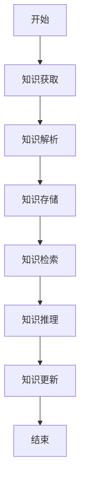
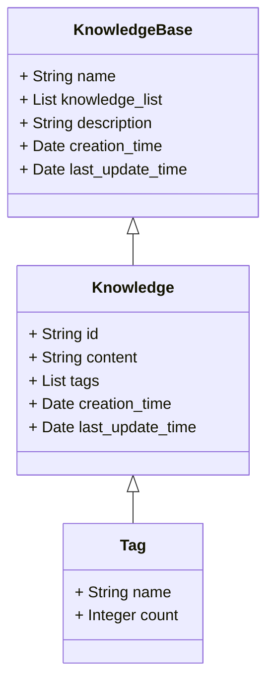

                 


# 企业AI Agent的知识库管理系统

## 关键词：
企业AI Agent、知识库管理、系统架构、算法原理、项目实战

## 摘要：
本文详细探讨了企业AI Agent的知识库管理系统的设计与实现。从问题背景到核心概念，从算法原理到系统架构，从项目实战到最佳实践，全面分析了该系统的各个方面。通过理论分析和实际案例，本文为读者提供了一套完整的解决方案，帮助企业在智能化转型中构建高效的知识库管理系统。

---

# 第一部分：问题背景与概念背景

## 第1章：问题背景与概念背景

### 1.1 问题背景

#### 1.1.1 企业AI Agent的发展现状
随着人工智能技术的快速发展，企业AI Agent（智能体）的应用越来越广泛。AI Agent通过自动化处理企业数据、信息和业务流程，显著提升了企业的效率和决策能力。然而，AI Agent的性能和准确性 heavily depend on the quality and comprehensiveness of the knowledge base it relies on.

#### 1.1.2 知识库管理在企业中的重要性
知识库是AI Agent的核心资源，它存储了企业的各类信息，如产品数据、客户信息、业务规则等。高效的knowledge management ensures that AI Agent能够快速准确地响应用户需求，提高企业的竞争力。

#### 1.1.3 当前知识库管理的主要挑战
尽管知识库管理的重要性不言而喻，但在实际应用中仍面临诸多挑战：
- 数据的多样性和复杂性导致知识表示困难。
- 知识更新的及时性与准确性难以兼顾。
- 知识检索和推理的效率问题。

### 1.2 问题描述

#### 1.2.1 企业AI Agent的核心需求
企业AI Agent需要一个高效、可靠的知识库管理系统来支持其运作。具体需求包括：
- 支持多种数据格式和存储方式。
- 提供灵活的知识检索和推理能力。
- 实现知识的动态更新和版本控制。

#### 1.2.2 知识库管理的业务场景
知识库管理在企业中的主要业务场景包括：
- 客户服务：通过知识库快速响应客户问题。
- 业务流程自动化：利用知识库实现自动化操作。
- 数据分析：基于知识库进行数据挖掘和分析。

#### 1.2.3 知识库管理的痛点与难点
- 数据孤岛问题：各部门数据分散，难以统一管理。
- 知识更新延迟：面对快速变化的业务需求，知识更新往往滞后。
- 知识表示复杂：不同领域的知识表示方式差异大，难以统一。

### 1.3 问题解决

#### 1.3.1 知识库管理的目标与价值
知识库管理的目标是实现企业知识的高效存储、检索和应用。其价值体现在：
- 提高AI Agent的响应速度和准确性。
- 降低企业运营成本。
- 支持企业快速适应市场变化。

#### 1.3.2 知识库管理的关键成功因素
成功的知识库管理需要关注以下关键因素：
- 数据的标准化和规范化。
- 知识的动态更新和维护。
- 知识的可扩展性和灵活性。

#### 1.3.3 知识库管理的实施路径
实施知识库管理的路径包括：
1. 确定知识库的范围和目标。
2. 设计知识表示和存储的方案。
3. 实现知识的动态更新和维护。
4. 集成AI Agent，实现知识的应用。

### 1.4 边界与外延

#### 1.4.1 知识库管理的边界定义
知识库管理的边界包括：
- 数据的输入和输出范围。
- 知识表示的格式和规范。
- 知识应用的场景和限制。

#### 1.4.2 相关概念的对比分析
与知识库管理相关的概念包括：
- 数据库管理：侧重于数据的存储和检索。
- 知识图谱：侧重于语义网络的构建。
- 专家系统：侧重于基于知识的推理和决策。

#### 1.4.3 知识库管理的外延扩展
知识库管理的外延包括：
- 多模态数据的整合。
- 智能化知识推理。
- 自适应知识更新。

### 1.5 概念结构与核心要素

#### 1.5.1 知识库管理的构成要素
知识库管理的构成要素包括：
- 数据源：知识的输入渠道。
- 知识表示：知识的组织方式。
- 知识存储：知识的物理存储方式。
- 知识检索：知识的查询方式。
- 知识推理：基于知识的逻辑推理。

#### 1.5.2 各要素之间的关系
各要素之间的关系如下：
- 数据源提供原始数据，知识表示将其转化为结构化知识。
- 知识存储将结构化知识存入数据库，知识检索根据查询需求提取知识，知识推理基于知识进行推理和决策。

#### 1.5.3 核心要素的特征对比
以下是核心要素的特征对比：

| 要素       | 特征1：结构化程度 | 特征2：动态性 | 特征3：复杂性 |
|------------|------------------|--------------|-------------|
| 数据源     | 低               | 高            | 高           |
| 知识表示    | 高               | 中            | 中           |
| 知识存储    | 高               | 中            | 中           |
| 知识检索    | 高               | 中            | 中           |
| 知识推理    | 高               | 中            | 高           |

### 1.6 本章小结
本章从问题背景出发，分析了知识库管理在企业AI Agent中的重要性，明确了知识库管理的目标、挑战和实施路径。通过对比分析，界定了知识库管理的边界，并详细阐述了其核心要素及其关系。

---

# 第二部分：核心概念与联系

## 第2章：核心概念与联系

### 2.1 核心概念原理

#### 2.1.1 知识库管理的原理分析
知识库管理的原理包括：
- 数据清洗：对原始数据进行去噪和标准化处理。
- 知识抽取：从数据中提取有用的知识。
- 知识融合：将多个数据源的知识进行整合。
- 知识存储：将融合后的知识存储到知识库中。
- 知识检索：根据查询需求，快速检索相关知识。
- 知识推理：基于知识进行逻辑推理，生成新的知识。

#### 2.1.2 AI Agent的知识表示方法
知识表示方法包括：
- 符号表示：使用符号和规则表示知识。
- 语义网络：通过节点和边表示知识的语义关系。
- 知识图谱：通过图结构表示实体及其关系。

#### 2.1.3 知识库管理的实现机制
知识库管理的实现机制包括：
- 数据预处理：清洗和转换数据。
- 知识建模：设计知识的表示方式。
- 知识存储：选择合适的存储技术和数据结构。
- 知识检索：实现高效的查询算法。
- 知识更新：维护知识库的最新性。

### 2.2 概念属性特征对比

#### 2.2.1 不同知识库管理方法的对比
以下是几种常见知识库管理方法的对比：

| 方法         | 特点1：存储方式 | 特点2：查询效率 | 特点3：扩展性 |
|--------------|----------------|----------------|--------------|
| 基于关系的管理 | 高              | 低              | 高            |
| 基于语义的管理 | 中              | 高              | 中            |
| 基于图的管理   | 低              | 高              | 高            |

#### 2.2.2 各种AI Agent类型的特点
以下是常见AI Agent类型的对比：

| 类型         | 特点1：自主性 | 特点2：反应性 | 特点3：社会性 |
|--------------|----------------|---------------|--------------|
| 反应式Agent  | 低              | 高              | 低            |
| 规则式Agent  | 中              | 中              | 低            |
| 学习式Agent  | 高              | 高              | 中            |

#### 2.2.3 核心概念的属性分析
核心概念的属性分析如下：

| 概念         | 属性1：数据源 | 属性2：知识表示 | 属性3：知识推理 |
|--------------|----------------|-----------------|----------------|
| 知识库管理   | 多源           | 结构化           | 基于规则        |
| AI Agent     | 业务数据       | 符号化           | 基于知识图谱     |

### 2.3 ER实体关系图

```mermaid
er
  actor: 用户
  knowledge_base: 知识库
  agent: AI Agent
  relation: 管理
  actor -[管理]-> knowledge_base
  knowledge_base -[管理]-> agent
```

### 2.4 本章小结
本章深入分析了知识库管理的核心概念与联系，包括知识表示方法、实现机制以及不同管理方法的对比。通过ER实体关系图，明确了知识库管理的主要实体及其关系。

---

# 第三部分：算法原理讲解

## 第3章：算法原理讲解

### 3.1 算法原理

#### 3.1.1 知识库管理算法的总体框架
知识库管理算法的总体框架包括：
1. 数据预处理：清洗和转换数据。
2. 知识抽取：从数据中提取有用的知识。
3. 知识融合：整合多源知识。
4. 知识存储：将知识存储到数据库中。
5. 知识检索：根据查询需求，快速检索相关知识。
6. 知识推理：基于知识进行逻辑推理。

#### 3.1.2 知识表示与推理算法
知识表示与推理算法包括：
- 符号逻辑推理：基于符号逻辑进行推理。
- 语义网络推理：基于语义网络进行推理。
- 知识图谱推理：基于知识图谱进行推理。

#### 3.1.3 知识更新与维护算法
知识更新与维护算法包括：
- 增量更新：仅更新变化的部分。
- 全量更新：完全重建知识库。
- 分布式更新：在分布式系统中进行知识更新。

### 3.2 算法流程图



### 3.3 算法实现代码

```python
def knowledge_management_algorithm(knowledge_base):
    # 知识获取
    knowledge = get_knowledge_from_source(knowledge_base)
    # 知识解析
    parsed_knowledge = parse_knowledge(knowledge)
    # 知识存储
    store_knowledge(parsed_knowledge, knowledge_base)
    # 知识检索
    retrieved_knowledge = search_knowledge(parsed_knowledge, knowledge_base)
    # 知识推理
    inferred_knowledge = infer_knowledge(retrieved_knowledge)
    # 知识更新
    update_knowledge(inferred_knowledge, knowledge_base)
    return inferred_knowledge
```

### 3.4 算法数学模型与公式

#### 3.4.1 知识表示的向量空间模型
知识表示的向量空间模型可以用以下公式表示：
$$
\text{向量} = \sum_{i=1}^{n} w_i \cdot v_i
$$
其中，$w_i$ 是第$i$个词的权重，$v_i$ 是第$i$个词的向量。

#### 3.4.2 知识推理的逻辑推理模型
知识推理的逻辑推理模型可以用以下公式表示：
$$
\text{结论} = \text{逻辑推理}(\text{前提}_1, \text{前提}_2, \ldots, \text{前提}_n)
$$
其中，$\text{前提}_i$ 是推理的前提条件。

### 3.5 算法举例说明

#### 3.5.1 知识抽取的示例
假设我们有一个客户评论数据集，我们需要从中抽取客户满意度。首先，我们需要对评论进行分词和情感分析，然后将满意度分类为“满意”、“一般”或“不满意”。

#### 3.5.2 知识融合的示例
假设我们有两个数据源，一个是客户评论，另一个是产品规格。我们需要将这两个数据源的知识进行融合，生成综合的产品评价。

#### 3.5.3 知识推理的示例
假设我们有一个知识库，其中包含“产品A的价格是100元”和“产品A的库存为0”，我们可以推理出“产品A无货”的结论。

### 3.6 本章小结
本章详细讲解了知识库管理的算法原理，包括总体框架、具体算法、流程图、代码实现以及数学模型。通过具体示例，进一步加深了对算法的理解。

---

# 第四部分：系统分析与架构设计方案

## 第4章：系统分析与架构设计方案

### 4.1 问题场景介绍
假设我们正在为一家电商平台开发一个AI客服系统，该系统需要能够回答客户的问题，处理订单，提供售后服务等。为了实现这些功能，我们需要一个高效的知识库管理系统来支持AI Agent的运作。

### 4.2 项目介绍
本项目的目标是开发一个支持企业AI Agent的知识库管理系统，实现知识的高效存储、检索和推理。系统将支持多源数据输入、结构化知识表示、动态知识更新等功能。

### 4.3 系统功能设计

#### 4.3.1 领域模型设计
以下是系统的领域模型：



#### 4.3.2 系统架构设计


#### 4.3.3 系统接口设计
以下是系统的主要接口：

- `get_knowledge()`：获取指定的知识。
- `update_knowledge()`：更新知识。
- `search_knowledge()`：检索知识。
- `infer_knowledge()`：推理知识。

### 4.4 本章小结
本章通过实际问题场景的介绍，详细分析了系统的功能需求和架构设计。通过领域模型和架构图，明确了系统的各个组件及其关系。

---

# 第五部分：项目实战

## 第5章：项目实战

### 5.1 环境安装

#### 5.1.1 系统需求
- Python 3.8+
- Jupyter Notebook
- PostgreSQL

#### 5.1.2 安装依赖
```bash
pip install python-postgresql
pip install spacy
pip install networkx
```

### 5.2 系统核心实现源代码

#### 5.2.1 数据预处理代码
```python
import spacy

def preprocess_data(data):
    nlp = spacy.load("en_core_web_sm")
    doc = nlp(data)
    tokens = [token.text for token in doc]
    return tokens
```

#### 5.2.2 知识表示代码
```python
from spacy.lang.en import English

def represent_knowledge(knowledge):
    nlp = English()
    doc = nlp(knowledge)
    return [(token.text, token.lemma_, token.pos_) for token in doc]
```

#### 5.2.3 知识推理代码
```python
import networkx as nx

def infer_knowledge(knowledge_graph):
    G = nx.DiGraph(knowledge_graph)
    return nx.transitive_closure(G)
```

### 5.3 代码应用解读与分析
1. 数据预处理代码使用spaCy对文本进行分词处理。
2. 知识表示代码将文本表示为结构化的形式，包括词干和词性。
3. 知识推理代码使用NetworkX构建知识图谱，并计算其传递闭包。

### 5.4 实际案例分析

#### 5.4.1 案例背景
我们以电商平台的客服系统为例，设计一个简单的知识库管理系统。

#### 5.4.2 知识库实现
以下是知识库的实现：

```python
class KnowledgeBase:
    def __init__(self, name):
        self.name = name
        self.knowledge = {}

    def add_knowledge(self, id, content, tags):
        self.knowledge[id] = {
            "content": content,
            "tags": tags
        }

    def get_knowledge(self, id):
        return self.knowledge.get(id, None)

    def update_knowledge(self, id, content, tags):
        if id in self.knowledge:
            self.knowledge[id] = {
                "content": content,
                "tags": tags
            }

    def search_knowledge(self, tag):
        results = []
        for id, knowledge in self.knowledge.items():
            if tag in knowledge["tags"]:
                results.append(knowledge)
        return results
```

#### 5.4.3 案例分析
通过上述代码，我们可以实现一个简单的知识库管理系统，支持知识的添加、获取、更新和检索。

### 5.5 本章小结
本章通过实际案例分析，详细讲解了知识库管理系统的实现过程，包括环境安装、代码实现和案例分析。

---

# 第六部分：最佳实践

## 第6章：最佳实践

### 6.1 最佳实践 tips
- 数据预处理是知识管理的关键，确保数据的干净和一致性。
- 选择合适的知识表示方法，提高知识检索和推理的效率。
- 定期更新知识库，确保知识的准确性和及时性。
- 使用分布式架构，提高系统的可扩展性和可靠性。

### 6.2 小结
通过本文的详细讲解，我们掌握了企业AI Agent的知识库管理系统的各个方面，包括问题背景、核心概念、算法原理、系统架构、项目实战和最佳实践。

### 6.3 注意事项
- 知识库管理需要跨团队协作，确保数据的准确性和一致性。
- 系统设计时要充分考虑可扩展性和可维护性。
- 定期进行系统性能优化，提高知识检索和推理的效率。

### 6.4 拓展阅读
- 《Knowledge Representation and Reasoning》
- 《Designing Enterprise Knowledge Management Systems》
- 《Applied Artificial Intelligence: Principles and Practice》

### 6.5 本章小结
本章总结了知识库管理系统的最佳实践，包括注意事项和拓展阅读，为读者提供了进一步学习和实践的资源。

---

# 作者

作者：AI天才研究院/AI Genius Institute & 禅与计算机程序设计艺术 /Zen And The Art of Computer Programming

