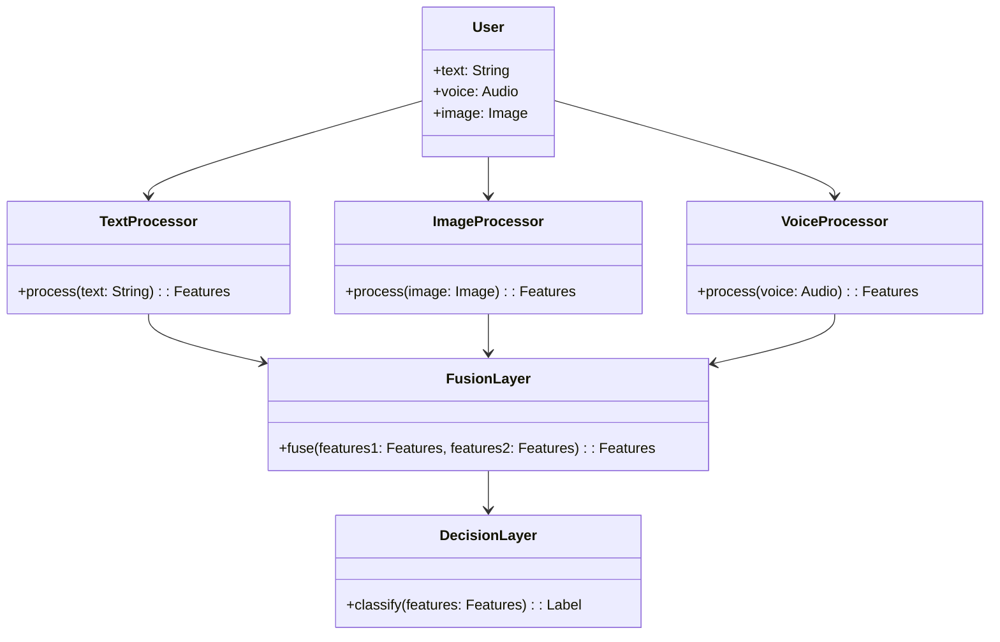
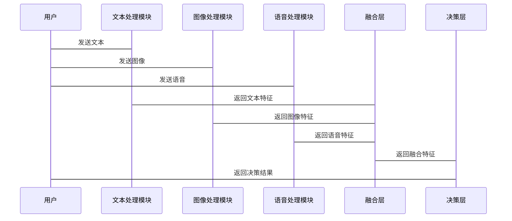

                 


# 多模态AI Agent：整合文本、图像和语音

## 关键词：多模态AI Agent，文本处理，图像处理，语音处理，数据融合，神经网络

## 摘要：  
多模态AI Agent整合了文本、图像和语音等多种数据形式，通过深度学习和多模态数据融合技术，提升AI系统在复杂场景下的理解和处理能力。本文将从多模态AI Agent的核心概念出发，详细讲解文本、图像和语音的处理方法，探讨多模态数据融合的策略，分析神经网络在多模态学习中的应用，并通过实际案例展示如何构建一个多模态AI Agent系统。

---

# 第1章：多模态AI Agent的基本概念

## 1.1 多模态AI Agent的定义与背景

多模态AI Agent是一种能够同时处理和理解多种数据形式（如文本、图像、语音等）的人工智能代理。它通过整合不同模态的数据，能够更全面地感知和理解环境，从而在复杂场景中提供更智能的服务。

### 1.1.1 多模态数据的定义

多模态数据指的是来自不同感官渠道或数据源的信息。常见的多模态数据包括文本、图像、语音、视频、传感器数据等。每种模态数据都有其独特的信息表达方式，但它们之间又相互关联，共同描述同一个实体或场景。

### 1.1.2 多模态AI Agent的核心概念

多模态AI Agent的核心在于能够处理和融合多种数据形式，通过综合分析不同模态的信息，提升决策的准确性和鲁棒性。它通常由数据采集、处理、融合和决策四个部分组成。

### 1.1.3 多模态AI Agent的发展背景

随着人工智能技术的快速发展，单一模态的AI系统逐渐暴露出其局限性。例如，仅依赖文本的NLP系统难以处理复杂场景中的图像信息，而单一模态的语音识别系统则无法结合上下文语境进行理解。多模态AI Agent的出现，正是为了克服这些局限性，通过整合多种数据形式，提升AI系统的智能水平。

---

## 1.2 多模态AI Agent的优势与挑战

### 1.2.1 多模态数据的优势

多模态数据能够提供更丰富的信息，帮助AI系统更全面地理解用户意图和场景上下文。例如，在智能客服系统中，结合文本、语音和图像信息，可以更准确地识别用户情绪和需求。

### 1.2.2 多模态AI Agent的应用场景

多模态AI Agent的应用场景广泛，包括智能助手、智能家居、自动驾驶、医疗诊断、安防监控等领域。在这些场景中，多模态数据的整合能够显著提升系统的智能化水平。

### 1.2.3 多模态AI Agent的挑战

多模态数据的异构性和复杂性为AI系统的处理和融合带来了挑战。不同模态的数据格式和特征维度差异较大，如何有效地进行数据融合和协同推理是一个复杂的问题。

---

## 1.3 多模态AI Agent的分类

### 1.3.1 基于文本的多模态AI Agent

这类AI Agent主要以文本为主要输入模态，同时结合图像或语音信息进行辅助分析。例如，文本与图像的融合可以帮助系统更准确地识别图片中的文字内容。

### 1.3.2 基于图像的多模态AI Agent

这类AI Agent以图像为主要输入模态，同时结合文本或语音信息进行分析。例如，在图像识别系统中，结合语音描述可以帮助系统更好地理解图像内容。

### 1.3.3 基于语音的多模态AI Agent

这类AI Agent以语音为主要输入模态，同时结合文本或图像信息进行分析。例如，在语音助手系统中，结合用户的表情和手势信息，可以更准确地理解用户的意图。

---

## 1.4 本章小结

本章介绍了多模态AI Agent的基本概念、优势与挑战，以及其在不同场景中的分类。通过这些内容，我们可以更好地理解多模态AI Agent的核心价值和应用潜力。

---

# 第2章：多模态数据处理技术

## 2.1 文本数据的处理

### 2.1.1 自然语言处理基础

自然语言处理（NLP）是文本数据处理的核心技术。通过对文本进行分词、词性标注、句法分析等处理，可以提取文本中的语义信息。

#### 示例代码：

```python
import nltk
text = "Hello, how are you?"
tokens = nltk.word_tokenize(text)
print(tokens)
```

### 2.1.2 文本预处理方法

文本预处理是NLP任务中的关键步骤，包括去除停用词、 stemming（词干提取）和lemmatization（词根化）等操作。

#### 示例代码：

```python
from nltk.corpus import stopwords
stop_words = set(stopwords.words('english'))
filtered_sentence = [word for word in tokens if not word in stop_words]
print(filtered_sentence)
```

### 2.1.3 文本特征提取

文本特征提取的目标是将文本数据转化为计算机可以处理的向量表示。常用的方法包括TF-IDF和Word2Vec。

#### 示例代码：

```python
from sklearn.feature_extraction.text import TfidfVectorizer
vectorizer = TfidfVectorizer()
tfidf = vectorizer.fit_transform([text])
print(tfidf)
```

---

## 2.2 图像数据的处理

### 2.2.1 图像识别基础

图像识别是计算机视觉的核心任务，通过卷积神经网络（CNN）可以实现对图像的分类和识别。

#### 示例代码：

```python
import tensorflow as tf
model = tf.keras.Sequential([
    tf.keras.layers.Conv2D(32, (3,3), activation='relu', input_shape=(224, 224, 3)),
    tf.keras.layers.MaxPooling2D(2,2),
    tf.keras.layers.Flatten(),
    tf.keras.layers.Dense(128, activation='relu'),
    tf.keras.layers.Dense(10, activation='softmax')
])
```

### 2.2.2 图像预处理技术

图像预处理包括调整图像大小、归一化、数据增强等操作，以提高模型的泛化能力。

#### 示例代码：

```python
from tensorflow.keras.preprocessing.image import ImageDataGenerator
datagen = ImageDataGenerator(rescale=1./255, rotation_range=15, horizontal_flip=True)
```

### 2.2.3 图像特征提取

图像特征提取的目标是将图像转化为数值表示，常用的方法包括CNN和区域卷积神经网络（RCNN）。

---

## 2.3 语音数据的处理

### 2.3.1 语音识别基础

语音识别通过将语音信号转化为文本，常用的技术包括隐马尔可夫模型（HMM）和深度学习模型（如RNN和Transformer）。

#### 示例代码：

```python
import speech_recognition as sr
r = sr.Recognizer()
audio_file = sr.AudioFile("audio.wav")
with audio_file as source:
    audio = r.record(source)
text = rrecognize_google(audio)
print(text)
```

### 2.3.2 语音预处理方法

语音预处理包括降噪、分割和特征提取等步骤，常用的方法包括MFCC和Mel频谱。

#### 示例代码：

```python
import librosa
audio, sr = librosa.load("audio.wav", sr=16000)
mfccs = librosa.feature.mfcc(y=audio, sr=sr)
print(mfccs.shape)
```

### 2.3.3 语音特征提取

语音特征提取的目标是将语音信号转化为数值表示，常用的方法包括MFCC和深度学习模型。

---

## 2.4 本章小结

本章详细讲解了文本、图像和语音数据的处理方法，包括预处理和特征提取技术。这些技术为后续的多模态数据融合奠定了基础。

---

# 第3章：多模态数据融合方法

## 3.1 多模态数据融合的概述

### 3.1.1 数据融合的定义

数据融合是指将多个数据源的信息进行整合，以提高信息的准确性和完整性。多模态数据融合是数据融合的重要形式，旨在充分利用不同模态的数据优势。

---

## 3.2 多模态数据融合的策略

### 3.2.1 基于特征级的融合

特征级融合是在特征层面进行信息整合，常用的方法包括加权融合和注意力机制。

#### 示例代码：

```python
import tensorflow as tf
feature_fusion = tf.keras.layers.Dense(64, activation='relu')(text_features)
feature_fusion = tf.keras.layers.Add()([feature_fusion, image_features])
```

### 3.2.2 基于决策级的融合

决策级融合是在决策层面进行信息整合，常用的方法包括投票和加权融合。

#### 示例代码：

```python
from sklearn.ensemble import VotingClassifier
model1 = ...
model2 = ...
model = VotingClassifier(estimators=[('model1', model1), ('model2', model2)])
```

### 3.2.3 基于模型级的融合

模型级融合是在模型内部进行信息整合，常用的方法包括多任务学习和联合训练。

#### 示例代码：

```python
import tensorflow as tf
model = tf.keras.Model(inputs=[text_input, image_input], outputs=output)
```

---

## 3.3 多模态数据融合的实现方法

### 3.3.1 线性融合方法

线性融合是一种简单有效的融合方法，通过线性组合不同模态的特征向量。

#### 示例代码：

```python
import numpy as np
features = np.concatenate([text_features, image_features], axis=1)
weights = np.random.rand(features.shape[1])
fused_features = features * weights
```

### 3.3.2 非线性融合方法

非线性融合通过引入非线性变换，如神经网络，来提高融合效果。

#### 示例代码：

```python
import tensorflow as tf
fused_features = tf.keras.layers.Dense(64, activation='relu')(features)
```

### 3.3.3 基于深度学习的融合方法

基于深度学习的融合方法通过端到端的模型训练，自动学习最佳的融合策略。

#### 示例代码：

```python
import tensorflow as tf
fused_features = tf.keras.layers.Add()([text_features, image_features])
output = tf.keras.layers.Dense(10, activation='softmax')(fused_features)
model = tf.keras.Model(inputs=[text_input, image_input], outputs=output)
```

---

## 3.4 本章小结

本章探讨了多模态数据融合的策略和方法，重点介绍了特征级、决策级和模型级融合的技术实现。通过这些方法，可以有效地整合不同模态的数据，提升AI系统的智能水平。

---

# 第4章：多模态AI Agent的算法原理

## 4.1 多模态学习的算法概述

### 4.1.1 多模态学习的基本原理

多模态学习通过联合训练多个模态的数据，学习共享特征和任务特定特征，实现跨模态的信息互补。

### 4.1.2 多模态学习的主要算法

多模态学习的主要算法包括多模态神经网络、多任务学习和对抗学习等。

### 4.1.3 多模态学习的挑战

多模态学习的主要挑战包括模态之间的异构性、数据不平衡和计算复杂度高等问题。

---

## 4.2 多模态神经网络模型

### 4.2.1 多模态神经网络的结构

多模态神经网络的结构包括模态特定网络和模态共享网络两部分，用于分别处理和融合不同模态的数据。

#### 示例代码：

```python
import tensorflow as tf
text_network = tf.keras.Sequential([...])
image_network = tf.keras.Sequential([...])
fused_features = tf.keras.layers.Add()([text_network.output, image_network.output])
output = tf.keras.layers.Dense(10, activation='softmax')(fused_features)
model = tf.keras.Model(inputs=[text_input, image_input], outputs=output)
```

### 4.2.2 多模态神经网络的训练方法

多模态神经网络的训练通常采用端到端的反向传播算法，通过联合优化多个模态的损失函数，实现模型的共同优化。

#### 示例代码：

```python
model.compile(optimizer='adam', loss='categorical_crossentropy', metrics=['accuracy'])
model.fit([text_data, image_data], labels, epochs=10, batch_size=32)
```

### 4.2.3 多模态神经网络的应用

多模态神经网络在图像描述生成、语音辅助识别和多语言翻译等领域得到了广泛应用。

---

## 4.3 基于注意力机制的多模态

### 4.3.1 注意力机制的原理

注意力机制通过计算不同位置的重要性权重，实现对关键信息的聚焦。

#### 示例代码：

```python
import tensorflow as tf
attention_weights = tf.keras.layers.Dense(64, activation='softmax')(features)
context = tf.keras.layers.Dot((1,1))([features, attention_weights])
```

### 4.3.2 注意力机制在多模态中的应用

注意力机制在多模态数据融合中，可以帮助模型关注重要的模态信息，提升模型的表达能力。

---

## 4.4 本章小结

本章介绍了多模态AI Agent的算法原理，重点讲解了多模态神经网络和注意力机制的应用。通过这些算法，可以有效地实现多模态数据的融合与分析。

---

# 第5章：多模态AI Agent的系统架构设计

## 5.1 问题场景介绍

在智能客服系统中，用户可能同时发送文本、语音和图像信息。为了准确理解用户需求，需要设计一个多模态AI Agent系统，能够同时处理和分析多种数据形式。

---

## 5.2 系统功能设计

### 5.2.1 领域模型（Mermaid 类图）



### 5.2.2 系统架构设计（Mermaid 架构图）

```mermaid
archi
    前端服务
    中间件
        文本处理模块
        图像处理模块
        语音处理模块
    后端服务
        融合层
        决策层
```

### 5.2.3 系统接口设计

系统接口设计包括数据输入接口、数据处理接口和决策输出接口。每个接口都需要定义明确的输入和输出格式。

---

## 5.3 系统交互设计（Mermaid 序列图）



---

## 5.4 本章小结

本章通过智能客服系统的案例，详细讲解了多模态AI Agent的系统架构设计，包括领域模型、系统架构、接口设计和系统交互设计。

---

# 第6章：多模态AI Agent的项目实战

## 6.1 环境安装

### 6.1.1 安装依赖

需要安装以下依赖：

```bash
pip install tensorflow keras numpy matplotlib librosa scikit-learn nltk speech_recognition
```

---

## 6.2 系统核心实现源代码

### 6.2.1 文本处理模块

```python
import nltk
from sklearn.feature_extraction.text import TfidfVectorizer

def process_text(text):
    tokens = nltk.word_tokenize(text)
    filtered_sentence = [word for word in tokens if not word in stopwords.words('english')]
    vectorizer = TfidfVectorizer()
    tfidf = vectorizer.fit_transform([' '.join(filtered_sentence)])
    return tfidf.toarray()
```

### 6.2.2 图像处理模块

```python
import tensorflow.keras as keras
import numpy as np

def process_image(image_path):
    image = keras.preprocessing.image.load_image(image_path)
    image = keras.preprocessing.image.resize_image(image, (224, 224))
    image = np.expand_dims(image, axis=0)
    return image
```

### 6.2.3 语音处理模块

```python
import speech_recognition as sr

def process_voice(audio_path):
    r = sr.Recognizer()
    audio_file = sr.AudioFile(audio_path)
    with audio_file as source:
        audio = r.record(source)
    text = r.recognize_google(audio)
    return text
```

### 6.2.4 融合层

```python
import numpy as np
from tensorflow.keras.layers import Dense, Add

def fuse_features(text_features, image_features, voice_features):
    features = np.concatenate([text_features, image_features, voice_features], axis=1)
    weights = np.random.rand(features.shape[1])
    fused_features = features * weights
    return fused_features
```

### 6.2.5 决策层

```python
import tensorflow.keras as keras

def build_model(input_shape):
    input_text = keras.Input(shape=input_shape['text'])
    input_image = keras.Input(shape=input_shape['image'])
    input_voice = keras.Input(shape=input_shape['voice'])
    
    text_features = Dense(64, activation='relu')(input_text)
    image_features = Dense(64, activation='relu')(input_image)
    voice_features = Dense(64, activation='relu')(input_voice)
    
    fused_features = Add()([text_features, image_features, voice_features])
    output = Dense(10, activation='softmax')(fused_features)
    
    model = keras.Model(inputs=[input_text, input_image, input_voice], outputs=output)
    return model
```

---

## 6.3 代码应用解读与分析

通过上述代码，我们可以实现一个多模态AI Agent系统，能够同时处理文本、图像和语音数据。文本处理模块负责将文本转化为特征向量，图像处理模块将图像转化为特征向量，语音处理模块将语音转化为文本。融合层将这些特征向量进行加权融合，决策层通过神经网络模型进行分类和预测。

---

## 6.4 实际案例分析

以智能客服系统为例，用户发送一条包含文本、图像和语音的信息。系统分别处理这三种数据，提取特征后进行融合，最终输出准确的决策结果。

---

## 6.5 项目小结

本章通过实际案例展示了如何构建一个多模态AI Agent系统，详细讲解了各个模块的实现方法和代码。通过这些内容，读者可以掌握多模态数据处理和融合的基本技能。

---

# 第7章：多模态AI Agent的总结与展望

## 7.1 本章总结

多模态AI Agent通过整合文本、图像和语音等多种数据形式，能够更全面地理解和处理复杂场景中的信息。本文详细讲解了多模态数据处理、融合方法和系统架构设计，并通过实际案例展示了多模态AI Agent的应用。

---

## 7.2 未来展望

随着人工智能技术的不断发展，多模态AI Agent将具有更广泛的应用场景。未来的研究方向包括更高效的多模态数据融合方法、更智能的多模态学习算法以及更强大的多模态系统架构设计。

---

## 7.3 最佳实践 Tips

- 在处理多模态数据时，应充分考虑不同模态数据的特征和优势。
- 数据融合方法的选择应根据具体场景和任务需求进行调整。
- 多模态系统的实现需要跨领域的知识和技能。

---

## 7.4 本章小结

本章总结了全文的主要内容，并展望了多模态AI Agent的未来发展方向。通过本文的学习，读者可以更好地理解多模态AI Agent的核心技术和应用潜力。

---

# 作者：AI天才研究院/AI Genius Institute & 禅与计算机程序设计艺术 /Zen And The Art of Computer Programming

---

希望这篇技术博客文章能为读者提供关于多模态AI Agent的深入理解，并激发进一步研究和实践的兴趣。

