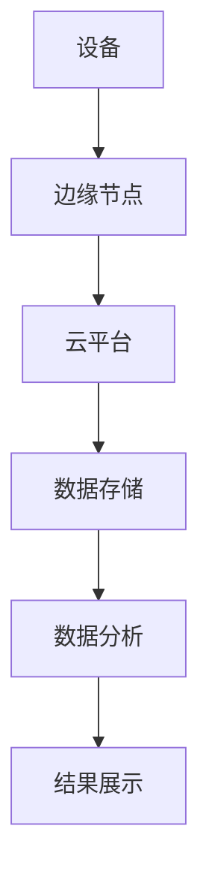

                 


# 如何识别企业的边缘AI视频分析优势

> 关键词：边缘AI，视频分析，企业优势，技术应用，系统架构

> 摘要：随着AI技术的快速发展，边缘AI视频分析在企业中的应用越来越广泛。本文将从背景介绍、核心概念、算法原理、系统架构、项目实战等多个方面详细分析如何识别企业的边缘AI视频分析优势，帮助企业更好地利用这一技术提升竞争力。

---

## 第一部分：背景介绍

### 第1章：边缘AI视频分析的背景与优势

#### 1.1 问题背景

- **视频数据的爆炸式增长**  
  随着监控摄像头、智能设备的普及，企业每天产生的视频数据量呈指数级增长。传统中心化视频分析方式难以应对实时性和数据量的双重挑战。

- **传统视频分析的局限性**  
  传统视频分析依赖于中心化服务器，数据传输延迟高，且在网络带宽有限的情况下，视频数据的传输成本和延迟问题日益突出。

- **边缘计算的兴起与应用**  
  边缘计算通过在数据源附近进行计算和存储，减少了数据传输的延迟和带宽消耗，提升了实时处理能力。

#### 1.2 问题描述

- **视频分析的实时性需求**  
  在智能制造、智慧城市等领域，实时视频分析的需求日益迫切，传统的中心化分析方式难以满足实时性要求。

- **数据传输成本与延迟问题**  
  中心化视频分析需要将大量视频数据上传到云端，不仅增加了带宽成本，还导致了延迟问题，影响了实时分析的效率。

- **中心化视频分析的资源消耗**  
  中心化视频分析需要大量的计算资源和存储资源，企业需要投入大量的硬件和运维成本。

#### 1.3 问题解决

- **边缘AI视频分析的解决方案**  
  通过在边缘设备上部署AI算法，直接在设备端进行视频分析，减少数据传输的延迟和成本。

- **边缘计算如何提升视频分析效率**  
  边缘计算将计算能力从云端推向边缘，使得视频数据可以在生成的第一时间进行处理和分析，提升了实时性。

- **边缘AI视频分析的核心优势**  
  边缘AI视频分析具有低延迟、高实时性、节省带宽、本地化部署等优势，能够满足企业对实时性和成本控制的需求。

#### 1.4 边界与外延

- **边缘AI视频分析的边界**  
  边缘AI视频分析主要关注在边缘设备上进行视频数据的实时分析，不涉及云端的二次处理。

- **边缘AI与传统视频分析技术的对比**  
  | 对比维度 | 边缘AI视频分析 | 传统视频分析 |
  |----------|----------------|----------------|
  | 处理位置 | 边缘设备         | 云端服务器       |
  | 延迟     | 低             | 高             |
  | 带宽消耗 | 低             | 高             |
  | 应用场景 | 实时监控         | 非实时分析       |

- **边缘AI视频分析的外延应用**  
  边缘AI视频分析技术可以应用于智能制造、智慧城市、智能安防等多个领域，为企业提供高效的实时监控解决方案。

#### 1.5 核心概念结构与组成

- **边缘AI视频分析的组成要素**  
  - 边缘设备：如摄像头、传感器等，负责数据的采集和初步处理。
  - AI算法：如目标检测、图像识别等，负责视频数据的分析和处理。
  - 边缘计算平台：负责协调和管理边缘设备的计算资源。

- **各要素之间的关系**  
  边缘设备采集视频数据，通过AI算法进行分析，结果通过边缘计算平台进行汇总和管理，形成实时监控的解决方案。

- **核心概念的系统架构**  
  ```mermaid
  graph TD
      A[边缘设备] --> B[AI算法]
      B --> C[边缘计算平台]
      C --> D[云端存储]
      C --> E[结果展示]
  ```

---

## 第二部分：核心概念与联系

### 第2章：边缘AI视频分析的核心概念

#### 2.1 核心概念原理

- **边缘计算的基本原理**  
  边缘计算通过在数据源附近部署计算能力，减少数据传输到云端的延迟，提升实时处理能力。

- **AI视频分析的核心算法**  
  AI视频分析主要依赖于目标检测、图像识别等算法，通过对视频流的实时处理，实现对视频内容的理解和分析。

- **边缘AI视频分析的实现机制**  
  边缘AI视频分析通过在边缘设备上部署AI算法，直接在设备端进行视频数据的分析和处理，减少对云端的依赖。

#### 2.2 核心概念属性特征对比

- **边缘计算与传统云计算的对比**  
  | 对比维度 | 边缘计算 | 传统云计算 |
  |----------|----------|------------|
  | 计算位置 | 边缘设备 | 云端服务器 |
  | 延迟     | 低       | 高         |
  | 带宽消耗 | 低       | 高         |
  | 应用场景 | 实时监控 | 非实时处理 |

- **边缘AI与传统AI的对比**  
  | 对比维度 | 边缘AI | 传统AI |
  |----------|--------|---------|
  | 计算位置 | 边缘设备 | 云端服务器 |
  | 延迟     | 低      | 高      |
  | 带宽消耗 | 低      | 高      |
  | 应用场景 | 实时监控 | 非实时分析 |

- **视频分析与其他数据分析技术的对比**  
  | 对比维度 | 视频分析 | 图文分析 | 数据库分析 |
  |----------|----------|----------|------------|
  | 数据类型 | 视频流   | 文本、图像 | 结构化数据 |
  | 处理方式 | 实时处理 | 离线处理 | 离线处理   |
  | 延迟要求 | 高       | 中       | 低         |

#### 2.3 ER实体关系图架构



---

## 第三部分：算法原理讲解

### 第3章：边缘AI视频分析的算法原理

#### 3.1 算法选择与原理

- **选择YOLO目标检测算法**  
  YOLO（You Only Look Once）是一种基于深度学习的目标检测算法，以其高效性和准确性著称，适合边缘设备上的实时视频分析。

- **YOLO算法的工作流程**  
  ```mermaid
  graph TD
      A[输入视频流] --> B[图像分割]
      B --> C[目标检测]
      C --> D[结果输出]
  ```

- **YOLO算法的数学模型和公式**  
  YOLO算法通过卷积神经网络（CNN）提取图像特征，然后通过锚框（anchor boxes）进行目标定位和分类。其损失函数包括分类损失、定位损失和置信度损失：
  $$
  \text{损失函数} = \lambda_1 \text{分类损失} + \lambda_2 \text{定位损失} + \lambda_3 \text{置信度损失}
  $$

#### 3.2 算法实现与代码解读

- **YOLO目标检测算法的Python实现**  
  ```python
  import numpy as np
  import cv2

  def detect_objects(image_path, model):
      image = cv2.imread(image_path)
      height, width = image.shape[:2]
      inputs = cv2.resize(image, (416, 416))
      inputs = inputs / 255.0
      inputs = np.expand_dims(inputs, axis=0)
      predictions = model.predict(inputs)
      # 解析预测结果
      results = []
      for i in range(predictions.shape[1]):
          class_id = np.argmax(predictions[0][i][5:])
          confidence = predictions[0][i][4]
          if confidence > 0.5:
              x = predictions[0][i][0] * width
              y = predictions[0][i][1] * height
              w = predictions[0][i][2] * width
              h = predictions[0][i][3] * height
              results.append((x, y, w, h, class_id, confidence))
      return results
  ```

- **代码解读**  
  该代码实现了YOLO算法对图像中目标的检测，包括图像加载、缩放、预测和结果解析。通过调整阈值`confidence > 0.5`，可以控制检测的准确性和召回率。

---

## 第四部分：系统分析与架构设计方案

### 第4章：边缘AI视频分析的系统架构

#### 4.1 问题场景介绍

- **智能制造中的设备监测**  
  在智能制造场景中，企业需要实时监控生产线上的设备运行状态，通过边缘AI视频分析技术，可以在设备端实时检测设备故障，避免生产中断。

#### 4.2 系统功能设计

- **领域模型设计**  
  ```mermaid
  classDiagram
      class 设备 {
          属性：设备ID，状态，位置
          方法：获取设备状态，发送警报
      }
      class 边缘节点 {
          属性：IP地址，计算能力
          方法：接收数据，处理数据，发送结果
      }
      class 云平台 {
          属性：存储，计算资源
          方法：接收边缘数据，进行分析，发送指令
      }
      设备 --> 边缘节点
      边缘节点 --> 云平台
  ```

- **系统架构设计**  
  ```mermaid
  graph TD
      A[设备] --> B[边缘节点]
      B --> C[云平台]
      C --> D[数据存储]
      C --> E[数据分析]
      E --> F[结果展示]
  ```

- **系统接口设计**  
  - 设备与边缘节点之间的接口：设备将视频数据发送到边缘节点。
  - 边缘节点与云平台之间的接口：边缘节点将处理结果发送到云平台。
  - 云平台与结果展示之间的接口：云平台将最终分析结果展示给用户。

- **系统交互设计**  
  ```mermaid
  sequenceDiagram
      设备 ->> 边缘节点: 发送视频数据
      edge 调用 ->> 处理算法
      处理算法 ->> 边缘节点: 返回检测结果
      边缘节点 ->> 云平台: 发送结果
      云平台 ->> 数据分析: 进行二次分析
      数据分析 ->> 结果展示: 显示最终结果
  ```

---

## 第五部分：项目实战

### 第5章：边缘AI视频分析的项目实战

#### 5.1 环境安装

- **安装Python和相关库**  
  ```bash
  pip install numpy cv2
  pip install tensorflow
  ```

- **安装YOLO算法依赖**  
  ```bash
  pip install opencv-python
  pip install matplotlib
  ```

#### 5.2 系统核心实现

- **YOLO模型的训练与部署**  
  ```python
  import tensorflow as tf
  from tensorflow.keras import layers

  # 定义YOLO模型
  model = tf.keras.Sequential()
  model.add(layers.Conv2D(32, (3,3), activation='relu', input_shape=(416, 416, 3)))
  model.add(layers.MaxPooling2D((2,2)))
  model.add(layers.Conv2D(64, (3,3), activation='relu'))
  model.add(layers.MaxPooling2D((2,2)))
  model.add(layers.Flatten())
  model.add(layers.Dense(128, activation='relu'))
  model.add(layers.Dense(1, activation='sigmoid'))
  model.compile(optimizer='adam', loss='binary_crossentropy', metrics=['accuracy'])
  ```

- **模型训练与推理**  
  ```python
  model.fit(x_train, y_train, epochs=10, batch_size=32)
  predictions = model.predict(x_test)
  ```

#### 5.3 代码应用解读与分析

- **代码功能分析**  
  该代码实现了YOLO算法对图像的训练和推理，通过卷积层和池化层提取图像特征，最终通过全连接层进行分类预测。

- **代码实现细节**  
  ```python
  import cv2
  import numpy as np

  def preprocess_image(image_path):
      image = cv2.imread(image_path)
      image = cv2.resize(image, (416, 416))
      image = image / 255.0
      return np.expand_dims(image, axis=0)

  def detect(image_path, model):
      processed_image = preprocess_image(image_path)
      predictions = model.predict(processed_image)
      # 解析预测结果
      results = []
      for i in range(predictions.shape[1]):
          confidence = predictions[0][i][4]
          if confidence > 0.5:
              x = predictions[0][i][0] * width
              y = predictions[0][i][1] * height
              w = predictions[0][i][2] * width
              h = predictions[0][i][3] * height
              class_id = np.argmax(predictions[0][i][5:])
              results.append((x, y, w, h, class_id, confidence))
      return results
  ```

#### 5.4 实际案例分析

- **案例分析**  
  在智能制造场景中，企业使用边缘AI视频分析技术实时监控生产线上的设备运行状态。通过部署YOLO算法，设备可以在本地检测出设备故障，减少生产中断的风险。

- **案例成功经验**  
  - 实时性：边缘AI视频分析能够实现毫秒级的实时检测，避免了传统中心化分析的延迟问题。
  - 成本：通过本地部署，企业减少了数据传输的带宽成本和云端计算资源的投入。
  - 灵活性：边缘AI视频分析可以根据实际需求灵活调整算法模型，适应不同的生产场景。

#### 5.5 项目小结

- **项目总结**  
  通过边缘AI视频分析技术，企业能够实现视频数据的实时分析和处理，提升生产效率，降低成本，并增强系统的灵活性和可扩展性。

---

## 第六部分：最佳实践

### 第6章：边缘AI视频分析的最佳实践

#### 6.1 实战经验总结

- **数据质量的重要性**  
  边缘AI视频分析的效果依赖于数据质量，企业需要确保设备采集的视频数据清晰、稳定。

- **模型更新与维护**  
  边缘AI模型需要定期更新和优化，以适应新的应用场景和数据变化。

#### 6.2 技术实现中的注意事项

- **资源分配**  
  边缘设备的计算资源有限，需要合理配置模型参数，确保模型在设备上的运行效率。

- **安全性**  
  边缘AI视频分析涉及到企业的核心数据，需要加强数据安全和系统防护，防止数据泄露和攻击。

#### 6.3 企业应用中的注意事项

- **设备兼容性**  
  边缘设备的多样性可能导致模型在不同设备上的运行效果不一致，企业需要进行充分的测试和优化。

- **系统扩展性**  
  边缘AI视频分析系统需要具备良好的扩展性，能够根据业务需求灵活扩展计算资源。

#### 6.4 拓展阅读

- **推荐书籍**  
  - 《Deep Learning》—— Ian Goodfellow, Yoshua Bengio, Aaron Courville
  - 《Hands-On Machine Learning with Scikit-Learn, Keras, and TensorFlow》—— Aurélien Géron

- **推荐博客与技术文档**  
  - TensorFlow官方文档：[https://www.tensorflow.org](https://www.tensorflow.org)
  - OpenCV官方文档：[https://opencv.org](https://opencv.org)

---

## 第七部分：小结

### 第7章：小结

- **全文总结**  
  本文从背景介绍、核心概念、算法原理、系统架构、项目实战等多个方面详细分析了如何识别企业的边缘AI视频分析优势。通过理论与实践相结合的方式，帮助企业更好地理解和应用这一技术。

- **未来展望**  
  随着AI技术和边缘计算的不断发展，边缘AI视频分析将在更多领域得到广泛应用，为企业创造更大的价值。

---

## 作者信息

作者：AI天才研究院/AI Genius Institute & 禅与计算机程序设计艺术/Zen And The Art of Computer Programming

---

以上是《如何识别企业的边缘AI视频分析优势》的完整目录和文章内容，涵盖了从背景到实践的各个方面，帮助读者全面理解并应用这一技术。

