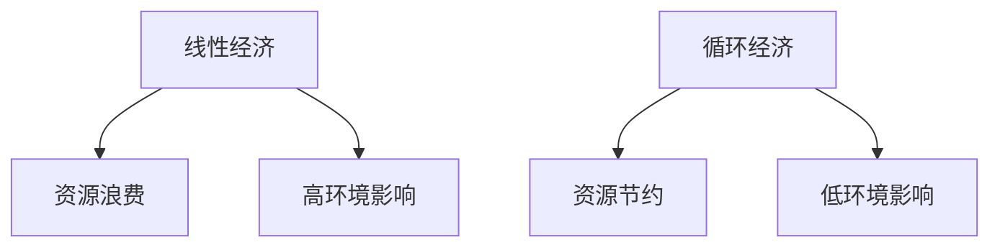
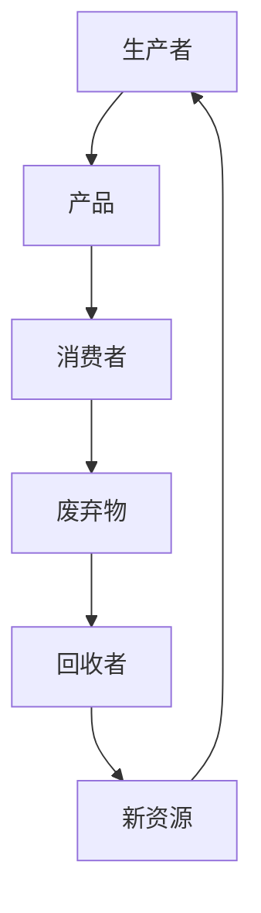
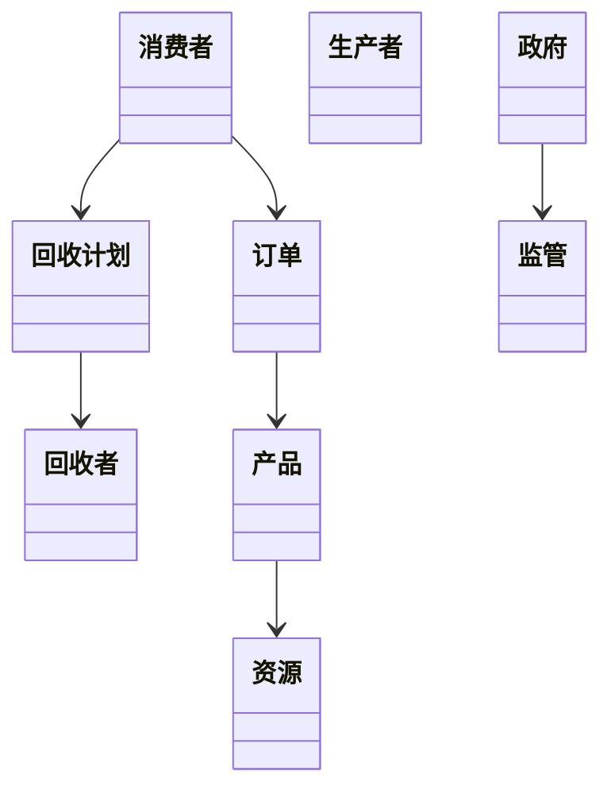
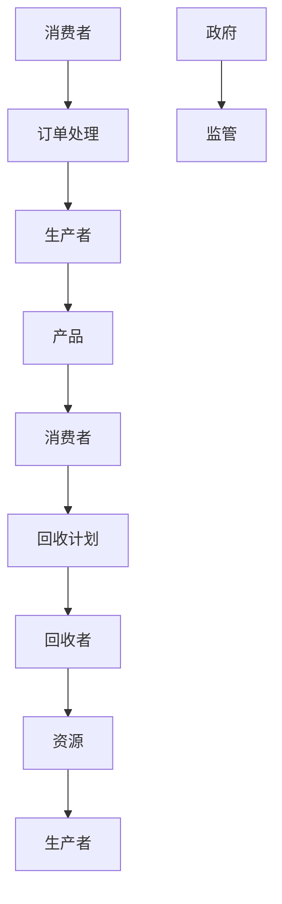
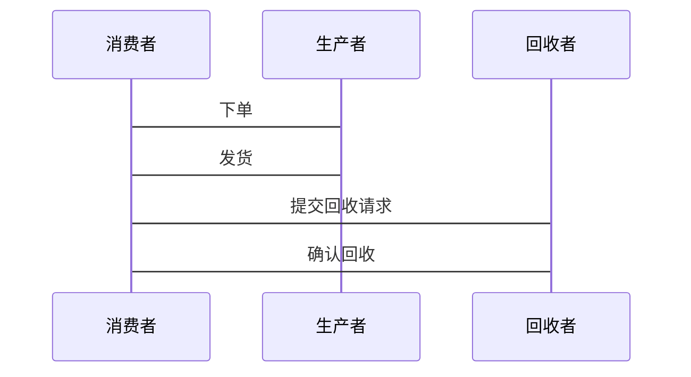

                 


# 循环经济商业模式的可扩展性与投资机会

## 关键词：循环经济、商业模式、可扩展性、投资机会、可持续发展、资源利用、经济效益

## 摘要：  
循环经济作为一种新兴的经济模式，强调资源的高效利用和循环使用，旨在减少资源消耗和环境污染。本文探讨了循环经济商业模式的可扩展性及其投资机会，分析了其核心概念、算法原理、数学模型、系统架构设计以及实际案例。通过详细讲解循环经济的资源流动机制、价值创造、成本收益分析等，本文为读者提供了深入了解循环经济商业模式的全面视角，并揭示了其在可持续发展中的重要价值和投资潜力。

---

## 第1章：循环经济商业模式的背景介绍

### 1.1 循环经济的基本概念

#### 1.1.1 循环经济的定义  
循环经济是一种以资源高效利用和循环使用为核心的经济模式，强调通过设计、生产、消费和回收等环节的协同作用，实现资源的闭环流动。

#### 1.1.2 循环经济的核心原则  
- **减少**：减少资源的消耗，避免浪费。  
- **再利用**：延长产品生命周期，通过共享、翻新等方式提高资源利用率。  
- **再循环**：将废弃物转化为新的资源，实现材料的循环利用。  

#### 1.1.3 循环经济与传统经济的区别  
循环经济与传统线性经济的根本区别在于，循环经济强调资源的循环利用，而线性经济则是一次性使用资源并产生废弃物。通过对比，循环经济能够显著减少资源消耗和环境污染。

---

### 1.2 循环经济的经济、社会和环境效益

#### 1.2.1 经济效益  
循环经济通过减少资源浪费和提高资源利用率，降低了企业的生产成本。同时，循环经济模式还催生了新的商业模式，如产品即服务（PaaS）和共享经济，为企业创造了额外的收入来源。

#### 1.2.2 社会效益  
循环经济促进了就业机会的增加，尤其是在回收、再制造和共享经济等领域。此外，循环经济模式还提高了资源的公平分配，有助于构建更加可持续的社会。

#### 1.2.3 环境效益  
循环经济通过减少资源消耗和废弃物产生，显著降低了碳排放和环境污染。这种模式在应对气候变化和环境保护方面具有重要意义。

---

### 1.3 循环经济在全球范围内的发展趋势

#### 1.3.1 全球循环经济的发展现状  
全球范围内，许多国家和地区已经开始推广循环经济模式。例如，欧洲多个国家通过政策支持和技术创新，推动了循环经济的发展。

#### 1.3.2 不同国家的循环经济实践案例  
- **德国**：通过严格的垃圾分类和回收政策，德国在循环经济方面取得了显著成效。  
- **中国**：中国近年来也在大力推进循环经济，特别是在制造业和服务业领域。  
- **日本**：日本的循环经济模式注重技术创新和资源高效利用。  

#### 1.3.3 循环经济面临的挑战与未来趋势  
尽管循环经济具有诸多优势，但其推广仍然面临一些挑战，如技术瓶颈、政策支持不足和公众认知度低等。未来，随着技术的进步和政策的完善，循环经济将有更大的发展空间。

---

## 第2章：循环经济商业模式的核心概念与联系

### 2.1 循环经济商业模式的定义与分类

#### 2.1.1 循环经济商业模式的定义  
循环经济商业模式是指通过设计和实施一系列经济活动，使得资源在生产和消费过程中能够循环利用，从而实现经济效益和环境效益的双赢。

#### 2.1.2 不同类型的循环经济商业模式  
- **产品即服务（PaaS）**：企业通过提供产品的使用权来获取收入，而非一次性出售产品。  
- **共享经济**：通过共享资源实现资源的高效利用，如共享办公空间、共享出行等。  
- **逆向物流**：通过回收和再利用废弃物，降低资源浪费。  

#### 2.1.3 各种模式的优缺点对比  
| 模式类型       | 优点                           | 缺点                           |
|----------------|--------------------------------|--------------------------------|
| 产品即服务     | 资源利用率高，减少浪费           | 初始投资高，用户接受度低       |
| 共享经济       | 提高资源利用率，降低成本         | 需要依赖平台，管理复杂           |
| 逆向物流       | 节省资源，降低生产成本           | 回收成本高，技术要求高           |

---

### 2.2 循环经济商业模式的属性特征对比

#### 2.2.1 表格形式对比：线性经济 vs 循环经济  
| 特性            | 线性经济                  | 循环经济                  |
|-----------------|---------------------------|---------------------------|
| 资源利用        | 一次性使用，资源浪费       | 循环利用，资源节约         |
| 环境影响        | 高，废弃物多             | 低，废弃物少             |
| 经济效益        | 低，资源浪费大           | 高，资源利用效率高         |

#### 2.2.2 图表展示：循环经济商业模式的属性特征  
使用 Mermaid 绘制的对比图，展示循环经济和线性经济在资源利用、环境影响和经济效益等方面的差异。



---

### 2.3 循环经济商业模式的ER实体关系图

#### 2.3.1 实体关系图展示：消费者、生产者、回收者、政府等之间的关系  
使用 Mermaid 绘制的 ER 图，展示循环经济系统中各实体之间的关系。

```mermaid
erDiagram
    actor 消费者
    actor 生产者
    actor 回收者
    actor 政府
    product 产品
    resource 资源
    order 订单
    recycle 计划

    消费者 -->|购买| 生产者
    生产者 -->|提供| 产品
    消费者 -->|使用| 产品
    消费者 -->|返回| 回收者
    回收者 -->|处理| 资源
    生产者 -->|使用| 资源
    政府 -->|监管| 循环经济系统
```

---

## 第3章：循环经济商业模式的算法原理讲解

### 3.1 循环经济商业模式中的资源流动机制

#### 3.1.1 资源从生产到消费的流动过程  
- 生产者利用资源生产产品。  
- 消费者购买并使用产品。  
- 消费者将使用后的废弃物返回给回收者。  
- 回收者将废弃物转化为新的资源，供生产者再利用。  

#### 3.1.2 资源回收与再利用的算法模型  
通过算法模拟资源的流动过程，确保资源的最大化利用。例如，利用逆向物流优化资源回收路径，减少运输成本和时间。

#### 3.1.3 使用 Mermaid 绘制的资源流动流程图  


---

### 3.2 循环经济商业模式中的价值创造机制

#### 3.2.1 价值创造的关键算法步骤  
- 确定资源的最优分配路径。  
- 计算资源的再利用率和再利用成本。  
- 优化产品设计，延长产品生命周期。  

#### 3.2.2 算法的数学模型和公式  
通过数学模型计算资源的再利用率和价值创造的效率。例如，利用线性规划模型优化资源分配。

#### 3.2.3 通过具体案例解释算法的应用  
以电子产品为例，说明如何通过算法优化产品的设计和回收流程，提高资源利用率和企业收益。

---

## 第4章：循环经济商业模式的数学模型与公式

### 4.1 循环经济商业模式的成本收益分析

#### 4.1.1 成本收益分析的数学模型  
通过公式计算不同商业模式下的成本和收益，评估其经济可行性。

例如：  
- 成本 = 初始投资 + 运营成本 + 回收成本  
- 收益 = 销售收入 + 回收收入  

#### 4.1.2 资源利用率的计算公式  
资源利用率 = 回收资源量 / 总资源消耗量  

#### 4.1.3 利润最大化模型  
利润 = 收益 - 成本  

---

## 第5章：循环经济商业模式的系统分析与架构设计

### 5.1 系统分析

#### 5.1.1 问题场景介绍  
描述一个具体的循环经济项目，如电子产品回收和再利用系统。  

#### 5.1.2 项目介绍  
说明项目的总体目标和实施步骤，如建立回收网络、设计回收流程等。  

---

### 5.2 系统架构设计

#### 5.2.1 领域模型 mermaid 类图  
使用 Mermaid 绘制领域模型类图，展示系统中的各个实体及其关系。  



#### 5.2.2 系统架构设计 mermaid 架构图  
使用 Mermaid 绘制系统架构图，展示系统的各个模块和交互关系。  



---

### 5.3 系统接口设计

#### 5.3.1 核心接口设计  
- 订单接口：消费者下单，生产者接单。  
- 回收接口：消费者提交回收请求，回收者处理请求。  

#### 5.3.2 系统交互 mermaid 序列图  
使用 Mermaid 绘制系统交互序列图，展示用户与系统之间的交互流程。  



---

## 第6章：循环经济商业模式的项目实战

### 6.1 项目环境搭建

#### 6.1.1 环境搭建步骤  
- 安装必要的软件和工具，如编程语言、版本控制系统等。  
- 配置开发环境，确保项目能够顺利运行。  

#### 6.1.2 开发工具推荐  
- 编程语言：Python、Java  
- 版本控制：Git  
- 开发框架：Django、Spring  

---

### 6.2 系统核心实现源代码

#### 6.2.1 核心代码实现  
以下是一个简单的循环经济系统订单处理代码示例：

```python
class Consumer:
    def __init__(self, name):
        self.name = name
        self.orders = []

    def place_order(self, product):
        self.orders.append(product)
        return "Order placed successfully"

class Producer:
    def __init__(self, name):
        self.name = name
        self.products = []

    def receive_order(self, order):
        if order in self.products:
            return "Order received"
        else:
            return "Order not found"

# 使用示例
consumer = Consumer("Alice")
producer = Producer("Bob")
product = "Eco-friendly T-shirt"

print(consumer.place_order(product))
print(producer.receive_order(product))
```

#### 6.2.2 代码解读与分析  
解释上述代码的功能和实现逻辑，说明如何通过代码实现循环经济模式中的订单处理流程。

---

### 6.3 实际案例分析

#### 6.3.1 案例介绍  
以电子产品回收项目为例，详细描述项目的实施过程和实际效果。

#### 6.3.2 项目小结  
总结项目的成功经验，分析存在的问题，并提出改进建议。

---

## 第7章：循环经济商业模式的最佳实践

### 7.1 关键成功因素

#### 7.1.1 技术创新  
通过技术创新提高资源利用率，降低回收成本。  

#### 7.1.2 政策支持  
政府应出台相关政策，支持循环经济的发展，如税收优惠和补贴。  

#### 7.1.3 用户参与  
提高用户的环保意识，鼓励用户参与循环经济活动。  

---

### 7.2 小结

循环经济商业模式具有重要的经济和环境意义，其可扩展性和投资机会为其广泛应用提供了可能。通过技术创新、政策支持和用户参与，循环经济模式将更加成熟和完善。

---

### 7.3 注意事项

- 在实施循环经济模式时，需注意技术可行性、成本效益和用户接受度。  
- 需要建立完善的回收体系和监管机制，确保循环经济的顺利运行。  

---

### 7.4 未来的研究方向

- 研究循环经济模式在不同行业中的应用和推广策略。  
- 探讨循环经济与数字化技术的结合，如区块链技术在资源追踪中的应用。  

---

### 7.5 拓展阅读

- 推荐阅读《循环经济：从理论到实践》、《可持续发展与商业模式创新》等书籍。  

---

## 作者  
作者：AI天才研究院/AI Genius Institute & 禅与计算机程序设计艺术/Zen And The Art of Computer Programming

