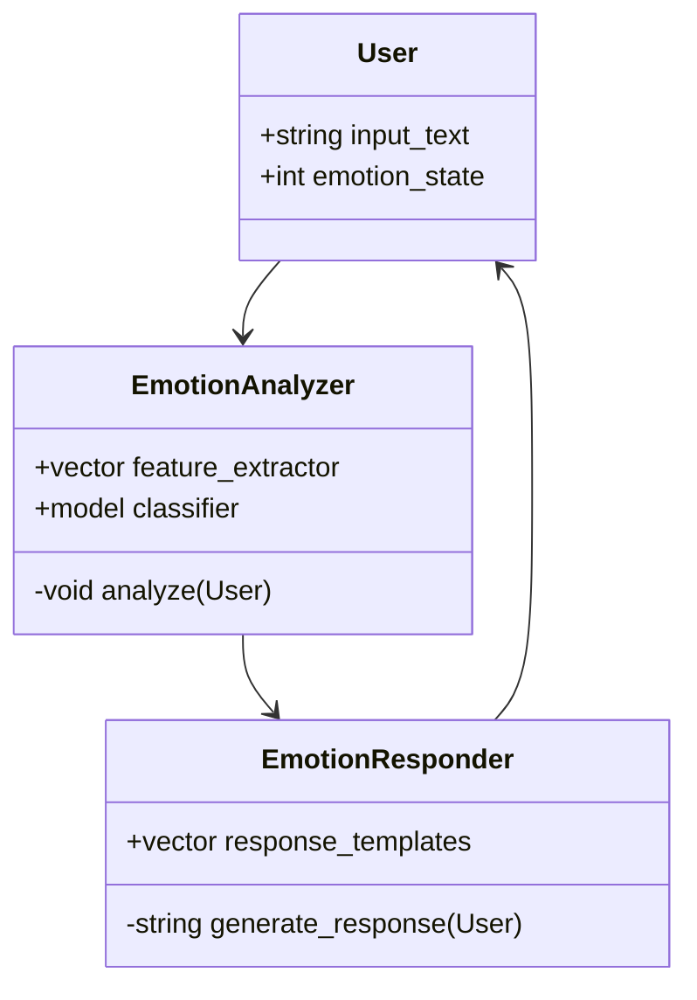
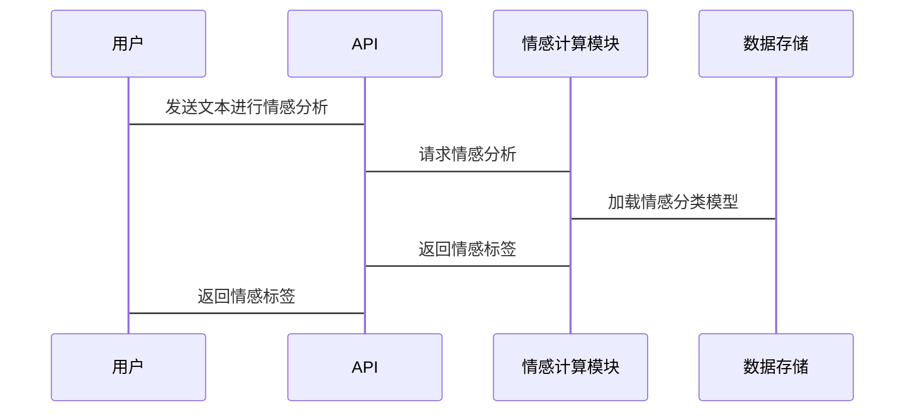

                 


# 情感计算：增强AI Agent的情感智能

## 关键词：情感计算，AI Agent，人机交互，情感智能，机器学习

## 摘要：情感计算是一种结合心理学、认知科学和计算机科学的多学科技术，旨在赋予AI Agent理解和处理人类情感的能力。本文将从情感计算的基本概念、核心算法、系统架构到项目实战，全面探讨如何增强AI Agent的情感智能，最终实现更加自然和高效的人机交互。

---

# 第一部分: 情感计算概述

## 第1章: 情感计算概述

### 1.1 情感计算的基本概念

#### 1.1.1 情感计算的定义
情感计算（Affective Computing）是研究如何通过计算机技术来识别、理解和模拟人类情感的科学。它旨在使计算机系统具备感知和处理人类情感的能力，从而实现更加自然和智能的人机交互。

#### 1.1.2 情感计算的核心要素
情感计算的核心要素包括：
1. **情感识别**：通过自然语言处理、语音分析或面部表情识别等方式，识别用户的情感状态。
2. **情感分析**：对用户的情感倾向（如正面、负面、中性）进行分类。
3. **情感生成**：根据用户的情感状态，生成相应的回应或反馈。

#### 1.1.3 情感计算的应用场景
情感计算的应用场景广泛，包括：
- 智能客服：通过分析用户的情感状态，提供更贴心的服务。
- 教育技术：根据学生的情感状态，调整教学策略。
- 健康监测：通过情感分析，帮助识别潜在的心理健康问题。

### 1.2 情感计算的发展背景

#### 1.2.1 人工智能的演进历程
人工智能（AI）的发展经历了多个阶段，从早期的符号逻辑推理到现在的深度学习，技术不断进步。情感计算作为AI的一个重要分支，随着技术的发展逐渐成熟。

#### 1.2.2 情感计算在AI Agent中的地位
AI Agent需要与人类进行交互，理解用户的情感需求是实现智能化交互的关键。情感计算为AI Agent提供了情感感知和处理的能力，使其能够更好地满足用户的情感需求。

#### 1.2.3 当前情感计算的研究热点
当前，情感计算的研究热点包括：
- 基于深度学习的情感分析模型。
- 多模态情感计算（结合文本、语音、面部表情等多种信息）。
- 情感计算在教育、医疗等领域的应用研究。

### 1.3 情感计算的现状与挑战

#### 1.3.1 情感计算的主要研究方向
目前，情感计算的主要研究方向包括：
1. 情感识别的准确性提升。
2. 多模态情感计算的融合方法。
3. 情感计算的实时性优化。

#### 1.3.2 当前技术的局限性
情感计算目前面临以下挑战：
- 情感表达的多样性导致识别难度大。
- 数据标注的主观性和不一致性影响模型的泛化能力。
- 隐私问题限制了情感数据的采集和使用。

#### 1.3.3 情感计算面临的伦理与隐私问题
情感计算涉及大量个人情感数据的采集和处理，这引发了隐私保护和伦理道德方面的争议。如何在技术进步与隐私保护之间找到平衡点，是情感计算领域需要解决的重要问题。

### 1.4 情感计算的应用前景

#### 1.4.1 情感计算在人机交互中的应用
通过情感计算，AI Agent能够更好地理解用户的情感需求，从而提供更个性化的服务。例如，在智能音箱中，当用户情绪低落时，系统可以主动提供安慰或放松的音乐。

#### 1.4.2 情感计算在智能客服中的应用
智能客服可以通过情感分析技术，快速识别用户的情绪状态，调整回应的语气和内容，提升用户体验。

#### 1.4.3 情感计算在教育、医疗等领域的潜力
在教育领域，情感计算可以帮助教师更好地理解学生的情绪变化，提供更有针对性的教学方法。在医疗领域，情感计算可以辅助医生识别患者的情绪问题，提供更全面的诊断。

### 1.5 本章小结
本章从情感计算的基本概念、发展背景、现状与挑战以及应用前景四个方面进行了详细阐述，为后续章节奠定了基础。

---

# 第二部分: 情感计算的核心概念与原理

## 第2章: 情感计算的核心概念

### 2.1 情感计算的理论基础

#### 2.1.1 情感计算的多学科交叉性
情感计算涉及心理学、认知科学、计算机科学等多个学科。通过多学科的交叉融合，情感计算能够更好地理解和模拟人类情感。

#### 2.1.2 情感计算与心理学的关系
心理学研究人类情感的产生和表达机制，为情感计算提供了理论依据。情感计算通过借鉴心理学的研究成果，提升了情感识别的准确性。

#### 2.1.3 情感计算与认知科学的联系
认知科学关注人类认知过程，包括感知、记忆、推理等。情感计算通过结合认知科学的研究成果，进一步提升了AI Agent的智能水平。

### 2.2 情感计算的关键技术

#### 2.2.1 情感识别技术
情感识别技术通过分析用户的语言、语音、面部表情等信息，识别其情感状态。例如，基于自然语言处理的情感分析技术，可以通过分析文本的情感倾向，识别用户的正面或负面情绪。

#### 2.2.2 情感分析技术
情感分析技术是对文本进行情感分类的过程。例如，给定一条用户评论，系统可以判断其情感倾向是正面、负面还是中性。

#### 2.2.3 情感生成技术
情感生成技术是根据用户的情感需求，生成相应的回应或反馈。例如，当用户表达悲伤情绪时，系统可以生成安慰的话语。

### 2.3 情感计算的核心算法

#### 2.3.1 基于规则的情感计算方法
基于规则的情感计算方法通过预定义的规则和关键词匹配，判断用户的情感状态。例如，当用户使用“很高兴”等关键词时，系统可以判断其情感为正面。

#### 2.3.2 基于机器学习的情感计算方法
基于机器学习的情感计算方法通过训练模型，自动学习情感特征，从而实现情感分类。常用的算法包括支持向量机（SVM）和朴素贝叶斯（Naive Bayes）。

#### 2.3.3 基于深度学习的情感计算方法
基于深度学习的情感计算方法利用神经网络模型，如循环神经网络（RNN）和卷积神经网络（CNN），进行情感分析。这些模型能够自动提取文本特征，提升情感分类的准确性。

### 2.4 情感计算的数学模型

#### 2.4.1 情感计算的特征表示模型
特征表示模型将文本或语音信号转换为数值形式的特征向量。例如，词袋模型（Bag-of-Words）和词嵌入模型（Word2Vec）。

#### 2.4.2 情感计算的情感分类模型
情感分类模型通过训练数据，学习情感特征，实现情感分类。例如，基于SVM的情感分类模型。

#### 2.4.3 情感计算的情感生成模型
情感生成模型通过生成模型，如变体自编码器（VAE）和生成对抗网络（GAN），生成情感化的内容。

### 2.5 本章小结
本章详细介绍了情感计算的核心概念与原理，包括理论基础、关键技术、核心算法和数学模型。

---

## 第3章: 情感计算的算法原理

### 3.1 情感计算的基本算法

#### 3.1.1 基于规则的算法
基于规则的算法通过预定义规则，匹配关键词或短语，判断用户情感。例如，当用户使用“非常喜欢”时，系统判断情感为正面。

#### 3.1.2 基于机器学习的算法
基于机器学习的算法通过训练数据，学习情感特征，实现情感分类。例如，SVM和Naive Bayes算法。

#### 3.1.3 基于深度学习的算法
基于深度学习的算法利用神经网络模型，如RNN和CNN，进行情感分析。这些模型能够自动提取特征，提升分类准确性。

### 3.2 情感计算的特征提取

#### 3.2.1 文本特征提取
文本特征提取将文本转换为数值形式的特征向量。例如，使用TF-IDF提取关键词特征，或使用Word2Vec生成词向量。

#### 3.2.2 声音特征提取
声音特征提取通过分析语音信号，提取情感相关的特征，如音调、语速和音量。

#### 3.2.3 面部表情特征提取
面部表情特征提取通过分析面部特征点，识别表情变化，判断情感状态。

### 3.3 情感计算的情感分类

#### 3.3.1 监督学习分类方法
监督学习分类方法使用标注数据，训练分类器，实现情感分类。例如，使用SVM进行情感分类。

#### 3.3.2 无监督学习分类方法
无监督学习分类方法在无标注数据的情况下，发现数据中的自然聚类。例如，使用K-means进行情感聚类。

#### 3.3.3 半监督学习分类方法
半监督学习分类方法结合标注数据和未标注数据，提升分类性能。例如，使用半监督SVM进行情感分类。

### 3.4 情感计算的情感生成

#### 3.4.1 基于规则的情感生成
基于规则的情感生成方法通过预定义的规则，生成情感化的回应。例如，当用户表达悲伤时，系统生成安慰的话语。

#### 3.4.2 基于模板的情感生成
基于模板的情感生成方法通过填充预定义模板，生成情感化的文本。例如，使用模板生成感谢的话语。

#### 3.4.3 基于生成模型的情感生成
基于生成模型的情感生成方法通过深度学习模型，生成多样化的情感文本。例如，使用GAN生成情感化的评论。

### 3.5 情感计算的算法实现

#### 3.5.1 基于Python的情感计算实现
使用Python和scikit-learn库，实现基于机器学习的情感分类。

```python
from sklearn.feature_extraction.text import TfidfVectorizer
from sklearn.svm import SVC

# 文本数据
texts = ["I love this product!", "This is terrible!"]
labels = [1, 0]  # 1表示正面，0表示负面

# 特征提取
vectorizer = TfidfVectorizer()
X = vectorizer.fit_transform(texts)

# 模型训练
model = SVC()
model.fit(X, labels)

# 预测
test_text = "I really enjoy this service!"
test_X = vectorizer.transform([test_text])
print(model.predict(test_X))
```

#### 3.5.2 基于TensorFlow的情感计算实现
使用TensorFlow框架，实现基于深度学习的情感分类。

```python
import tensorflow as tf
from tensorflow.keras import layers

# 数据准备
train_data = ...
train_labels = ...

# 模型构建
model = tf.keras.Sequential()
model.add(layers.Embedding(input_dim=..., output_dim=...))
model.add(layers.LSTM(64))
model.add(layers.Dense(1, activation='sigmoid'))

# 编译
model.compile(loss='binary_crossentropy', optimizer='adam', metrics=['accuracy'])

# 训练
model.fit(train_data, train_labels, epochs=10, batch_size=32)
```

#### 3.5.3 基于PyTorch的情感计算实现
使用PyTorch框架，实现基于深度学习的情感分类。

```python
import torch
import torch.nn as nn
import torch.optim as optim

# 数据准备
train_data = ...
train_labels = ...

# 模型构建
class SentimentClassifier(nn.Module):
    def __init__(self):
        super(SentimentClassifier, self).__init__()
        self.l1 = nn.Linear(300, 64)  # 假设词向量维度为300
        self.l2 = nn.Linear(64, 1)

    def forward(self, x):
        x = self.l1(x)
        x = self.l2(x)
        return x

model = SentimentClassifier()

# 编译
criterion = nn.BCEWithLogitsLoss()
optimizer = optim.Adam(model.parameters(), lr=0.001)

# 训练
for epoch in range(10):
    for inputs, labels in dataloader:
        outputs = model(inputs)
        loss = criterion(outputs, labels)
        optimizer.zero_grad()
        loss.backward()
        optimizer.step()
```

### 3.6 本章小结
本章详细讲解了情感计算的算法原理与实现，包括基于规则、机器学习和深度学习的方法，并通过具体代码示例展示了不同算法的实现过程。

---

## 第4章: 情感计算的系统架构设计

### 4.1 系统功能设计

#### 4.1.1 问题场景介绍
以智能客服系统为例，设计一个基于情感计算的情感分析模块。

#### 4.1.2 系统功能需求
- 用户输入文本，系统分析情感倾向。
- 根据情感状态，生成相应的回应。

#### 4.1.3 领域模型设计


### 4.2 系统架构设计

#### 4.2.1 系统架构图


### 4.3 系统接口设计

#### 4.3.1 API接口设计
- API端点：`/api/v1/emotion/analyze`
- 请求参数：`text`
- 返回结果：`emotion_label`（0表示负面，1表示正面）

#### 4.3.2 序列图设计


### 4.4 本章小结
本章通过系统架构设计，展示了情感计算在实际应用中的具体实现方式，包括系统功能设计、架构设计和接口设计。

---

## 第5章: 情感计算的项目实战

### 5.1 环境安装

#### 5.1.1 安装Python环境
安装Python 3.8或更高版本。

#### 5.1.2 安装依赖库
安装必要的Python库，如`scikit-learn`、`tensorflow`、`pytorch`等。

#### 5.1.3 安装开发工具
安装IDE（如PyCharm）和版本控制工具（如Git）。

### 5.2 系统核心实现

#### 5.2.1 数据预处理
对文本数据进行清洗和特征提取，例如去除停用词、分词处理。

#### 5.2.2 模型训练
使用训练数据训练情感分类模型，如基于SVM或深度学习模型。

#### 5.2.3 模型评估
通过交叉验证评估模型的准确率、召回率和F1分数。

### 5.3 代码实现

#### 5.3.1 基于scikit-learn的情感分类
```python
from sklearn.feature_extraction.text import TfidfVectorizer
from sklearn.svm import SVC
from sklearn.metrics import accuracy_score

# 数据准备
texts = ["I love this product!", "This is terrible!"]
labels = [1, 0]  # 1表示正面，0表示负面

# 特征提取
vectorizer = TfidfVectorizer()
X = vectorizer.fit_transform(texts)

# 模型训练
model = SVC()
model.fit(X, labels)

# 测试
test_text = "I really enjoy this service!"
test_X = vectorizer.transform([test_text])
print("预测结果:", model.predict(test_X))
print("准确率:", accuracy_score([1], model.predict(test_X)))
```

#### 5.3.2 基于PyTorch的情感分类
```python
import torch
import torch.nn as nn
import torch.optim as optim
from torch.utils.data import DataLoader

# 数据准备
train_data = ...
train_labels = ...

# 模型构建
class SentimentClassifier(nn.Module):
    def __init__(self):
        super(SentimentClassifier, self).__init__()
        self.l1 = nn.Linear(300, 64)
        self.l2 = nn.Linear(64, 1)

    def forward(self, x):
        x = self.l1(x)
        x = self.l2(x)
        return x

model = SentimentClassifier()

# 编译
criterion = nn.BCEWithLogitsLoss()
optimizer = optim.Adam(model.parameters(), lr=0.001)

# 训练
for epoch in range(10):
    for inputs, labels in dataloader:
        outputs = model(inputs)
        loss = criterion(outputs, labels)
        optimizer.zero_grad()
        loss.backward()
        optimizer.step()
```

### 5.4 案例分析

#### 5.4.1 情感分析系统设计
设计一个简单的情感分析系统，能够接收用户输入的文本，分析其情感倾向，并返回结果。

#### 5.4.2 系统功能展示
- 用户输入：`"I hate this service!"`
- 系统分析：情感标签为负面。
- 系统回应：`"我们很抱歉听到您有这样的体验，有什么问题我们可以帮助您解决吗？"`

### 5.5 本章小结
本章通过项目实战，展示了情感计算在实际应用中的具体实现过程，包括环境安装、系统核心实现和案例分析。

---

## 第6章: 情感计算的最佳实践与小结

### 6.1 最佳实践

#### 6.1.1 数据预处理的重要性
数据预处理是情感计算的关键步骤，包括文本清洗、分词和特征提取。

#### 6.1.2 模型选择与优化
选择合适的模型，并通过调参和交叉验证优化模型性能。

#### 6.1.3 多模态情感计算的应用
结合文本、语音和面部表情等多种信息，提升情感计算的准确性和鲁棒性。

### 6.2 小结
情感计算是一项具有广阔应用前景的技术，通过本文的详细讲解，读者可以全面了解情感计算的核心概念、算法原理和系统架构设计。同时，通过项目实战，读者可以掌握情感计算的具体实现方法。

### 6.3 注意事项
- 在情感计算中，要注意数据标注的客观性和一致性。
- 需要关注情感计算的伦理和隐私问题，避免滥用技术。
- 在实际应用中，要根据具体需求选择合适的情感计算方法。

### 6.4 拓展阅读
- 情感计算领域的经典论文和书籍。
- 深度学习在情感计算中的最新研究进展。
- 情感计算在教育、医疗等领域的实际应用案例。

---

# 作者：AI天才研究院/AI Genius Institute & 禅与计算机程序设计艺术 /Zen And The Art of Computer Programming

