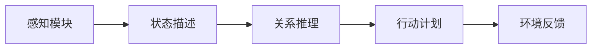
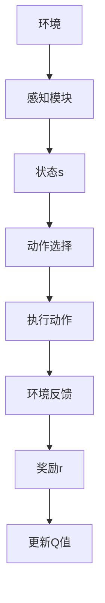
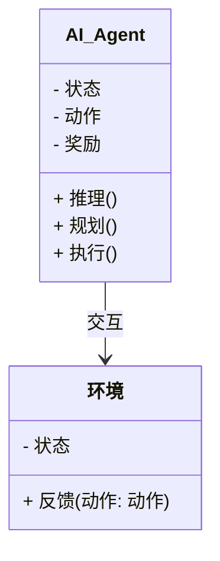
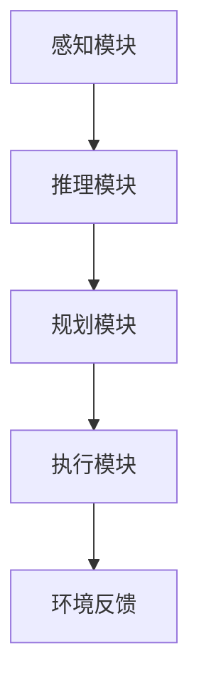
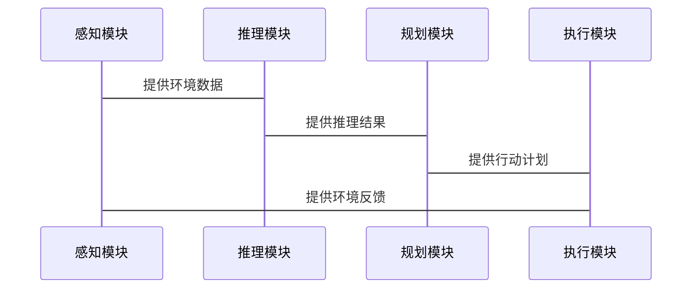

                 


# 构建具有自主决策能力的AI Agent

## 关键词
- AI Agent
- 自主决策
- 强化学习
- 系统架构
- 项目实战

## 摘要
本文旨在探讨如何构建具有自主决策能力的AI Agent。通过分析AI Agent的核心概念、算法原理、系统架构以及实际项目案例，详细讲解如何从理论到实践构建一个能够独立做出决策的智能体。本文将涵盖强化学习算法、数学模型、系统设计和代码实现等关键内容，为读者提供一个全面的构建指南。

---

# 第一部分: 自主决策AI Agent的背景与核心概念

## 第1章: 自主决策AI Agent概述

### 1.1 问题背景与目标
#### 1.1.1 传统AI与自主决策AI的对比
传统AI（如专家系统）依赖于规则和知识库，决策过程需要明确的规则设计，且通常需要外部干预。而自主决策AI Agent能够通过感知环境、推理信息、制定计划并执行动作，实现自主决策。

#### 1.1.2 自主决策AI Agent的核心目标
- 实现自主性：AI Agent能够独立感知环境并做出决策。
- 高效性：在复杂环境中快速做出最优决策。
- 自适应性：能够根据环境变化动态调整决策策略。

#### 1.1.3 自主决策AI Agent的应用场景与边界
应用场景包括机器人控制、自动驾驶、智能助手、游戏AI等。边界在于环境的不确定性和复杂性，以及决策的实时性和高效性要求。

### 1.2 自主决策AI Agent的定义与组成
#### 1.2.1 自主决策AI Agent的定义
自主决策AI Agent是一种智能体，能够在动态和不确定的环境中，通过感知、推理、规划和执行等模块，自主地做出决策并实现目标。

#### 1.2.2 核心要素与组成模块
- 感知模块：通过传感器或数据输入，获取环境信息。
- 推理模块：分析环境信息，建立因果关系。
- 规划模块：基于推理结果，制定行动计划。
- 执行模块：执行计划并获得环境反馈。

#### 1.2.3 决策过程的数学模型与公式
决策过程可以表示为：
$$ Q(s, a) = \max_{a'} Q(s', a') + \gamma r $$
其中，$s$为当前状态，$a$为动作，$s'$为下一状态，$\gamma$为折扣因子，$r$为奖励。

---

## 第2章: 自主决策AI Agent的核心概念与联系

### 2.1 核心概念原理
#### 2.1.1 感知模块
- 输入：环境数据。
- 输出：状态描述。
- 功能：解释环境信息。

#### 2.1.2 推理模块
- 输入：状态描述。
- 输出：关系推理。
- 功能：分析因果关系。

#### 2.1.3 规划模块
- 输入：关系推理。
- 输出：行动计划。
- 功能：制定最优策略。

#### 2.1.4 执行模块
- 输入：行动计划。
- 输出：环境反馈。
- 功能：执行具体操作。

### 2.2 概念属性特征对比表
| 模块名称 | 输入 | 输出 | 核心功能 |
|----------|------|------|----------|
| 感知模块 | 环境数据 | 状态描述 | 解释环境信息 |
| 推理模块 | 状态描述 | 关系推理 | 分析因果关系 |
| 规划模块 | 关系推理 | 行动计划 | 制定最优策略 |
| 执行模块 | 行动计划 | 环境反馈 | 执行具体操作 |

### 2.3 实体关系图


---

# 第二部分: 自主决策AI Agent的算法原理

## 第3章: 基于强化学习的决策算法

### 3.1 强化学习基础
#### 3.1.1 强化学习的基本概念
强化学习是一种机器学习范式，通过智能体与环境的交互，学习如何做出决策以最大化累计奖励。

#### 3.1.2 状态、动作、奖励的定义
- 状态（State）：环境的当前情况。
- 动作（Action）：智能体采取的行为。
- 奖励（Reward）：智能体行为的反馈。

#### 3.1.3 Q-learning算法原理
Q-learning算法通过更新Q值表，学习状态-动作对的最优值：
$$ Q(s, a) = Q(s, a) + \alpha (r + \gamma \max Q(s', a')) - Q(s, a) $$

### 3.2 DQN算法详解
#### 3.2.1 DQN算法的数学模型
DQN（Deep Q-Network）使用深度神经网络近似Q值函数：
$$ Q(s, a) = \max_{a'} Q(s', a') + \gamma r $$

#### 3.2.2 DQN算法的流程图


#### 3.2.3 DQN算法的Python实现
```python
import numpy as np
import gym

class DQN:
    def __init__(self, state_space, action_space):
        self.state_space = state_space
        self.action_space = action_space
        self.gamma = 0.99
        self.epsilon = 1.0
        self.epsilon_min = 0.01
        self.epsilon_decay = 0.995
        self.model = self.build_model()

    def build_model(self):
        model = Sequential()
        model.add(Dense(64, activation='relu', input_dim=self.state_space))
        model.add(Dense(64, activation='relu'))
        model.add(Dense(self.action_space, activation='linear'))
        model.compile(optimizer=Adam(learning_rate=0.001), loss='mse')
        return model

    def act(self, state):
        if np.random.random() < self.epsilon:
            return np.random.randint(self.action_space)
        return np.argmax(self.model.predict(state.reshape(1, -1)))

    def remember(self, state, action, reward, next_state):
        self.memory.append((state, action, reward, next_state))

    def replay(self, batch_size):
        if len(self.memory) < batch_size:
            return
        minibatch = random.sample(self.memory, batch_size)
        states = np.array([t[0] for t in minibatch])
        actions = np.array([t[1] for t in minibatch])
        rewards = np.array([t[2] for t in minibatch])
        next_states = np.array([t[3] for t in minibatch])
        
        targets = self.model.predict(states)
        next_q = self.model.predict(next_states)
        targets[range(batch_size), actions] = rewards + self.gamma * np.max(next_q, axis=1)
        self.model.fit(states, targets, epochs=1, verbose=0)
        
    def decay_epsilon(self):
        self.epsilon = max(self.epsilon * self.epsilon_decay, self.epsilon_min)

# 环境初始化
env = gym.make('CartPole-v0')
state_space = env.observation_space.shape[0]
action_space = env.action_space.n

# 初始化DQN
dqn = DQN(state_space, action_space)

# 训练过程
episodes = 1000
for episode in range(episodes):
    state = env.reset()
    total_reward = 0
    done = False
    while not done:
        action = dqn.act(state)
        next_state, reward, done, _ = env.step(action)
        dqn.remember(state, action, reward, next_state)
        dqn.replay(32)
        dqn.decay_epsilon()
        state = next_state
        total_reward += reward
    print(f"Episode {episode+1}, Total Reward: {total_reward}")
```

---

## 第4章: 数学模型与公式解析

### 4.1 强化学习的核心公式
- 状态转移：$$ P(s', r | s, a) $$
- Q值更新：$$ Q(s, a) = Q(s, a) + \alpha (r + \gamma Q(s', a') - Q(s, a)) $$

### 4.2 深度强化学习的挑战
- 状态空间和动作空间的高维性。
- 离策与在策学习的平衡。

---

# 第三部分: 自主决策AI Agent的系统分析与架构设计

## 第5章: 问题场景与系统功能设计

### 5.1 问题场景介绍
以自动驾驶为例，AI Agent需要感知道路状况、预测其他车辆的运动，并做出转向和加速的决策。

### 5.2 系统功能设计
- 感知模块：使用摄像头和雷达获取环境数据。
- 推理模块：分析交通规则和车辆行为。
- 规划模块：制定路径规划。
- 执行模块：控制方向盘和油门。

### 5.3 领域模型类图


### 5.4 系统架构设计


### 5.5 系统接口与交互流程


---

# 第四部分: 自主决策AI Agent的项目实战

## 第6章: 项目环境与核心代码实现

### 6.1 项目环境安装
- 安装Python和相关库（如TensorFlow、Keras、OpenAI Gym）。

### 6.2 核心代码实现
```python
import gym
from tensorflow.keras.models import Sequential
from tensorflow.keras.layers import Dense
from tensorflow.keras.optimizers import Adam

class DQN:
    def __init__(self, state_space, action_space):
        self.state_space = state_space
        self.action_space = action_space
        self.gamma = 0.99
        self.epsilon = 1.0
        self.epsilon_min = 0.01
        self.epsilon_decay = 0.995
        self.model = self.build_model()

    def build_model(self):
        model = Sequential()
        model.add(Dense(64, activation='relu', input_dim=self.state_space))
        model.add(Dense(64, activation='relu'))
        model.add(Dense(self.action_space, activation='linear'))
        model.compile(optimizer=Adam(learning_rate=0.001), loss='mse')
        return model

    # 其余方法与第3章一致
```

### 6.3 代码应用解读
- 感知模块：从环境中获取状态。
- 推理模块：使用DQN模型选择动作。
- 规划模块：基于推理结果制定计划。
- 执行模块：执行动作并获得反馈。

### 6.4 实际案例分析
以OpenAI Gym中的CartPole环境为例，训练AI Agent控制小车保持平衡。

### 6.5 项目小结
通过实际项目，验证了自主决策AI Agent的设计和实现过程，展示了算法的有效性和系统的可行性。

---

# 第五部分: 最佳实践与未来展望

## 第7章: 最佳实践与注意事项

### 7.1 实践 tips
- 数据预处理：确保输入数据的高质量。
- 模型调参：优化学习率和折扣因子。
- 环境设计：合理设计奖励机制。

### 7.2 注意事项
- 确保系统的安全性和鲁棒性。
- 考虑环境的动态变化和不确定性。
- 避免过拟合，保持模型的泛化能力。

## 第8章: 总结与未来展望

### 8.1 总结
本文详细讲解了自主决策AI Agent的构建过程，从理论到实践，涵盖了算法原理、系统架构和项目实现。

### 8.2 未来展望
- 更复杂的决策任务：如多智能体协作。
- 更高效的学习算法：如基于Transformer的架构。
- 更广泛的应用场景：如智慧城市和医疗健康。

---

# 作者
作者：AI天才研究院/AI Genius Institute  
作者：禅与计算机程序设计艺术/Zen And The Art of Computer Programming

