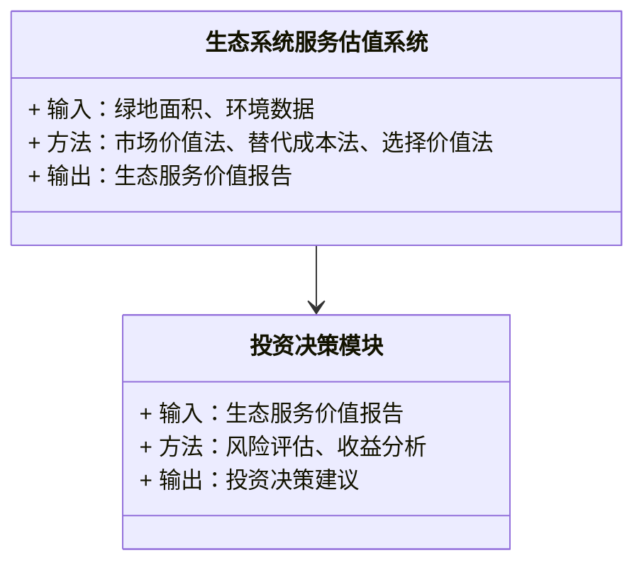
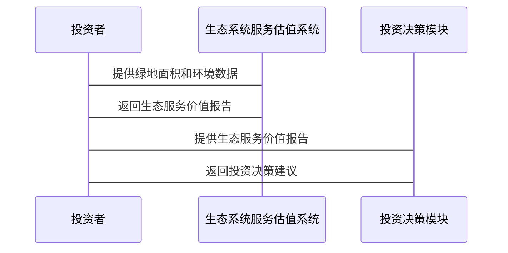

                 


# 生态系统服务估值方法在投资决策中的应用

> 关键词：生态系统服务，投资决策，绿色金融，可持续投资，估值方法

> 摘要：生态系统服务作为自然环境提供的重要服务，对人类社会的可持续发展具有重要意义。本文探讨了生态系统服务在投资决策中的应用，详细介绍了生态系统服务的定义、分类、估值方法，并通过实际案例展示了如何将这些方法应用于投资决策中。通过分析生态系统服务与投资决策的关系，本文旨在为投资者提供科学的决策支持，促进绿色金融和可持续投资的发展。

---

# 第一部分: 生态系统服务与投资决策的背景介绍

## 第1章: 生态系统服务的定义与分类

### 1.1 生态系统服务的定义

#### 1.1.1 核心概念：问题背景与问题描述

生态系统服务是指自然生态系统提供的各种服务，包括 provisioning（ provisioning services）、regulating（regulating services）、cultural（cultural services）和 supporting（supporting services）四类。这些服务对人类的生存、经济发展和文化活动至关重要。然而，由于生态系统服务的非市场性质，其价值往往被忽视或低估。

#### 1.1.2 生态系统服务的分类与特征

生态系统服务可以分为以下四类：

1. ** provisioning services**：直接提供人类所需的资源，如食物、水、木材等。
2. ** regulating services**：调节环境过程，如气候调节、水循环、疾病控制等。
3. ** cultural services**：提供文化、精神和娱乐价值，如旅游、教育、美学等。
4. ** supporting services**：支持其他生态系统服务的生态过程，如土壤形成、养分循环等。

生态系统服务的特征包括：

- **公共品属性**：许多生态系统服务具有公共品属性，难以通过市场交易定价。
- **外部性**：生态系统服务的收益或成本往往影响到第三方，导致市场失灵。
- **复杂性**：生态系统服务的价值取决于多种因素，如地理位置、环境条件和人类活动。

#### 1.1.3 生态系统服务与人类福祉的关系

生态系统服务对人类福祉有深远影响。例如，健康的生态系统可以提供清洁的空气和水，减少自然灾害的风险，促进经济发展和文化传承。然而，过度开发和破坏生态系统会导致生态系统服务的退化，进而影响人类的生存和发展。

### 1.2 生态系统服务的经济价值

#### 1.2.1 市场价值法

市场价值法通过市场交易数据估算生态系统服务的价值。例如，森林可以提供木材资源，其价值可以通过市场上的木材价格来估算。然而，这种方法仅适用于可交易的生态系统服务，无法评估非市场化的服务。

#### 1.2.2 替代成本法

替代成本法通过估算替代方案的成本来确定生态系统服务的价值。例如，如果砍伐森林会导致水土流失，那么恢复森林的成本可以作为替代成本来估算生态服务的价值。

#### 1.2.3 选择价值法

选择价值法通过调查或实验来估计人们愿意为生态系统服务支付的费用。例如，通过问卷调查了解公众愿意为清洁的水源支付多少钱。

---

## 第2章: 投资决策中的生态系统服务

### 2.1 投资决策中的生态因素

#### 2.1.1 绿色金融与可持续投资

绿色金融是指将环境因素纳入投资决策的金融活动。生态系统服务的估值是绿色金融的重要组成部分，可以帮助投资者识别环境风险和机会。

#### 2.1.2 生态系统服务在项目评估中的作用

在项目评估中，生态系统服务的估值可以帮助投资者评估项目的环境影响和潜在收益。例如，在评估一个工业园区项目时，需要考虑其对当地水资源和空气质量的影响。

#### 2.1.3 生态风险与投资决策的关系

生态风险是指生态系统服务退化或丧失的风险。在投资决策中，生态风险可能影响项目的长期可持续性和经济回报。例如，过度依赖自然资源的项目可能面临资源枯竭的风险。

### 2.2 生态系统服务与企业价值

#### 2.2.1 生态资产的经济价值评估

生态资产是指生态系统提供的各种资源和服务。通过估算生态资产的经济价值，可以帮助企业评估其对经济回报的影响。例如，一个公司依赖于清洁的水源进行生产，可以通过估算水源的经济价值来评估其对公司的贡献。

#### 2.2.2 生态系统服务对企业财务的影响

生态系统服务的估值可以帮助企业识别和管理环境风险。例如，一个依赖农业生产的公司可能面临气候变化的风险，通过估算气候调节服务的价值，可以帮助公司制定应对策略。

#### 2.2.3 可持续发展与企业长期价值

可持续发展是企业长期价值的重要组成部分。通过估算生态系统服务的估值，企业可以更好地理解其对社会和环境的影响，从而制定更可持续的经营策略。

---

# 第二部分: 生态系统服务估值的核心概念与联系

## 第3章: 生态系统服务估值的核心原理

### 3.1 估值方法的分类与对比

以下是几种常见的生态系统服务估值方法的对比表格：

| 估值方法          | 适用场景                     | 优点                     | 缺点                     |
|-------------------|------------------------------|--------------------------|--------------------------|
| 市场价值法        | 可交易的资源                 | 数据容易获取               | 无法估值非市场化的服务   |
| 替代成本法        | 环境恢复成本估算             | 能够量化具体成本           | 可能高估或低估实际价值    |
| 选择价值法        | 公共品属性的服务             | 能够反映真实偏好           | 调查成本较高             |

### 3.2 实体关系图与生态系统服务网络

以下是生态系统服务的ER实体关系图（Mermaid流程图）：

```mermaid
erDiagram
    actor 投资者 {
        string 资金
        string 项目
    }
    actor 环境 {
        string 生态系统服务
        string 估值方法
    }
    actor 决策者 {
        string 投资决策
        string 可持续性目标
    }
    investor -> 环境 : 提供资金
   环境 -> 投资者 : 提供生态系统服务
   投资者 -> 决策者 : 制定投资决策
    环境 -> 决策者 : 支持可持续性目标
```

---

# 第三部分: 生态系统服务估值的算法原理

## 第4章: 常见生态系统服务估值算法

### 4.1 市场价值法

#### 4.1.1 算法流程图（Mermaid）

```mermaid
graph TD
    A[开始] -> B[确定可交易的资源]
    B -> C[收集市场交易数据]
    C -> D[计算资源价值]
    D -> E[结束]
```

#### 4.1.2 Python实现代码

```python
def market_value_assessment(resource_value, impact_factor):
    return resource_value * impact_factor

# 示例
resource_value = 100  # 资源价值
impact_factor = 2     # 影响因子
result = market_value_assessment(resource_value, impact_factor)
print(f"生态系统服务的市场价值为：{result}")
```

### 4.2 替代成本法

#### 4.2.1 算法流程图（Mermaid）

```mermaid
graph TD
    A[开始] -> B[确定替代方案]
    B -> C[估算恢复成本]
    C -> D[计算生态服务价值]
    D -> E[结束]
```

#### 4.2.2 Python实现代码

```python
def alternative_cost_assessment(cost, benefit):
    return benefit - cost

# 示例
cost = 50  # 恢复成本
benefit = 100  # 生态服务的收益
result = alternative_cost_assessment(cost, benefit)
print(f"生态系统的净收益为：{result}")
```

### 4.3 选择价值法

#### 4.3.1 算法流程图（Mermaid）

```mermaid
graph TD
    A[开始] -> B[设计调查问卷]
    B -> C[收集数据]
    C -> D[计算选择价值]
    D -> E[结束]
```

#### 4.3.2 Python实现代码

```python
def choice_value_assessment(preferences, weights):
    return sum(preferences * weights) / len(preferences)

# 示例
preferences = [50, 60, 70]  # 调查问卷中的偏好值
weights = [0.3, 0.4, 0.3]  # 权重
result = choice_value_assessment(preferences, weights)
print(f"选择价值为：{result}")
```

---

# 第四部分: 生态系统服务估值在投资决策中的应用

## 第5章: 系统分析与架构设计

### 5.1 问题场景介绍

假设我们正在评估一个城市绿地的生态服务价值。绿地提供了氧气、防洪、休闲娱乐等多种生态系统服务。我们需要通过估值方法估算这些服务的价值，为投资决策提供依据。

### 5.2 系统功能设计

以下是系统功能设计的类图（Mermaid）：



### 5.3 系统架构设计

以下是系统架构设计的架构图（Mermaid）：

```mermaid
docker
    service 生态系统服务估值系统 {
        publish 80
    }
    service 投资决策模块 {
        publish 8080
    }
    生态系统服务估值系统 --> 投资决策模块
```

### 5.4 系统接口设计

以下是系统接口设计的接口图（Mermaid）：

```mermaid
client
    call 生态系统服务估值系统
    ... 
```

### 5.5 系统交互设计

以下是系统交互设计的序列图（Mermaid）：



---

## 第6章: 项目实战

### 6.1 环境安装

要运行生态系统服务估值系统，需要安装以下软件和工具：

1. Python 3.8+
2. Mermaid CLI 或支持 Mermaid 的 IDE
3. 数据分析库（如 Pandas、NumPy）
4. 可视化工具（如 Matplotlib 或 Seaborn）

### 6.2 系统核心实现源代码

以下是生态系统服务估值系统的核心代码：

```python
class EcosystemServiceValuation:
    def __init__(self, area, environment_data):
        self.area = area
        self.environment_data = environment_data

    def market_value_assessment(self, resource_value, impact_factor):
        return resource_value * impact_factor

    def alternative_cost_assessment(self, cost, benefit):
        return benefit - cost

    def choice_value_assessment(self, preferences, weights):
        return sum(preferences * weights) / len(preferences)

# 示例使用
valuation = EcosystemServiceValuation(100, "urban_green")
market_value = valuation.market_value_assessment(50, 2)
alternative_cost = valuation.alternative_cost_assessment(30, 70)
choice_value = valuation.choice_value_assessment([40, 50, 60], [0.2, 0.3, 0.5])

print(f"市场价值：{market_value}")
print(f"替代成本价值：{alternative_cost}")
print(f"选择价值：{choice_value}")
```

### 6.3 代码应用解读与分析

上述代码定义了一个 `EcosystemServiceValuation` 类，包含三种估值方法：市场价值法、替代成本法和选择价值法。通过实例化该类，我们可以调用这些方法来估算生态系统服务的价值。

### 6.4 实际案例分析

假设我们正在评估一个城市绿地的生态服务价值。首先，我们需要收集绿地的面积和环境数据。然后，使用上述方法估算氧气、防洪和休闲娱乐的价值。最后，将这些价值综合起来，为投资决策提供依据。

### 6.5 项目小结

通过上述实战，我们可以看到，生态系统服务的估值方法可以帮助投资者更好地理解环境因素对投资决策的影响。这不仅有助于降低生态风险，还能提高投资的可持续性。

---

# 第五部分: 总结与展望

## 第7章: 总结与展望

### 7.1 最佳实践 tips

- 在投资决策中，应综合考虑多种生态系统服务的估值方法，以获得更准确的结果。
- 定期更新生态系统服务的估值数据，以反映环境变化和市场波动。
- 结合人工智能和大数据技术，提高生态系统服务估值的准确性和效率。

### 7.2 小结

生态系统服务的估值在投资决策中具有重要意义。通过合理应用估值方法，投资者可以更好地识别和管理环境风险，促进可持续发展。

### 7.3 注意事项

- 生态系统服务的估值具有一定的主观性，需要根据具体情况进行调整。
- 在实际应用中，应结合多种方法，避免单一方法的局限性。

### 7.4 拓展阅读

- 《生态经济学导论》
- 《绿色金融与可持续投资》
- 《生态系统服务与人类福祉》

---

# 作者：AI天才研究院/AI Genius Institute & 禅与计算机程序设计艺术 /Zen And The Art of Computer Programming

