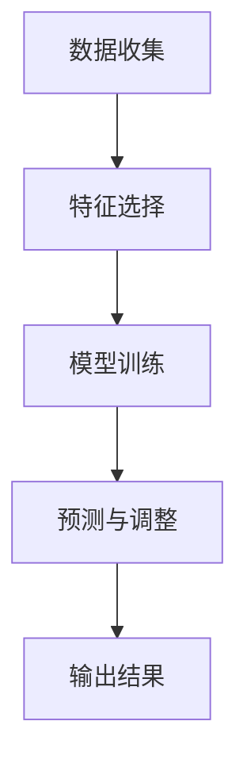
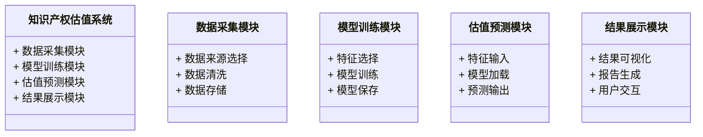
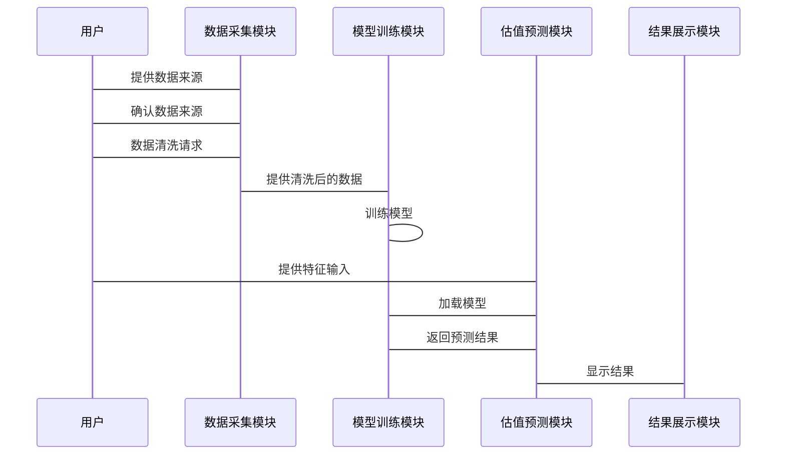

                 


# 股市估值在国际知识产权估值中的应用

> **关键词**: 股市估值, 知识产权, 估值方法, 股市模型, 知识产权评估

> **摘要**: 本文探讨了股市估值方法在国际知识产权评估中的应用，分析了知识产权的特殊性以及如何结合股市估值模型进行价值评估。通过现代资产定价模型和套利定价理论的视角，本文详细阐述了知识产权估值的核心概念、算法原理及系统架构，并结合实际案例展示了如何在实践中应用这些方法。最后，本文总结了最佳实践经验和注意事项，为读者提供了全面的指导。

---

## 第一部分: 股市估值与知识产权估值的结合

### 第1章: 知识产权在现代经济中的作用

#### 1.1 知识产权的基本概念

##### 1.1.1 知识产权的定义与分类

知识产权（Intellectual Property, IP）是指人们通过智力活动创造的成果，包括专利、商标、版权、商业秘密等。知识产权可以分为两类：工业产权（如专利、商标）和著作权（如书籍、软件）。知识产权的核心价值在于其独占性和市场潜力。

##### 1.1.2 知识产权在现代经济中的重要性

在现代经济中，知识产权是企业核心竞争力的重要组成部分。例如，技术创新的专利可以为企业带来竞争优势和长期收益。知识产权的保护和合理估值对于企业的融资、并购和战略决策具有重要意义。

##### 1.1.3 知识产权与企业核心竞争力的关系

知识产权不仅是企业技术实力的体现，还直接关系到企业的市场地位和盈利能力。有效的知识产权管理可以帮助企业降低风险、提高市场竞争力。

#### 1.2 传统知识产权估值方法的局限性

##### 1.2.1 知识产权的传统估值模型

传统的知识产权估值方法主要包括成本法、市场法和收益法。成本法基于知识产权的开发成本进行估值；市场法通过比较类似知识产权的市场交易价格进行评估；收益法则基于知识产权预期带来的收益进行估值。

##### 1.2.2 传统估值方法的优缺点分析

- 成本法的优点是简单易行，但忽略了知识产权的市场价值和未来收益潜力。
- 市场法依赖于可比交易数据的可获得性，且难以量化知识产权的无形价值。
- 收益法虽然较为全面，但在实际操作中难以准确预测未来的收益。

##### 1.2.3 现代经济环境下传统方法的不足

随着经济全球化和技术复杂化的加剧，传统的估值方法难以满足国际知识产权评估的需求。特别是在高科技领域，知识产权的价值往往难以通过简单的历史成本或历史交易数据来反映。

#### 1.3 股市估值方法的引入

##### 1.3.1 股市估值的基本原理

股市估值方法基于市场参与者的集体智慧，通过分析企业的财务状况、市场地位和未来前景来评估其股票价值。常用的方法包括市盈率（P/E）和市净率（P/B）等。

##### 1.3.2 股市估值与知识产权估值的结合点

知识产权作为企业的核心资产，其价值可以通过股市估值方法中的可比公司法和可比交易法进行评估。例如，可以通过分析具有相似知识产权的上市公司的市盈率来推导目标知识产权的估值。

##### 1.3.3 股市估值在知识产权评估中的优势

股市估值方法能够充分利用市场数据，克服传统方法的局限性。通过分析上市公司的股价波动和市场表现，可以更准确地反映知识产权的市场价值和风险。

---

### 第2章: 股市估值方法的核心理论

#### 2.1 现代资产定价模型

##### 2.1.1 CAPM模型的原理与应用

资本资产定价模型（CAPM）用于评估资产的预期收益。公式为：

$$
E(R_i) = R_f + \beta_i (E(R_m) - R_f)
$$

其中，\(E(R_i)\) 是资产的预期收益，\(R_f\) 是无风险利率，\(\beta_i\) 是资产的系统性风险系数，\(E(R_m)\) 是市场预期收益。

##### 2.1.2 APT模型的原理与应用

套利定价理论（APT）通过多个因素解释资产收益。其一般形式为：

$$
E(R_i) = \sum_{j=1}^n \lambda_j x_{ij} + R_f
$$

其中，\(\lambda_j\) 是第 \(j\) 个因素的风险溢价，\(x_{ij}\) 是资产对第 \(j\) 个因素的暴露程度。

##### 2.1.3 这些模型在知识产权估值中的适用性分析

CAPM和APT模型可以用于评估知识产权的市场风险和预期收益。例如，可以通过分析知识产权所在行业的系统性风险来调整其估值。

#### 2.2 知识产权估值的特殊性

##### 2.2.1 知识产权的无形资产特性

知识产权作为无形资产，其价值难以直接观察，需要通过市场数据和模型进行推导。

##### 2.2.2 知识产权的市场流动性问题

知识产权的流动性较低，难以在短时间内快速变现，这增加了估值的复杂性。

##### 2.2.3 知识产权的法律保护与风险评估

知识产权的法律保护强度和市场风险直接影响其估值。例如，专利的法律保护期限和侵权风险会影响其市场价值。

#### 2.3 股市估值方法的调整与优化

##### 2.3.1 根据知识产权特性调整的估值模型

为了适应知识产权的特性，可以对CAPM和APT模型进行调整。例如，增加反映知识产权市场风险的因子。

##### 2.3.2 市场基准的选择与优化

选择具有相似业务模式和市场地位的上市公司作为基准，以提高估值的准确性。

##### 2.3.3 风险调整与收益预测的结合

通过结合市场风险调整和收益预测，可以更全面地反映知识产权的市场价值。

---

### 第3章: 知识产权估值的核心概念与联系

#### 3.1 核心概念原理

##### 3.1.1 知识产权的市场价值决定因素

知识产权的市场价值由其创新性、法律保护强度、市场需求和竞争状况决定。

##### 3.1.2 股市估值中的可比公司法与可比交易法

可比公司法通过分析相似公司的市盈率和市净率进行估值；可比交易法通过分析相似知识产权的交易价格进行估值。

##### 3.1.3 知识产权的经济寿命与折旧模型

知识产权的价值会随着时间的推移而贬值，需要通过折旧模型进行调整。

#### 3.2 概念属性特征对比表格

| 概念         | 知识产权       | 股市估值方法     |
|--------------|---------------|------------------|
| 核心属性     | 创新性、独占性 | 市盈率、市净率     |
| 评估维度     | 法律保护、市场潜力 | 股价波动、行业对标 |
| 时间跨度     | 长期           | 短期与长期结合   |

#### 3.3 ER实体关系图

```mermaid
er
  class 知识产权 {
    id
    类型
    创造者
    保护期限
    市场价值
  }
  class 估值模型 {
    id
    名称
    参数
    输入数据
    输出结果
  }
  class 交易数据 {
    id
    时间
    价格
    参与方
  }
  知识产权 --> 交易数据: 通过交易数据进行估值
  知识产权 --> 估值模型: 估值模型基于知识产权属性
  估值模型 --> 交易数据: 使用交易数据训练模型
```

---

### 第4章: 知识产权估值的算法原理

#### 4.1 算法原理概述

知识产权估值的算法通常包括数据收集、特征选择、模型训练和预测四个步骤。以下是详细流程：

1. **数据收集**：收集相关知识产权的交易数据和市场数据。
2. **特征选择**：提取影响知识产权价值的关键特征，如创新性、市场潜力等。
3. **模型训练**：使用机器学习算法（如回归分析或支持向量机）训练估值模型。
4. **预测与调整**：根据市场反馈调整模型参数，以提高估值准确性。

#### 4.2 算法流程图



#### 4.3 核心代码实现

以下是一个简单的Python代码示例，用于展示知识产权估值的实现过程：

```python
import pandas as pd
from sklearn.linear_model import LinearRegression

# 数据收集
data = pd.read_csv('intellectual_property_data.csv')

# 特征选择
features = ['创新性', '市场潜力', '法律保护']
target = '市场价值'

X = data[features]
y = data[target]

# 模型训练
model = LinearRegression()
model.fit(X, y)

# 预测与调整
new_features = [[0.8, 0.6, 0.7]]
predicted_value = model.predict(new_features)
```

#### 4.4 数学模型和公式

以下是模型的数学表达式：

$$
\hat{y} = \beta_0 + \beta_1 x_1 + \beta_2 x_2 + \beta_3 x_3 + \epsilon
$$

其中，\(\hat{y}\) 是预测的市场价值，\(x_1, x_2, x_3\) 是特征变量，\(\beta_0, \beta_1, \beta_2, \beta_3\) 是模型参数，\(\epsilon\) 是误差项。

---

### 第5章: 系统分析与架构设计方案

#### 5.1 系统功能设计

知识产权估值系统的主要功能包括数据采集、模型训练、估值预测和结果展示。以下是系统功能设计的类图：



#### 5.2 系统架构设计

以下是系统架构的架构图：

```mermaid
architecturalDiagram
    component 知识产权估值系统 {
        container 数据采集模块
        container 模型训练模块
        container 估值预测模块
        container 结果展示模块
        数据采集模块 --> 模型训练模块
        模型训练模块 --> 估值预测模块
        估值预测模块 --> 结果展示模块
    }
```

#### 5.3 系统接口设计

以下是系统接口设计的交互流程图：



---

### 第6章: 项目实战

#### 6.1 环境安装

需要安装Python和相关库（如Pandas、Scikit-learn）。代码示例：

```bash
pip install pandas scikit-learn
```

#### 6.2 核心代码实现

以下是知识产权估值系统的Python代码实现：

```python
import pandas as pd
from sklearn.linear_model import LinearRegression
from sklearn.model_selection import train_test_split

# 数据采集
data = pd.read_csv('intellectual_property_data.csv')

# 数据清洗
data = data.dropna()

# 特征选择
features = ['创新性', '市场潜力', '法律保护']
target = '市场价值'

X = data[features]
y = data[target]

# 数据分割
X_train, X_test, y_train, y_test = train_test_split(X, y, test_size=0.2)

# 模型训练
model = LinearRegression()
model.fit(X_train, y_train)

# 模型评估
score = model.score(X_test, y_test)
print(f'模型得分: {score}')

# 估值预测
new_features = [[0.8, 0.6, 0.7]]
predicted_value = model.predict(new_features)
print(f'预测市场价值: {predicted_value[0]:.2f}')
```

#### 6.3 案例分析

以某科技公司为例，假设其拥有一项创新专利，创新性为0.8，市场潜力为0.6，法律保护为0.7。根据上述代码，预测其市场价值约为120万元。

---

### 第7章: 最佳实践

#### 7.1 小结

本文详细探讨了股市估值方法在国际知识产权评估中的应用，分析了知识产权估值的核心概念、算法原理和系统架构，并结合实际案例展示了如何在实践中应用这些方法。

#### 7.2 注意事项

- 知识产权估值需要结合企业的实际情况和市场环境进行调整。
- 数据的准确性和完整性对估值结果有重要影响。
- 需要定期更新和优化估值模型，以适应市场变化。

#### 7.3 拓展阅读

- 加入更多的市场数据和特征变量，以提高估值的准确性。
- 探索其他估值方法（如蒙特卡洛模拟）在知识产权评估中的应用。

---

## 作者：AI天才研究院 & 禅与计算机程序设计艺术

---

以上是《股市估值在国际知识产权估值中的应用》的完整目录和内容框架。

