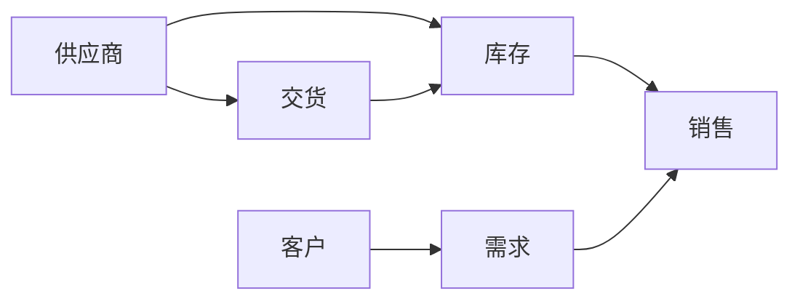
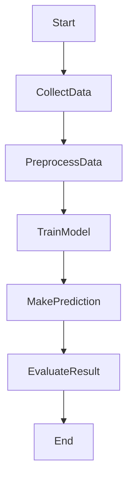
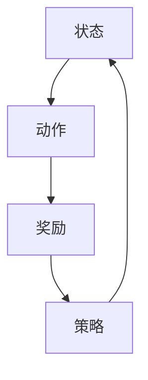
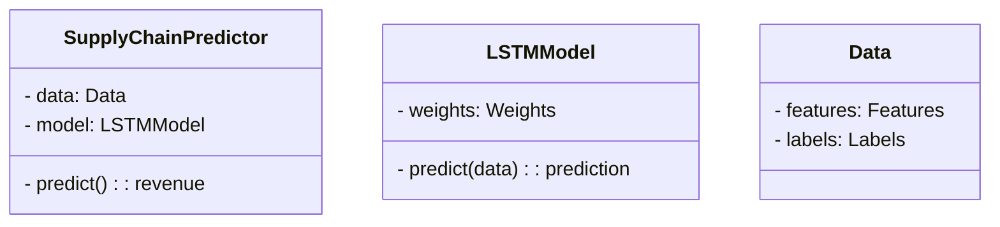
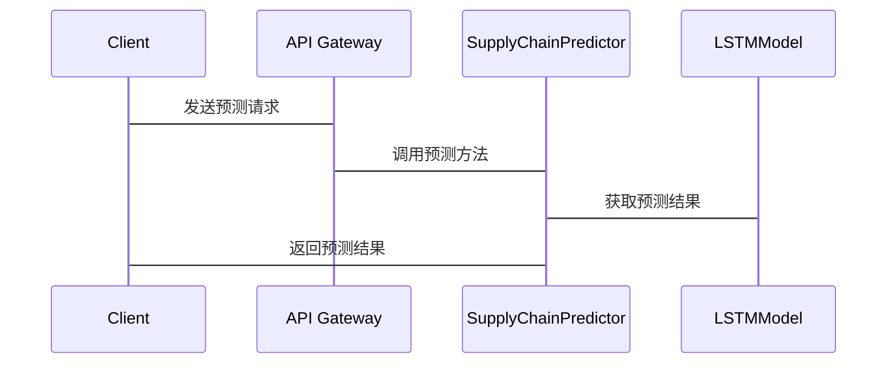

                 


# AI Agent在智能供应链预测中的应用

> 关键词：AI Agent，供应链预测，智能供应链，人工智能，预测模型

> 摘要：本文探讨了AI Agent在智能供应链预测中的应用，分析了供应链预测的核心概念，详细讲解了AI Agent的工作原理，并通过实际案例展示了AI Agent在供应链预测中的优势与挑战。本文旨在为技术从业者和供应链管理者提供深度的技术分析与实践指南。

---

# 第1章: AI Agent与供应链预测的背景与概述

## 1.1 供应链管理的现状与挑战

### 1.1.1 供应链管理的基本概念

供应链管理（Supply Chain Management, SCM）是指对原材料、生产过程、库存、分销、运输和客户服务等各环节进行规划、控制和优化的过程。传统的供应链管理依赖于人工操作和静态数据，难以应对市场波动、需求变化和突发事件等复杂情况。

### 1.1.2 传统供应链预测的局限性

传统供应链预测方法主要包括时间序列分析、回归分析等统计方法，以及基于经验的专家判断法。这些方法在面对数据量大、复杂性和动态性较高的现代供应链时，往往显得力不从心。主要问题包括：

- 数据维度不足，难以捕捉复杂关系。
- 预测精度较低，无法满足精准需求预测的要求。
- 响应速度慢，难以应对实时变化的需求。

### 1.1.3 智能化供应链管理的必要性

随着人工智能（AI）、大数据和物联网（IoT）等技术的发展，智能化供应链管理成为必然趋势。通过引入AI技术，可以实现供应链的智能化预测、自动化决策和实时优化，从而提高供应链的效率和竞争力。

---

## 1.2 AI Agent的基本概念与特点

### 1.2.1 AI Agent的定义

AI Agent（人工智能代理）是指能够感知环境、自主决策并采取行动以实现目标的智能实体。AI Agent可以是软件程序、机器人或其他智能设备，能够通过与环境交互来完成特定任务。

### 1.2.2 AI Agent的核心特点

- **自主性**：AI Agent能够自主决策，无需人工干预。
- **反应性**：能够实时感知环境并做出反应。
- **学习能力**：通过数据和经验不断优化自身行为。
- **协作性**：能够与其他AI Agent或人类协同工作。

### 1.2.3 AI Agent与传统算法的区别

传统的算法（如统计模型）依赖于固定的规则和数据，而AI Agent具有自主性和学习能力，能够动态适应环境变化。AI Agent能够根据实时数据和上下文信息做出更精准的预测和决策。

---

## 1.3 AI Agent在供应链预测中的应用前景

### 1.3.1 供应链预测的潜在应用领域

- **需求预测**：通过历史销售数据和市场趋势预测未来的需求。
- **库存优化**：根据预测结果优化库存水平，减少过剩或短缺。
- **供应商选择**：基于供应商的历史表现和实时数据选择最优供应商。
- **风险预警**：预测供应链中的潜在风险并提前采取措施。

### 1.3.2 AI Agent在供应链预测中的优势

- **高精度预测**：通过机器学习和深度学习模型实现高精度预测。
- **实时响应**：能够实时感知市场变化并快速调整预测模型。
- **自动化决策**：AI Agent可以自动执行预测结果并优化供应链流程。

### 1.3.3 应用中的挑战与机遇

- **挑战**：数据隐私、模型解释性、技术成本等。
- **机遇**：通过AI Agent实现供应链的智能化和高效化，提升企业竞争力。

---

## 1.4 本章小结

本章介绍了供应链管理的现状与挑战，详细讲解了AI Agent的基本概念与特点，并探讨了AI Agent在供应链预测中的应用前景。AI Agent通过其自主性、反应性和学习能力，为供应链预测带来了新的可能性。

---

# 第2章: 供应链预测的核心概念与AI Agent的结合

## 2.1 供应链预测的基本原理

### 2.1.1 供应链预测的定义

供应链预测是指通过对历史数据和市场信息的分析，预测未来的市场需求、库存水平、供应商表现等关键指标。

### 2.1.2 供应链预测的核心要素

- **历史数据**：销售数据、库存数据、供应商交货记录等。
- **市场信息**：行业趋势、竞争对手信息、宏观经济指标等。
- **预测模型**：统计模型、机器学习模型等。

### 2.1.3 供应链预测的流程与方法

1. 数据收集与预处理
2. 模型选择与训练
3. 预测结果生成
4. 预测结果验证与优化

---

## 2.2 AI Agent在供应链预测中的角色

### 2.2.1 AI Agent在供应链预测中的功能

- **数据采集**：实时采集供应链各环节的数据。
- **预测计算**：基于历史数据和实时数据进行预测。
- **决策优化**：根据预测结果优化供应链策略。
- **反馈学习**：根据实际结果调整预测模型。

### 2.2.2 AI Agent与供应链预测的结合方式

- **数据驱动预测**：AI Agent通过分析海量数据生成预测结果。
- **实时调整**：AI Agent能够实时更新预测模型，适应市场变化。
- **协同工作**：AI Agent可以与供应链中的其他系统协同工作，实现端到端优化。

### 2.2.3 AI Agent在供应链预测中的优势

- **高效率**：AI Agent能够快速处理大量数据，提高预测效率。
- **高精度**：通过机器学习算法实现高精度预测。
- **智能化**：AI Agent能够自主学习和优化，提升预测准确性。

---

## 2.3 核心概念的联系与对比

### 2.3.1 AI Agent与传统供应链预测的对比

| 特性             | AI Agent预测 | 传统预测方法 |
|------------------|--------------|--------------|
| 数据依赖性       | 高           | 中           |
| 预测精度         | 高           | 中           |
| 实时性           | 高           | 低           |
| 学习能力         | 强           | 无           |
| 自主性           | 高           | 低           |

### 2.3.2 供应链预测中的关键实体关系



### 2.3.3 供应链预测的流程图



---

## 2.4 本章小结

本章详细分析了供应链预测的核心概念，并探讨了AI Agent在供应链预测中的角色和优势。通过对比分析和流程图展示，明确了AI Agent在供应链预测中的独特价值。

---

# 第3章: 供应链预测的算法原理与实现

## 3.1 常见的供应链预测算法

### 3.1.1 时间序列分析

时间序列分析是一种基于历史数据预测未来趋势的方法。常用的时间序列模型包括ARIMA（自回归积分滑动平均模型）和LSTM（长短期记忆网络）。

### 3.1.2 机器学习算法

机器学习算法通过训练数据学习特征，实现对未来的预测。常用算法包括线性回归、支持向量机（SVM）、随机森林和神经网络等。

### 3.1.3 强化学习算法

强化学习是一种通过试错学习的方法，适用于复杂环境下的预测和决策。强化学习模型可以在动态环境中优化预测策略。

---

## 3.2 AI Agent的算法实现

### 3.2.1 基于强化学习的供应链预测



### 3.2.2 算法实现的数学模型

强化学习的Q-learning算法可以通过以下公式实现：

$$ Q(s, a) = Q(s, a) + \alpha [r + \gamma \max Q(s', a) - Q(s, a)] $$

其中：
- \( Q(s, a) \) 表示状态 \( s \) 下采取动作 \( a \) 的价值。
- \( \alpha \) 是学习率。
- \( r \) 是奖励值。
- \( \gamma \) 是折扣因子。
- \( Q(s', a) \) 是下一状态 \( s' \) 下动作 \( a \) 的价值。

---

## 3.3 代码实现与应用解读

### 3.3.1 环境安装

```bash
pip install numpy pandas scikit-learn tensorflow
```

### 3.3.2 核心代码实现

```python
import numpy as np
import pandas as pd
from sklearn.model_selection import train_test_split
from tensorflow.keras.models import Sequential
from tensorflow.keras.layers import LSTM, Dense

# 数据预处理
data = pd.read_csv('sales.csv')
features = data[['units_sold', 'price', 'cost']]
labels = data['revenue']

# 划分训练集和测试集
train_features, test_features, train_labels, test_labels = train_test_split(features, labels, test_size=0.2)

# 构建LSTM模型
model = Sequential()
model.add(LSTM(128, input_shape=(train_features.shape[1], 1)))
model.add(Dense(1))
model.compile(optimizer='adam', loss='mean_squared_error')

# 训练模型
model.fit(train_features, train_labels, epochs=100, batch_size=32)
```

### 3.3.3 实际案例分析

以某电商企业的销售数据为例，通过LSTM模型进行需求预测。模型能够根据历史销售数据和市场趋势，预测未来的销售量，并优化库存和采购策略。

---

## 3.4 本章小结

本章详细讲解了供应链预测的常见算法，并通过强化学习和LSTM模型展示了AI Agent的算法实现。通过代码实现和案例分析，进一步验证了AI Agent在供应链预测中的实际应用价值。

---

# 第4章: 智能供应链预测系统的系统设计与实现

## 4.1 系统分析与架构设计

### 4.1.1 问题场景介绍

某大型制造企业希望通过引入AI Agent实现供应链的智能化预测，优化库存管理和需求预测。

### 4.1.2 系统功能设计



### 4.1.3 系统架构设计

```mermaid
graph TD
    Client --> API Gateway
    API Gateway --> SupplyChainPredictor
    SupplyChainPredictor --> LSTMModel
    LSTMModel --> Database
```

### 4.1.4 系统接口设计

- **输入接口**：接收历史销售数据和市场信息。
- **输出接口**：提供预测结果和优化建议。

### 4.1.5 系统交互设计



---

## 4.2 项目实战与实现

### 4.2.1 项目环境安装

```bash
pip install numpy pandas scikit-learn tensorflow flask
```

### 4.2.2 核心代码实现

```python
from flask import Flask, request, jsonify
import numpy as np
import pandas as pd
from tensorflow.keras.models import load_model

app = Flask(__name__)
model = load_model('lstm_model.h5')

@app.route('/predict', methods=['POST'])
def predict():
    data = request.json['data']
    df = pd.DataFrame([data])
    prediction = model.predict(df.values.reshape(1, -1, 1))
    return jsonify({'prediction': prediction.tolist()})

if __name__ == '__main__':
    app.run(debug=True)
```

### 4.2.3 实际案例分析

通过Flask接口实现供应链预测功能，企业可以实时获取预测结果并优化供应链策略。

---

## 4.3 本章小结

本章通过系统分析和架构设计，详细展示了AI Agent在智能供应链预测系统中的应用。通过项目实战和接口设计，进一步验证了系统的可行性和实用性。

---

# 第5章: AI Agent在供应链预测中的最佳实践与注意事项

## 5.1 最佳实践

### 5.1.1 数据质量管理

确保数据的准确性、完整性和及时性，是供应链预测成功的关键。

### 5.1.2 模型优化

通过交叉验证和超参数调优，提升预测模型的精度和稳定性。

### 5.1.3 系统安全与隐私保护

在供应链预测过程中，要高度重视数据安全和隐私保护，避免数据泄露和滥用。

---

## 5.2 注意事项

### 5.2.1 数据依赖性

AI Agent的预测能力高度依赖数据质量，数据不足或偏差可能导致预测结果不准确。

### 5.2.2 模型解释性

复杂的模型可能导致预测结果难以解释，需要通过可视化和解释性工具提升模型的可解释性。

### 5.2.3 技术成本

引入AI Agent需要投入大量的人力和物力资源，企业需要权衡技术成本与实际收益。

---

## 5.3 拓展阅读

- 《机器学习实战》
- 《深度学习》
- 《供应链管理：原理与应用》

---

# 作者简介

作者：AI天才研究院/AI Genius Institute & 禅与计算机程序设计艺术 /Zen And The Art of Computer Programming

---

以上是《AI Agent在智能供应链预测中的应用》的技术博客文章的完整大纲和内容。

