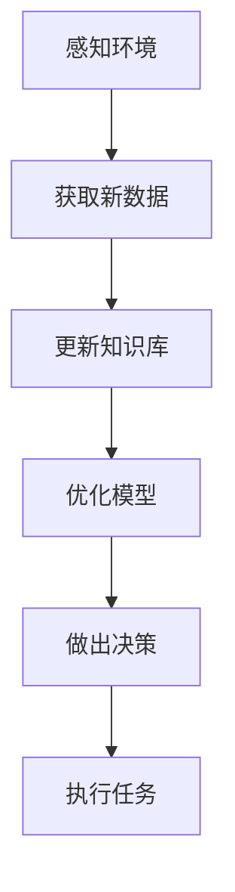
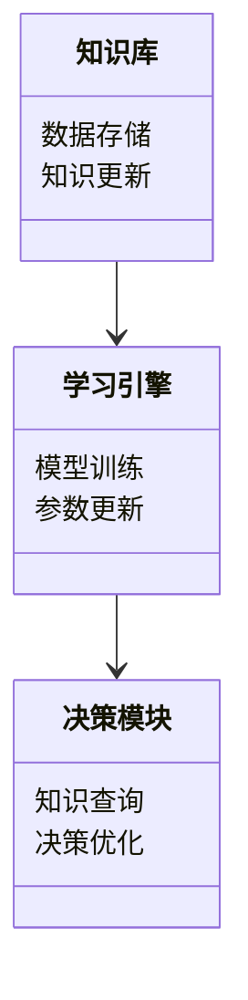
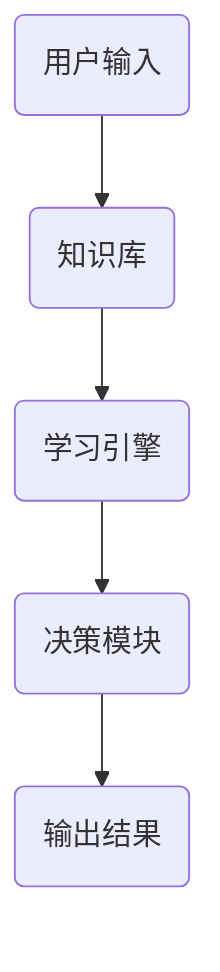
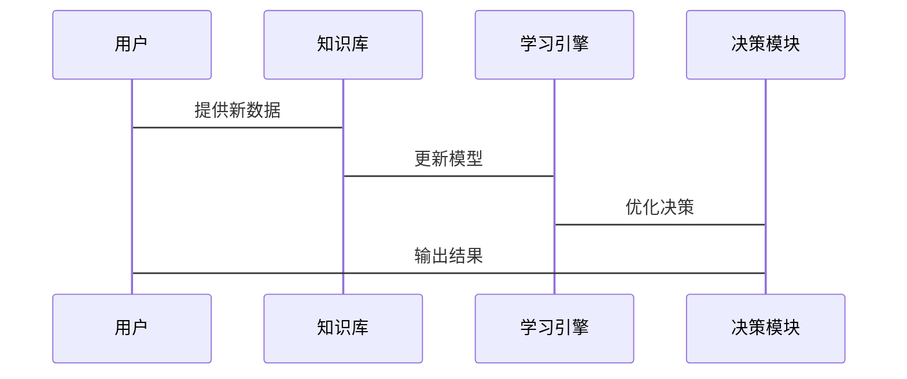

                 


# AI Agent的持续学习机制：保持知识更新与性能提升

> 关键词：AI Agent，持续学习，知识更新，性能提升，算法原理，系统架构，项目实战

> 摘要：本文将探讨AI Agent的持续学习机制，分析其在知识更新与性能提升方面的核心原理与实现方法。通过详细讲解核心概念、算法原理、系统架构、项目实战和最佳实践，本文旨在为读者提供全面的技术洞察。

---

## 第一部分: AI Agent的持续学习机制概述

### 第1章: AI Agent与持续学习的背景

#### 1.1 AI Agent的基本概念

##### 1.1.1 AI Agent的定义与特点
AI Agent（人工智能代理）是一种能够感知环境、执行任务并做出决策的智能实体。其特点包括：
- **自主性**：能够在无外部干预的情况下自主运行。
- **反应性**：能够实时感知环境并做出响应。
- **目标导向性**：通过目标驱动行为，优化决策以实现目标。
- **学习能力**：能够通过经验或数据优化自身性能。

##### 1.1.2 AI Agent的应用场景与挑战
AI Agent广泛应用于自动驾驶、智能助手、机器人、推荐系统等领域。其主要挑战包括：
- 复杂环境的适应性
- 动态数据的实时处理
- 模型的持续更新与优化

##### 1.1.3 持续学习的概念与重要性
持续学习是指AI Agent在运行过程中不断吸收新知识、优化模型以适应新任务或环境变化的能力。其重要性体现在：
- **实时性**：能够快速响应新需求。
- **适应性**：在动态环境中保持高效性能。
- **扩展性**：能够不断扩展知识库，应对更多复杂场景。

#### 1.2 持续学习的背景与问题背景

##### 1.2.1 知识更新的需求
AI Agent需要实时更新知识库以应对环境变化，例如：
- 新数据的引入
- 新任务的分配
- 环境规则的变化

##### 1.2.2 性能提升的必要性
持续学习能够帮助AI Agent：
- 提高准确性
- 提升效率
- 增强鲁棒性

##### 1.2.3 持续学习的核心问题描述
持续学习的核心问题在于如何在不破坏已有知识的前提下，高效地整合新知识并优化模型。

#### 1.3 问题的边界与外延

##### 1.3.1 持续学习的边界
- **任务范围**：仅限于特定领域或任务。
- **数据规模**：受内存和计算资源限制。

##### 1.3.2 相关概念的对比与区分
| 概念       | 描述                                   |
|------------|----------------------------------------|
| 在线学习   | 在数据流中实时更新模型                 |
| 离线学习   | 批量处理数据后一次性更新模型             |
| 迁移学习   | 利用已有知识快速适应新任务             |
| 自适应学习 | 动态调整模型参数以适应变化             |

##### 1.3.3 持续学习的系统架构与核心要素
- **知识库**：存储已有知识和经验。
- **学习引擎**：负责模型更新和优化。
- **感知模块**：获取新数据和环境信息。
- **决策模块**：基于更新后的模型做出决策。

### 第2章: 持续学习的核心概念与联系

#### 2.1 持续学习的机制原理

##### 2.1.1 在线学习与离线学习的对比
| 对比维度      | 在线学习                  | 离线学习                  |
|---------------|---------------------------|---------------------------|
| 数据处理方式  | 实时处理数据流            | 批量处理数据              |
| 计算开销      | 较高                      | 较低                      |
| 适用场景      | 网络实时推荐、实时翻译      | 离线数据分析、模型训练      |

##### 2.1.2 迁移学习与自适应学习的区别
| 对比维度      | 迁移学习                  | 自适应学习                |
|---------------|---------------------------|---------------------------|
| 核心目标      | 利用已有知识快速适应新任务 | 动态调整模型以适应变化      |
| 适用场景      | 新领域任务、数据稀缺场景  | 动态环境、实时反馈场景      |

##### 2.1.3 持续学习的核心算法特征
- **在线性**：支持实时数据流处理。
- **累积性**：能够累积已有知识。
- **自适应性**：能够动态调整模型参数。

#### 2.2 核心概念的属性对比

##### 2.2.1 持续学习与传统学习的对比表格
| 对比维度      | 持续学习                  | 传统学习                  |
|---------------|---------------------------|---------------------------|
| 数据处理      | 实时更新                  | 一次性处理                |
| 模型更新      | 频繁更新                  | 一次性优化                |
| 知识库        | 动态扩展                  | 固定大小                  |

#### 2.2.2 知识更新与模型优化的关系
知识更新是模型优化的前提，模型优化是知识更新的目标。

#### 2.2.3 性能提升的度量标准
- **准确率**：分类任务中的正确识别比例。
- **响应时间**：系统处理请求的时间。
- **适应速度**：模型适应新任务的速度。

#### 2.3 ER实体关系图与流程图

##### 2.3.1 持续学习的ER实体关系图
```mermaid
er
actor(AI Agent) -[> 实例化知识库]
actor(AI Agent) -[> 更新模型]
actor(AI Agent) -[> 优化决策]
```

##### 2.3.2 持续学习的流程图


---

## 第三部分: 持续学习的算法原理

### 第3章: 持续学习的核心算法

#### 3.1 在线学习算法

##### 3.1.1 在线学习的基本原理
在线学习的核心在于实时更新模型，适应数据流的变化。其基本步骤包括：
1. 获取新数据样本。
2. 更新模型参数。
3. 输出预测结果。

##### 3.1.2 梯度下降法的在线学习应用
使用随机梯度下降法（SGD）进行在线学习：
$$ \theta_{t+1} = \theta_t - \eta \cdot \nabla J(\theta_t) $$
其中，$\theta$表示模型参数，$\eta$表示学习率，$\nabla J$表示损失函数的梯度。

##### 3.1.3 距离度量的在线更新公式
在在线学习中，可以使用如下公式更新模型参数：
$$ \theta_{t+1} = \theta_t + \alpha (x_{t+1} - \theta_t) $$
其中，$\alpha$是步长，$x_{t+1}$是新数据点。

#### 3.2 迁移学习算法

##### 3.2.1 迁移学习的基本原理
迁移学习的核心在于利用源任务的知识，快速适应目标任务。其基本步骤包括：
1. 建立源任务和目标任务的特征表示。
2. 知识迁移到目标任务。
3. 在目标任务上进行微调。

##### 3.2.2 迁移学习的领域适应
在迁移学习中，领域适应可以通过以下公式实现：
$$ p(y|x,D_{source}) \rightarrow p(y|x,D_{target}) $$
其中，$D_{source}$和$D_{target}$分别表示源领域和目标领域的数据集。

#### 3.3 迁移学习的领域适应

##### 3.3.1 知识表示与迁移策略
知识表示可以通过向量空间模型实现，迁移策略可以通过权重共享或参数调整实现。

##### 3.3.2 知识整合与模型优化
知识整合可以通过以下公式实现：
$$ f_{target}(x) = g_{source}(x) + \alpha h(x) $$
其中，$g_{source}(x)$是源任务的模型，$h(x)$是目标任务的特定调整项。

##### 3.3.3 模型优化与性能提升
模型优化可以通过以下公式实现：
$$ \theta_{target} = \arg\min_{\theta} \sum_{i=1}^n (y_i - f_\theta(x_i))^2 + \lambda ||\theta - \theta_{source}||^2 $$
其中，$\lambda$是正则化系数，$\theta_{source}$是源任务的模型参数。

---

## 第四部分: 持续学习的系统分析与架构设计

### 第4章: 持续学习的系统架构

#### 4.1 系统功能设计

##### 4.1.1 领域模型


##### 4.1.2 系统架构


##### 4.1.3 系统接口设计
系统主要接口包括：
- **知识库接口**：提供数据存储和查询功能。
- **学习引擎接口**：提供模型训练和参数更新功能。
- **决策模块接口**：提供决策优化和结果输出功能。

##### 4.1.4 系统交互


---

## 第五部分: 持续学习的项目实战

### 第5章: 项目实战

#### 5.1 项目背景与目标

##### 5.1.1 项目背景
本项目旨在开发一个多领域知识问答的AI Agent，能够实时更新知识库并优化模型性能。

##### 5.1.2 项目目标
- 实现实时知识更新。
- 提供多领域问答功能。
- 实现模型优化与性能提升。

#### 5.2 核心代码实现

##### 5.2.1 环境配置
```bash
pip install transformers
pip install numpy
pip install scikit-learn
```

##### 5.2.2 知识库更新
```python
class KnowledgeBase:
    def __init__(self):
        self.data = {}

    def update(self, new_data):
        self.data.update(new_data)
```

##### 5.2.3 模型训练
```python
from sklearn.linear_model import SGDClassifier

class OnlineLearner:
    def __init__(self):
        self.model = SGDClassifier()

    def update_model(self, X, y):
        self.model.partial_fit(X, y)
```

##### 5.2.4 决策优化
```python
class DecisionOptimizer:
    def __init__(self, model):
        self.model = model

    def optimize(self, input_data):
        prediction = self.model.predict(input_data)
        return prediction
```

#### 5.3 功能解读与分析

##### 5.3.1 知识库更新
通过`KnowledgeBase`类实现知识库的动态更新，支持新增和修改数据。

##### 5.3.2 模型优化
使用`SGDClassifier`进行在线模型更新，支持实时数据流处理。

##### 5.3.3 决策优化
通过`DecisionOptimizer`类实现模型的动态优化，支持实时决策。

#### 5.4 项目小结
本项目通过在线学习和迁移学习实现了多领域知识问答系统的实时更新与优化，展示了持续学习机制在实际应用中的有效性。

---

## 第六部分: 持续学习的最佳实践

### 第6章: 最佳实践

#### 6.1 项目经验总结

##### 6.1.1 核心经验
- 知识库的动态更新是持续学习的基础。
- 模型的在线更新是持续学习的核心。
- 决策的实时优化是持续学习的关键。

##### 6.1.2 项目经验
- 通过在线学习实现了实时知识更新。
- 通过迁移学习实现了多领域任务的快速适应。

#### 6.2 小结与注意事项

##### 6.2.1 小结
- 持续学习机制能够有效提升AI Agent的性能和适应性。
- 在线学习和迁移学习是实现持续学习的重要手段。

##### 6.2.2 注意事项
- 注意模型的泛化能力，避免过拟合。
- 注意知识库的更新频率，避免资源消耗过大。
- 注意模型的实时性，避免响应延迟。

#### 6.3 未来的研究方向

##### 6.3.1 持续学习的优化方向
- 提高模型的自适应能力。
- 降低模型的计算开销。
- 提升模型的可解释性。

##### 6.3.2 新兴技术的结合
- 结合边缘计算，提升模型的实时性。
- 结合强化学习，提升模型的决策能力。
- 结合图神经网络，提升模型的关联性。

---

## 作者：AI天才研究院/AI Genius Institute & 禅与计算机程序设计艺术 /Zen And The Art of Computer Programming

