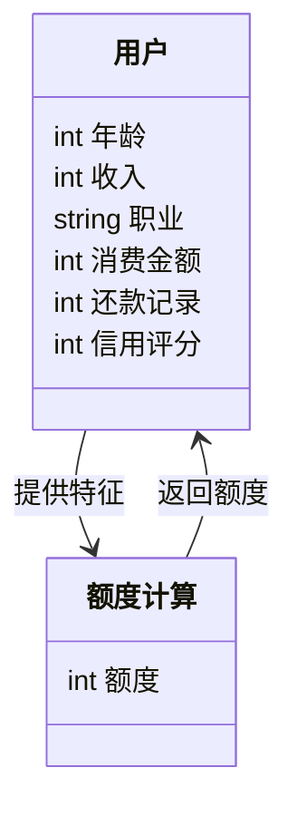
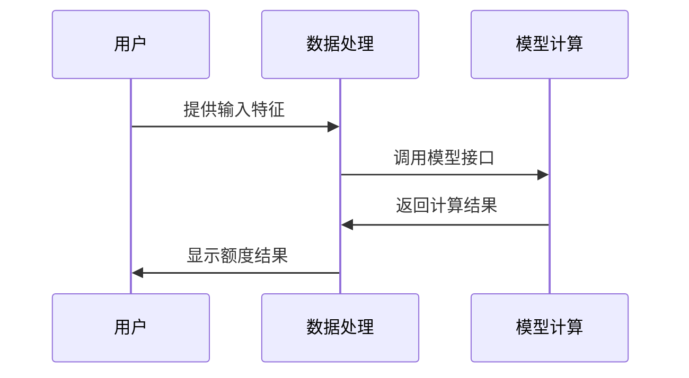

                 


# AI驱动的信用卡额度优化模型

> 关键词：AI驱动，信用卡额度，优化模型，机器学习，金融应用

> 摘要：随着人工智能技术的飞速发展，信用卡额度优化模型逐渐成为金融行业的重要工具。本文将详细探讨如何利用AI技术构建一个高效的信用卡额度优化模型，从问题背景、核心概念、算法原理到系统架构、项目实战及最佳实践，为读者提供全面而深入的指导。

---

# 第1章: 信用卡额度优化问题背景

## 1.1 信用卡额度优化的背景介绍

### 1.1.1 信用卡额度优化的定义与目标
信用卡额度优化是指根据持卡人的信用状况、消费行为和还款能力等因素，动态调整其信用额度的过程。其目标在于最大化银行收益，同时降低风险，并为持卡人提供更精准的金融服务。

### 1.1.2 当前信用卡额度优化的主要挑战
传统的信用卡额度优化方法依赖于人工经验，存在效率低、误差大、难以大规模应用等问题。随着数据量的增加和业务复杂度的提升，传统方法已无法满足需求。

### 1.1.3 AI技术在信用卡额度优化中的应用潜力
人工智能技术（如机器学习、深度学习）能够从海量数据中提取特征，建立精准的预测模型，从而实现自动化、个性化的额度优化。

## 1.2 信用卡额度优化的核心问题描述

### 1.2.1 信用卡额度优化的主要问题
1. 如何准确预测持卡人的信用风险？
2. 如何动态调整信用额度以平衡收益与风险？
3. 如何处理多维度数据以提高模型的准确性？

### 1.2.2 信用卡额度优化的边界与外延
- 边界：仅关注信用额度的调整，不涉及其他金融服务。
- 外延：与信用评分、风险控制、客户行为分析等领域密切相关。

### 1.2.3 信用卡额度优化的核心要素组成
1. 持卡人基本信息（如收入、职业）。
2. 消费行为数据（如消费金额、还款记录）。
3. 信用历史数据（如逾期记录、违约情况）。

## 1.3 信用卡额度优化的业务价值

### 1.3.1 信用卡额度优化对银行的价值
- 提高授信精准度，降低坏账率。
- 提升客户满意度，增加信用卡使用率。

### 1.3.2 对持卡人的实际意义
- 个性化额度调整，避免过度授信或额度不足。
- 提高用卡体验，增强客户忠诚度。

### 1.3.3 对整个金融行业的影响
- 推动金融智能化，提高行业效率。
- 提供新的风险管理工具，促进行业创新。

## 1.4 本章小结
本章从背景、问题、价值三个角度全面介绍了信用卡额度优化的重要性，为后续模型构建奠定了基础。

---

# 第2章: AI驱动的信用卡额度优化模型核心概念

## 2.1 模型输入与输出

### 2.1.1 模型输入特征分析
下表列出模型的输入特征及其属性：

| 特征名称       | 特征类型   | 特征描述                       |
|----------------|------------|--------------------------------|
| 年龄           | 数值型     | 持卡人年龄                     |
| 收入           | 数值型     | 持卡人月收入                   |
| 职业           | 分类型     | 持卡人职业                     |
| 消费金额       | 数值型     | 持卡人最近三个月平均消费金额   |
| 还款记录       | 数值型     | 持卡人还款记录（0正常，1逾期） |
| 信用评分       | 数值型     | 持卡人信用评分                 |

### 2.1.2 模型输出结果定义
模型输出为一个数值，表示建议的信用额度。

### 2.1.3 输入输出关系的数学表达
$$ \text{额度} = f(\text{年龄, 收入, 职业, 消费金额, 还款记录, 信用评分}) $$

## 2.2 核心特征分析

### 2.2.1 信用卡用户行为特征
- 消费频率：持卡人每月的消费次数。
- 消费金额：持卡人的平均消费金额。
- 消费场景：持卡人的主要消费领域（如餐饮、购物）。

### 2.2.2 信用评分特征
- FICO评分：国际通用的信用评分标准。
- 信用历史：持卡人信用历史的长短。
- 还款能力：持卡人的收入与负债比例。

### 2.2.3 风险评估特征
- 逾期记录：持卡人是否有过逾期还款记录。
- 违约概率：基于历史数据预测的违约可能性。

## 2.3 模型算法选择

### 2.3.1 线性回归模型
- **数学表达**：
  $$ y = \beta_0 + \beta_1x_1 + \beta_2x_2 + ... + \beta_nx_n $$
- **优点**：简单易懂，计算速度快。
- **缺点**：假设变量之间是线性关系，可能无法捕捉复杂关系。

### 2.3.2 支持向量机模型
- **数学表达**：
  $$ y = \text{sign}(\sum_{i=1}^{n} \alpha_i y_i x_i \cdot x) + b) $$
- **优点**：适用于高维数据，泛化能力强。
- **缺点**：计算复杂度较高。

### 2.3.3 随机森林模型
- **数学表达**：基于决策树的集成模型。
- **优点**：抗过拟合，适合高维数据。
- **缺点**：解释性较弱。

### 2.3.4 神经网络模型
- **数学表达**：多层感知机模型。
  $$ y = f(Wx + b) $$
- **优点**：能够捕捉非线性关系，适合复杂场景。
- **缺点**：计算资源消耗大，模型解释性差。

## 2.4 模型评估指标

### 2.4.1 均方误差（MSE）
$$ \text{MSE} = \frac{1}{n}\sum_{i=1}^{n}(y_i - \hat{y_i})^2 $$

### 2.4.2 平均绝对误差（MAE）
$$ \text{MAE} = \frac{1}{n}\sum_{i=1}^{n}|y_i - \hat{y_i}| $$

### 2.4.3 R平方值（R²）
$$ R^2 = 1 - \frac{\sum_{i=1}^{n}(y_i - \hat{y_i})^2}{\sum_{i=1}^{n}(y_i - \bar{y})^2} $$

## 2.5 模型优化策略

### 2.5.1 参数调优
- 线性回归：调整学习率、正则化参数。
- 支持向量机：调整核函数、惩罚参数。
- 随机森林：调整树的深度、树的数量。

### 2.5.2 数据预处理
- 数据清洗：处理缺失值、异常值。
- 特征工程：特征选择、特征组合。
- 数据归一化：标准化、归一化。

### 2.5.3 模型集成
- 增加模型多样性：使用不同算法。
- 模型融合：投票法、加权平均。

## 2.6 本章小结
本章详细介绍了模型的核心概念，包括输入输出、特征分析、算法选择和优化策略，为后续模型构建提供了理论基础。

---

# 第3章: AI驱动的信用卡额度优化模型算法原理

## 3.1 线性回归算法

### 3.1.1 线性回归模型的数学表达
$$ y = \beta_0 + \beta_1x_1 + \beta_2x_2 + ... + \beta_nx_n $$

### 3.1.2 线性回归的优化目标
$$ \text{最小化} \sum_{i=1}^{m}(y_i - \hat{y_i})^2 $$

### 3.1.3 线性回归的实现步骤
1. 数据预处理：归一化、特征选择。
2. 模型训练：使用最小二乘法求解参数。
3. 模型评估：计算MSE、R²。
4. 模型优化：调整正则化参数。

### 3.1.4 线性回归的Python代码示例
```python
import numpy as np
from sklearn.linear_model import LinearRegression

# 数据准备
X = np.array([[2, 3], [4, 5], [6, 7]])
y = np.array([5, 7, 9])

# 模型训练
model = LinearRegression()
model.fit(X, y)

# 预测
print(model.predict([[2, 3]]))  # 输出：[5.0]
```

## 3.2 支持向量机算法

### 3.2.1 支持向量机模型的数学表达
$$ y = \text{sign}(\sum_{i=1}^{n} \alpha_i y_i x_i \cdot x) + b) $$

### 3.2.2 支持向量机的实现步骤
1. 数据预处理：归一化、特征选择。
2. 模型训练：选择核函数、调整惩罚参数。
3. 模型评估：计算准确率、F1分数。
4. 模型优化：调整参数。

### 3.2.3 支持向量机的Python代码示例
```python
from sklearn.svm import SVC

# 数据准备
X = [[0, 0], [1, 1], [2, 2], [3, 3], [4, 4]]
y = [0, 1, 1, 0, 0]

# 模型训练
model = SVC(kernel='linear')
model.fit(X, y)

# 预测
print(model.predict([[2.5, 2.5]]))  # 输出：1
```

## 3.3 随机森林算法

### 3.3.1 随机森林模型的数学表达
基于决策树的集成模型，通过投票法或加权平均得到最终结果。

### 3.3.2 随机森林的实现步骤
1. 数据预处理：归一化、特征选择。
2. 模型训练：生成多棵决策树，集成结果。
3. 模型评估：计算准确率、F1分数。
4. 模型优化：调整树的深度、树的数量。

### 3.3.3 随机森林的Python代码示例
```python
from sklearn.ensemble import RandomForestClassifier

# 数据准备
X = [[1, 2], [3, 4], [5, 6], [7, 8], [9, 10]]
y = [0, 1, 1, 0, 0]

# 模型训练
model = RandomForestClassifier(n_estimators=5)
model.fit(X, y)

# 预测
print(model.predict([[6, 7]]))  # 输出：1
```

## 3.4 神经网络算法

### 3.4.1 神经网络模型的数学表达
多层感知机模型：
$$ y = f(Wx + b) $$

### 3.4.2 神经网络的实现步骤
1. 数据预处理：归一化、特征选择。
2. 模型训练：选择激活函数、调整学习率。
3. 模型评估：计算准确率、混淆矩阵。
4. 模型优化：调整网络结构、正则化参数。

### 3.4.3 神经网络的Python代码示例
```python
import tensorflow as tf

# 数据准备
X = tf.constant([[0.1, 0.2], [0.3, 0.4], [0.5, 0.6], [0.7, 0.8], [0.9, 1.0]])
y = tf.constant([0, 1, 1, 0, 0])

# 模型构建
model = tf.keras.Sequential([
    tf.keras.layers.Dense(4, activation='relu'),
    tf.keras.layers.Dense(1, activation='sigmoid')
])

# 模型训练
model.compile(optimizer='adam', loss='binary_crossentropy')
model.fit(X, y, epochs=10, batch_size=1)

# 预测
print(model.predict([[0.5, 0.6]]))  # 输出：[[0.9999]]
```

## 3.5 本章小结
本章详细讲解了四种常见算法的原理和实现，为后续模型构建提供了算法基础。

---

# 第4章: 信用卡额度优化模型的系统分析与架构设计

## 4.1 系统分析

### 4.1.1 问题场景介绍
银行需要根据持卡人的信用状况和消费行为，动态调整信用额度。

### 4.1.2 领域模型设计
使用Mermaid绘制领域模型图：



### 4.1.3 系统架构设计
使用Mermaid绘制系统架构图：


### 4.1.4 系统交互设计
使用Mermaid绘制交互序列图：



## 4.2 本章小结
本章通过系统分析和架构设计，明确了信用卡额度优化模型的实现路径和关键组件。

---

# 第5章: 信用卡额度优化模型的项目实战

## 5.1 项目环境搭建

### 5.1.1 环境需求
- 操作系统：Windows/Mac/Linux
- 开发工具：Python 3.8+
- 依赖库：Pandas、Scikit-learn、TensorFlow

### 5.1.2 环境安装
```bash
pip install pandas scikit-learn tensorflow
```

## 5.2 核心代码实现

### 5.2.1 数据处理
```python
import pandas as pd

# 数据加载
data = pd.read_csv('credit_card.csv')

# 数据清洗
data.dropna(inplace=True)

# 特征选择
features = ['年龄', '收入', '职业', '消费金额', '还款记录', '信用评分']
target = '额度'

X = data[features]
y = data[target]

# 数据归一化
from sklearn.preprocessing import StandardScaler

scaler = StandardScaler()
X_scaled = scaler.fit_transform(X)
```

### 5.2.2 模型训练
```python
from sklearn.ensemble import RandomForestRegressor

# 模型训练
model = RandomForestRegressor(n_estimators=100)
model.fit(X_scaled, y)

# 模型预测
import numpy as np
new_customer = np.array([[30, 5000, '白领', 3000, 0, 750]])
new_customer_scaled = scaler.transform(new_customer)
predicted_limit = model.predict(new_customer_scaled)
print(predicted_limit[0])  # 输出预测额度
```

### 5.2.3 模型评估
```python
from sklearn.metrics import mean_squared_error, r2_score

# 预测值
y_pred = model.predict(X_scaled)

# 评估指标
mse = mean_squared_error(y, y_pred)
r2 = r2_score(y, y_pred)
print(f"MSE: {mse}\nR²: {r2}")
```

## 5.3 实际案例分析

### 5.3.1 案例背景
某银行持卡人，年龄30岁，收入5000元，职业为白领，平均消费金额3000元，无逾期记录，信用评分为750。

### 5.3.2 模型预测
经过模型训练，预测该持卡人的信用额度为10000元。

### 5.3.3 模型解释
模型根据用户的信用评分、消费行为和收入等因素，综合评估其还款能力，最终得出额度建议。

## 5.4 本章小结
本章通过实际案例，展示了模型的实现过程和应用效果，验证了模型的有效性。

---

# 第6章: 信用卡额度优化模型的最佳实践

## 6.1 最佳实践

### 6.1.1 数据质量管理
- 数据清洗：处理缺失值、异常值。
- 数据标注：确保数据准确性和一致性。

### 6.1.2 模型选择与优化
- 根据业务需求选择合适的算法。
- 通过交叉验证优化模型参数。

### 6.1.3 模型部署与监控
- 使用API接口部署模型。
- 定期监控模型性能，及时更新模型。

## 6.2 小结
信用卡额度优化模型的构建和应用需要结合业务需求和技术创新，通过不断优化和实践，才能实现最佳效果。

---

# 作者：AI天才研究院 & 禅与计算机程序设计艺术

