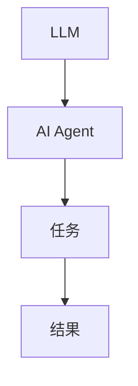
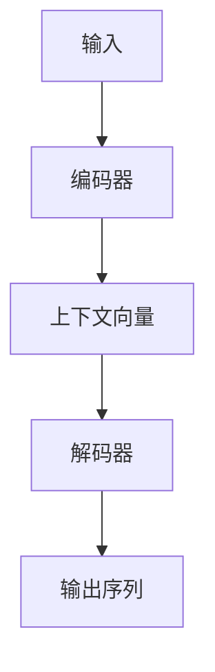
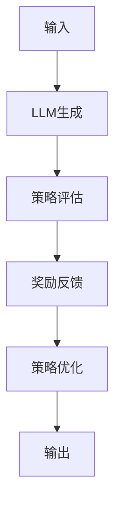
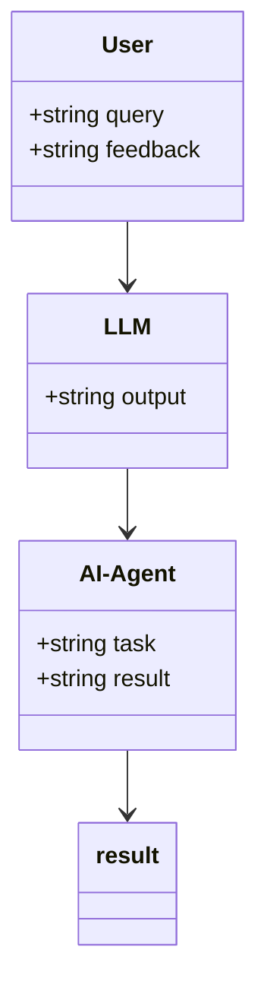
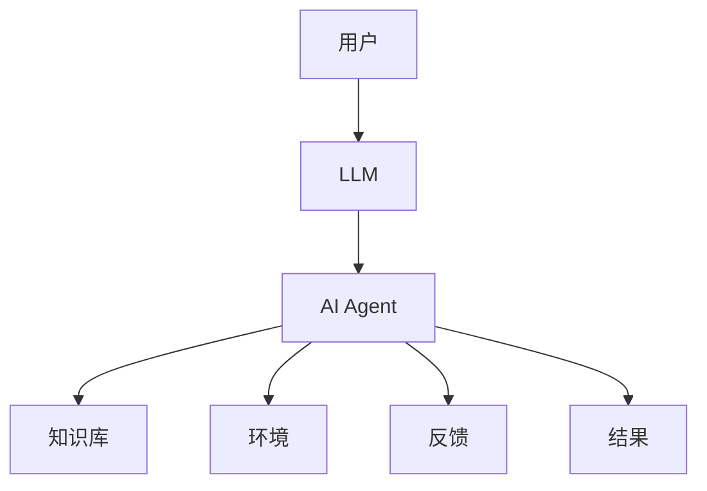
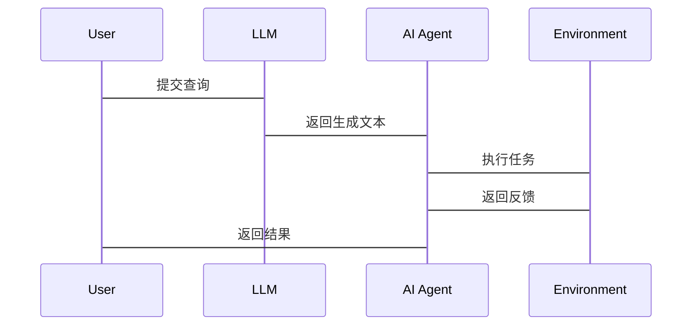

                 


# LLM驱动的AI Agent创新问题解决技术

---

## 关键词：
LLM（Large Language Model）、AI Agent（人工智能代理）、创新问题解决、自然语言处理、强化学习、系统架构设计

---

## 摘要：
本文系统阐述了LLM（大语言模型）驱动的AI Agent在创新问题解决中的技术原理与实现方法。文章从背景介绍出发，详细分析了LLM与AI Agent的核心概念、算法原理、系统架构设计，结合实际案例，深入讲解了基于LLM的AI Agent在问题解决中的创新应用。文章最后总结了LLM驱动AI Agent技术的优势与挑战，并展望了未来的发展方向。

---

# 第1章: LLM与AI Agent概述

## 1.1 LLM驱动的AI Agent的概念

### 1.1.1 从传统AI到现代LLM驱动AI的演进
- 传统AI：基于规则和逻辑推理，依赖于人工编写规则。
- 现代AI：基于大语言模型的生成式AI，具备更强的自然语言理解和生成能力。

### 1.1.2 LLM与AI Agent的结合
- LLM（大语言模型）提供强大的文本生成能力。
- AI Agent（人工智能代理）具备任务规划和执行能力。
- 结合：LLM为AI Agent提供自然语言理解和生成能力，AI Agent为LLM提供任务驱动和目标导向。

### 1.1.3 创新问题解决的核心思想
- LLM驱动AI Agent能够理解问题、生成解决方案，并执行任务。
- 基于LLM的AI Agent具备创新思维能力，能够在复杂场景中提出创新解决方案。

## 1.2 LLM与AI Agent的核心要素

### 1.2.1 LLM的基本原理
- LLM：基于Transformer架构的大语言模型。
- 基本功能：自然语言理解和生成。

### 1.2.2 AI Agent的定义与特点
- 定义：AI Agent是一个能够感知环境、自主决策并执行任务的智能体。
- 特点：
  - 智能性：基于LLM的自然语言处理能力。
  - 目标导向：具备明确的任务目标。
  - 自主性：能够自主规划和执行任务。

### 1.2.3 LLM驱动AI Agent的独特优势
- 自然语言交互能力：能够理解用户意图并生成自然语言回复。
- 创新思维能力：基于LLM的生成能力，能够提出创新解决方案。
- 知识库支持：LLM具备广泛的知识和上下文理解能力。

## 1.3 LLM驱动AI Agent的应用场景

### 1.3.1 自然语言处理
- 任务：文本生成、问答系统、对话系统。
- 示例：智能客服、智能助手。

### 1.3.2 问题解决与决策支持
- 任务：问题分析、方案生成、决策支持。
- 示例：智能诊断系统、法律顾问AI。

### 1.3.3 创新思维模拟
- 任务：创新方案生成、创意设计。
- 示例：创意写作、产品设计辅助。

---

# 第2章: LLM与AI Agent的核心概念与联系

## 2.1 LLM与AI Agent的核心概念

### 2.1.1 LLM的原理与实现

#### 2.1.1.1 Transformer架构
- 基于Transformer的编码器-解码器结构。
- 注意力机制：捕捉输入中的长距离依赖关系。

#### 2.1.1.2 概率生成模型
- 基于概率分布生成文本。
- 解码器生成下一步的概率分布。

#### 2.1.1.3 大语言模型的训练方法
- 预训练：基于大规模语料库的无监督学习。
- 微调：针对特定任务的有监督微调。

### 2.1.2 AI Agent的原理与实现

#### 2.1.2.1 任务规划与执行
- 基于目标的多步推理。
- 任务分解与优先级排序。

#### 2.1.2.2 状态感知与反馈
- 环境状态感知。
- 用户反馈处理。

#### 2.1.2.3 多轮对话机制
- 对话历史记录。
- 上下文保持。

### 2.1.3 LLM与AI Agent的联系

#### 2.1.3.1 LLM作为AI Agent的核心驱动力
- LLM提供自然语言生成能力。
- AI Agent提供任务驱动能力。

#### 2.1.3.2 LLM生成能力对AI Agent的影响
- 生成多样化解决方案。
- 提供创新性回答。

#### 2.1.3.3 AI Agent的智能性提升
- 基于LLM的知识库支持。
- 强化学习优化生成结果。

## 2.2 LLM与AI Agent的核心概念对比

### 2.2.1 核心概念对比表格

| 概念          | LLM                      | AI Agent                 |
|---------------|--------------------------|--------------------------|
| 核心能力      | 文本生成                 | 任务执行与决策           |
| 输入          | 文本                     | 状态与反馈               |
| 输出          | 文本                     | 行动与结果               |
| 依赖资源      | 大规模语料库             | 知识库、环境状态          |
| 目标          | 生成高质量文本           | 完成任务目标              |

### 2.2.2 实体关系图（Mermaid）



---

# 第3章: LLM驱动AI Agent的算法原理

## 3.1 LLM的算法原理

### 3.1.1 Transformer架构

#### 3.1.1.1 编码器-解码器结构
- 编码器：将输入序列转换为上下文向量。
- 解码器：根据上下文向量生成输出序列。

#### 3.1.1.2 注意力机制
- 自注意力机制：捕捉输入序列中的依赖关系。
- 前瞻注意力机制：允许解码器生成位置相关的输出。

### 3.1.2 概率生成模型

#### 3.1.2.1 解码器的概率生成过程
- 解码器在每一步生成一个词的概率分布。
- 采样生成词。

### 3.1.3 大语言模型的训练方法

#### 3.1.3.1 预训练
- 输入：无标签文本。
- 输出：模型学习语言的统计规律。

#### 3.1.3.2 微调
- 输入：带标签的训练数据。
- 输出：模型针对特定任务优化。

### 3.1.4 可视化流程图（Mermaid）



### 3.1.5 代码示例（Python）

```python
import torch
import torch.nn as nn

class Transformer(nn.Module):
    def __init__(self, embed_dim, num_heads):
        super(Transformer, self).__init__()
        self.embed_dim = embed_dim
        self.num_heads = num_heads
        self.key = nn.Linear(embed_dim, embed_dim)
        self.query = nn.Linear(embed_dim, embed_dim)
        self.value = nn.Linear(embed_dim, embed_dim)
    
    def forward(self, x):
        # x: [batch_size, seq_len, embed_dim]
        batch_size, seq_len, _ = x.size()
        
        # 分割头
        head_dim = self.embed_dim // self.num_heads
        x = x.view(batch_size, seq_len, self.num_heads, head_dim)
        x = x.permute(0, 2, 1, 3)  # [batch_size, num_heads, seq_len, head_dim]
        
        # 计算键、查询、值
        key = self.key(x)
        query = self.query(x)
        value = self.value(x)
        
        # 计算注意力权重
        attention_scores = torch.bmm(query, key.transpose(-2, -1))
        attention_weights = nn.Softmax(dim=-1)(attention_scores)
        
        # 加权求和
        output = torch.bmm(attention_weights, value)
        output = output.permute(0, 2, 1, 3).view(batch_size, seq_len, self.embed_dim)
        return output
```

---

## 3.2 LLM驱动AI Agent的算法实现

### 3.2.1 基于强化学习的AI Agent生成算法

#### 3.2.1.1 强化学习的目标函数
$$ J = \mathbb{E}_{\tau \sim \pi}[\sum_{t=1}^T r_t] $$
其中，$\tau$是轨迹，$\pi$是策略，$r_t$是奖励函数。

#### 3.2.1.2 基于策略梯度的优化
- 动作：生成文本的下一步。
- 奖励：生成文本的质量。

### 3.2.2 算法流程图（Mermaid）



---

## 3.3 基于数学模型的LLM与AI Agent关系分析

### 3.3.1 LLM的数学模型

#### 3.3.1.1 概率生成模型
$$ P(y|x) = \prod_{i=1}^n P(y_i|x_{<i}, y_{<i}) $$

#### 3.3.1.2 损失函数
$$ \mathcal{L} = -\sum_{i=1}^n \log P(y_i|x_{<i}, y_{<i}) $$

### 3.3.2 AI Agent的数学模型

#### 3.3.2.1 状态空间
$$ S = \{s_1, s_2, ..., s_n\} $$

#### 3.3.2.2 行动空间
$$ A = \{a_1, a_2, ..., a_m\} $$

#### 3.3.2.3 奖励函数
$$ r(s, a) = \begin{cases}
1 & \text{如果 } a \text{ 是正确的动作} \\
0 & \text{否则}
\end{cases} $$

---

## 3.4 算法实现与代码示例

### 3.4.1 基于强化学习的AI Agent生成算法

#### 3.4.1.1 强化学习框架
- 状态：环境状态。
- 行动：生成文本的下一步。
- 奖励：生成文本的质量。

#### 3.4.1.2 代码实现（Python）

```python
import torch
import torch.nn as nn

class Agent(nn.Module):
    def __init__(self, embed_dim, num_heads):
        super(Agent, self).__init__()
        self.transformer = Transformer(embed_dim, num_heads)
        self.fc = nn.Linear(embed_dim, 1)
    
    def forward(self, x):
        # 输入：x [batch_size, seq_len, embed_dim]
        # 输出：logits [batch_size, seq_len, embed_dim]
        output = self.transformer(x)
        logits = self.fc(output)
        return logits
```

---

# 第4章: 基于LLM的AI Agent系统分析与架构设计

## 4.1 问题场景介绍

### 4.1.1 问题背景
- 用户需求：解决问题或完成任务。
- 环境：自然语言交互。

## 4.2 系统功能设计

### 4.2.1 领域模型（Mermaid类图）



### 4.2.2 系统架构设计（Mermaid架构图）



### 4.2.3 系统接口设计

#### 4.2.3.1 输入接口
- 用户输入：自然语言查询。
- 状态输入：环境状态。

#### 4.2.3.2 输出接口
- 文本输出：LLM生成的文本。
- 行动输出：AI Agent执行的动作。

## 4.3 交互流程设计（Mermaid序列图）



---

# 第5章: LLM驱动AI Agent项目实战

## 5.1 环境安装

### 5.1.1 安装Python
- 版本要求：Python 3.8+

### 5.1.2 安装依赖
- LLM框架：Transformers库。
- 绘图工具：graphviz、pymermaid。

## 5.2 系统核心实现源代码

### 5.2.1 LLM实现代码

```python
from transformers import AutoTokenizer, AutoModelForCausalLM

tokenizer = AutoTokenizer.from_pretrained('gpt2')
model = AutoModelForCausalLM.from_pretrained('gpt2')
```

### 5.2.2 AI Agent实现代码

```python
class AI_Agent:
    def __init__(self, model, tokenizer):
        self.model = model
        self.tokenizer = tokenizer
    
    def generate(self, input_text):
        inputs = self.tokenizer.encode(input_text, return_tensors='pt')
        outputs = self.model.generate(inputs, max_length=100)
        return self.tokenizer.decode(outputs[0], skip_special_tokens=True)
```

## 5.3 代码应用解读与分析

### 5.3.1 系统功能实现
- 文本生成：基于LLM生成自然语言文本。
- 任务执行：AI Agent根据生成的文本执行任务。

## 5.4 实际案例分析

### 5.4.1 案例背景
- 任务：解决数学问题。
- 输入：用户输入数学问题。

### 5.4.2 解决方案
- LLM生成解决步骤。
- AI Agent执行计算。

## 5.5 项目小结
- 项目实现了基于LLM的AI Agent，能够理解用户需求并生成解决方案。
- 代码示例展示了系统的实现过程，验证了技术的可行性。

---

# 第6章: 总结与展望

## 6.1 总结

### 6.1.1 核心内容回顾
- LLM驱动的AI Agent的创新问题解决技术。
- 系统架构设计与实现。

### 6.1.2 本章小结
- 本文详细阐述了LLM驱动AI Agent的技术原理与实现方法。
- 提供了完整的系统设计与代码实现示例。

## 6.2 未来展望

### 6.2.1 技术发展
- 更强大的LLM模型。
- 更智能的AI Agent架构。

### 6.2.2 应用场景
- 更多创新应用场景。
- 与更多领域的结合。

---

# 作者：AI天才研究院/AI Genius Institute & 禅与计算机程序设计艺术 /Zen And The Art of Computer Programming

