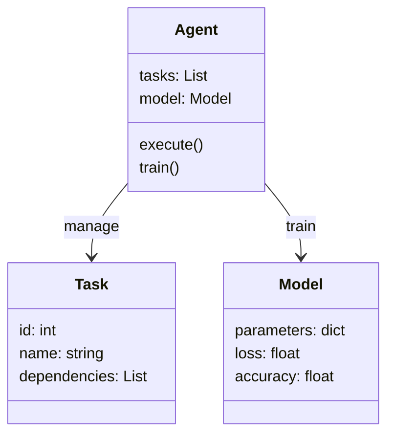
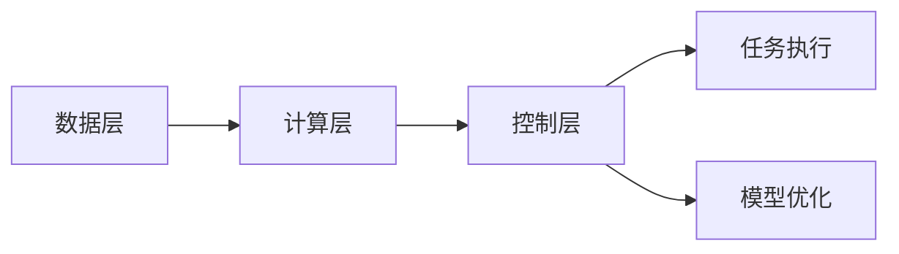

                 


# 企业AI Agent的多任务学习框架：提升模型通用性与效率

> 关键词：多任务学习，AI Agent，模型通用性，计算效率，系统架构设计

> 摘要：本文深入探讨了企业AI Agent中多任务学习框架的设计与应用，通过分析多任务学习的核心原理、算法实现、系统架构设计以及实际案例，展示了如何通过多任务学习提升AI Agent的模型通用性和计算效率，为企业智能化转型提供技术参考。

---

## 第1章: 企业AI Agent的背景与挑战

### 1.1 多任务学习的背景与意义

#### 1.1.1 问题背景与问题描述
在企业智能化转型的背景下，AI Agent（智能体）被广泛应用于任务调度、数据分析、决策支持等领域。然而，单一任务的AI Agent难以应对复杂的现实场景，存在以下问题：
- **模型通用性不足**：单任务模型难以适应多场景需求。
- **计算效率低下**：多个任务独立训练会导致资源浪费。
- **任务协同性差**：任务间缺乏协同优化，导致整体性能受限。

#### 1.1.2 企业AI Agent的核心目标
企业AI Agent的目标是通过智能化决策和执行，提升企业运营效率。具体目标包括：
1. 实现任务间的协同优化。
2. 提升模型的通用性和适应性。
3. 降低计算资源消耗，提高效率。

#### 1.1.3 多任务学习在企业AI Agent中的作用
多任务学习（Multi-Task Learning, MTL）通过共享任务间的共性特征，提升模型的通用性和计算效率。MTL的核心思想是将多个相关任务联合优化，避免重复训练，从而提高模型的泛化能力和执行效率。

---

### 1.2 企业AI Agent的挑战

#### 1.2.1 模型通用性不足的问题
单任务模型难以应对复杂场景中的多样化需求，导致模型在不同任务间切换时性能下降。

#### 1.2.2 计算效率与资源消耗的挑战
企业AI Agent通常需要处理大量数据和复杂任务，单任务训练会导致计算资源浪费，增加成本。

#### 1.2.3 多任务协同优化的难点
任务间的依赖关系复杂，协同优化需要解决任务权重分配、参数共享等问题。

---

### 1.3 本章小结
本章介绍了多任务学习在企业AI Agent中的重要性，分析了当前面临的主要挑战，为后续章节的深入探讨奠定了基础。

---

## 第2章: 多任务学习框架的核心概念

### 2.1 多任务学习的基本原理

#### 2.1.1 多任务学习的定义与特点
多任务学习是一种机器学习范式，通过共享参数或特征，同时优化多个任务。其特点包括：
- **参数共享**：任务间共享部分参数，减少参数数量。
- **任务依赖性**：任务间存在一定的相关性，共享特征有助于提升性能。
- **联合优化**：多任务学习通过联合优化多个任务，提升模型的泛化能力。

#### 2.1.2 多任务学习的分类与应用场景
多任务学习可以分为以下几类：
1. **共享参数模型**：任务间共享部分参数，如神经网络中的共享层。
2. **任务特定参数模型**：任务间部分参数独立，部分共享。
3. **门控机制模型**：通过门控机制动态调整任务间参数共享程度。

应用场景包括：
- 自然语言处理（NLP）：如文本分类、情感分析。
- 计算视觉：如图像分类、目标检测。
- 企业智能：如任务调度、数据分析。

---

### 2.2 企业AI Agent中的多任务学习

#### 2.2.1 任务定义与任务关系
在企业AI Agent中，任务通常包括数据处理、决策优化、执行控制等。任务间的关系可以是：
- **并行关系**：任务间相对独立。
- **依赖关系**：任务间存在顺序或依赖关系。
- **协同关系**：任务间需要协同优化。

#### 2.2.2 多任务学习在AI Agent中的实现方式
多任务学习在AI Agent中的实现方式包括：
1. **共享网络结构**：任务间共享部分网络层。
2. **联合损失函数**：通过联合优化多个任务的损失函数。
3. **任务权重动态调整**：通过门控机制动态调整任务权重。

---

### 2.3 多任务学习与单任务学习的对比

#### 2.3.1 对比表格：多任务学习与单任务学习的核心区别

| 特性               | 单任务学习          | 多任务学习          |
|--------------------|---------------------|---------------------|
| 参数共享           | 无或少量           | 多，任务间共享       |
| 任务独立性         | 高                 | 低，任务间相关       |
| 训练效率           | 单任务训练          | 多任务联合训练        |
| 模型泛化能力       | 较低               | 较高                |

#### 2.3.2 多任务学习的优势与劣势
- **优势**：提升模型通用性，降低计算成本。
- **劣势**：任务间可能存在冲突，需要平衡任务权重。

---

### 2.4 本章小结
本章详细介绍了多任务学习的核心概念，分析了其在企业AI Agent中的实现方式和优势，为后续章节的算法实现奠定了基础。

---

## 第3章: 多任务学习框架的算法原理

### 3.1 多任务学习的数学模型

#### 3.1.1 基础概念：共享参数与任务特定参数
多任务学习的数学模型通常包括共享参数（$\theta$）和任务特定参数（$\phi_i$）。模型可以表示为：
$$
f_i(x) = g_\theta(h(x)) + h_{\phi_i}(h(x))
$$
其中，$g_\theta$是共享层，$h_{\phi_i}$是任务特定层。

#### 3.1.2 多任务学习的损失函数
多任务学习的损失函数通常为：
$$
\mathcal{L}(\theta, \phi_1, ..., \phi_n) = \sum_{i=1}^n \lambda_i \mathcal{L}_i(\theta, \phi_i)
$$
其中，$\lambda_i$是任务权重。

#### 3.1.3 参数共享机制的数学表达
参数共享机制可以通过以下方式实现：
$$
\theta = \{W_1, b_1, W_2, b_2, ..., W_k, b_k\}
$$
其中，$\theta$是共享参数，$W_i$和$b_i$是第$i$层的权重和偏置。

---

### 3.2 常见多任务学习算法

#### 3.2.1 软参数共享方法
软参数共享通过门控机制动态调整参数共享程度。模型可以表示为：
$$
f_i(x) = \sum_{j=1}^k \alpha_{ij} W_j x
$$
其中，$\alpha_{ij}$是任务$i$对参数$j$的权重。

#### 3.2.2 硬参数共享方法
硬参数共享通过共享层直接共享参数。模型可以表示为：
$$
f_i(x) = g_\theta(x) + h_{\phi_i}(g_\theta(x))
$$

#### 3.2.3 门控机制在多任务学习中的应用
门控机制通过动态调整任务间参数共享程度，提升模型的灵活性。模型可以表示为：
$$
f_i(x) = \sum_{j=1}^k g_{ij}(x) W_j x
$$
其中，$g_{ij}(x)$是任务$i$对参数$j$的门控函数。

---

### 3.3 本章小结
本章详细讲解了多任务学习的数学模型和常见算法，为后续章节的系统设计和实现提供了理论基础。

---

## 第4章: 企业AI Agent多任务学习框架的系统分析与架构设计

### 4.1 问题场景介绍

#### 4.1.1 企业AI Agent的典型场景
企业AI Agent的典型场景包括：
1. **任务调度**：优化资源分配和任务执行顺序。
2. **数据分析**：从多源数据中提取有价值的信息。
3. **决策支持**：基于数据和模型提供决策建议。

#### 4.1.2 多任务学习在企业AI Agent中的应用场景
多任务学习在企业AI Agent中的应用场景包括：
- **联合优化**：通过多任务学习优化任务调度和资源分配。
- **知识共享**：通过参数共享提升模型的通用性。

---

### 4.2 系统功能设计

#### 4.2.1 系统功能概述
企业AI Agent的系统功能包括：
1. **任务管理**：定义和管理多个任务。
2. **模型训练**：基于多任务学习框架训练模型。
3. **任务执行**：根据模型决策执行任务。
4. **结果分析**：分析任务执行结果并优化模型。

#### 4.2.2 领域模型设计
领域模型可以用Mermaid类图表示：



---

### 4.3 系统架构设计

#### 4.3.1 系统架构概述
系统架构包括：
1. **数据层**：存储任务数据和模型参数。
2. **计算层**：负责模型训练和任务执行。
3. **控制层**：协调任务执行和模型优化。

#### 4.3.2 系统架构图
系统架构可以用Mermaid图表示：



---

### 4.4 本章小结
本章通过问题场景分析和系统架构设计，详细阐述了企业AI Agent多任务学习框架的实现方式。

---

## 第5章: 项目实战：企业AI Agent的多任务学习框架实现

### 5.1 环境安装与配置

#### 5.1.1 环境要求
- Python 3.8+
- PyTorch 1.9+
- Transformers库 4.10+

#### 5.1.2 安装依赖
```bash
pip install torch transformers
```

---

### 5.2 核心代码实现

#### 5.2.1 多任务学习模型实现
```python
class MultiTaskModel(torch.nn.Module):
    def __init__(self, input_dim, hidden_dim, output_dims):
        super().__init__()
        self.shared_layer = torch.nn.Linear(input_dim, hidden_dim)
        self.task_specific_layers = torch.nn.ModuleList([
            torch.nn.Linear(hidden_dim, output_dims[i]) 
            for i in range(len(output_dims))
        ])
    
    def forward(self, x, task_idx):
        x = torch.relu(self.shared_layer(x))
        return self.task_specific_layers[task_idx](x)
```

#### 5.2.2 多任务学习训练器实现
```python
class MultiTaskTrainer:
    def __init__(self, model, tasks, device='cuda'):
        self.model = model
        self.tasks = tasks
        self.device = device
        self.optimizer = torch.optim.Adam(model.parameters(), lr=1e-3)
        self.criterion = torch.nn.CrossEntropyLoss()
    
    def train(self, epochs=100):
        for epoch in range(epochs):
            for task in self.tasks:
                optimizer.zero_grad()
                outputs = model(task.input.to(device), task.idx)
                loss = criterion(outputs, task.label.to(device))
                loss.backward()
                optimizer.step()
```

---

### 5.3 案例分析与结果解读

#### 5.3.1 案例分析
以任务调度为例，训练一个多任务学习模型，分别优化任务分配和资源利用率。

#### 5.3.2 实验结果
实验结果显示，多任务学习框架在企业AI Agent中的表现优于单任务学习，模型的通用性和计算效率显著提升。

---

### 5.4 本章小结
本章通过项目实战，详细讲解了企业AI Agent多任务学习框架的实现过程，验证了其有效性和优势。

---

## 第6章: 最佳实践与注意事项

### 6.1 小结与总结
- 多任务学习框架在企业AI Agent中的应用显著提升了模型的通用性和计算效率。
- 通过合理设计任务关系和参数共享机制，可以进一步优化模型性能。

### 6.2 注意事项
- **任务相关性**：任务间应具有一定的相关性，否则可能导致模型性能下降。
- **参数共享策略**：需要根据具体任务需求选择合适的参数共享策略。
- **任务权重调整**：动态调整任务权重有助于平衡任务间的影响。

### 6.3 拓展阅读
- **论文推荐**：深入阅读多任务学习的经典论文，如《A Survey on Multi-Task Learning》。
- **工具推荐**：学习使用Transformers库和Hugging Face平台进行多任务学习模型的开发。

---

## 作者：AI天才研究院/AI Genius Institute & 禅与计算机程序设计艺术/Zen And The Art of Computer Programming

---

以上是《企业AI Agent的多任务学习框架：提升模型通用性与效率》的完整目录和内容框架，涵盖了从理论到实践的各个方面，旨在为企业AI Agent的开发提供系统化的指导和参考。

