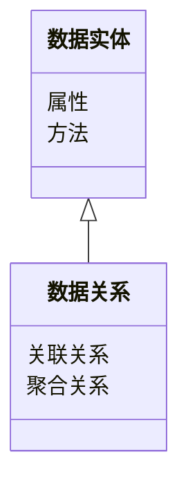
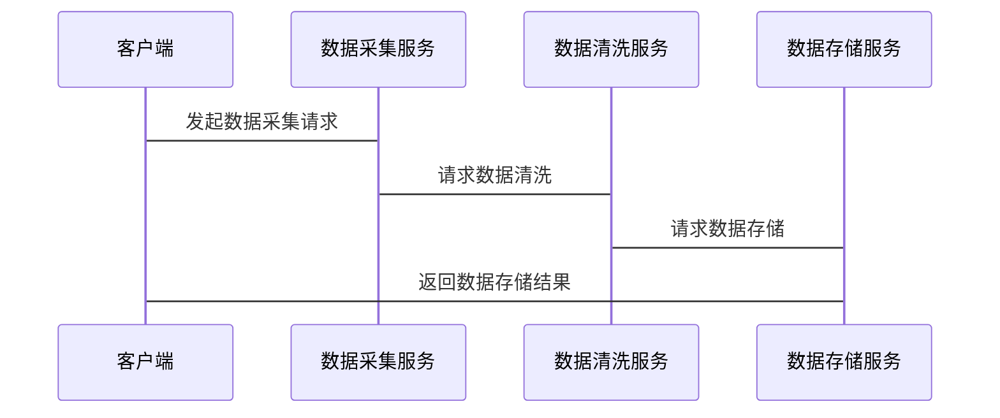

                 


# 《企业AI Agent的数据治理框架》

---

## 关键词：数据治理、AI Agent、企业架构、数据安全、算法优化

---

## 摘要：  
在数字化转型的浪潮中，企业数据治理的重要性日益凸显。AI Agent作为一种智能代理，能够通过自动化和智能化的方式提升数据治理的效率和效果。本文从企业AI Agent的核心概念出发，结合数据治理的理论基础，详细阐述了AI Agent在数据治理中的算法原理、系统架构设计、项目实战以及最佳实践。通过构建企业AI Agent的数据治理框架，我们能够更好地应对数据治理中的复杂挑战，为企业创造更大的价值。

---

## 第1章: 企业AI Agent与数据治理背景

### 1.1 数据治理的背景与挑战

#### 1.1.1 数据治理的基本概念  
数据治理是指通过制定政策、流程和技术手段，对数据的全生命周期进行管理，以确保数据的完整性、准确性、一致性和安全性。随着企业数字化转型的推进，数据已成为企业的核心资产，数据治理的重要性不言而喻。

#### 1.1.2 企业数据治理的现状与挑战  
当前，企业数据治理面临以下主要挑战：  
1. 数据孤岛问题：数据分布在不同的系统和部门，难以统一管理和利用。  
2. 数据质量不高：数据可能存在重复、不一致、不完整等问题。  
3. 数据安全风险：数据泄露、滥用等安全问题日益突出。  
4. 数据治理效率低：传统数据治理方式依赖人工操作，效率低下，难以应对海量数据的挑战。  

#### 1.1.3 AI Agent在数据治理中的作用  
AI Agent（人工智能代理）是一种能够感知环境、自主决策并执行任务的智能体。在数据治理中，AI Agent可以通过自动化的方式解决数据孤岛、数据质量、数据安全等难题，显著提升数据治理的效率和效果。

---

### 1.2 AI Agent的核心概念

#### 1.2.1 AI Agent的定义与特点  
AI Agent是一种能够感知环境、自主决策并执行任务的智能体。其核心特点包括：  
- **自主性**：能够在没有外部干预的情况下独立运行。  
- **反应性**：能够根据环境变化动态调整行为。  
- **目标导向**：具有明确的目标，并通过行动实现目标。  
- **学习能力**：能够通过数据和经验不断优化自身的决策能力。  

#### 1.2.2 AI Agent与传统数据治理的区别  
传统数据治理主要依赖人工操作和规则制定，而AI Agent可以通过机器学习、自然语言处理等技术实现数据治理的自动化和智能化。例如，AI Agent可以自动识别数据中的异常值，自动清洗数据，甚至可以预测数据质量问题。

#### 1.2.3 企业AI Agent的应用场景  
AI Agent在企业数据治理中的应用场景包括：  
1. **数据清洗**：自动识别和修复数据中的错误。  
2. **数据整合**：将分散在不同系统中的数据进行整合，形成统一的数据视图。  
3. **数据安全**：实时监控数据访问行为，防止数据泄露。  
4. **数据质量管理**：通过机器学习模型预测数据质量，主动优化数据。  

---

### 1.3 数据治理框架的价值

#### 1.3.1 数据治理对企业的重要性  
数据治理是企业数字化转型的核心支撑。通过有效的数据治理，企业可以提升数据的利用价值，降低数据风险，增强竞争力。

#### 1.3.2 AI Agent如何提升数据治理效率  
AI Agent通过自动化和智能化的方式，显著提升了数据治理的效率。例如，AI Agent可以实时监控数据变更，自动调整数据治理策略，减少人工干预。  

#### 1.3.3 数据治理框架的构建原则  
构建数据治理框架的原则包括：  
1. **以业务为导向**：数据治理的目标应与企业业务目标一致。  
2. **数据的全生命周期管理**：覆盖数据的采集、存储、处理、分析、共享和销毁的全生命周期。  
3. **可扩展性**：框架应具备灵活性，能够适应企业的发展需求。  

---

### 1.4 本章小结  
本章介绍了企业AI Agent与数据治理的背景，分析了数据治理的挑战和AI Agent的作用，总结了AI Agent的核心概念和应用场景，为后续章节的展开奠定了基础。

---

## 第2章: 数据治理框架的理论基础

### 2.1 数据治理的基本原理

#### 2.1.1 数据治理的目标与范围  
数据治理的目标是确保数据的可用性、一致性、完整性和安全性。其范围涵盖数据的采集、存储、处理、分析和共享等环节。

#### 2.1.2 企业数据治理的实施步骤  
企业数据治理的实施步骤包括：  
1. **需求分析**：明确数据治理的目标和范围。  
2. **政策制定**：制定数据治理的政策、流程和规范。  
3. **技术选型**：选择适合的数据治理工具和技术。  
4. **实施与监控**：实施数据治理方案，并持续监控和优化。  

#### 2.1.3 数据治理的关键原则  
数据治理的关键原则包括：  
- 数据所有权明确：数据的归属和责任需清晰。  
- 数据质量管理：确保数据的准确性、一致性和完整性。  
- 数据安全：保护数据的机密性、完整性和可用性。  
- 数据共享与隐私保护：在数据共享中保护用户隐私。  

---

### 2.2 企业数据治理框架模型

#### 2.2.1 数据治理框架的分类  
数据治理框架主要分为以下几类：  
1. **基于规则的框架**：通过预定义的规则进行数据治理。  
2. **基于模型的框架**：通过数据建模实现数据治理。  
3. **基于机器学习的框架**：利用机器学习技术进行数据治理。  

#### 2.2.2 数据治理框架的核心模块  
数据治理框架的核心模块包括：  
- **数据采集与处理**：采集数据并进行预处理。  
- **数据存储与管理**：存储数据并进行统一管理。  
- **数据质量管理**：检测和修复数据质量问题。  
- **数据安全与隐私保护**：确保数据的安全性和隐私性。  

#### 2.2.3 数据治理框架的实施方法  
数据治理框架的实施方法包括：  
1. **制定数据治理策略**：明确数据治理的目标和范围。  
2. **建立数据治理体系**：构建数据治理体系，包括组织架构、政策和工具。  
3. **实施数据治理项目**：通过具体项目推动数据治理的落地。  

---

### 2.3 数据治理与AI Agent的关系

#### 2.3.1 数据治理对AI Agent的需求  
数据治理需要AI Agent来提升效率和智能化水平，特别是在数据清洗、数据整合和数据安全方面。  

#### 2.3.2 AI Agent如何支持数据治理  
AI Agent可以通过以下方式支持数据治理：  
1. **自动化数据清洗**：通过机器学习算法自动识别和修复数据中的错误。  
2. **智能数据整合**：利用自然语言处理技术自动匹配和整合数据。  
3. **实时数据监控**：通过流数据处理技术实时监控数据变更。  

#### 2.3.3 数据治理框架的构建与优化  
构建数据治理框架时，需要将AI Agent与传统数据治理方法相结合，充分发挥AI Agent的优势，同时弥补其在特定场景中的不足。

---

### 2.4 本章小结  
本章详细介绍了数据治理的基本原理和框架模型，并探讨了AI Agent在数据治理中的作用和应用场景，为后续章节的深入分析奠定了理论基础。

---

## 第3章: AI Agent的核心原理

### 3.1 AI Agent的算法原理

#### 3.1.1 感知与决策  
AI Agent通过感知环境、收集数据，并基于数据进行决策。例如，可以通过机器学习模型对数据进行分类、聚类或预测，从而生成决策结果。

#### 3.1.2 执行与反馈  
AI Agent在生成决策后，会执行相应的操作，并通过反馈机制不断优化自身的决策能力。

#### 3.1.3 数据驱动的AI Agent  
数据驱动的AI Agent依赖于高质量的数据进行训练和推理。例如，可以通过监督学习算法训练分类模型，识别数据中的异常值。

---

### 3.2 AI Agent的数据处理流程

#### 3.2.1 数据预处理  
数据预处理是AI Agent数据处理的第一步，包括数据清洗、数据转换和数据增强等步骤。

#### 3.2.2 数据分析与建模  
AI Agent通过数据分析和建模，发现数据中的规律和模式。例如，可以通过聚类分析识别数据中的相似群体。

#### 3.2.3 数据可视化与解释  
数据可视化和解释是AI Agent的重要功能，能够帮助用户更好地理解和分析数据。

---

### 3.3 AI Agent的系统架构

#### 3.3.1 分层架构  
AI Agent的系统架构通常采用分层架构，包括感知层、决策层和执行层。

#### 3.3.2 微服务架构  
在企业级应用中，AI Agent的系统架构可以采用微服务架构，每个服务负责特定的功能模块。

---

### 3.4 本章小结  
本章详细介绍了AI Agent的核心原理，包括感知与决策、数据处理流程和系统架构设计，为后续章节的系统设计奠定了基础。

---

## 第4章: 数据治理的数学模型

### 4.1 数据质量评估模型

#### 4.1.1 数据质量指标  
数据质量指标包括完整性、准确性、一致性和及时性等。

#### 4.1.2 数据质量评估公式  
数据质量指数（DQI）可以通过以下公式计算：  
$$ DQI = \frac{\text{符合要求的数据量}}{\text{总数据量}} $$  

---

### 4.2 数据清洗算法

#### 4.2.1 数据清洗步骤  
数据清洗的步骤包括数据去重、数据填补、数据转换和数据删除。

#### 4.2.2 数据清洗模型  
数据清洗模型可以通过机器学习算法实现，例如使用聚类算法识别异常值。

---

### 4.3 数据融合模型

#### 4.3.1 数据融合方法  
数据融合方法包括基于规则的融合、基于模型的融合和基于图的融合。

#### 4.3.2 数据融合公式  
数据融合可以通过加权平均公式实现：  
$$ \text{融合后的值} = \sum_{i=1}^{n} w_i x_i $$  

---

### 4.4 本章小结  
本章通过数学模型详细阐述了数据质量评估、数据清洗和数据融合的实现方法，为AI Agent的数据治理提供了理论支持。

---

## 第5章: 系统架构设计

### 5.1 系统需求分析

#### 5.1.1 功能需求  
功能需求包括数据采集、数据清洗、数据存储和数据安全。

#### 5.1.2 性能需求  
性能需求包括处理速度、响应时间和吞吐量。

---

### 5.2 系统设计领域模型

#### 5.2.1 领域模型设计  
领域模型设计包括数据实体、数据关系和数据操作。

#### 5.2.2 领域模型示意图  


---

### 5.3 系统架构设计

#### 5.3.1 分层架构  
分层架构包括表现层、业务逻辑层和数据访问层。

#### 5.3.2 微服务架构  
微服务架构包括数据采集服务、数据清洗服务和数据存储服务。

---

### 5.4 系统接口设计

#### 5.4.1 API接口设计  
API接口包括数据采集接口、数据清洗接口和数据查询接口。

#### 5.4.2 接口交互流程  


---

### 5.5 本章小结  
本章详细设计了系统架构，包括领域模型、分层架构和微服务架构，并通过mermaid图展示了接口交互流程，为后续章节的项目实现提供了指导。

---

## 第6章: 项目实战

### 6.1 项目背景与需求分析

#### 6.1.1 项目背景  
以某电商企业的客户画像构建为例，分析数据治理需求。

#### 6.1.2 项目目标  
通过AI Agent实现客户画像数据的清洗、整合和分析。

---

### 6.2 环境搭建与工具安装

#### 6.2.1 开发环境搭建  
开发环境包括Python、Jupyter Notebook和数据库。

#### 6.2.2 工具安装  
安装必要的库，例如Pandas、NumPy和Scikit-learn。

---

### 6.3 系统核心实现

#### 6.3.1 数据预处理代码  
```python
import pandas as pd
import numpy as np

# 读取数据
data = pd.read_csv('customer_data.csv')

# 数据清洗
data.dropna(inplace=True)
data.drop_duplicates(inplace=True)

# 数据转换
data['age'] = data['age'].astype(int)
```

#### 6.3.2 模型训练代码  
```python
from sklearn.cluster import KMeans

# 数据聚类
model = KMeans(n_clusters=3)
model.fit(data)
```

---

### 6.4 代码实现与结果分析

#### 6.4.1 数据清洗结果  
数据清洗后，数据的完整性和一致性得到了显著提升。

#### 6.4.2 模型训练结果  
通过聚类分析，识别出客户群体的三个主要类别。

---

### 6.5 项目总结与优化建议

#### 6.5.1 项目总结  
本项目成功实现了客户画像数据的清洗和分析，验证了AI Agent在数据治理中的有效性。

#### 6.5.2 优化建议  
未来可以进一步优化数据清洗算法和模型训练方法，提升数据治理的效果。

---

### 6.6 本章小结  
本章通过一个实际项目展示了AI Agent在数据治理中的应用，详细描述了项目实施的全过程，为读者提供了宝贵的实战经验。

---

## 第7章: 最佳实践与总结

### 7.1 框架构建的核心要点

#### 7.1.1 数据治理与AI Agent的结合  
数据治理是基础，AI Agent是手段，两者需要有机结合。

#### 7.1.2 数据安全与隐私保护  
在数据治理过程中，必须重视数据安全和隐私保护。

---

### 7.2 实际应用中的注意事项

#### 7.2.1 数据质量的持续优化  
数据治理是一个持续的过程，需要不断优化数据质量。

#### 7.2.2 模型的可解释性  
AI Agent的决策过程需要具有可解释性，以便更好地理解其行为。

---

### 7.3 案例分析与经验分享

#### 7.3.1 案例分析  
分析某企业AI Agent数据治理项目的成功经验。

#### 7.3.2 经验分享  
分享在数据治理过程中积累的经验和教训。

---

### 7.4 未来展望

#### 7.4.1 技术发展趋势  
未来，AI Agent将更加智能化和自动化，数据治理将更加注重数据的全生命周期管理。

#### 7.4.2 应用场景扩展  
AI Agent在数据治理中的应用将扩展到更多领域，例如金融、医疗和教育等。

---

### 7.5 本章小结  
本章总结了AI Agent数据治理框架的核心要点，提出了实际应用中的注意事项，并展望了未来的发展方向。

---

## 作者：AI天才研究院/AI Genius Institute & 禅与计算机程序设计艺术 /Zen And The Art of Computer Programming

---

# 文章结束

