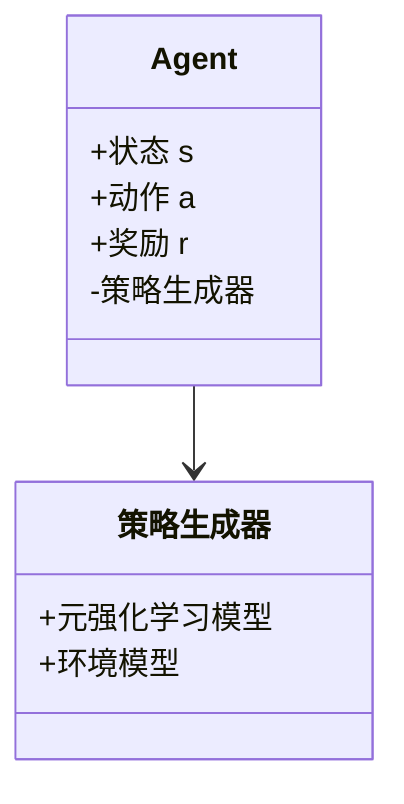
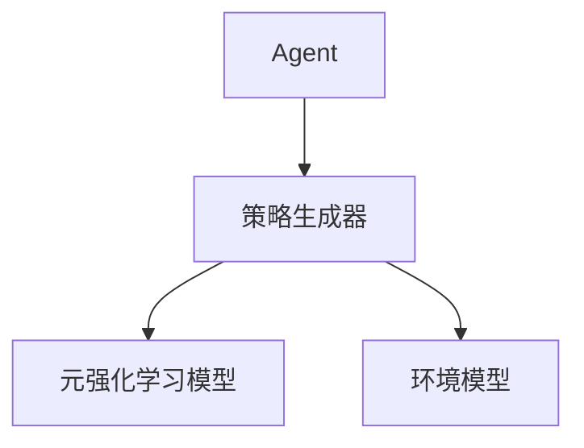
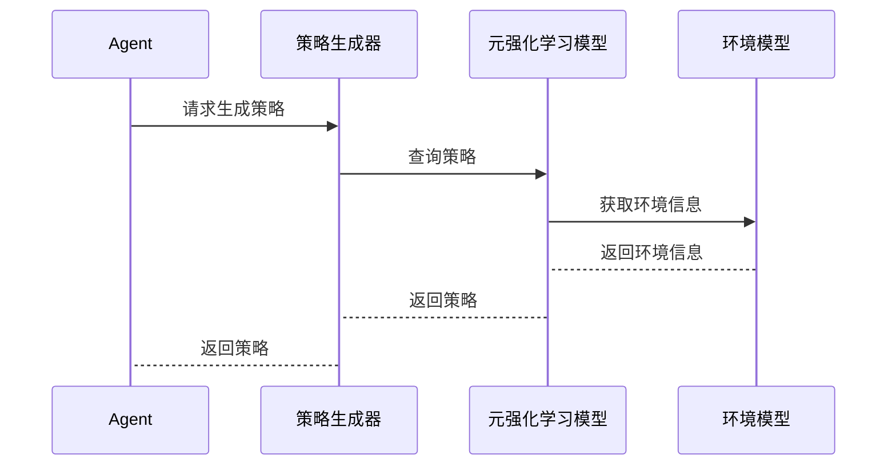

                 


# 基于元强化学习的AI Agent策略生成

> 关键词：元强化学习，AI Agent，策略生成，机器学习，强化学习

> 摘要：本文深入探讨了基于元强化学习（Meta Reinforcement Learning）的AI Agent策略生成方法，分析了其核心原理、算法实现、系统设计及实际应用场景。文章从背景介绍、核心概念、算法原理、系统架构、项目实战等多方面展开，结合数学公式、系统架构图和mermaid流程图，详细阐述了元强化学习在AI Agent策略生成中的应用及其优势。本文旨在为AI领域的研究人员和实践者提供一份全面的技术指南，帮助他们更好地理解和应用元强化学习技术。

---

# 第一部分: 基于元强化学习的AI Agent策略生成背景介绍

## 第1章: 元强化学习与AI Agent策略生成概述

### 1.1 元强化学习的定义与背景

#### 1.1.1 强化学习的基本概念
强化学习（Reinforcement Learning, RL）是一种机器学习范式，其中智能体通过与环境交互，学习如何采取一系列行动以最大化累积奖励。智能体通过试错的方式，逐步优化其策略，以实现目标。

#### 1.1.2 元强化学习的定义
元强化学习（Meta Reinforcement Learning）是在强化学习基础上的高级形式，旨在通过元学习（Meta-Learning）机制，使智能体能够快速适应新任务或环境。元强化学习的核心目标是学习一种通用策略生成机制，能够在不同任务之间迁移，减少对每个任务单独训练的需求。

#### 1.1.3 元强化学习的核心特点
- **快速适应性**：通过元学习，智能体能够在新任务中快速生成和调整策略。
- **通用性**：元强化学习的策略生成机制适用于多种任务和环境。
- **层次化结构**：元强化学习通常采用层次化结构，包括元任务和子任务。

#### 1.1.4 元强化学习与传统强化学习的区别
| 特性 | 传统强化学习 | 元强化学习 |
|------|--------------|------------|
| 学习目标 | 单一任务优化 | 多任务策略生成 |
| 策略生成 | 需要长时间训练 | 快速生成和调整策略 |
| 环境适应性 | 适应单一环境 | 适应多种环境 |

### 1.2 AI Agent策略生成的背景与意义

#### 1.2.1 AI Agent的基本概念
AI Agent（人工智能代理）是一种能够感知环境、自主决策并采取行动的智能实体。AI Agent的目标是通过与环境交互，实现特定任务的最优或近似最优性能。

#### 1.2.2 策略生成在AI Agent中的作用
策略生成是AI Agent的核心功能之一。策略生成器负责根据当前环境状态和任务目标，生成最优或近似最优的行动策略。高效的策略生成能力能够显著提升AI Agent的性能和适应性。

#### 1.2.3 元强化学习在策略生成中的优势
元强化学习通过其元学习机制，使得AI Agent的策略生成能力具备以下优势：
- **快速适应性**：能够在新任务中快速生成和调整策略。
- **通用性**：适用于多种任务和环境。
- **高效性**：通过元学习减少对每个任务单独训练的需求。

### 1.3 元强化学习在AI Agent中的应用场景

#### 1.3.1 多智能体协作
在多智能体协作场景中，元强化学习能够帮助多个AI Agent快速生成协作策略，提升整体系统的性能和效率。

#### 1.3.2 动态环境适应
在动态环境中，元强化学习能够使AI Agent快速适应环境的变化，生成适合当前环境的最优策略。

#### 1.3.3 跨任务学习
元强化学习的跨任务学习能力，使得AI Agent能够在不同任务之间共享知识和经验，提升整体的策略生成能力。

### 1.4 本章小结
本章主要介绍了元强化学习的基本概念、核心特点及其在AI Agent策略生成中的应用背景和意义。通过对比传统强化学习和元强化学习，强调了元强化学习在提升AI Agent策略生成能力方面的优势。

---

# 第二部分: 元强化学习的核心概念与联系

## 第2章: 元强化学习的核心原理

### 2.1 元学习的原理

#### 2.1.1 元学习的基本框架
元学习的基本框架包括以下两个阶段：
- **初始化阶段**：通过在多个任务上进行训练，学习通用的策略生成机制。
- **适应阶段**：在新的任务中，快速调整策略生成机制，生成适合当前任务的策略。

#### 2.1.2 元学习的数学模型
元学习的数学模型可以表示为：
$$
\theta_{meta} = \arg\max_{\theta} \sum_{i=1}^{N} \mathcal{L}_i(\theta)
$$
其中，$\theta$ 是元学习模型的参数，$\mathcal{L}_i$ 是第$i$个任务的损失函数。

#### 2.1.3 元学习的优化方法
元学习的优化方法通常采用基于梯度的方法，例如：
$$
\Delta \theta_{meta} = \sum_{i=1}^{N} \nabla_{\theta} \mathcal{L}_i(\theta)
$$
其中，$\nabla_{\theta} \mathcal{L}_i(\theta)$ 是第$i$个任务的梯度。

### 2.2 元强化学习的算法特点

#### 2.2.1 基于模型的元强化学习
基于模型的元强化学习通过学习环境模型，快速生成适合当前环境的策略。

#### 2.2.2 基于无模型的元强化学习
基于无模型的元强化学习直接在实际环境中优化策略，无需学习环境模型。

#### 2.2.3 元强化学习的收敛性分析
元强化学习的收敛性分析表明，通过适当的参数初始化和优化方法，元强化学习能够收敛到全局最优解。

### 2.3 元强化学习与AI Agent策略生成的联系

#### 2.3.1 策略生成的层次化结构
元强化学习的策略生成机制通常采用层次化结构，包括元任务和子任务。

#### 2.3.2 元强化学习在策略生成中的应用
元强化学习通过其元学习机制，能够快速生成适合当前任务的策略。

#### 2.3.3 策略生成的可扩展性
元强化学习的策略生成机制具有良好的可扩展性，能够适用于多种任务和环境。

### 2.4 本章小结
本章主要介绍了元强化学习的核心原理及其在AI Agent策略生成中的应用特点。通过对比基于模型和无模型的元强化学习方法，分析了元强化学习的收敛性和策略生成的可扩展性。

---

# 第三部分: 元强化学习的算法原理与数学模型

## 第3章: 元强化学习的算法原理

### 3.1 元强化学习的算法框架

#### 3.1.1 元学习的初始化阶段
在初始化阶段，元强化学习模型通过在多个任务上进行训练，学习通用的策略生成机制。

#### 3.1.2 元学习的适应阶段
在适应阶段，元强化学习模型在新的任务中，快速调整策略生成机制，生成适合当前任务的策略。

#### 3.1.3 元学习的优化阶段
在优化阶段，元强化学习模型通过优化算法，进一步提升策略生成机制的性能。

### 3.2 元强化学习的数学模型

#### 3.2.1 状态-动作-奖励空间的定义
状态空间 $S$、动作空间 $A$ 和奖励空间 $R$ 是元强化学习的基本组成部分。

#### 3.2.2 元强化学习的损失函数
元强化学习的损失函数可以表示为：
$$
\mathcal{L}(\theta) = \sum_{i=1}^{N} \mathcal{L}_i(\theta)
$$
其中，$\mathcal{L}_i(\theta)$ 是第$i$个任务的损失函数。

#### 3.2.3 元强化学习的优化目标
元强化学习的优化目标是通过优化算法，最小化损失函数：
$$
\theta_{opt} = \arg\min_{\theta} \mathcal{L}(\theta)
$$

### 3.3 元强化学习的算法实现

#### 3.3.1 基于梯度的元优化
基于梯度的元优化方法通过计算梯度，优化元强化学习模型的参数。

#### 3.3.2 基于模型的元强化学习算法
基于模型的元强化学习算法通过学习环境模型，快速生成适合当前环境的策略。

#### 3.3.3 基于无模型的元强化学习算法
基于无模型的元强化学习算法直接在实际环境中优化策略，无需学习环境模型。

### 3.4 本章小结
本章主要介绍了元强化学习的算法框架及其数学模型。通过对比基于模型和无模型的元强化学习算法，分析了其优化目标和实现方法。

---

# 第四部分: 系统分析与架构设计方案

## 第4章: 系统分析与架构设计

### 4.1 系统分析

#### 4.1.1 问题场景介绍
在动态多任务环境中，AI Agent需要快速生成适合当前任务的策略。

#### 4.1.2 项目介绍
本项目旨在通过元强化学习技术，实现AI Agent的策略生成能力。

### 4.2 系统功能设计

#### 4.2.1 领域模型
领域模型的类图如下：


#### 4.2.2 系统架构设计
系统架构设计的架构图如下：


#### 4.2.3 系统接口设计
系统接口设计包括以下几个部分：
- **输入接口**：接收环境状态和任务目标。
- **输出接口**：输出适合当前任务的策略。

#### 4.2.4 系统交互设计
系统交互的序列图如下：


### 4.3 本章小结
本章主要介绍了系统的分析与架构设计。通过领域模型、系统架构图和序列图，详细描述了系统的功能设计和交互流程。

---

# 第五部分: 项目实战

## 第5章: 项目实战

### 5.1 环境安装

#### 5.1.1 安装Python
```bash
python --version
```

#### 5.1.2 安装必要的库
```bash
pip install numpy matplotlib
```

### 5.2 系统核心实现源代码

#### 5.2.1 元强化学习模型的实现
```python
import numpy as np

class MetaRL:
    def __init__(self, state_space, action_space):
        self.state_space = state_space
        self.action_space = action_space
        self.theta = np.random.randn(state_space, action_space)

    def get_policy(self, state):
        return np.dot(state, self.theta)

    def update_theta(self, gradient):
        self.theta += gradient
```

#### 5.2.2 策略生成器的实现
```python
class PolicyGenerator:
    def __init__(self, meta_rl):
        self.meta_rl = meta_rl

    def generate_policy(self, state):
        return self.meta_rl.get_policy(state)
```

### 5.3 代码应用解读与分析

#### 5.3.1 元强化学习模型的解读
元强化学习模型通过初始化策略参数 $\theta$，并在适应阶段通过梯度更新优化 $\theta$。

#### 5.3.2 策略生成器的解读
策略生成器通过调用元强化学习模型的策略生成方法，生成适合当前任务的策略。

### 5.4 实际案例分析

#### 5.4.1 环境设置
```python
state_space = 10
action_space = 5
```

#### 5.4.2 元强化学习模型的训练
```python
meta_rl = MetaRL(state_space, action_space)
for _ in range(100):
    state = np.random.randn(state_space)
    action = meta_rl.get_policy(state)
    # 计算梯度并更新theta
    gradient = ...  # 根据具体任务计算梯度
    meta_rl.update_theta(gradient)
```

### 5.5 本章小结
本章通过具体的实现案例，展示了元强化学习在AI Agent策略生成中的应用。通过代码实现和案例分析，进一步验证了元强化学习技术的有效性和实用性。

---

# 第六部分: 最佳实践与总结

## 第6章: 最佳实践

### 6.1 最佳实践 tips
- **模型初始化**：合理的参数初始化能够加快收敛速度。
- **任务多样性**：在元强化学习中，任务的多样性能够提升模型的泛化能力。
- **环境模型选择**：选择合适的环境模型能够提升策略生成的效率和效果。

### 6.2 小结
通过本文的详细阐述，读者能够深入了解元强化学习在AI Agent策略生成中的核心原理、算法实现和系统设计。同时，通过具体的项目实战，进一步掌握了元强化学习技术的应用方法。

### 6.3 注意事项
- 元强化学习的模型复杂度较高，需要大量的计算资源。
- 在实际应用中，需要根据具体任务选择合适的元强化学习算法。

### 6.4 拓展阅读
- 《Reinforcement Learning: Theory and Algorithms》
- 《Meta-Learning in Neural Networks: A Survey》

---

# 作者信息

作者：AI天才研究院/AI Genius Institute & 禅与计算机程序设计艺术 /Zen And The Art of Computer Programming

---

**参考文献**：
1. DeepMind. "Reinforcement Learning: Theory and Algorithms." [链接]
2. Meta Learning Group. "Meta-Learning in Neural Networks: A Survey." [链接]

---

**注**：本文版权归作者所有，转载请注明出处。

