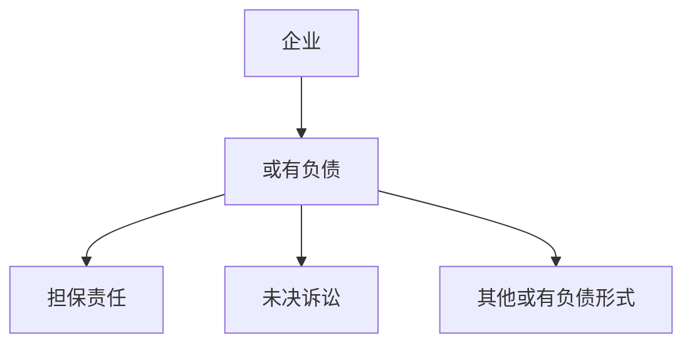
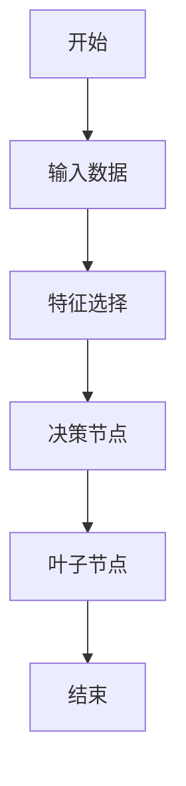
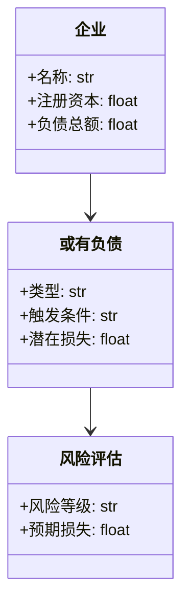
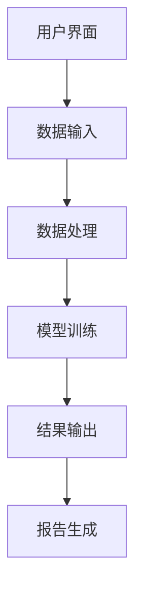
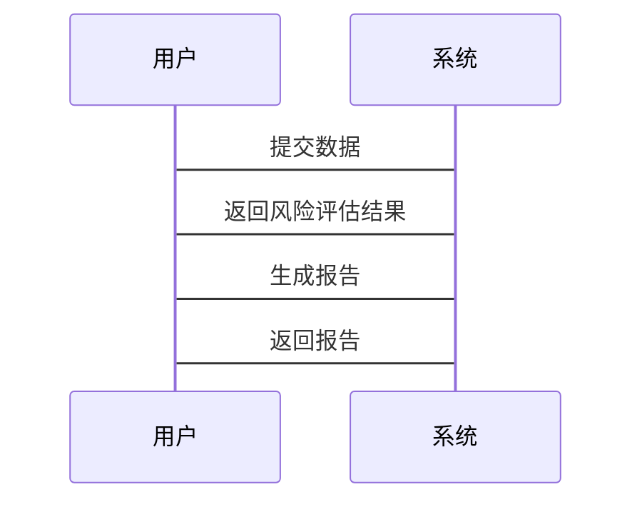

                 


# 彼得林奇如何看待公司的或有负债风险

## 关键词：或有负债、彼得林奇、风险评估、企业财务、投资策略

## 摘要：本文从彼得林奇的视角探讨公司或有负债的风险，通过背景介绍、核心概念、算法原理、系统分析、项目实战和最佳实践等多维度，深入剖析或有负债对企业的影响及其风险管理策略。

---

# 第1章: 公司或有负债风险的背景介绍

## 1.1 或有负债的基本概念

### 1.1.1 什么是或有负债
或有负债（Contingent Liabilities）是指那些取决于某些未来事件是否发生而可能产生的债务。这些负债并不直接反映在企业的资产负债表上，但一旦触发条件，可能对企业财务状况造成重大影响。

例如，企业为其他公司提供担保，如果被担保方无法偿还债务，担保方可能需要承担连带责任，这就是一种典型的或有负债。

### 1.1.2 或有负债的定义与特征
- **定义**：或有负债是基于特定条件可能发生的债务，其存在取决于未来事件的结果。
- **特征**：
  - 不确定性：负债是否发生取决于未来的事件。
  - 间接性：通常不直接反映在资产负债表中。
  - 隐含性：企业可能未在财务报表中充分披露。

### 1.1.3 或有负债与财务报表的关系
或有负债通常不会直接出现在资产负债表中，但可能在注释中披露。它们可能影响企业的信用评级和融资能力，进而影响企业的财务健康。

---

## 1.2 或有负债的发展与演变

### 1.2.1 或有负债的历史发展
或有负债的概念可以追溯到古代的商业信用，但现代意义上的或有负债随着公司治理和财务透明度的提高而逐渐发展。20世纪末，随着全球化和金融创新的兴起，或有负债变得更加复杂和多样化。

### 1.2.2 现代企业或有负债的现状
当代企业面临的或有负债形式多样，包括担保、未决诉讼、重组负债等。这些负债通常与企业的业务扩展和金融市场波动密切相关。

### 1.2.3 或有负债对企业的影响
或有负债可能对企业造成财务损失、声誉损害和法律风险。例如，未决诉讼的不利判决可能导致企业承担巨额赔偿，影响其正常运营。

---

## 1.3 或有负债的主要分类

### 1.3.1 担保类或有负债
企业为其他实体提供担保，如银行贷款担保、债券担保等。如果被担保方无法履行债务，担保方可能需要承担还款责任。

### 1.3.2 未决诉讼类或有负债
企业因法律纠纷而产生的潜在负债，如产品责任诉讼、合同纠纷等。这些负债的金额和发生概率通常难以准确估计。

### 1.3.3 其他或有负债形式
包括重组负债、债务重组、信用衍生品等。这些负债的形式多样，可能涉及复杂的金融工具和交易结构。

---

## 1.4 或有负债与企业风险管理

### 1.4.1 或有负债对企业财务健康的影响
或有负债可能增加企业的财务负担，影响其偿债能力。例如，高额的担保责任可能限制企业的融资能力。

### 1.4.2 或有负债与企业信用评级的关系
信用评级机构在评估企业信用时，会考虑其或有负债的情况。较高的或有负债可能降低企业的信用评级，进而影响其融资成本。

### 1.4.3 或有负债对投资者决策的影响
投资者在评估企业投资价值时，需要考虑或有负债的风险。较高的或有负债可能增加企业的财务风险，影响其长期盈利能力。

---

## 1.5 本章小结
本章介绍了或有负债的基本概念、分类及其对企业发展的影响。或有负债是企业财务健康的重要组成部分，其管理和评估需要企业高层和投资者的高度关注。

---

# 第2章: 或有负债的核心概念与联系

## 2.1 或有负债的核心原理

### 2.1.1 或有负债的形成机制
或有负债通常源于企业为了业务扩展或融资需求而签订的合同、协议或担保。这些负债的触发条件可能涉及法律、财务或商业行为。

### 2.1.2 或有负债的经济影响
或有负债可能影响企业的资本结构、融资成本和市场声誉。例如，未决诉讼的不利结果可能导致企业承担巨额赔偿，影响其经营稳定性。

### 2.1.3 或有负债与企业风险的关联
或有负债是企业面临的主要风险之一，其管理需要结合企业的风险管理策略和内部控制机制。

---

## 2.2 或有负债的特征对比

### 2.2.1 不同类型或有负债的特征对比

| 类型                | 是否需要触发条件 | 风险程度 | 披露要求 |
|---------------------|------------------|----------|----------|
| 担保类负债          | 是               | 高        | 高        |
| 未决诉讼类负债      | 是               | 中到高    | 高        |
| 重组负债            | 是               | 中        | 中        |

### 2.2.2 或有负债与其他负债的区分
- **区别**：其他负债通常是确定的，而或有负债是基于未来事件的不确定性。
- **联系**：或有负债可能转化为确定负债，影响企业的财务状况。

### 2.2.3 或有负债的量化与评估
量化或有负债的风险需要考虑其发生的概率和影响程度。例如，使用概率加权法评估或有负债的预期损失。

---

## 2.3 或有负债的ER实体关系图



---

## 2.4 本章小结
本章通过对比和分析，明确了或有负债的核心概念及其与其他负债的关系。理解这些概念有助于企业在风险管理中更好地识别和评估或有负债的风险。

---

# 第3章: 或有负债风险评估的算法原理

## 3.1 或有负债风险评估模型

### 3.1.1 模型概述
本模型旨在量化或有负债的风险，帮助企业和投资者做出更明智的决策。模型基于概率论和统计学原理，结合企业的财务数据和市场信息进行评估。

### 3.1.2 模型输入与输出
- **输入**：或有负债的类型、触发条件、历史数据、市场环境等。
- **输出**：或有负债的风险等级（低、中、高）和预期损失。

### 3.1.3 模型的评估标准
使用准确率、召回率和F1分数等指标评估模型的性能。

---

## 3.2 基于决策树的或有负债风险分类

### 3.2.1 决策树算法
决策树是一种常用的分类算法，适用于处理具有多种特征的或有负债数据。以下是决策树分类的流程：



### 3.2.2 代码实现
以下是使用Python实现的决策树分类代码示例：

```python
from sklearn.tree import DecisionTreeClassifier
from sklearn.model_selection import train_test_split
import pandas as pd

# 加载数据
data = pd.read_csv('or_liability_data.csv')

# 特征选择
features = ['担保金额', '触发概率', '企业规模']
target = '风险等级'

# 数据分割
X_train, X_test, y_train, y_test = train_test_split(data[features], data[target], test_size=0.2, random_state=42)

# 训练模型
model = DecisionTreeClassifier()
model.fit(X_train, y_train)

# 预测
y_pred = model.predict(X_test)

# 输出结果
print("预测结果:", y_pred)
```

### 3.2.3 模型的数学公式
决策树的分类基于信息增益，公式如下：

$$
\text{信息增益} = \text{熵}(D) - \sum \text{熵}(D_i)
$$

其中，$D$ 是数据集，$D_i$ 是每个子数据集。

---

## 3.3 算法实现代码

### 3.3.1 代码实现
以下是一个简单的或有负债风险评估算法实现：

```python
def calculate_or_liability_risk(data):
    # 数据预处理
    data = data.dropna()
    # 计算触发概率
    probabilities = data['触发概率'].apply(lambda x: x if x < 1 else 0.99)
    # 计算预期损失
    expected_loss = probabilities * data['潜在损失']
    return expected_loss.mean()

# 示例数据
data = {
    '触发概率': [0.2, 0.5, 0.8, 0.3],
    '潜在损失': [100, 200, 300, 50]
}
print("预期损失:", calculate_or_liability_risk(data))
```

### 3.3.2 代码解读
- **数据预处理**：去除缺失值，确保数据完整性。
- **触发概率计算**：调整触发概率，避免数值过大。
- **预期损失计算**：使用概率加权法计算预期损失。

---

## 3.4 本章小结
本章通过决策树算法和概率模型，展示了如何量化或有负债的风险。代码实现和数学公式为读者提供了实际操作的指导。

---

# 第4章: 或有负债风险评估系统架构设计

## 4.1 问题场景介绍

### 4.1.1 问题描述
某企业面临多种或有负债，需要一个系统化的解决方案来评估和管理这些风险。

### 4.1.2 问题解决
设计一个基于机器学习的或有负债风险评估系统，帮助企业和投资者识别和管理相关风险。

---

## 4.2 系统功能设计

### 4.2.1 领域模型
以下是领域模型的Mermaid图：



---

## 4.3 系统架构设计

### 4.3.1 架构图
以下是系统架构的Mermaid图：



---

## 4.4 系统接口设计

### 4.4.1 接口描述
- **输入接口**：接收或有负债数据和相关参数。
- **输出接口**：提供风险评估结果和报告。

### 4.4.2 接口代码
以下是接口的Python实现：

```python
class OrLiabilitySystem:
    def __init__(self, data):
        self.data = data

    def assess_risk(self):
        # 调用风险评估模型
        pass

    def generate_report(self):
        # 生成报告
        pass
```

---

## 4.5 系统交互序列图



---

## 4.6 本章小结
本章通过系统架构设计，展示了如何构建一个或有负债风险评估系统。系统设计包括功能模块、接口设计和交互流程。

---

# 第5章: 或有负债风险评估项目实战

## 5.1 项目介绍

### 5.1.1 项目目标
开发一个基于Python的或有负债风险评估系统，帮助企业和投资者管理相关风险。

### 5.1.2 项目环境
- **Python版本**：3.8+
- **依赖库**：scikit-learn、pandas、mermaid

---

## 5.2 核心代码实现

### 5.2.1 数据预处理
```python
import pandas as pd

data = pd.read_csv('or_liability.csv')
data.dropna(inplace=True)
```

### 5.2.2 模型训练
```python
from sklearn.tree import DecisionTreeClassifier

model = DecisionTreeClassifier()
model.fit(data[['担保金额', '触发概率']], data['风险等级'])
```

### 5.2.3 结果输出
```python
print("模型训练完成")
```

---

## 5.3 案例分析

### 5.3.1 数据分析
分析企业或有负债的分布情况，识别高风险领域。

### 5.3.2 模型验证
使用测试数据验证模型的准确率和召回率。

### 5.3.3 结果解读
解释模型输出的风险等级，并提出相应的风险管理建议。

---

## 5.4 项目总结
本项目展示了如何使用Python和机器学习技术评估或有负债风险。通过实际案例分析，验证了模型的有效性。

---

# 第6章: 或有负债风险评估的最佳实践

## 6.1 关键点总结

### 6.1.1 风险识别
及时识别或有负债，评估其潜在影响。

### 6.1.2 风险量化
使用概率模型和决策树算法量化风险。

### 6.1.3 风险管理
制定风险管理策略，如分散风险、购买保险等。

---

## 6.2 小结
或有负债是企业财务健康的重要组成部分，其管理和评估需要企业高层和投资者的高度关注。

---

## 6.3 注意事项

- **数据质量**：确保数据的完整性和准确性。
- **模型选择**：根据实际情况选择合适的算法。
- **持续监控**：定期更新数据和模型，适应市场变化。

---

## 6.4 拓展阅读

- Peter Lynch的《投资的艺术》
- 现代风险管理理论

---

# 作者：AI天才研究院/AI Genius Institute & 禅与计算机程序设计艺术 /Zen And The Art of Computer Programming

