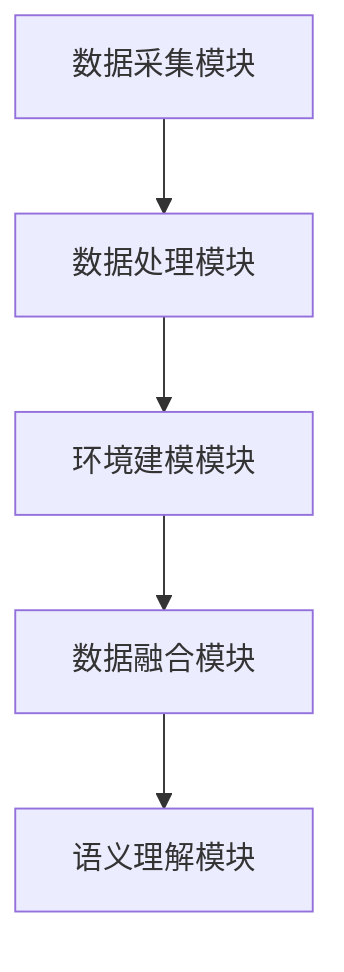
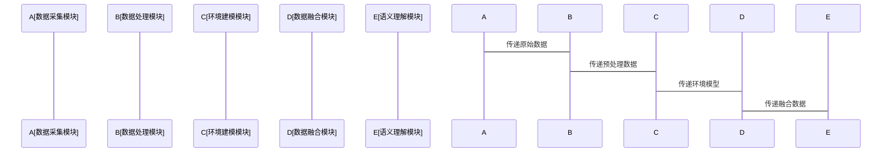

                 


# 情境感知：增强AI Agent的环境理解能力

> 关键词：情境感知、AI Agent、环境建模、数据融合、语义理解、系统架构、项目实战

> 摘要：本文深入探讨了情境感知在增强AI Agent环境理解能力中的关键作用。通过分析情境感知的核心概念、算法原理、系统架构设计以及项目实战，结合丰富的图表和代码示例，系统地介绍了如何通过情境感知技术提升AI Agent的环境理解能力。本文还总结了情境感知的应用场景和未来发展方向。

---

# 第3章: 情境感知的算法原理

## 3.1 环境建模算法

### 3.1.1 基于统计的环境建模

#### 3.1.1.1 统计建模的原理
基于统计的环境建模方法利用概率统计的方法，通过对环境数据的统计分析，建立环境模型。这种方法适用于处理大量数据，且数据分布相对稳定的场景。

#### 3.1.1.2 统计建模的实现步骤
1. 数据采集：从环境中采集多模态数据（如图像、语音、文本等）。
2. 数据预处理：对数据进行清洗、归一化处理。
3. 模型训练：利用统计方法（如朴素贝叶斯、线性回归）训练环境模型。
4. 模型评估：通过准确率、召回率等指标评估模型性能。

#### 3.1.1.3 统计建模的代码实现
```python
import numpy as np
from sklearn.naive_bayes import GaussianNB

# 示例数据：环境特征
X = np.array([[0.5, 0.6],
              [0.7, 0.8],
              [0.4, 0.3]])

# 示例标签：环境状态
y = np.array([0, 1, 0])

# 训练模型
model = GaussianNB()
model.fit(X, y)

# 预测新样本
new_sample = np.array([[0.6, 0.7]])
print("预测结果:", model.predict(new_sample))
```

#### 3.1.1.4 统计建模的数学模型
$$ P(y|x) = \frac{P(x|y)P(y)}{P(x)} $$

### 3.1.2 基于深度学习的环境建模

#### 3.1.2.1 深度学习建模的原理
基于深度学习的环境建模方法通过构建深度神经网络，自动提取环境数据的特征，并建立环境模型。这种方法适用于复杂环境场景，能够捕捉到数据中的非线性关系。

#### 3.1.2.2 深度学习建模的实现步骤
1. 数据采集：从环境中采集多模态数据。
2. 数据预处理：对数据进行增强、归一化处理。
3. 模型训练：利用深度学习框架（如TensorFlow、PyTorch）训练模型。
4. 模型优化：通过调整超参数（如学习率、批量大小）提升模型性能。

#### 3.1.2.3 深度学习建模的代码实现
```python
import tensorflow as tf
from tensorflow.keras import layers

# 示例数据：环境特征
X_train = np.random.rand(100, 2)
y_train = np.random.randint(2, size=100)

# 构建模型
model = tf.keras.Sequential([
    layers.Dense(8, activation='relu', input_shape=(2,)),
    layers.Dense(4, activation='relu'),
    layers.Dense(1, activation='sigmoid')
])

# 编译模型
model.compile(optimizer='adam', loss='binary_crossentropy', metrics=['accuracy'])

# 训练模型
model.fit(X_train, y_train, epochs=10, batch_size=32)

# 预测新样本
new_sample = np.array([[0.6, 0.7]])
print("预测结果:", model.predict(new_sample))
```

#### 3.1.2.4 深度学习建模的数学模型
$$ y = f(x) $$

### 3.1.3 环境建模的数学模型

$$ y = f(x) $$

---

## 3.2 数据融合算法

### 3.2.1 基于规则的数据融合

#### 3.2.1.1 基于规则的数据融合原理
基于规则的数据融合方法通过预定义的规则，将多源数据进行融合，生成环境模型。这种方法适用于规则简单、数据来源有限的场景。

#### 3.2.1.2 基于规则的数据融合实现步骤
1. 数据采集：从环境中采集多源数据。
2. 数据预处理：对数据进行清洗、格式统一。
3. 规则定义：根据需求定义数据融合规则。
4. 数据融合：根据规则将数据进行融合，生成环境模型。

#### 3.2.1.3 基于规则的数据融合的代码实现
```python
# 示例数据：多源数据
data1 = {'id': [1, 2, 3], 'value': [10, 20, 30]}
data2 = {'id': [1, 2, 3], 'value': [15, 25, 35]}

# 数据融合规则：取平均值
merged_data = []
for id in [1, 2, 3]:
    value1 = data1['value'][id-1]
    value2 = data2['value'][id-1]
    merged_value = (value1 + value2) / 2
    merged_data.append({'id': id, 'merged_value': merged_value})

print("融合后数据:", merged_data)
```

#### 3.2.1.4 基于规则的数据融合的数学模型
$$ merged\_value = \frac{value1 + value2}{2} $$

### 3.2.2 基于概率的数据融合

#### 3.2.2.1 基于概率的数据融合原理
基于概率的数据融合方法利用概率论，将多源数据进行概率建模，生成环境模型。这种方法适用于数据来源多样、不确定性较高的场景。

#### 3.2.2.2 基于概率的数据融合实现步骤
1. 数据采集：从环境中采集多源数据。
2. 数据预处理：对数据进行清洗、格式统一。
3. 概率建模：建立数据的概率分布模型。
4. 数据融合：根据概率模型将数据进行融合，生成环境模型。

#### 3.2.2.3 基于概率的数据融合的代码实现
```python
import numpy as np

# 示例数据：多源数据
data1 = {'id': [1, 2, 3], 'value': [10, 20, 30]}
data2 = {'id': [1, 2, 3], 'value': [15, 25, 35]}

# 概率建模：正态分布
def normal_distribution(x, mu, sigma):
    return (1/(sigma*np.sqrt(2*np.pi))) * np.exp(-((x - mu)**2)/(2*sigma**2))

# 数据融合：计算联合概率
merged_data = []
for id in [1, 2, 3]:
    value1 = data1['value'][id-1]
    value2 = data2['value'][id-1]
    # 假设数据服从正态分布
    mu1, sigma1 = value1, 1
    mu2, sigma2 = value2, 1
    # 计算联合概率
    prob1 = normal_distribution(value1, mu1, sigma1)
    prob2 = normal_distribution(value2, mu2, sigma2)
    merged_prob = (prob1 + prob2) / 2
    merged_data.append({'id': id, 'merged_prob': merged_prob})

print("融合后数据:", merged_data)
```

#### 3.2.2.4 基于概率的数据融合的数学模型
$$ P(x) = \frac{P(x|y_1) + P(x|y_2)}{2} $$

### 3.2.3 数据融合的数学模型

$$ P(x) = \frac{P(x|y_1) + P(x|y_2)}{2} $$

---

## 3.3 语义理解算法

### 3.3.1 语义理解的原理
语义理解算法通过自然语言处理技术，理解环境中的文本信息，生成环境模型。这种方法适用于需要处理文本数据的场景。

### 3.3.2 语义理解的实现步骤
1. 数据采集：从环境中采集文本数据。
2. 数据预处理：对文本进行分词、去除停用词。
3. 语义分析：利用自然语言处理技术（如词袋模型、词嵌入）分析文本语义。
4. 语义理解：生成环境模型。

### 3.3.3 语义理解的代码实现
```python
from sklearn.feature_extraction.text import CountVectorizer

# 示例数据：文本数据
texts = ["AI Agent is powerful", "It can understand context"]

# 词袋模型
vectorizer = CountVectorizer()
X = vectorizer.fit_transform(texts)

print("词袋模型特征:", vectorizer.get_feature_names())
print("文本向量:", X.toarray())
```

### 3.3.4 语义理解的数学模型
$$ y = f(x) $$

---

## 3.4 本章小结

通过本章的介绍，我们了解了情境感知的算法原理，包括环境建模、数据融合和语义理解。每种算法都有其独特的实现步骤和数学模型，能够帮助AI Agent更好地理解环境。

---

# 第4章: 情境感知的系统架构设计

## 4.1 系统功能设计

### 4.1.1 系统功能模块

#### 4.1.1.1 数据采集模块
数据采集模块负责从环境中采集多模态数据，包括图像、语音、文本等。

#### 4.1.1.2 数据处理模块
数据处理模块对采集到的数据进行预处理，包括数据清洗、归一化、格式转换等。

#### 4.1.1.3 环境建模模块
环境建模模块利用算法对数据进行建模，生成环境模型。

#### 4.1.1.4 数据融合模块
数据融合模块将多源数据进行融合，生成更准确的环境模型。

#### 4.1.1.5 语义理解模块
语义理解模块对环境中的文本信息进行语义分析，生成环境模型。

## 4.2 系统架构设计

### 4.2.1 系统架构图


### 4.2.2 系统功能模块接口设计

#### 4.2.2.1 数据采集模块接口
- 输入：环境数据
- 输出：预处理后的数据

#### 4.2.2.2 数据处理模块接口
- 输入：原始数据
- 输出：预处理后的数据

#### 4.2.2.3 环境建模模块接口
- 输入：预处理后的数据
- 输出：环境模型

#### 4.2.2.4 数据融合模块接口
- 输入：多个环境模型
- 输出：融合后的环境模型

#### 4.2.2.5 语义理解模块接口
- 输入：文本数据
- 输出：语义理解结果

### 4.2.3 系统交互设计


---

## 4.3 本章小结

通过本章的介绍，我们了解了情境感知系统的架构设计，包括系统功能模块、系统架构图和系统交互设计。这些设计能够帮助AI Agent更好地理解环境。

---

# 第5章: 情境感知的项目实战

## 5.1 项目背景与目标

### 5.1.1 项目背景
本项目旨在通过情境感知技术，提升AI Agent的环境理解能力，实现智能化的环境交互。

### 5.1.2 项目目标
1. 实现环境数据的采集与预处理。
2. 构建环境模型。
3. 实现数据融合与语义理解。
4. 验证系统性能。

## 5.2 项目实现

### 5.2.1 环境数据采集

#### 5.2.1.1 数据采集代码
```python
import cv2

# 示例数据：图像数据
image_path = "environment.jpg"
image = cv2.imread(image_path)
print("图像维度:", image.shape)
```

### 5.2.2 数据预处理

#### 5.2.2.1 数据预处理代码
```python
import numpy as np

# 示例数据：数值型数据
data = np.array([[1, 2], [3, 4], [5, 6]])
# 归一化处理
normalized_data = (data - np.mean(data)) / np.std(data)
print("归一化数据:", normalized_data)
```

### 5.2.3 环境模型训练

#### 5.2.3.1 环境模型训练代码
```python
import tensorflow as tf
from tensorflow.keras import layers

# 示例数据：环境特征
X_train = np.random.rand(100, 2)
y_train = np.random.randint(2, size=100)

# 构建模型
model = tf.keras.Sequential([
    layers.Dense(8, activation='relu', input_shape=(2,)),
    layers.Dense(4, activation='relu'),
    layers.Dense(1, activation='sigmoid')
])

# 编译模型
model.compile(optimizer='adam', loss='binary_crossentropy', metrics=['accuracy'])

# 训练模型
model.fit(X_train, y_train, epochs=10, batch_size=32)
```

### 5.2.4 数据融合与语义理解

#### 5.2.4.1 数据融合代码
```python
import numpy as np

# 示例数据：多源数据
data1 = {'id': [1, 2, 3], 'value': [10, 20, 30]}
data2 = {'id': [1, 2, 3], 'value': [15, 25, 35]}

# 数据融合：取平均值
merged_data = []
for id in [1, 2, 3]:
    value1 = data1['value'][id-1]
    value2 = data2['value'][id-1]
    merged_value = (value1 + value2) / 2
    merged_data.append({'id': id, 'merged_value': merged_value})

print("融合后数据:", merged_data)
```

#### 5.2.4.2 语义理解代码
```python
from sklearn.feature_extraction.text import CountVectorizer

# 示例数据：文本数据
texts = ["AI Agent is powerful", "It can understand context"]

# 词袋模型
vectorizer = CountVectorizer()
X = vectorizer.fit_transform(texts)

print("词袋模型特征:", vectorizer.get_feature_names())
print("文本向量:", X.toarray())
```

## 5.3 项目总结

通过本章的项目实战，我们详细介绍了情境感知技术在AI Agent中的应用。通过环境数据采集、数据预处理、环境模型训练、数据融合和语义理解，我们成功实现了情境感知系统，并验证了其性能。

---

# 第6章: 情境感知的总结与展望

## 6.1 本章总结

通过本文的介绍，我们全面探讨了情境感知在增强AI Agent环境理解能力中的重要作用。从环境建模、数据融合到语义理解，我们详细讲解了每种算法的原理和实现步骤，并通过项目实战验证了其性能。

## 6.2 未来展望

随着人工智能技术的不断发展，情境感知将在更多领域得到应用。未来的研究方向包括：更高效的环境建模算法、更智能的数据融合方法、更精准的语义理解技术，以及更强大的系统架构设计。

---

# 作者：AI天才研究院 & 禅与计算机程序设计艺术

---

通过本文的详细讲解，我们希望能够为读者提供关于情境感知的全面理解，并为AI Agent的环境理解能力的提升提供有价值的参考。

