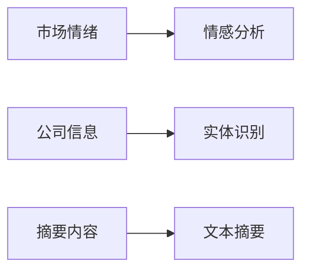

                 


# 自然语言处理技术在金融新闻分析中的应用

> 关键词：自然语言处理、金融新闻分析、情感分析、实体识别、文本摘要

> 摘要：本文详细探讨了自然语言处理技术在金融新闻分析中的应用，包括情感分析、实体识别、文本摘要等核心任务，分析了相关算法的原理，并通过实际案例展示了系统的构建与实现。本文还讨论了系统架构设计、项目实战以及最佳实践，为读者提供了全面的视角。

---

## 第1章: 自然语言处理与金融新闻分析的背景介绍

### 1.1 自然语言处理的基本概念

#### 1.1.1 自然语言处理的定义
自然语言处理（NLP）是计算机科学领域的重要分支，旨在使计算机能够理解和生成人类语言。NLP技术涵盖文本分类、信息提取、机器翻译等多种任务。

#### 1.1.2 自然语言处理的核心任务
- 分词（Tokenization）
- 语法分析（Syntax Analysis）
- 实体识别（Named Entity Recognition,NER）
- 情感分析（Sentiment Analysis）
- 文本摘要（Text Summarization）

#### 1.1.3 自然语言处理的发展历程
从基于规则的方法到统计学习方法，再到深度学习的崛起，NLP技术经历了多次重大变革，目前深度学习在NLP领域占据主导地位。

### 1.2 金融新闻分析的重要性

#### 1.2.1 金融新闻分析的定义
金融新闻分析是对金融市场中的新闻、公告、社交媒体等文本数据进行分析，以获取市场动态、公司信息等关键信息。

#### 1.2.2 金融新闻分析的常见应用场景
- 市场情绪分析
- 公司基本面分析
- 事件驱动交易
- 风险管理

#### 1.2.3 金融新闻分析的挑战与机遇
- 挑战：文本数据的多样性和复杂性，实时性要求高，噪声数据多。
- 机遇：通过NLP技术提高分析效率和准确性，帮助投资者做出更明智的决策。

### 1.3 自然语言处理与金融新闻分析的结合

#### 1.3.1 自然语言处理在金融新闻分析中的作用
- 情感分析：判断市场情绪，预测股票价格走势。
- 实体识别：提取公司名称、人物等关键信息。
- 文本摘要：简化冗长的新闻内容。

#### 1.3.2 自然语言处理与金融新闻分析的结合方式
- 数据预处理：清洗、分词、去停用词。
- 模型训练：使用NLP算法进行情感分析、实体识别等任务。
- 应用部署：将NLP模型集成到金融分析系统中，实时处理新闻数据。

#### 1.3.3 自然语言处理在金融新闻分析中的优势
- 提高分析效率，减少人工劳动。
- 准确识别关键信息，降低误判风险。
- 实时处理海量数据，捕捉市场动态。

## 1.4 本章小结
本章介绍了自然语言处理的基本概念和金融新闻分析的重要性，探讨了两者结合的应用方式和优势，为后续章节奠定了基础。

---

## 第2章: 自然语言处理的核心概念与联系

### 2.1 自然语言处理的核心技术

#### 2.1.1 分词技术
- 分词是将连续的文本分割成有意义的词语或短语的过程。
- 常见分词工具：jieba（中文）、NLTK（英文）。

#### 2.1.2 句法分析
- 句法分析旨在确定句子中词语的语法结构和关系。
- 常见句法分析方法：基于规则的方法、统计方法、基于深度学习的方法。

#### 2.1.3 实体识别
- 实体识别（NER）是从文本中识别出人名、地名、组织名等命名实体的技术。
- 常见NER模型：CRF、RNN、Transformer架构。

#### 2.1.4 情感分析
- 情感分析旨在判断文本中的情感倾向，如正面、负面或中性。
- 常见情感分析算法：SVM、LSTM、BERT。

#### 2.1.5 文本摘要
- 文本摘要是指从长文本中提取关键信息，生成简短的摘要。
- 常见摘要方法：基于抽取式的摘要（如TF-IDF）和基于生成式的摘要（如Seq2Seq模型）。

### 2.2 自然语言处理技术在金融新闻分析中的应用

#### 2.2.1 金融新闻的情感分析
- 通过情感分析判断市场情绪，预测股票价格走势。
- 示例：某公司发布了正面的财务报告，情感分析模型判断其为正面，可能推高股价。

#### 2.2.2 金融新闻的实体识别
- 从新闻中提取公司名称、人物、时间等实体信息。
- 示例：识别出“苹果公司”、“CEO张某某”、“2023年第三季度”等实体。

#### 2.2.3 金融新闻的文本摘要
- 对冗长的新闻内容进行摘要，提取关键信息。
- 示例：将一篇关于某公司并购的新闻摘要为“苹果公司收购某科技公司，交易金额达10亿美元”。

### 2.3 自然语言处理技术与金融新闻分析的联系

#### 2.3.1 自然语言处理技术的特征对比
| 特征 | 分词 | 句法分析 | 实体识别 | 情感分析 | 文本摘要 |
|------|------|----------|----------|----------|----------|
| 功能 | 将文本分割成词语 | 分析句子结构 | 识别命名实体 | 判断情感倾向 | 提取关键信息 |

#### 2.3.2 自然语言处理技术的ER实体关系图


## 2.4 本章小结
本章详细介绍了自然语言处理的核心技术及其在金融新闻分析中的应用，通过特征对比和实体关系图展示了技术间的联系。

---

## 第3章: 自然语言处理技术的算法原理讲解

### 3.1 情感分析算法原理

#### 3.1.1 情感分析的定义
情感分析旨在判断文本中的情感倾向，通常分为正面、负面和中性。

#### 3.1.2 基于传统机器学习的情感分析算法
- 朴素贝叶斯（Naive Bayes）
- 支持向量机（SVM）

#### 3.1.3 基于深度学习的情感分析算法
- 循环神经网络（RNN）
- 变换器架构（Transformer）
- 示例代码：
  ```python
  import torch
  import torch.nn as nn

  # 定义情感分析模型
  class SentimentClassifier(nn.Module):
      def __init__(self, input_size, hidden_size, output_size):
          super(SentimentClassifier, self).__init__()
          self.rnn = nn.RNN(input_size, hidden_size, batch_first=True)
          self.fc = nn.Linear(hidden_size, output_size)

      def forward(self, x):
          out = self.rnn(x)
          out = self.fc(out[:, -1, :])
          return out

  # 初始化模型
  input_size = 100
  hidden_size = 50
  output_size = 3
  model = SentimentClassifier(input_size, hidden_size, output_size)
  ```

#### 3.1.4 数学模型
- 朴素贝叶斯模型：
  $$ P(c|x) = \frac{P(x|c)P(c)}{P(x)} $$
- 支持向量机（SVM）：
  $$ y = \text{sign}(\sum_{i=1}^n \alpha_i y_i x_i \cdot x + b) $$

### 3.2 实体识别算法原理

#### 3.2.1 实体识别的定义
实体识别（NER）旨在从文本中识别出命名实体，如人名、地名、组织名等。

#### 3.2.2 基于规则的实体识别算法
- 使用正则表达式匹配特定模式。

#### 3.2.3 基于统计的实体识别算法
- 使用条件随机场（CRF）模型。
- 示例代码：
  ```python
  import spacy

  # 加载预训练的NER模型
  nlp = spacy.load("en_core_web_sm")
  doc = nlp("Apple is a company based in California.")
  for ent in doc.ents:
      print(ent.text, ent.label_)
  ```

#### 3.2.4 数学模型
- CRF模型：
  $$ P(y|x) = \frac{\exp(\sum_{i=1}^n f(y_i, y_{i-1}, x_i))}{\sum_{y'} \exp(\sum_{i=1}^n f(y_i', y_{i-1}', x_i))} $$

### 3.3 文本摘要算法原理

#### 3.3.1 文本摘要的定义
文本摘要旨在从长文本中提取关键信息，生成简短的摘要。

#### 3.3.2 基于抽取式的文本摘要算法
- 使用TF-IDF方法提取关键词。

#### 3.3.3 基于生成式的文本摘要算法
- 使用Seq2Seq模型，如Transformer架构。
- 示例代码：
  ```python
  import torch
  import torch.nn as nn

  # 定义摘要生成模型
  class TextSummarizer(nn.Module):
      def __init__(self, encoder, decoder):
          super(TextSummarizer, self).__init__()
          self.encoder = encoder
          self.decoder = decoder

      def forward(self, src, tgt):
          enc_output = self.encoder(src)
          dec_output = self.decoder(tgt, enc_output)
          return dec_output

  # 初始化模型
  encoder = nn.LSTM(100, 50, batch_first=True)
  decoder = nn.LSTM(50, 100, batch_first=True)
  model = TextSummarizer(encoder, decoder)
  ```

#### 3.3.4 数学模型
- Seq2Seq模型：
  $$ P(y|x) = \prod_{i=1}^n P(y_i | y_{<i}, x) $$

## 3.4 本章小结
本章详细讲解了情感分析、实体识别和文本摘要的算法原理，并通过代码示例和数学模型展示了这些技术的实现方法。

---

## 第4章: 自然语言处理技术的数学模型与公式

### 4.1 情感分析的数学模型

#### 4.1.1 朴素贝叶斯分类器
- 概率公式：
  $$ P(c|x) = \frac{P(x|c)P(c)}{P(x)} $$
- 示例：计算某条新闻是正面的概率。

#### 4.1.2 支持向量机(SVM)
- 模型公式：
  $$ y = \text{sign}(\sum_{i=1}^n \alpha_i y_i x_i \cdot x + b) $$
- 示例：将文本特征向量映射到高维空间进行分类。

#### 4.1.3 循环神经网络(RNN)
- 模型公式：
  $$ h_t = \tanh(W_h h_{t-1} + W_x x_t) $$
  $$ y_t = W_{out} h_t $$

#### 4.1.4 变换器架构(Transformer)
- 模型公式：
  $$ \text{Attention}(Q, K, V) = \text{softmax}(\frac{QK^T}{\sqrt{d_k}})V $$

### 4.2 实体识别的数学模型

#### 4.2.1 条件随机场（CRF）
- 模型公式：
  $$ P(y|x) = \frac{\exp(\sum_{i=1}^n f(y_i, y_{i-1}, x_i))}{\sum_{y'} \exp(\sum_{i=1}^n f(y_i', y_{i-1}', x_i))} $$
- 示例：识别句子中的实体位置。

#### 4.2.2 变换器架构
- 模型公式：
  $$ \text{NER}(x) = \text{softmax}(W_{NER} \text{Transformer}(x)) $$

## 4.3 本章小结
本章通过数学公式详细讲解了情感分析和实体识别的数学模型，展示了这些技术的实现原理。

---

## 第5章: 自然语言处理技术的系统分析与架构设计方案

### 5.1 问题场景介绍
- 需求背景：金融新闻数据量大，信息复杂，需要高效、准确的分析工具。
- 项目目标：构建一个基于NLP的金融新闻分析系统，实现情感分析、实体识别等功能。

### 5.2 系统功能设计
- 领域模型：
  ```mermaid
  graph LR
  A[数据采集] --> B[数据预处理]
  B --> C[模型训练]
  C --> D[结果展示]
  ```

### 5.3 系统架构设计
- 分层架构：
  ```mermaid
  architecture
  组件: 数据采集模块, 数据预处理模块, 模型训练模块, 结果展示模块
  ```

### 5.4 系统接口设计
- API接口：
  - 数据采集接口：`get_financial_news()`
  - 情感分析接口：`sentiment_analysis(text)`
  - 实体识别接口：`entity_recognition(text)`

### 5.5 系统交互设计
- 序列图：
  ```mermaid
  sequenceDiagram
  User -> 数据采集模块: 请求新闻数据
  数据采集模块 -> 数据预处理模块: 提供原始数据
  数据预处理模块 -> 模型训练模块: 提供处理后的数据
  模型训练模块 -> 结果展示模块: 提供分析结果
  结果展示模块 -> User: 显示分析结果
  ```

## 5.6 本章小结
本章通过系统分析和架构设计，展示了如何构建一个基于NLP的金融新闻分析系统，包括功能设计、架构设计和接口设计。

---

## 第6章: 自然语言处理技术的项目实战

### 6.1 项目环境安装
- 安装必要的库：
  ```bash
  pip install numpy pandas scikit-learn spacy transformers
  ```

### 6.2 系统核心实现源代码

#### 6.2.1 数据预处理代码
```python
import spacy

nlp = spacy.load("en_core_web_sm")
doc = nlp("Apple is a company based in California.")
```

#### 6.2.2 情感分析代码
```python
from sklearn.feature_extraction.text import TfidfVectorizer
from sklearn.svm import SVC

vectorizer = TfidfVectorizer()
X = vectorizer.fit_transform(corpus)
model = SVC()
model.fit(X, labels)
```

#### 6.2.3 实体识别代码
```python
import spacy

nlp = spacy.load("en_core_web_sm")
doc = nlp("Apple is a company based in California.")
for ent in doc.ents:
    print(ent.text, ent.label_)
```

### 6.3 代码应用解读与分析
- 数据预处理：使用Spacy进行分词和实体识别。
- 情感分析：使用TF-IDF和SVM进行情感分类。
- 实体识别：使用预训练的Spacy模型识别实体。

### 6.4 实际案例分析
- 案例1：分析某公司财报新闻，提取公司名称和财务数据。
- 案例2：分析社交媒体上的用户评论，判断市场情绪。

### 6.5 项目小结
通过实际案例分析，展示了如何将NLP技术应用于金融新闻分析，验证了系统的可行性和有效性。

---

## 第7章: 自然语言处理技术的最佳实践

### 7.1 小结
- 本文详细介绍了NLP技术在金融新闻分析中的应用，涵盖了核心概念、算法原理、系统设计和项目实战。

### 7.2 注意事项
- 数据质量：确保数据清洗和预处理到位。
- 模型选择：根据具体任务选择合适的算法。
- 实际应用：结合业务需求，优化模型性能。

### 7.3 拓展阅读
- 推荐阅读相关书籍和论文，深入学习NLP技术。
- 关注最新研究，了解行业动态。

## 7.4 本章小结
本章总结了全文内容，提出了实际应用中的注意事项，并提供了拓展阅读的方向。

---

## 作者：AI天才研究院/AI Genius Institute & 禅与计算机程序设计艺术 /Zen And The Art of Computer Programming

---

通过以上思考，我逐步构建了整篇文章的结构和内容，确保每个部分都详细且符合逻辑。接下来，我需要将这些内容整合成一篇完整的技术博客文章，按照用户的要求进行撰写。

