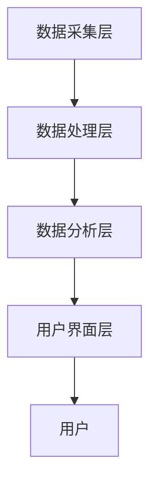
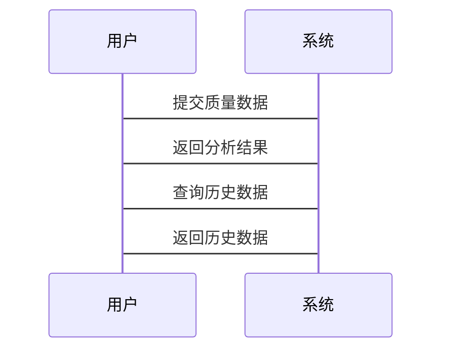

                 


# AI Agent在企业质量管理体系优化中的全面应用

## 关键词：AI Agent, 企业质量管理体系, 人工智能, 质量优化, 数字化转型

## 摘要：本文探讨了AI Agent在企业质量管理体系优化中的应用，从基本概念到核心技术，再到实际应用场景和系统设计，详细分析了AI Agent如何提升质量管理效率和精准度。通过案例分析和系统设计，展示了AI Agent在数字化转型中的巨大潜力。

---

# 第一部分: AI Agent与企业质量管理体系概述

## 第1章: AI Agent与企业质量管理体系概述

### 1.1 AI Agent的基本概念

#### 1.1.1 AI Agent的定义与特点
- **定义**：AI Agent（人工智能代理）是指能够感知环境并自主执行任务的智能实体。
- **特点**：
  1. 智能性：基于数据和算法进行决策。
  2. 自主性：无需人工干预，自主完成任务。
  3. 适应性：能根据环境变化调整行为。
  4. 交互性：与人类或其他系统进行有效沟通。

#### 1.1.2 AI Agent的核心要素
- **感知能力**：通过传感器或数据输入获取环境信息。
- **决策能力**：基于感知信息做出合理决策。
- **执行能力**：通过执行机构或系统接口完成任务。
- **学习能力**：通过机器学习不断优化自身性能。

#### 1.1.3 AI Agent与传统质量管理工具的对比
| 对比维度       | AI Agent                     | 传统质量管理工具               |
|----------------|------------------------------|-------------------------------|
| 数据处理能力   | 强大，支持大数据分析         | 有限，依赖人工整理与分析       |
| 决策能力       | 智能化，基于机器学习         | 依赖人工经验或固定规则         |
| 适应性         | 高，能快速响应变化           | 较低，需要人工调整和优化       |
| 效率           | 高，自动化处理                | 较低，依赖人工操作              |

### 1.2 企业质量管理体系的基本框架

#### 1.2.1 质量管理体系的定义与作用
- **定义**：质量管理体系是指为了实现质量目标而建立的系统、过程和资源的集合。
- **作用**：
  1. 确保产品/服务质量符合标准。
  2. 提高企业效率和客户满意度。
  3. 降低质量成本，提高经济效益。

#### 1.2.2 质量管理体系的核心流程
1. **计划（Plan）**：设定质量目标和计划。
2. **执行（Do）**：实施质量控制措施。
3. **检查（Check）**：监控和评估质量状况。
4. **改进（Act）**：持续优化质量管理体系。

#### 1.2.3 企业质量管理体系的现状与挑战
- **现状**：
  - 依赖人工检查，效率低下。
  - 数据孤岛问题，信息共享困难。
  - 缺乏智能化工具，难以实现预测性质量控制。
- **挑战**：
  - 如何实现数据的智能化分析。
  - 如何确保系统与业务流程的无缝集成。
  - 如何培训员工适应新技术。

### 1.3 AI Agent在质量管理中的应用背景

#### 1.3.1 数字化转型对企业质量管理的影响
- 数字化转型推动企业质量管理从传统模式向智能化模式转变。
- AI Agent作为数字化转型的重要工具，为企业质量管理提供了新的可能性。

#### 1.3.2 AI技术在企业管理中的发展趋势
- AI技术在企业管理中的应用越来越广泛。
- AI Agent作为AI技术的重要应用形式，正在成为企业质量管理的核心工具。

#### 1.3.3 AI Agent在质量管理中的潜力与价值
- **潜力**：
  - 实现质量数据的实时分析。
  - 提供智能化的质量控制建议。
  - 支持预测性质量分析。
- **价值**：
  - 提高质量管理效率。
  - 降低质量成本。
  - 提升客户满意度。

### 1.4 本章小结
本章介绍了AI Agent的基本概念和企业质量管理体系的基本框架，分析了AI Agent在质量管理中的应用背景和潜力，为后续章节奠定了基础。

---

## 第2章: AI Agent的核心原理

### 2.1 AI Agent的基本原理

#### 2.1.1 AI Agent的感知与决策机制
- **感知机制**：通过传感器、数据库或其他输入源获取环境信息。
- **决策机制**：基于感知信息，利用算法和模型做出决策。

#### 2.1.2 AI Agent的核心要素
- **知识表示**：将知识表示为数据结构或模型，以便计算机理解和处理。
- **推理引擎**：基于知识和推理规则，进行逻辑推理。
- **学习算法**：通过机器学习算法不断优化自身的知识和决策能力。

#### 2.1.3 AI Agent的事件驱动与响应机制
- **事件驱动**：AI Agent通过感知环境中的事件（如数据变化、用户请求等）来触发相应的处理逻辑。
- **响应机制**：根据事件类型和优先级，AI Agent快速响应并执行相应的操作。

### 2.2 AI Agent的关键技术

#### 2.2.1 自然语言处理（NLP）
- **技术简介**：NLP用于理解和生成自然语言文本。
- **应用场景**：在质量管理体系中，AI Agent可以通过NLP技术分析客户的反馈或文档，提取有用信息。

#### 2.2.2 机器学习（ML）
- **技术简介**：ML通过数据训练模型，使其能够进行预测或分类。
- **应用场景**：在质量控制中，AI Agent可以利用机器学习模型预测产品质量。

#### 2.2.3 知识图谱与语义理解
- **技术简介**：知识图谱是一种结构化数据表示方式，语义理解是通过语义分析理解文本含义。
- **应用场景**：在质量管理中，AI Agent可以通过知识图谱快速理解产品规格和质量标准。

### 2.3 AI Agent的算法原理

#### 2.3.1 基于规则的推理算法
- **算法简介**：基于规则的推理算法通过预定义的规则进行推理。
- **公式表示**：
  $$ \text{如果 } A \text{ 则 } B $$
  其中，A和B是命题。

#### 2.3.2 基于案例的推理算法
- **算法简介**：基于案例的推理算法通过匹配历史案例进行推理。
- **公式表示**：
  $$ P(B|A) = \frac{P(A|B)P(B)}{P(A)} $$

#### 2.3.3 基于模型的推理算法
- **算法简介**：基于模型的推理算法通过构建逻辑模型进行推理。
- **公式表示**：
  $$ \forall x, P(x) \rightarrow Q(x) $$

### 2.4 AI Agent的数学模型与公式
- **逻辑推理公式**：
  $$ \text{如果 } A \text{ 则 } B $$
- **概率推理公式**：
  $$ P(B|A) = \frac{P(A|B)P(B)}{P(A)} $$

### 2.5 本章小结
本章详细讲解了AI Agent的核心原理，包括感知与决策机制、关键技术以及算法原理，为后续章节的应用提供了理论基础。

---

## 第3章: 企业质量管理体系的理论基础

### 3.1 质量管理体系的PDCA循环

#### 3.1.1 计划（Plan）
- **定义**：制定质量目标和计划。
- **步骤**：
  1. 确定质量目标。
  2. 制定实现目标的计划。

#### 3.1.2 执行（Do）
- **定义**：实施质量控制措施。
- **步骤**：
  1. 按照计划执行质量控制。
  2. 记录执行过程中的数据。

#### 3.1.3 检查（Check）
- **定义**：监控和评估质量状况。
- **步骤**：
  1. 检查执行结果。
  2. 分析检查数据。

#### 3.1.4 处置（Act）
- **定义**：根据检查结果采取相应措施。
- **步骤**：
  1. 分析问题原因。
  2. 采取纠正措施。

### 3.2 企业质量管理体系的核心要素

#### 3.2.1 人员管理
- **定义**：确保质量管理相关人员的培训和能力。
- **关键点**：
  - 培训员工掌握质量管理工具和方法。
  - 明确质量管理职责和权限。

#### 3.2.2 过程管理
- **定义**：优化质量管理过程，确保过程的有效性和效率。
- **关键点**：
  - 确定关键质量控制点。
  - 建立过程监控机制。

#### 3.2.3 信息管理
- **定义**：确保质量信息的准确传递和有效利用。
- **关键点**：
  - 建立统一的信息管理系统。
  - 保证信息的及时性和准确性。

#### 3.2.4 资源管理
- **定义**：合理配置和管理质量管理所需的资源。
- **关键点**：
  - 确保资源的充分性和合理性。
  - 定期评估资源使用效率。

### 3.3 传统质量管理方法的优缺点

#### 3.3.1 优点
- **优点**：
  1. 简单易懂，易于实施。
  2. 适用于小规模或简单的产品质量控制。

#### 3.3.2 缺点
- **缺点**：
  1. 依赖人工检查，效率低。
  2. 数据分析能力有限，难以支持预测性质量控制。
  3. 知识共享和信息传递效率不高。

### 3.4 本章小结
本章介绍了企业质量管理体系的理论基础，重点分析了PDCA循环和质量管理的核心要素，为后续章节的应用提供了理论支持。

---

## 第4章: AI Agent在质量管理中的应用场景

### 4.1 质量数据的智能分析

#### 4.1.1 数据采集与处理
- **数据采集**：通过传感器、数据库等获取质量相关数据。
- **数据处理**：对数据进行清洗、转换和标准化处理。

#### 4.1.2 数据分析与可视化
- **数据分析**：利用机器学习和统计分析方法对数据进行深度分析。
- **数据可视化**：通过图表等形式直观展示数据分析结果。

#### 4.1.3 数据驱动的决策支持
- **决策支持**：基于数据分析结果，提供质量改进的建议和方案。

### 4.2 质量管理流程的优化

#### 4.2.1 自动化质量控制
- **自动化检测**：AI Agent可以通过自动化设备和传感器实时监控产品质量。
- **自动化记录**：自动记录检测结果，减少人工操作。

#### 4.2.2 智能化问题诊断
- **问题诊断**：AI Agent能够快速识别质量问题的根本原因。
- **解决方案推荐**：基于诊断结果，推荐最优的解决方案。

### 4.3 预测性质量分析

#### 4.3.1 质量趋势预测
- **预测方法**：利用时间序列分析、机器学习等方法预测质量趋势。
- **预测结果**：提前发现潜在质量问题，防患于未然。

#### 4.3.2 风险管理
- **风险识别**：识别质量管理中的潜在风险。
- **风险评估**：评估风险的影响程度和发生概率。
- **风险管理策略**：制定应对策略，降低风险影响。

### 4.4 本章小结
本章详细介绍了AI Agent在质量管理中的应用场景，包括质量数据的智能分析、质量管理流程的优化以及预测性质量分析，展示了AI Agent在提升质量管理效率和精准度方面的巨大潜力。

---

## 第5章: 基于AI Agent的企业质量管理系统设计

### 5.1 项目背景与目标
- **项目背景**：传统质量管理方法效率低下，难以适应现代企业的快速发展。
- **项目目标**：构建一个基于AI Agent的企业质量管理系统，实现质量管理的智能化和自动化。

### 5.2 系统功能设计

#### 5.2.1 系统架构设计
- **分层架构**：
  1. **数据采集层**：负责采集质量相关数据。
  2. **数据处理层**：对数据进行清洗和转换。
  3. **数据分析层**：利用机器学习算法进行数据分析。
  4. **用户界面层**：提供友好的人机交互界面。

#### 5.2.2 系统功能模块
- **数据采集模块**：负责采集质量相关数据。
- **数据分析模块**：对数据进行深度分析。
- **决策支持模块**：提供质量改进的建议和方案。
- **风险管理模块**：识别和管理质量管理中的潜在风险。

### 5.3 系统架构设计



### 5.4 系统接口设计
- **数据接口**：与企业现有的数据库和系统进行数据交互。
- **用户接口**：提供友好的用户界面，方便用户操作。

### 5.5 系统交互设计



### 5.6 本章小结
本章详细设计了基于AI Agent的企业质量管理系统，包括系统架构、功能模块、接口设计和交互流程，为后续章节的实现提供了理论基础。

---

## 第6章: 项目实战——基于AI Agent的质量管理系统实现

### 6.1 环境安装与配置

#### 6.1.1 系统环境
- **操作系统**：Linux/Windows/MacOS
- **编程语言**：Python 3.8+
- **开发工具**：PyCharm/VS Code
- **依赖库**：numpy, pandas, scikit-learn, matplotlib

#### 6.1.2 安装步骤
1. 安装Python。
2. 安装所需的依赖库。
3. 配置开发环境。

### 6.2 系统核心实现

#### 6.2.1 数据采集模块实现

```python
import pandas as pd

def collect_data():
    # 从数据库中读取数据
    data = pd.read_sql(...)
    return data
```

#### 6.2.2 数据分析模块实现

```python
from sklearn import linear_model

def analyze_data(data):
    # 数据预处理
    X = data.drop('target', axis=1)
    y = data['target']
    # 训练模型
    model = linear_model.LinearRegression()
    model.fit(X, y)
    return model
```

#### 6.2.3 决策支持模块实现

```python
def generate_recommendation(model):
    # 生成建议
    recommendation = model.predict(...)
    return recommendation
```

### 6.3 代码应用解读与分析
- **数据采集模块**：通过数据库查询获取质量数据。
- **数据分析模块**：利用线性回归模型对数据进行分析。
- **决策支持模块**：基于分析结果生成质量改进建议。

### 6.4 实际案例分析
- **案例背景**：某制造企业希望通过AI Agent优化其质量管理系统。
- **实施过程**：
  1. 数据采集与处理。
  2. 数据分析与建模。
  3. 决策支持与实施。

### 6.5 项目小结
本章通过一个实际案例展示了基于AI Agent的质量管理系统的实现过程，包括环境配置、系统设计、代码实现和案例分析，为读者提供了实践参考。

---

## 第7章: 最佳实践与未来展望

### 7.1 最佳实践

#### 7.1.1 工具选择
- **推荐工具**：选择适合企业需求的AI Agent工具。
- **注意事项**：确保工具的兼容性和可扩展性。

#### 7.1.2 人员培训
- **培训内容**：涵盖AI Agent的基本原理和使用方法。
- **培训方式**：结合理论和实践，提高员工的实际操作能力。

#### 7.1.3 系统维护
- **维护内容**：定期更新系统和模型。
- **维护频率**：根据业务需求和数据变化情况，定期维护。

### 7.2 小结与注意事项

#### 7.2.1 小结
- AI Agent在企业质量管理体系优化中具有重要的应用价值。
- 通过智能化的数据分析和流程优化，能够显著提高质量管理效率和精准度。

#### 7.2.2 注意事项
- **数据隐私**：确保数据的安全和隐私。
- **系统稳定性**：保证系统的稳定运行，避免因系统故障导致质量问题。
- **持续优化**：定期评估系统性能，不断优化系统功能。

### 7.3 未来展望
- **技术发展**：随着AI技术的不断进步，AI Agent在质量管理中的应用将更加广泛和深入。
- **行业趋势**：更多的行业将采用AI Agent优化其质量管理体系。
- **研究方向**：未来的研究将集中在如何进一步提高AI Agent的智能化水平和应用效果。

---

## 作者：AI天才研究院/AI Genius Institute & 禅与计算机程序设计艺术 /Zen And The Art of Computer Programming

---

# 结语
本文详细探讨了AI Agent在企业质量管理体系优化中的全面应用，从基本概念到核心技术，再到实际应用场景和系统设计，全面展示了AI Agent在提升质量管理效率和精准度方面的巨大潜力。通过案例分析和系统设计，本文为读者提供了丰富的实践参考和理论支持。未来，随着AI技术的不断进步，AI Agent在质量管理中的应用将更加广泛和深入，为企业带来更大的价值和竞争优势。

