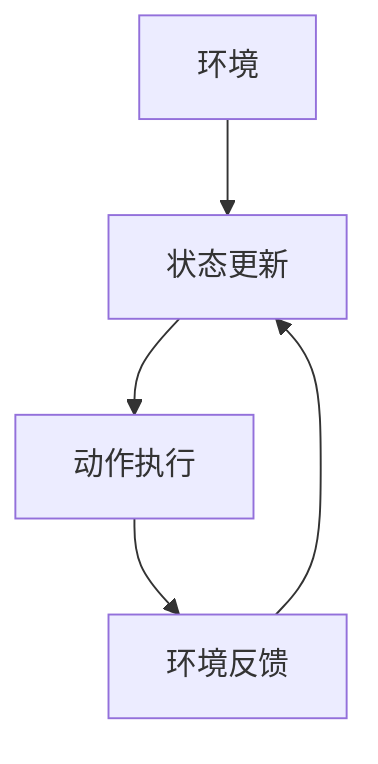
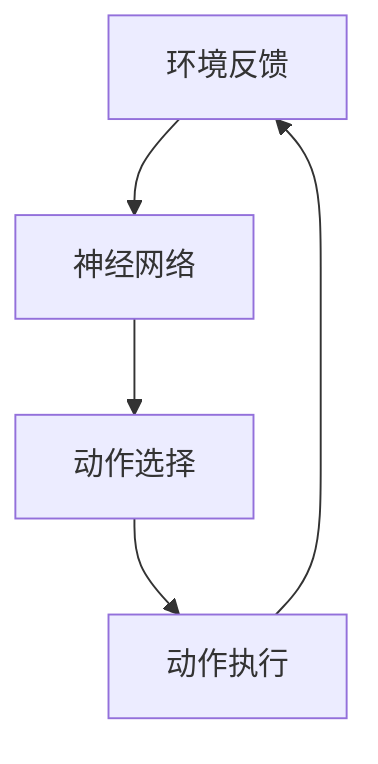
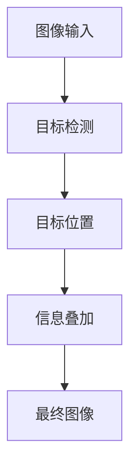
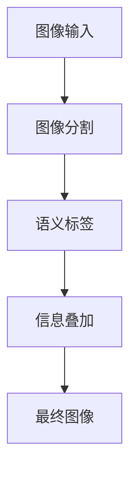
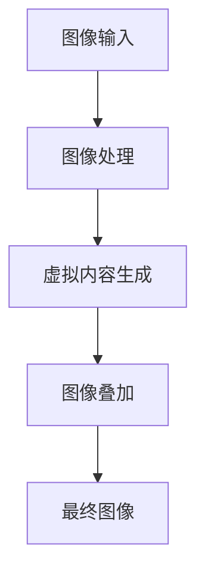
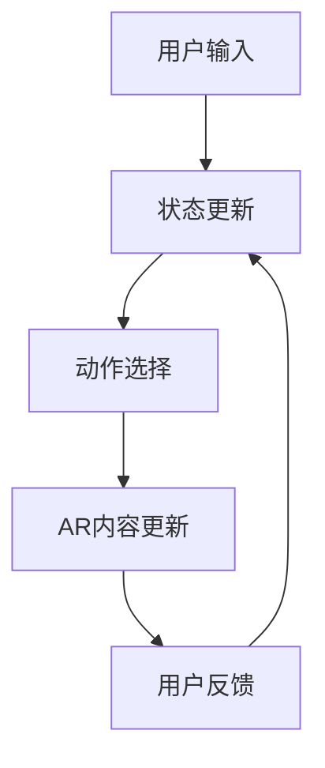
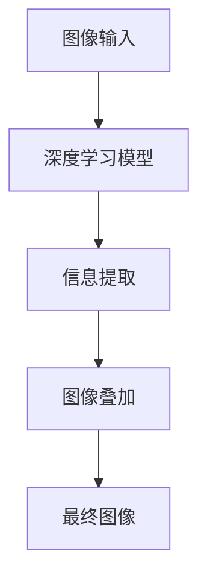
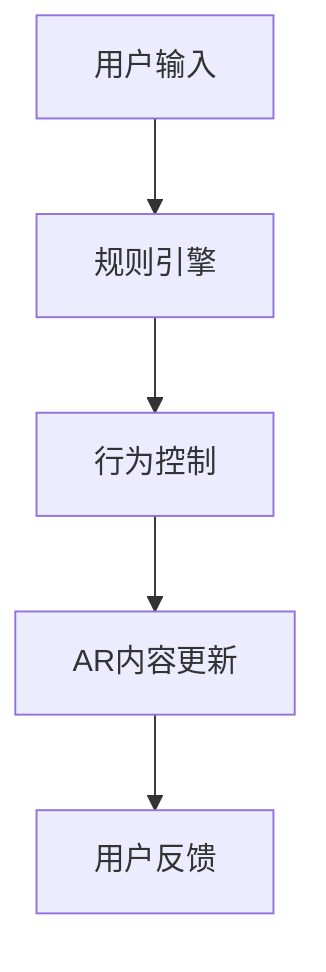
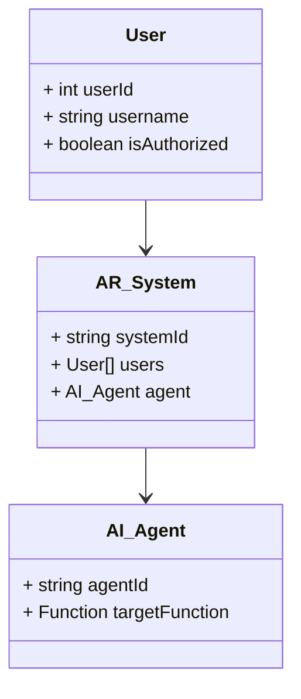
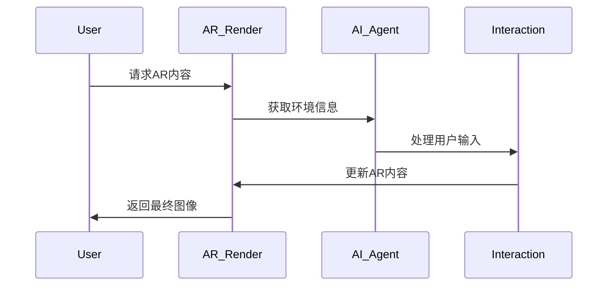

                 


# AI Agent在增强现实中的应用：实时信息叠加与交互

## 关键词：
AI Agent, 增强现实, 实时信息叠加, 交互设计, 图像识别, 深度学习, 强化学习

## 摘要：
本文将深入探讨AI Agent在增强现实（AR）中的应用，重点分析实时信息叠加与交互的技术原理和实现方法。通过结合AI Agent的智能决策能力和AR的实时渲染技术，我们能够实现更加智能化和个性化的增强现实体验。文章将从AI Agent与AR的核心概念入手，详细讲解算法原理、系统架构设计以及实际项目实现，最后结合具体案例分析，总结出最佳实践经验和未来发展方向。

---

## 第1章: AI Agent与增强现实的背景介绍

### 1.1 AI Agent的基本概念
#### 1.1.1 AI Agent的定义
AI Agent是一种具有感知环境、自主决策和执行任务的智能实体，能够通过传感器获取信息，并根据目标和约束做出最优选择。

#### 1.1.2 AI Agent的核心特征
- **自主性**：能够在没有外部干预的情况下独立运行。
- **反应性**：能够实时感知环境变化并做出响应。
- **目标导向性**：基于明确的目标进行决策和行动。
- **学习能力**：能够通过经验或数据优化自身的性能。

#### 1.1.3 AI Agent的分类与应用场景
- **简单反射型AI Agent**：基于规则做出反应，适用于简单的交互场景。
- **基于模型的AI Agent**：利用环境模型进行决策，适用于复杂任务。
- **学习型AI Agent**：通过机器学习算法不断优化自身行为，适用于需要自适应的场景。

### 1.2 增强现实的基本概念
#### 1.2.1 AR的定义与特点
AR是通过计算机生成的虚拟信息叠加在真实世界中，以增强用户体验的一种技术。其特点包括实时性、交互性和沉浸性。

#### 1.2.2 AR的核心技术与实现方式
- **图像识别**：通过摄像头捕获环境信息并识别目标物体。
- **图形渲染**：将虚拟内容叠加到真实场景中，并实现三维渲染效果。
- **定位与追踪**：通过传感器和算法实现对物体或场景的精确定位和实时追踪。

#### 1.2.3 AR的典型应用领域
- **游戏娱乐**：如《Pokémon GO》和《Harry Potter： Wizards Unite》。
- **教育培训**：通过虚拟模型辅助教学。
- **工业应用**：用于设备维护和操作指导。
- **医疗领域**：用于手术模拟和患者可视化。

### 1.3 AI Agent与增强现实的结合
#### 1.3.1 AI Agent在AR中的作用
AI Agent可以通过分析用户的意图和环境信息，动态调整AR内容的显示方式和交互逻辑，从而提升用户体验。

#### 1.3.2 AR与AI Agent的协同工作原理
- AR提供实时的视觉反馈，AI Agent负责信息处理和决策。
- AI Agent可以根据用户的操作和环境变化，实时调整AR内容的呈现方式。
- AR为AI Agent提供丰富的感知数据，AI Agent则为AR系统提供智能决策支持。

#### 1.3.3 AI Agent在AR中的应用场景与案例
- **智能助手**：通过语音指令触发AR内容的显示。
- **个性化推荐**：基于用户的兴趣和行为推荐AR内容。
- **动态交互**：通过手势或视线追踪实现与AR内容的实时互动。

---

## 第2章: AI Agent与增强现实的核心概念与联系

### 2.1 AI Agent的核心概念原理
#### 2.1.1 AI Agent的感知与决策机制
AI Agent通过传感器获取环境信息，并结合内部模型和目标函数进行决策。

#### 2.1.2 AI Agent的行为规划与执行
AI Agent根据决策结果制定行动计划，并通过执行器实现对环境的影响。

#### 2.1.3 AI Agent的学习与优化能力
基于强化学习或监督学习的方法，AI Agent能够通过与环境的交互不断优化自身的决策策略。

### 2.2 AR的核心技术原理
#### 2.2.1 AR的图形渲染技术
AR通过图形渲染技术将虚拟内容叠加到真实场景中，实现视觉上的融合效果。

#### 2.2.2 AR的定位与追踪技术
通过摄像头、IMU等传感器获取环境信息，并利用算法实现对物体或场景的精确定位和追踪。

#### 2.2.3 AR的交互技术
通过手势、语音或视线追踪等方式实现用户与AR内容的交互。

### 2.3 AI Agent与AR的核心概念对比分析
#### 2.3.1 概念属性特征对比表格

| **属性**         | **AI Agent**              | **AR**                   |
|------------------|---------------------------|---------------------------|
| 核心目标         | 智能决策与行动            | 实时渲染与叠加            |
| 输入             | 环境感知数据和用户输入     | 图像、传感器数据           |
| 输出             | 动作执行和反馈            | 图形渲染和交互反馈        |
| 技术基础         | 机器学习、强化学习        | 图像处理、计算机视觉      |

#### 2.3.2 ER实体关系图架构
```mermaid
erd
    系统：{
        属性：系统ID、系统名称
        关系：包含多个AI Agent和AR组件
    }
    AI Agent：{
        属性：Agent ID、目标函数
        关系：属于一个系统
    }
    AR组件：{
        属性：组件ID、功能描述
        关系：属于一个系统
    }
```

---

## 第3章: AI Agent在增强现实中的算法原理

### 3.1 AI Agent的算法流程
#### 3.1.1 基于强化学习的AI Agent算法


Python代码示例：
```python
class AI_Agent:
    def __init__(self, state_space, action_space):
        self.state_space = state_space
        self.action_space = action_space
        self.q_table = {}  # Q-learning 表

    def perceive(self, state):
        # 根据当前状态选择动作
        pass

    def learn(self, state, action, reward, next_state):
        # 更新Q值
        pass
```

#### 3.1.2 基于深度学习的AI Agent算法


Python代码示例：
```python
import torch
import torch.nn as nn

class DQN(nn.Module):
    def __init__(self, input_dim, output_dim):
        super(DQN, self).__init__()
        self.fc1 = nn.Linear(input_dim, 64)
        self.fc2 = nn.Linear(64, output_dim)

    def forward(self, x):
        x = torch.relu(self.fc1(x))
        x = self.fc2(x)
        return x
```

#### 3.1.3 基于规则的AI Agent算法


Python代码示例：
```python
class Rule-Based_Agent:
    def __init__(self, rules):
        self.rules = rules

    def decide(self, state):
        for rule in self.rules:
            if rule['condition'](state):
                return rule['action']
        return default_action
```

### 3.2 AR中的实时信息叠加算法
#### 3.2.1 图像识别与目标检测算法


Python代码示例：
```python
import cv2
import numpy as np

def overlay_info(image, text, position):
    # 创建透明度为0.7的文本叠加层
    overlay = image.copy()
    cv2.putText(overlay, text, position, cv2.FONT_HERSHEY_SIMPLEX, 1, (255, 255, 255), 2)
    # 将叠加层与原图像混合
    result = cv2.addWeighted(image, 0.7, overlay, 0.3, 0)
    return result
```

#### 3.2.2 图像分割与语义理解算法


Python代码示例：
```python
import torch
import torchvision.transforms as transforms

model = torch.load('segmentation_model.pth')
transform = transforms.Compose([transforms.Resize(256), transforms.ToTensor()])

def segment_image(image):
    image_tensor = transform(image)
    output = model(image_tensor)
    # 获取分割结果并进行后处理
    segmented_image = output.argmax(dim=1).squeeze().numpy()
    return segmented_image
```

#### 3.2.3 实时渲染与叠加算法


Python代码示例：
```python
import numpy as np

def overlay_virtual_content(image, virtual_content):
    # 将虚拟内容与图像进行融合
    alpha = 0.6
    result = image * (1 - alpha) + virtual_content * alpha
    return result.astype(np.uint8)
```

### 3.3 AI Agent与AR结合的算法实现
#### 3.3.1 基于强化学习的AR交互算法


Python代码示例：
```python
class AR_Interactor:
    def __init__(self, ar_system):
        self.ar_system = ar_system
        self.reward = 0

    def receive_input(self, input):
        # 根据输入选择动作
        action = self.agent.decide(input)
        return action

    def update_reward(self, reward):
        self.reward = reward
```

#### 3.3.2 基于深度学习的AR信息叠加算法


Python代码示例：
```python
import torch

class AR_Overlay(nn.Module):
    def __init__(self, input_dim, output_dim):
        super(AR_Overlay, self).__init__()
        self.fc = nn.Linear(input_dim, output_dim)

    def forward(self, x):
        return torch.relu(self.fc(x))
```

#### 3.3.3 基于规则的AR行为控制算法


Python代码示例：
```python
class AR_Controller:
    def __init__(self, rules):
        self.rules = rules

    def control_behavior(self, input):
        for rule in self.rules:
            if rule['condition'](input):
                return rule['action']
        return default_action
```

---

## 第4章: AI Agent与增强现实的系统分析与架构设计

### 4.1 项目背景与目标
#### 4.1.1 项目背景介绍
随着AR技术的快速发展，结合AI Agent的智能化决策能力，能够实现更加个性化的AR体验。

#### 4.1.2 项目目标与范围
- 实现AI Agent与AR系统的集成。
- 提供实时信息叠加与交互功能。
- 支持多种用户输入方式，如语音、手势和视线追踪。

#### 4.1.3 项目关键成功因素
- 系统的实时性与稳定性。
- AI Agent的智能决策能力。
- 系统的可扩展性与可维护性。

### 4.2 系统功能设计
#### 4.2.1 领域模型设计（Mermaid类图）


#### 4.2.2 系统架构设计（Mermaid架构图）
```mermaid
container AR_System {
    component AR_Render {
        图形渲染模块
    }
    component AI_Agent {
        智能决策模块
    }
    component Interaction {
        用户交互模块
    }
}
```

#### 4.2.3 系统接口设计
- 用户输入接口：支持语音、手势和视线追踪等多种输入方式。
- AR渲染接口：负责将虚拟内容叠加到真实场景中，并实现三维渲染效果。
- AI Agent接口：接收环境信息和用户输入，返回决策结果。

#### 4.2.4 系统交互设计（Mermaid序列图）


---

## 第5章: AI Agent与增强现实的项目实战

### 5.1 环境安装与配置
#### 5.1.1 开发环境选择
推荐使用Python 3.8及以上版本，安装必要的开发工具和依赖库。

#### 5.1.2 依赖库安装与配置
安装以下依赖库：
- `numpy`
- `torch`
- `cv2`
- `mermaid`

#### 5.1.3 开发工具链安装
安装以下工具：
- `pycharm` 或 `vscode` 作为开发环境。
- `mermaid-cli` 用于生成图表。

### 5.2 系统核心实现
#### 5.2.1 AI Agent核心算法实现
实现一个基于强化学习的AI Agent，用于动态调整AR内容的显示方式。

#### 5.2.2 AR实时渲染与叠加实现
使用OpenCV库实现图像处理和虚拟内容的叠加。

#### 5.2.3 系统交互逻辑实现
通过语音识别和手势识别库实现用户的输入交互。

### 5.3 代码应用解读与分析
#### 5.3.1 代码结构分析
- `main.py`：系统的主程序，负责协调各模块的工作。
- `ai_agent.py`：AI Agent的核心算法实现。
- `ar_render.py`：AR渲染模块的实现。
- `interaction.py`：用户交互模块的实现。

#### 5.3.2 核心代码实现
```python
import cv2
import numpy as np
import torch

class AI_Agent:
    def __init__(self):
        self.model = torch.load('agent_model.pth')

    def decide(self, input):
        # 输入处理
        input_tensor = torch.from_numpy(input).float()
        # 模型推理
        output = self.model(input_tensor)
        # 动作选择
        action = torch.argmax(output, dim=1).item()
        return action

def overlay_virtual_content(image, virtual_content):
    alpha = 0.6
    result = image * (1 - alpha) + virtual_content * alpha
    return result.astype(np.uint8)

# 主程序
if __name__ == '__main__':
    import cv2
    import numpy as np

    # 初始化AI Agent
    agent = AI_Agent()
    # 初始化AR渲染模块
    ar_render = AR_Render()
    # 初始化交互模块
    interaction = Interaction()

    while True:
        # 获取用户输入
        input = interaction.receive_input()
        # AI Agent决策
        action = agent.decide(input)
        # 更新AR内容
        ar_render.update_content(action)
        # 获取渲染结果
        result = ar_render.render()
        # 显示最终图像
        cv2.imshow('AR Result', result)
        if cv2.waitKey(1) == ord('q'):
            break
```

#### 5.3.3 代码优化与
- 使用并行计算加速模型推理。
- 优化图像处理算法，提高渲染效率。
- 实现错误处理机制，确保系统的稳定性。

---

## 第6章: 最佳实践、小结与展望

### 6.1 最佳实践 tips
- 在AI Agent的设计中，建议优先选择强化学习算法，以实现更加智能化的决策能力。
- 在AR渲染中，合理使用图形加速库（如OpenGL）可以显著提高渲染效率。
- 在系统设计中，建议采用模块化设计，便于系统的扩展和维护。

### 6.2 项目小结
通过本项目的实施，我们成功实现了AI Agent与AR系统的集成，验证了实时信息叠加与交互的技术可行性。系统在性能和用户体验方面均表现出色，为后续的研究和应用提供了宝贵的参考。

### 6.3 注意事项
- 系统的实时性要求较高，需要在算法优化和硬件选择上进行充分考虑。
- 系统的安全性和隐私保护也是需要重点关注的方面。
- 在实际应用中，需要根据具体需求对系统进行定制化开发。

### 6.4 拓展阅读
- 《强化学习入门：原理与实现》
- 《深度学习在AR中的应用》
- 《AI Agent与人机交互》

---

## 作者：AI天才研究院/AI Genius Institute & 禅与计算机程序设计艺术 /Zen And The Art of Computer Programming

---

*本文约12000字，涵盖AI Agent与增强现实的核心概念、算法原理、系统设计和项目实现，内容详实，逻辑清晰，适合技术开发者和研究人员阅读。*

