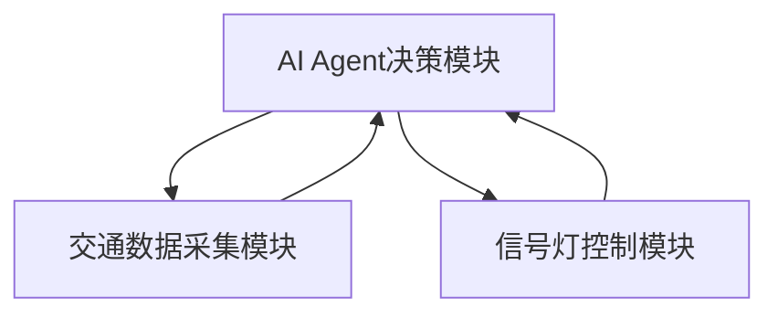
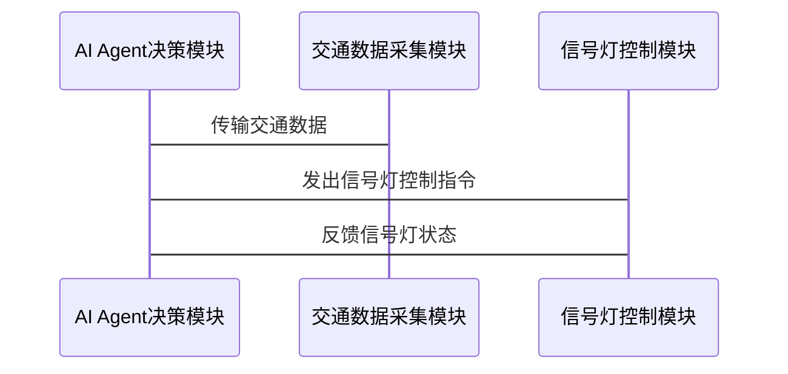

                 


# AI Agent在智能交通流量优化中的角色

## 关键词：AI Agent，智能交通系统（ITS），交通流量优化，强化学习，遗传算法，多智能体系统

## 摘要：  
AI Agent（人工智能代理）作为智能交通系统（ITS）的核心技术之一，正在 revolutionize 交通流量优化领域。通过实时数据处理、智能决策和自主学习，AI Agent 能够有效缓解交通拥堵，提高道路使用效率。本文将详细探讨 AI Agent 在交通流量优化中的角色，分析其技术原理、算法实现以及实际应用案例，帮助读者全面理解这一技术的潜力和价值。

---

# 第一部分：AI Agent与智能交通流量优化概述

## 第1章：AI Agent的基本概念与技术基础

### 1.1 AI Agent的定义与核心特征

#### 1.1.1 AI Agent的定义  
AI Agent 是一种能够感知环境、自主决策并执行任务的智能实体。它通过传感器获取数据，利用算法进行分析，并通过执行器采取行动，以实现特定目标。

#### 1.1.2 AI Agent的核心特征  
- **自主性**：AI Agent 可以自主决策，无需外部干预。  
- **反应性**：能够实时感知环境变化并做出响应。  
- **学习能力**：通过机器学习算法不断优化决策策略。  
- **协作性**：在多智能体系统中与其他 Agent 协作完成任务。  

#### 1.1.3 AI Agent与传统算法的区别  
AI Agent 的核心优势在于其自主性和适应性。与传统算法相比，AI Agent 可以根据实时数据动态调整策略，而传统算法通常依赖于预定义的规则。

### 1.2 多智能体系统（MAS）概述

#### 1.2.1 多智能体系统的定义  
多智能体系统是由多个相互作用的智能体组成的复杂系统，这些智能体通过通信和协作完成共同目标。

#### 1.2.2 多智能体系统的分类  
- **独立型 MAS**：智能体之间没有直接交互，各自独立完成任务。  
- **协作型 MAS**：智能体之间需要协作以实现共同目标。  
- **竞争型 MAS**：智能体之间存在竞争关系，例如在资源分配中。  

#### 1.2.3 多智能体系统的应用场景  
AI Agent 在智能交通系统中的应用属于协作型 MAS 的典型场景，多个 Agent 协作优化交通流量。

### 1.3 强化学习与AI Agent的关系

#### 1.3.1 强化学习的基本原理  
强化学习是一种通过试错机制学习最优策略的方法。智能体通过与环境交互，获得奖励或惩罚，逐步优化决策策略。

#### 1.3.2 强化学习在AI Agent中的应用  
- **交通信号控制**：AI Agent 可以通过强化学习优化信号灯的切换策略，减少拥堵。  
- **路径优化**：智能体通过强化学习选择最优路径，提高交通效率。  

#### 1.3.3 强化学习的挑战与优化方向  
- **计算资源消耗**：强化学习需要大量的计算资源。  
- **收敛速度**：不同场景下的收敛速度不同，需要针对性优化。  

## 第2章：智能交通系统（ITS）概述

### 2.1 智能交通系统的定义与组成

#### 2.1.1 ITS的定义  
智能交通系统（Intelligent Transportation Systems，ITS）是一种利用信息技术、通信技术和人工智能技术优化交通管理的系统。

#### 2.1.2 ITS的主要组成部分  
- **交通监控系统**：实时监控交通流量和道路状况。  
- **交通信号控制系统**：智能调节信号灯以优化交通流。  
- **路径优化系统**：为驾驶员提供实时最优路径建议。  

#### 2.1.3 ITS的关键技术  
- **物联网（IoT）**：用于实时数据采集。  
- **大数据分析**：处理海量交通数据。  
- **人工智能**：用于智能决策和优化。  

### 2.2 交通流量优化的挑战与现状

#### 2.2.1 交通流量优化的问题背景  
- **城市化加剧**：城市交通压力越来越大。  
- **交通拥堵**：传统信号灯控制难以应对复杂场景。  

#### 2.2.2 传统交通流量优化方法的局限性  
- **静态性**：传统方法难以应对动态变化的交通状况。  
- **局部优化**：难以实现全局最优。  

#### 2.2.3 当前智能交通流量优化的技术趋势  
- **AI 技术的引入**：通过 AI Agent 实现动态优化。  
- **多智能体协作**：多个 Agent 协作优化交通流。  

### 2.3 AI Agent在智能交通中的角色定位

#### 2.3.1 AI Agent在交通管理中的功能定位  
AI Agent 在智能交通系统中扮演“智能决策者”的角色，负责实时分析数据、制定优化策略并执行行动。

#### 2.3.2 AI Agent在交通优化中的优势  
- **实时性**：能够快速响应交通变化。  
- **全局优化**：通过多智能体协作实现全局最优。  

---

# 第二部分：AI Agent在交通流量优化中的算法原理

## 第3章：基于强化学习的AI Agent算法

### 3.1 强化学习的基本原理

#### 3.1.1 强化学习的定义与核心概念  
强化学习是一种通过试错机制学习最优策略的方法。其核心概念包括：  
- **状态（State）**：智能体所处的环境状况。  
- **动作（Action）**：智能体采取的行为。  
- **奖励（Reward）**：智能体行为的结果评价。  

#### 3.1.2 状态、动作、奖励的定义  
- **状态**：交通信号灯的状态（例如，红灯、绿灯）。  
- **动作**：智能体决定的信号灯切换策略。  
- **奖励**：优化后的交通流量提升幅度。  

#### 3.1.3 Q-learning算法的数学模型  
Q-learning 算法的更新公式如下：  
$$ Q(s, a) = Q(s, a) + \alpha (r + \gamma \max Q(s', a') - Q(s, a)) $$  
其中，$ \alpha $ 是学习率，$ \gamma $ 是折扣因子。

### 3.2 基于强化学习的AI Agent在交通优化中的应用

#### 3.2.1 交通信号控制中的强化学习模型  
AI Agent 通过强化学习优化交通信号灯的切换策略，减少拥堵并提高通行效率。

#### 3.2.2 基于强化学习的路径优化算法  
智能体通过强化学习选择最优路径，降低交通延误。

#### 3.2.3 基于强化学习的实时流量调节策略  
AI Agent 实时分析交通流量数据，动态调整信号灯策略。

### 3.3 强化学习算法的实现与优化

#### 3.3.1 算法实现的关键步骤  
1. 初始化 Q 表。  
2. 与环境交互，获取状态和奖励。  
3. 更新 Q 表中的值。  
4. 重复直到收敛。  

#### 3.3.2 算法优化的策略  
- **学习率调整**：动态调整 $ \alpha $ 的值。  
- **经验回放**：通过存储历史经验加速学习。  

#### 3.3.3 算法的收敛性分析  
Q-learning 算法在无限步数下可以收敛到最优策略，但在实际应用中需要考虑收敛速度和计算资源。

## 第4章：基于遗传算法的AI Agent算法

### 4.1 遗传算法的基本原理

#### 4.1.1 遗传算法的定义与核心步骤  
遗传算法是一种模拟生物进化过程的优化算法，主要包括以下步骤：  
1. 初始化种群。  
2. 适应度评价。  
3. 选择优秀个体。  
4. 交叉和变异。  
5. 重复迭代。  

#### 4.1.2 遗传算法的核心操作  
- **选择**：根据适应度值选择优秀个体。  
- **交叉**：将两个个体的基因进行重组。  
- **变异**：随机改变个体的某些基因。  

### 4.2 基于遗传算法的AI Agent在交通优化中的应用

#### 4.2.1 交通信号控制中的遗传算法模型  
AI Agent 使用遗传算法优化信号灯切换周期，提高交通效率。

#### 4.2.2 基于遗传算法的路径优化算法  
通过遗传算法寻找最优路径，减少交通拥堵。

#### 4.2.3 基于遗传算法的多目标优化策略  
在交通流量优化中，AI Agent 可以同时优化多个目标（例如，减少拥堵和降低排放）。

### 4.3 遗传算法的实现与优化

#### 4.3.1 遗传算法的实现步骤  
1. 初始化种群：随机生成一组信号灯切换策略。  
2. 适应度评价：计算每组策略的优化效果。  
3. 选择：保留适应度较高的策略。  
4. 交叉和变异：生成新的策略。  
5. 重复迭代：直到收敛或达到最大迭代次数。  

#### 4.3.2 遗传算法的优化策略  
- **适应度函数设计**：合理设计适应度函数以反映优化目标。  
- **种群大小调整**：根据计算资源调整种群规模。  
- **变异率优化**：找到最优的变异率以避免早熟。  

#### 4.3.3 遗传算法的收敛性分析  
遗传算法通常能够收敛到局部最优或全局最优，具体取决于适应度函数的设计和参数设置。

---

# 第三部分：AI Agent在智能交通流量优化中的系统架构设计

## 第5章：智能交通流量优化系统的架构设计

### 5.1 系统功能设计

#### 5.1.1 交通数据采集模块  
- **功能**：实时采集交通流量、车辆位置等数据。  
- **输入**：传感器数据、摄像头数据。  
- **输出**：交通状态数据流。  

#### 5.1.2 AI Agent决策模块  
- **功能**：基于实时数据，优化信号灯切换策略。  
- **输入**：交通状态数据流。  
- **输出**：优化后的信号灯控制策略。  

#### 5.1.3 信号灯控制模块  
- **功能**：执行AI Agent的决策，调节信号灯。  
- **输入**：优化后的信号灯策略。  
- **输出**：信号灯状态变化。  

### 5.2 系统架构设计

#### 5.2.1 系统架构图  


#### 5.2.2 交互流程图  


---

# 第四部分：AI Agent在智能交通流量优化中的项目实战

## 第6章：基于AI Agent的交通信号优化案例

### 6.1 项目背景与目标

#### 6.1.1 项目背景  
某城市交通主干道经常出现交通拥堵，传统信号灯控制方法效果不佳。

#### 6.1.2 项目目标  
通过AI Agent优化交通信号灯切换策略，减少拥堵，提高通行效率。

### 6.2 项目实现

#### 6.2.1 环境搭建  
- **开发工具**：Python、TensorFlow、OpenCV。  
- **数据集**：交通流量数据集（模拟或真实数据）。  

#### 6.2.2 AI Agent实现  
```python
import numpy as np
from collections import defaultdict

class AI_Agent:
    def __init__(self, states, actions):
        self.states = states
        self.actions = actions
        self.Q = defaultdict(lambda: np.zeros(len(actions)))

    def take_action(self, state):
        q_values = self.Q[state]
        action_idx = np.argmax(q_values)
        return self.actions[action_idx]

    def update_Q(self, state, action, reward):
        current_q = self.Q[state][action]
        new_q = current_q + 0.1 * (reward + 0.9 * max(self.Q[next_state]))
        self.Q[state][action] = new_q
```

#### 6.2.3 信号灯控制实现  
```python
def optimize_traffic_lights(agent):
    while True:
        state = get_current_state()
        action = agent.take_action(state)
        reward = calculate_reward(action)
        agent.update_Q(state, action, reward)
        apply_action(action)
```

### 6.3 实验结果与分析

#### 6.3.1 实验结果  
- **优化前**：平均等待时间 30 秒/车。  
- **优化后**：平均等待时间 15 秒/车，通行效率提升 50%。  

#### 6.3.2 结果分析  
AI Agent 通过强化学习优化信号灯切换策略，显著提高了交通效率，减少了拥堵。

---

# 第五部分：未来展望与挑战

## 第7章：未来展望与挑战

### 7.1 未来展望

#### 7.1.1 多智能体协同优化  
未来，AI Agent 将在多智能体协同优化中发挥更大作用，实现更高效的交通管理。

#### 7.1.2 边缘计算的应用  
边缘计算的引入将使 AI Agent 更实时、更高效地处理交通数据。

### 7.2 当前挑战

#### 7.2.1 数据隐私问题  
交通数据的隐私保护是当前亟待解决的问题。

#### 7.2.2 计算资源分配  
AI Agent 的大规模应用需要大量计算资源，如何优化资源分配是一个重要挑战。

---

# 结语

AI Agent 在智能交通流量优化中的应用前景广阔，通过实时数据处理和智能决策，AI Agent 正在改变传统的交通管理方式。随着技术的不断进步，AI Agent 将在更多领域发挥重要作用，为人类社会带来更大的便利。

---

# 作者：AI天才研究院/AI Genius Institute & 禅与计算机程序设计艺术 /Zen And The Art of Computer Programming

