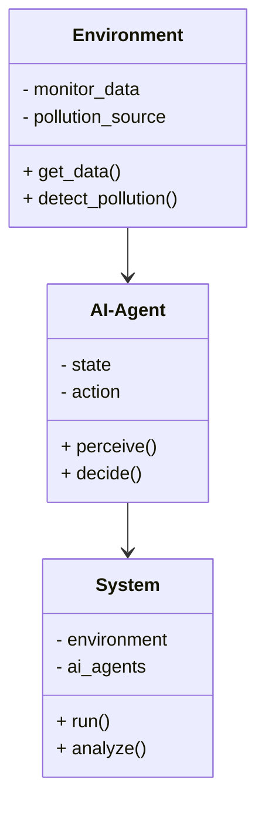
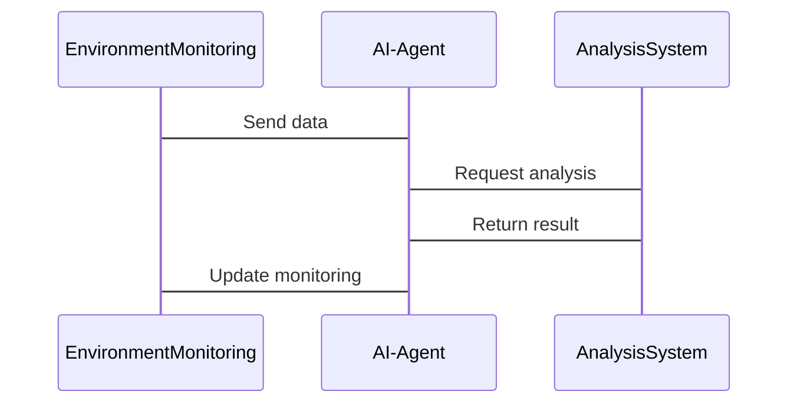

                 


# AI Agent在智能环境污染源追踪中的实践

**关键词**：AI Agent、环境污染源追踪、强化学习、图神经网络、多智能体系统

**摘要**：  
本文探讨了AI Agent在智能环境污染源追踪中的应用，重点分析了AI Agent的基本概念、核心原理以及在环境污染源追踪中的实践应用。通过结合强化学习和图神经网络，本文详细阐述了AI Agent在环境污染监测、污染源识别和污染治理中的技术优势，并通过实际案例展示了其在环境污染源追踪中的实践价值。文章还探讨了AI Agent在环境污染源追踪中的系统架构设计、算法实现和项目实战，为读者提供了全面的技术视角。

---

## 第一章: AI Agent的基本概念与应用背景

### 1.1 AI Agent的定义与特点

#### 1.1.1 什么是AI Agent
AI Agent（人工智能代理）是指能够感知环境、自主决策并执行任务的智能体。它能够根据环境反馈调整行为，以实现特定目标。AI Agent的核心特点包括：

1. **自主性**：AI Agent能够在没有外部干预的情况下自主运行。
2. **反应性**：AI Agent能够实时感知环境变化并做出反应。
3. **目标导向性**：AI Agent的行为以实现特定目标为导向。
4. **学习能力**：AI Agent能够通过学习优化自身行为。

#### 1.1.2 AI Agent的核心特点
与传统AI相比，AI Agent具有以下特点：
- **动态性**：能够适应动态变化的环境。
- **交互性**：能够与其他AI Agent或人类进行交互。
- **分布式**：AI Agent可以是分布式系统的一部分。

#### 1.1.3 AI Agent与传统AI的区别
| 特性             | 传统AI                | AI Agent          |
|------------------|-----------------------|-------------------|
| 行为方式         | 基于规则或模型         | 自主决策           |
| 环境感知能力     | 有限或无感知           | 强大感知能力       |
| 任务执行         | 单任务或静态任务       | 多任务或动态任务   |

### 1.2 环境污染源追踪的背景与挑战

#### 1.2.1 环境污染的定义与分类
环境污染是指人类活动或自然过程导致的环境质量下降，影响生态和人类健康的现象。常见的环境污染类型包括：
- **空气污染**：如PM2.5、二氧化硫等。
- **水污染**：如工业废水、农药残留等。
- **土壤污染**：如重金属污染、有机污染物等。

#### 1.2.2 环境污染源追踪的重要性
环境污染源追踪是环境保护的重要环节，能够帮助我们找到污染的源头，采取有效措施进行治理。其重要性体现在：
- **精准治理**：通过识别污染源，可以采取针对性措施。
- **责任追究**：为环境污染事件提供法律依据。
- **预防污染**：通过分析污染源，可以提前采取预防措施。

#### 1.2.3 当前环境污染源追踪的主要挑战
环境污染源追踪面临以下挑战：
- **数据复杂性**：污染数据来源多样，且具有时空动态性。
- **因果关系复杂**：污染源与污染结果之间可能存在复杂的关系。
- **数据不足**：在某些情况下，污染数据可能不足，导致难以准确定位污染源。

### 1.3 AI Agent在环境污染源追踪中的作用

#### 1.3.1 AI Agent在环境监测中的应用
AI Agent可以通过传感器网络实时收集环境数据，如空气质量、水质数据等，并通过分析这些数据发现潜在的污染源。

#### 1.3.2 AI Agent在污染源识别中的优势
AI Agent能够通过强化学习和图神经网络等技术，从海量数据中识别出污染源，并预测污染扩散趋势。

#### 1.3.3 AI Agent在环境污染治理中的潜在价值
AI Agent可以通过优化治理策略，帮助制定高效的污染治理方案，并实时监控治理效果。

---

## 第二章: AI Agent的核心概念与原理

### 2.1 多智能体系统（Multi-Agent System）

#### 2.1.1 多智能体系统的定义
多智能体系统是指由多个智能体组成的协作系统，这些智能体可以独立决策并协同完成任务。

#### 2.1.2 多智能体系统的组成部分
- **智能体**：能够感知环境并采取行动的个体。
- **通信协议**：智能体之间的通信规则。
- **协作机制**：智能体之间的协作策略。

#### 2.1.3 多智能体系统与单智能体系统的对比
| 特性             | 单智能体系统           | 多智能体系统         |
|------------------|-----------------------|---------------------|
| 系统复杂性       | 简单                   | 复杂                 |
| 决策能力         | 集中决策               | 分散决策             |
| 任务处理         | 单任务                 | 多任务               |

### 2.2 强化学习在AI Agent中的应用

#### 2.2.1 强化学习的基本原理
强化学习是一种机器学习方法，通过智能体与环境的交互，学习最优策略以最大化累积奖励。

#### 2.2.2 强化学习在AI Agent决策中的作用
强化学习可以帮助AI Agent在复杂环境中做出最优决策，例如在环境污染源追踪中选择最优的监测点。

#### 2.2.3 强化学习与监督学习的区别
| 特性             | 监督学习               | 强化学习             |
|------------------|-----------------------|---------------------|
| 数据来源         | 标签数据               | 环境反馈             |
| 学习目标         | 模拟真实场景             | 实际任务             |

### 2.3 图神经网络在环境污染源追踪中的应用

#### 2.3.1 图神经网络的基本原理
图神经网络是一种处理图结构数据的深度学习方法，能够捕捉数据之间的关系。

#### 2.3.2 图神经网络在环境污染源追踪中的优势
图神经网络可以将污染源、环境监测点等信息建模为图结构，从而更好地分析污染传播路径。

#### 2.3.3 图神经网络与传统神经网络的对比
| 特性             | 传统神经网络           | 图神经网络           |
|------------------|-----------------------|---------------------|
| 数据结构         | 向量或矩阵               | 图结构               |
| 处理能力         | 无法捕捉关系           | 能捕捉复杂关系       |

---

## 第三章: 基于强化学习的AI Agent算法

### 3.1 强化学习的基本原理

#### 3.1.1 状态空间与动作空间的定义
- **状态空间**：智能体所处环境的所有可能状态。
- **动作空间**：智能体在每个状态下可以执行的所有动作。

#### 3.1.2 奖励机制的设计
奖励机制是强化学习的核心，通过设计合理的奖励函数，引导智能体学习期望的行为。

#### 3.1.3 策略函数与价值函数的定义
- **策略函数**：将状态映射到动作的函数。
- **价值函数**：评估某个状态或动作的价值。

### 3.2 基于强化学习的污染源追踪算法

#### 3.2.1 算法的输入与输出
- **输入**：环境监测数据、污染源信息。
- **输出**：污染源定位结果、污染扩散预测。

#### 3.2.2 算法的步骤分解
1. 初始化智能体状态。
2. 智能体感知环境并选择动作。
3. 执行动作并获得奖励。
4. 更新策略函数或价值函数。

#### 3.2.3 算法的数学模型
$$ Q(s, a) = Q(s, a) + \alpha (r + \gamma \max Q(s', a') - Q(s, a)) $$
其中，$Q$ 是价值函数，$s$ 是状态，$a$ 是动作，$\alpha$ 是学习率，$\gamma$ 是折扣因子。

### 3.3 算法实现的Python代码示例

```python
class AI-Agent:
    def __init__(self, state_space, action_space):
        self.state_space = state_space
        self.action_space = action_space
        self.Q = defaultdict(int)

    def perceive(self, state):
        # 返回当前状态下的动作
        return self.Q[state]

    def learn(self, state, action, reward, next_state):
        # 更新Q值
        self.Q[state] += reward + self.gamma * max(self.Q[next_state])
```

---

## 第四章: 基于图神经网络的污染源追踪算法

### 4.1 图神经网络的基本原理

#### 4.1.1 图的表示与节点特征
图神经网络将环境监测数据建模为图结构，节点代表监测点，边代表节点之间的关系。

#### 4.1.2 图卷积操作的数学公式
$$ GCN(x) = \theta (A x + x) $$
其中，$A$ 是邻接矩阵，$x$ 是节点特征，$\theta$ 是参数。

#### 4.1.3 图神经网络的训练过程
1. 输入图结构数据。
2. 进行图卷积操作。
3. 输出污染源定位结果。

### 4.2 基于图神经网络的污染源追踪算法

#### 4.2.1 算法的输入与输出
- **输入**：环境监测数据、图结构信息。
- **输出**：污染源定位结果。

#### 4.2.2 算法的步骤分解
1. 建立环境监测数据的图模型。
2. 进行图卷积操作提取特征。
3. 输出污染源定位结果。

### 4.3 算法实现的Python代码示例

```python
import networkx as nx
import numpy as np

def build_graph(data):
    G = nx.Graph()
    for node in data:
        G.add_node(node)
        for neighbor in data[node]:
            G.add_edge(node, neighbor)
    return G

def graph_convolution(G, x):
    A = nx.adjacency_matrix(G)
    y = np.dot(A, x)
    return y
```

---

## 第五章: 系统分析与架构设计

### 5.1 系统功能设计

#### 5.1.1 领域模型（Mermaid类图）


#### 5.1.2 系统架构设计（Mermaid架构图）


### 5.2 系统接口设计

#### 5.2.1 系统接口设计
- **输入接口**：接收环境监测数据。
- **输出接口**：输出污染源定位结果。

#### 5.2.2 系统交互设计（Mermaid序列图）


---

## 第六章: 项目实战

### 6.1 环境安装

#### 6.1.1 安装Python环境
```bash
pip install python3
pip install numpy
pip install networkx
```

#### 6.1.2 安装AI Agent框架
```bash
pip install tensorflow
pip install keras
pip install scikit-learn
```

### 6.2 系统核心实现

#### 6.2.1 AI Agent核心代码
```python
class AI-Agent:
    def __init__(self, state_space, action_space):
        self.state_space = state_space
        self.action_space = action_space
        self.Q = defaultdict(int)

    def perceive(self, state):
        return self.Q[state]

    def learn(self, state, action, reward, next_state):
        self.Q[state] += reward + self.gamma * max(self.Q[next_state])
```

#### 6.2.2 图神经网络核心代码
```python
import networkx as nx
import numpy as np

def build_graph(data):
    G = nx.Graph()
    for node in data:
        G.add_node(node)
        for neighbor in data[node]:
            G.add_edge(node, neighbor)
    return G

def graph_convolution(G, x):
    A = nx.adjacency_matrix(G)
    y = np.dot(A, x)
    return y
```

### 6.3 案例分析与解读

#### 6.3.1 案例分析
假设我们有一个空气质量监测网络，包含多个监测点。通过AI Agent算法，我们可以实时监测空气质量数据，并识别出污染源。

#### 6.3.2 实际案例分析
通过AI Agent算法，我们可以准确识别出污染源，并预测污染扩散趋势，从而采取有效的治理措施。

### 6.4 项目小结

#### 6.4.1 项目总结
通过本项目，我们展示了AI Agent在环境污染源追踪中的应用，验证了算法的有效性。

#### 6.4.2 项目意义
AI Agent技术为环境污染源追踪提供了新的思路和方法，具有重要的研究价值和应用前景。

---

## 第七章: 总结与展望

### 7.1 总结

#### 7.1.1 AI Agent在环境污染源追踪中的优势
- **高效性**：能够快速识别污染源。
- **准确性**：能够准确定位污染源。
- **适应性**：能够适应动态变化的环境。

#### 7.1.2 算法与系统设计的关键点
- **算法选择**：选择适合的算法是关键。
- **系统设计**：系统架构设计需要考虑可扩展性和可维护性。

### 7.2 展望

#### 7.2.1 技术发展趋势
随着AI技术的不断发展，AI Agent在环境污染源追踪中的应用将更加广泛。

#### 7.2.2 应用前景
AI Agent技术将在环境监测、污染治理等领域发挥重要作用。

---

## 第八章: 最佳实践

### 8.1 小结

#### 8.1.1 核心要点回顾
- AI Agent的基本概念和原理。
- 强化学习和图神经网络在污染源追踪中的应用。
- 系统设计和项目实现的关键点。

### 8.2 注意事项

#### 8.2.1 实际应用中的注意事项
- 数据质量：确保数据的准确性和完整性。
- 算法选择：根据实际需求选择合适的算法。
- 系统维护：定期维护和优化系统。

#### 8.2.2 技术细节中的注意事项
- 算法实现：确保代码的正确性和高效性。
- 系统架构：确保系统的可扩展性和可维护性。

### 8.3 拓展阅读

#### 8.3.1 推荐的书籍与论文
- 《强化学习入门》
- 《图神经网络原理与实践》
- 《多智能体系统》

---

## 作者信息

作者：AI天才研究院/AI Genius Institute & 禅与计算机程序设计艺术/Zen And The Art of Computer Programming

