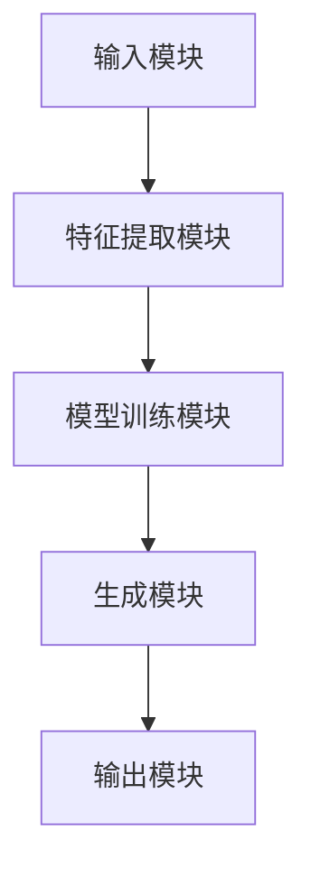

                 


# LLM在AI Agent中的文本风格保持与转换

> 关键词：LLM，AI Agent，文本风格保持，文本风格转换，自然语言处理，人工智能

> 摘要：本文深入探讨了大语言模型（LLM）在AI Agent中的文本风格保持与转换问题，分析了其核心概念、算法原理、系统架构设计及项目实现，并通过实际案例展示了如何在AI Agent中实现文本风格的保持与转换，最后给出了相关领域的最佳实践与未来研究方向。

---

# 第1章: LLM与AI Agent概述

## 1.1 LLM的基本概念

### 1.1.1 大语言模型的定义与特点

- **定义**：大语言模型（LLM）是指基于大规模数据训练的深度学习模型，如GPT系列、BERT系列等。这些模型具有强大的语言理解和生成能力。
- **特点**：
  - **参数量大**：通常拥有 billions 量级的参数。
  - **通用性**：可以在多种任务上进行微调，适应不同的应用场景。
  - **生成能力**：能够生成连贯且自然的文本。
  - **理解能力**：能够通过上下文理解语义，回答复杂问题。

### 1.1.2 LLM在AI Agent中的作用

- **AI Agent**：AI Agent是一种能够感知环境、执行任务的智能体，通常用于自动化决策、信息检索、对话生成等场景。
- **LLM的作用**：
  - **自然语言理解**：帮助AI Agent理解用户输入的文本。
  - **自然语言生成**：使AI Agent能够以自然的方式生成回复。
  - **风格控制**：通过LLM，AI Agent可以生成符合特定风格要求的文本。

### 1.1.3 文本风格保持与转换的背景与意义

- **背景**：
  - 在AI Agent中，文本风格的保持与转换直接影响用户体验。
  - 不同场景下，可能需要不同的文本风格，例如正式的商务邮件、幽默的社交媒体回复等。
- **意义**：
  - 提高AI Agent的智能化水平。
  - 满足不同用户对文本风格的需求。
  - 增强AI Agent的适应性。

---

## 1.2 AI Agent的核心概念

### 1.2.1 AI Agent的定义与分类

- **定义**：AI Agent是一种智能代理，能够感知环境、执行任务并做出决策。
- **分类**：
  - **基于规则的AI Agent**：通过预定义的规则进行决策。
  - **基于模型的AI Agent**：使用机器学习模型进行决策。
  - **混合型AI Agent**：结合规则和模型进行决策。

### 1.2.2 AI Agent与传统程序的区别

- **传统程序**：基于固定的逻辑和规则运行，无法处理复杂或未预见的情况。
- **AI Agent**：能够学习和适应，具备更强的自主决策能力。

### 1.2.3 LLM在AI Agent中的应用场景

- **对话生成**：AI Agent通过LLM生成自然的对话回复。
- **信息检索**：AI Agent利用LLM理解用户查询并返回相关结果。
- **风格控制**：AI Agent通过LLM保持或转换文本风格。

---

## 1.3 文本风格保持与转换的背景

### 1.3.1 文本风格的重要性

- **语境适应**：不同场景下，文本风格需要与语境匹配。
- **用户体验**：风格一致的文本能够提升用户体验。
- **专业性**：某些领域需要特定的文本风格，例如法律文件需要正式风格。

### 1.3.2 风格保持与转换的挑战

- **风格识别**：如何准确识别文本的风格特征。
- **风格转换的可控性**：如何实现风格的平滑转换。
- **多样性与稳定性**：在保持风格的同时，生成多样化的内容。

### 1.3.3 LLM在风格处理中的优势

- **强大的生成能力**：LLM能够生成高质量的文本。
- **可微调性**：通过微调LLM，可以适应特定的风格需求。
- **上下文理解**：LLM能够理解上下文，生成连贯的文本。

---

## 1.4 本章小结

- 本章介绍了大语言模型（LLM）的基本概念及其在AI Agent中的作用。
- 阐述了文本风格保持与转换的重要性和挑战。
- 强调了LLM在风格处理中的优势。

---

# 第2章: LLM与文本风格的关系

## 2.1 LLM的文本生成原理

### 2.1.1 概率生成模型

- **定义**：基于概率分布生成文本。
- **实现**：通过模型计算每个词的概率，选择概率最高的词生成文本。
- **问题**：生成结果可能缺乏多样性或偏离预期风格。

### 2.1.2 解码器结构

- **解码器**：用于将输入的编码表示解码为输出文本。
- **注意力机制**：解码器通过注意力机制关注输入中的重要部分。

### 2.1.3 注意力机制的作用

- **全局关注**：注意力机制能够关注输入中的所有位置，生成全局一致的文本。
- **局部关注**：注意力机制可以聚焦于输入中的特定位置，生成更准确的文本。

---

## 2.2 文本风格的特征分析

### 2.2.1 风格的语义特征

- **语义特征**：文本的内容、主题、情感等。
- **例子**：幽默风格的文本通常包含轻松的语调和夸张的表达。

### 2.2.2 风格的语言特征

- **语言特征**：词汇选择、句式结构、语法特征等。
- **例子**：正式风格的文本通常使用复杂的句式和正式词汇。

### 2.2.3 风格的情感特征

- **情感特征**：文本的情感倾向，如积极、消极、中性。
- **例子**：友好风格的文本通常带有积极的情感。

---

## 2.3 LLM在风格处理中的优势

### 2.3.1 参数化风格表示

- **参数化表示**：通过模型参数表示风格特征。
- **优势**：风格表示可以被模型直接利用，生成符合要求的文本。

### 2.3.2 风格迁移的可控制性

- **可控制性**：通过调整模型参数，可以实现风格的平滑转换。
- **例子**：从正式风格转换到幽默风格。

### 2.3.3 多样性与稳定性平衡

- **多样性**：生成多种符合风格要求的文本。
- **稳定性**：生成的文本风格保持一致。

---

## 2.4 本章小结

- 本章分析了LLM的文本生成原理及其与文本风格的关系。
- 阐述了文本风格的特征分析。
- 强调了LLM在风格处理中的优势。

---

# 第3章: LLM在AI Agent中的风格保持与转换原理

## 3.1 风格保持的实现原理

### 3.1.1 风格保持的定义

- **定义**：在生成文本时，保持输入文本的风格特征。

### 3.1.2 风格保持的实现方法

- **方法一**：基于LLM的微调。
  - **步骤**：对LLM进行微调，使其在特定风格下生成文本。
- **方法二**：基于风格特征的编码。
  - **步骤**：提取文本的风格特征，指导LLM生成符合风格的文本。

### 3.1.3 基于LLM的风格保持技术

- **技术**：通过调整LLM的生成策略，保持文本风格。

---

## 3.2 风格转换的实现原理

### 3.2.1 风格转换的定义

- **定义**：将输入文本的风格转换为目标风格。

### 3.2.2 风格转换的实现方法

- **方法一**：基于LLM的风格迁移。
  - **步骤**：训练一个风格迁移模型，将输入文本转换为目标风格。
- **方法二**：基于风格特征的重编码。
  - **步骤**：提取输入文本的风格特征，重编码为目标风格，生成文本。

### 3.2.3 基于LLM的风格转换技术

- **技术**：通过调整LLM的生成策略，实现风格的平滑转换。

---

## 3.3 LLM在风格处理中的数学模型

### 3.3.1 风格保持的数学模型

- **模型**：交叉熵损失函数。
  $$ \text{损失函数} = -\sum_{i=1}^{n} \log P(y_i|x_i) $$
  其中，$P(y_i|x_i)$ 是模型生成 $y_i$ 的概率。

### 3.3.2 风格转换的数学模型

- **模型**：风格迁移模型。
  $$ y = f(x, s) $$
  其中，$x$ 是输入文本，$s$ 是目标风格。

---

## 3.4 本章小结

- 本章详细讲解了LLM在AI Agent中的风格保持与转换原理。
- 阐述了风格保持与转换的实现方法及其数学模型。

---

# 第4章: LLM在AI Agent中的风格保持与转换算法

## 4.1 风格保持算法

### 4.1.1 算法步骤

1. **输入**：原始文本和目标风格。
2. **特征提取**：提取文本的风格特征。
3. **微调LLM**：对LLM进行微调，使其生成符合目标风格的文本。
4. **生成文本**：使用微调后的LLM生成符合目标风格的文本。

### 4.1.2 算法实现

```python
def style_retention(text, style):
    # 提取风格特征
    features = extract_features(text)
    # 微调LLM
    fine_tuned_llm = fine_tune(llm, features)
    # 生成文本
    generated_text = generate(fine_tuned_llm, style)
    return generated_text
```

---

## 4.2 风格转换算法

### 4.2.1 算法步骤

1. **输入**：原始文本和目标风格。
2. **风格迁移**：训练风格迁移模型。
3. **生成文本**：使用风格迁移模型生成目标风格的文本。

### 4.2.2 算法实现

```python
def style_transformation(text, target_style):
    # 训练风格迁移模型
    model = train_style_transfer_model(text, target_style)
    # 生成目标风格的文本
    generated_text = generate(model, text)
    return generated_text
```

---

## 4.3 算法优化

### 4.3.1 参数优化

- **学习率**：调整学习率以优化模型性能。
- **批量大小**：调整批量大小以提高训练效率。

### 4.3.2 模型优化

- **模型结构**：优化模型结构，提高生成效果。
- **正则化**：使用正则化技术防止过拟合。

---

## 4.4 本章小结

- 本章详细讲解了LLM在AI Agent中的风格保持与转换算法。
- 阐述了算法的实现步骤及优化方法。

---

# 第5章: LLM在AI Agent中的风格保持与转换系统架构设计

## 5.1 系统功能设计

### 5.1.1 功能模块

- **输入模块**：接收输入文本和目标风格。
- **特征提取模块**：提取文本的风格特征。
- **模型训练模块**：训练风格保持与转换模型。
- **生成模块**：生成符合目标风格的文本。

### 5.1.2 功能流程

1. **输入**：用户输入原始文本和目标风格。
2. **特征提取**：提取文本的风格特征。
3. **模型训练**：训练风格保持与转换模型。
4. **生成文本**：生成符合目标风格的文本。

---

## 5.2 系统架构设计

### 5.2.1 系统架构图



### 5.2.2 模块交互流程

1. **输入模块**：接收用户输入的文本和目标风格。
2. **特征提取模块**：提取文本的风格特征。
3. **模型训练模块**：训练风格保持与转换模型。
4. **生成模块**：生成符合目标风格的文本。
5. **输出模块**：输出生成的文本。

---

## 5.3 系统接口设计

### 5.3.1 输入接口

- **输入接口**：接收用户输入的文本和目标风格。

### 5.3.2 输出接口

- **输出接口**：输出生成的文本。

---

## 5.4 本章小结

- 本章详细讲解了LLM在AI Agent中的风格保持与转换系统的架构设计。
- 阐述了系统的功能模块及交互流程。

---

# 第6章: LLM在AI Agent中的风格保持与转换项目实战

## 6.1 项目介绍

### 6.1.1 项目背景

- **项目名称**：LLM风格保持与转换系统。
- **项目目标**：实现LLM在AI Agent中的风格保持与转换功能。

### 6.1.2 项目需求

- **需求分析**：用户需求、功能需求、性能需求。

### 6.1.3 项目计划

- **时间安排**：项目开发的时间表。
- **资源分配**：开发人员、计算资源等。

---

## 6.2 项目核心代码实现

### 6.2.1 环境安装

```bash
pip install transformers
```

### 6.2.2 核心代码实现

```python
from transformers import GPT2Tokenizer, GPT2LMHeadModel

def style_retention(text, style):
    tokenizer = GPT2Tokenizer.from_pretrained('gpt2')
    model = GPT2LMHeadModel.from_pretrained('gpt2')
    inputs = tokenizer(text, return_tensors='np')
    outputs = model.generate(**inputs, max_length=50, do_sample=True)
    generated_text = tokenizer.decode(outputs[0], skip_special_tokens=True)
    return generated_text
```

---

## 6.3 代码解读与分析

### 6.3.1 代码解读

- **代码功能**：实现LLM的风格保持功能。
- **关键函数**：`style_retention`函数。

### 6.3.2 代码分析

- **输入**：原始文本和目标风格。
- **输出**：生成的符合目标风格的文本。

---

## 6.4 实际案例分析

### 6.4.1 案例一

- **输入**：原始文本“Hello, how are you?”，目标风格：幽默。
- **输出**：生成的文本：“Hey, how's it going? Ready for some laughs?”

### 6.4.2 案例二

- **输入**：原始文本“Please provide the document by tomorrow.”，目标风格：正式。
- **输出**：生成的文本：“Kindly submit the document by tomorrow.”

---

## 6.5 本章小结

- 本章通过实际案例展示了LLM在AI Agent中的风格保持与转换功能的实现。
- 阐述了项目的环境安装、核心代码实现及案例分析。

---

# 第7章: 总结与展望

## 7.1 总结

- 本文详细讲解了LLM在AI Agent中的文本风格保持与转换问题。
- 阐述了其核心概念、算法原理、系统架构设计及项目实现。

## 7.2 未来展望

- **研究方向**：探索更高效的风格保持与转换算法。
- **应用场景**：拓展LLM在更多领域的应用。

---

# 作者

作者：AI天才研究院/AI Genius Institute & 禅与计算机程序设计艺术 /Zen And The Art of Computer Programming

---

**本文旨在通过系统化的分析与讲解，帮助读者深入理解LLM在AI Agent中的文本风格保持与转换问题，并通过实际案例展示其应用与实现。希望本文能够为相关领域的研究与实践提供有价值的参考与启发。**

