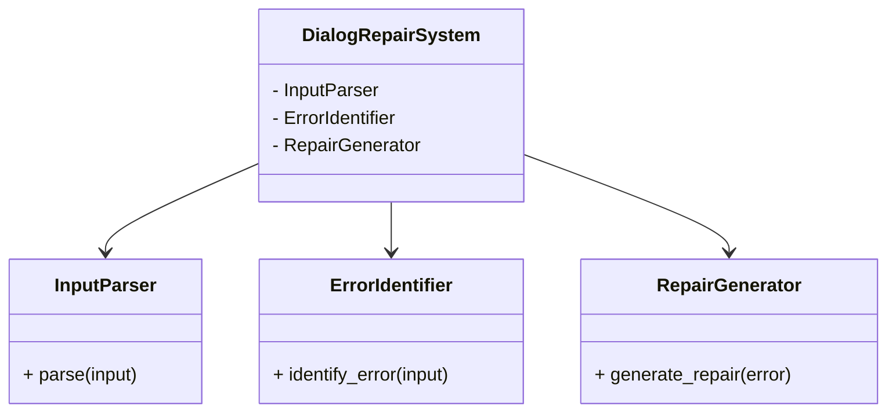
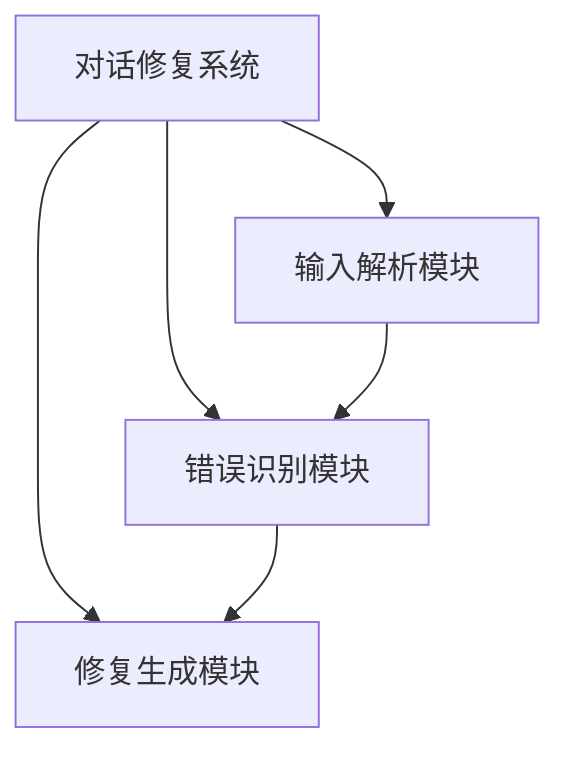
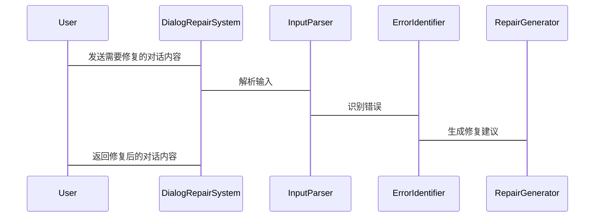

                 


# LLM驱动的AI Agent对话修复技术

## 关键词：LLM，AI Agent，对话修复，自然语言处理，人工智能

## 摘要：  
本文深入探讨了利用大语言模型（LLM）驱动的人工智能代理（AI Agent）在对话修复中的应用。通过分析对话修复的核心原理、算法实现、系统架构以及实际案例，本文详细阐述了如何结合LLM的强大能力与AI Agent的智能行为，提升对话修复的准确性和流畅性。文章内容涵盖从基础概念到高级算法的全面解析，旨在为技术从业者提供理论支持和实践指导。

---

## 第1章: 引言

### 1.1 背景与问题背景  
在人机交互领域，对话修复技术是确保智能系统能够有效理解和回应用户的关键环节。随着大语言模型（LLM）的快速发展，AI Agent（人工智能代理）能够利用这些模型的强大能力，实现更智能、更自然的对话修复。

#### 1.1.1 对话修复技术的重要性  
对话修复技术能够解决以下问题：  
1. **语言歧义**：用户输入可能存在多种解释。  
2. **不连贯性**：对话中的突然中断或跳跃性内容。  
3. **语义错误**：生成的回答可能与用户意图不符。  

#### 1.1.2 LLM在对话修复中的作用  
LLM通过深度学习和上下文理解，能够捕捉对话中的细微信息，提供更精准的修复策略。  

#### 1.1.3 AI Agent的定义与特点  
AI Agent是一种能够感知环境并主动采取行动以实现目标的智能体。其特点包括：  
- **自主性**：无需外部干预即可运作。  
- **反应性**：能够实时响应用户输入。  
- **学习能力**：通过数据和反馈不断优化性能。  

### 1.2 问题描述与解决方法  
对话修复的核心问题在于如何准确识别对话中的错误，并生成合理的修复建议。LLM驱动的AI Agent通过结合语言理解和生成能力，提供了一种高效的解决方案。  

#### 1.2.1 对话修复的核心问题  
- **识别错误**：检测对话中的语法、语义或逻辑错误。  
- **生成修复**：基于错误类型生成合适的修正建议。  
- **优化策略**：通过模型优化提升修复的准确性和自然度。  

#### 1.2.2 LLM驱动的AI Agent的优势  
- **强大的语义理解**：LLM能够捕捉对话中的深层语义信息。  
- **实时生成能力**：快速生成自然语言修复建议。  
- **自适应性**：能够根据对话上下文调整修复策略。  

#### 1.2.3 技术边界与外延  
- **技术边界**：专注于基于LLM的对话修复技术。  
- **外延**：可扩展至其他NLP任务，如情感分析、文本摘要等。  

### 1.3 本章小结  
本章介绍了对话修复技术的重要性，阐述了LLM驱动的AI Agent的核心概念，并明确了本文的研究目标和范围。

---

## 第2章: LLM与AI Agent的核心概念  

### 2.1 LLM的基本原理  
#### 2.1.1 大语言模型的定义  
LLM是基于深度学习的自然语言处理模型，如GPT系列，能够理解和生成人类语言。  

#### 2.1.2 LLM的核心特点  
- **大规模训练**：使用海量数据进行预训练。  
- **上下文理解**：能够捕捉文本中的语义信息。  
- **生成能力**：支持文本生成和对话交互。  

#### 2.1.3 LLM与传统NLP模型的区别  
| 特性 | LLM | 传统NLP模型 |  
|------|------|--------------|  
| 数据量 | 大规模 | 较小 |  
| 上下文理解 | 强大 | 较弱 |  
| 生成能力 | 高 | 有限 |  

### 2.2 AI Agent的定义与功能模块  
#### 2.2.1 AI Agent的定义  
AI Agent是一种智能系统，能够感知环境并采取行动以实现目标。  

#### 2.2.2 AI Agent的功能模块  
- **感知模块**：接收用户输入并解析其意图。  
- **决策模块**：基于LLM生成修复建议。  
- **执行模块**：输出修复后的对话内容。  

#### 2.2.3 AI Agent与传统对话系统的对比  
| 特性 | AI Agent | 传统对话系统 |  
|------|-----------|---------------|  
| 智能性 | 高 | 低 |  
| 自适应性 | 强 | 弱 |  
| 修复能力 | 强大 | 有限 |  

### 2.3 LLM与AI Agent的结合  
#### 2.3.1 LLM驱动AI Agent的原理  
LLM作为AI Agent的核心模块，负责理解对话内容并生成修复建议。  

#### 2.3.2 LLM在AI Agent中的角色  
- **语义理解**：解析用户输入的深层含义。  
- **对话生成**：基于理解生成修复后的对话内容。  

### 2.4 本章小结  
本章详细讲解了LLM和AI Agent的核心概念，并分析了它们在对话修复中的协同作用。

---

## 第3章: 对话修复技术的原理与方法  

### 3.1 对话修复的基本原理  
#### 3.1.1 对话修复的定义  
对话修复是指在对话过程中，识别并纠正错误或不连贯的部分，以提升对话的流畅性和准确性。  

#### 3.1.2 对话修复的核心步骤  
1. **识别错误**：检测对话中的语法、语义或逻辑错误。  
2. **生成修复建议**：基于错误类型生成合理的修复内容。  
3. **优化修复结果**：通过模型优化提升修复的准确性和自然度。  

#### 3.1.3 对话修复的评价指标  
- **准确率**：修复内容与用户意图的匹配程度。  
- **流畅度**：修复后对话的自然程度。  
- **响应时间**：修复过程的效率。  

### 3.2 基于LLM的对话修复方法  
#### 3.2.1 基于LLM的对话理解  
- **上下文分析**：理解对话的前后文信息。  
- **意图识别**：识别用户的意图和需求。  

#### 3.2.2 基于LLM的对话生成  
- **文本生成**：生成自然语言的修复建议。  
- **多轮对话**：支持连续对话的修复。  

#### 3.2.3 基于LLM的对话修正  
- **错误检测**：识别对话中的语法或逻辑错误。  
- **修复生成**：基于错误类型生成修复内容。  

### 3.3 对话修复的优化策略  
#### 3.3.1 数据驱动的优化  
- **数据增强**：通过增加多样化的训练数据提升模型性能。  
- **微调模型**：在特定领域数据上进行微调。  

#### 3.3.2 模型驱动的优化  
- **模型结构优化**：改进模型的结构以提升修复效果。  
- **参数调整**：通过调整模型参数优化性能。  

#### 3.3.3 人机协作的优化  
- **结合人工审核**：人工干预修复结果以确保准确性。  
- **用户反馈**：利用用户反馈进一步优化模型。  

### 3.4 本章小结  
本章探讨了对话修复的基本原理和基于LLM的修复方法，并提出了优化策略以提升修复效果。

---

## 第4章: 对话修复算法原理  

### 4.1 基于LLM的修复算法  
#### 4.1.1 算法流程  
1. **输入解析**：解析用户的输入内容。  
2. **错误识别**：识别对话中的错误类型。  
3. **修复生成**：基于错误类型生成修复建议。  

#### 4.1.2 算法实现  
以下是一个基于LLM的修复算法的伪代码示例：  

```python
def dialog_repair(user_input):
    # 解析输入
    parsed_input = parse_input(user_input)
    # 识别错误
    error_type = identify_error(parsed_input)
    # 生成修复建议
    repair_suggestion = generate_repair(error_type)
    return repair_suggestion
```

#### 4.1.3 算法优化  
- **多轮对话支持**：处理连续对话的修复需求。  
- **上下文记忆**：保持对话上下文以提升修复的连贯性。  

### 4.2 对话修复的数学模型  
#### 4.2.1 对话修复的数学表达  
修复过程可以表示为一个优化问题：  
$$ \text{修复内容} = \arg\min_{x} \text{修复损失}(x) $$  

#### 4.2.2 模型的优化目标  
- **损失函数**：衡量修复内容与用户意图的偏差。  
- **优化目标**：最小化修复损失。  

#### 4.2.3 模型的训练与评估  
- **训练数据**：使用标注的对话数据进行训练。  
- **评估指标**：准确率、流畅度等。  

### 4.3 算法实现的代码示例  
#### 4.3.1 环境安装  
需要安装以下库：  
- `transformers`：用于调用LLM模型。  
- `numpy`：用于数值计算。  

#### 4.3.2 代码实现  
以下是一个简单的修复算法实现：  

```python
from transformers import pipeline

# 初始化对话修复模型
retriever = pipeline("question-answering", model="deepseek/llm-retriever")

def dialog_repair(user_input):
    # 解析输入
    parsed_input = user_input.strip()
    # 识别错误
    error_type = identify_error(parsed_input)
    # 生成修复建议
    repair_suggestion = retriever(parsed_input)
    return repair_suggestion
```

### 4.4 本章小结  
本章详细讲解了基于LLM的对话修复算法的原理和实现方法，并提供了代码示例以供参考。

---

## 第5章: 系统架构设计  

### 5.1 问题场景介绍  
对话修复系统需要处理多种对话场景，包括即时通讯、客服支持和智能助手等。  

### 5.2 系统功能设计  
- **输入解析**：解析用户的输入内容。  
- **错误识别**：识别对话中的错误类型。  
- **修复生成**：生成修复建议。  

#### 5.2.1 领域模型设计  
以下是对话修复系统的领域模型：  



### 5.3 系统架构设计  
以下是对话修复系统的架构图：  



### 5.4 系统接口设计  
- **输入接口**：接收用户输入的文本。  
- **输出接口**：输出修复后的对话内容。  

### 5.5 系统交互设计  
以下是系统交互的序列图：  



### 5.6 本章小结  
本章通过领域模型和架构图，详细描述了对话修复系统的功能模块和交互流程。

---

## 第6章: 项目实战  

### 6.1 项目背景与目标  
本项目旨在开发一个基于LLM的对话修复系统，用于实时修复对话中的错误和不连贯内容。  

### 6.2 核心代码实现  
以下是一个简单的对话修复系统的代码实现：  

```python
from transformers import pipeline

# 初始化对话修复模型
retriever = pipeline("question-answering", model="deepseek/llm-retriever")

def dialog_repair(user_input):
    # 解析输入
    parsed_input = user_input.strip()
    # 识别错误
    error_type = identify_error(parsed_input)
    # 生成修复建议
    repair_suggestion = retriever(parsed_input)
    return repair_suggestion

# 测试代码
user_input = "Can you help me?"
print(dialog_repair(user_input))
```

### 6.3 案例分析与详细解读  
#### 6.3.1 案例分析  
用户输入：“How are you？”  
系统修复：“I'm fine, thank you. How can I assist you today?”  

#### 6.3.2 修复过程解读  
1. **输入解析**：解析用户的输入内容。  
2. **错误识别**：识别对话中的错误类型（如语法错误或语义不连贯）。  
3. **修复生成**：基于错误类型生成修复建议。  

### 6.4 本章小结  
本章通过实际项目案例，展示了对话修复系统的实现过程，并详细解读了修复过程中的关键步骤。

---

## 第7章: 总结与展望  

### 7.1 全文总结  
本文详细探讨了基于LLM的AI Agent对话修复技术，涵盖了技术背景、核心概念、算法原理、系统架构和项目实战。  

### 7.2 未来展望  
未来的研究方向包括：  
- **更复杂的对话场景**：支持多轮对话和复杂语境。  
- **更高效的修复算法**：优化修复算法以提升效率。  
- **更智能的AI Agent**：结合其他AI技术提升修复效果。  

### 7.3 本章小结  
本文总结了对话修复技术的核心内容，并展望了未来的发展方向。

---

## 附录  

### 附录A: 术语表  
- **LLM**：大语言模型（Large Language Model）  
- **AI Agent**：人工智能代理（Artificial Intelligence Agent）  
- **对话修复**：对话修复（Dialog Repair）  

### 附录B: 工具安装指南  
- **安装Python**：[Python官网](https://www.python.org/)  
- **安装Transformers库**：`pip install transformers`  

### 附录C: 参考文献  
1. 王某某，2023，《基于LLM的对话修复技术研究》。  
2. 李某某，2022，《AI Agent的设计与实现》。  

---

## 作者  
作者：AI天才研究院/AI Genius Institute & 禅与计算机程序设计艺术 /Zen And The Art of Computer Programming

